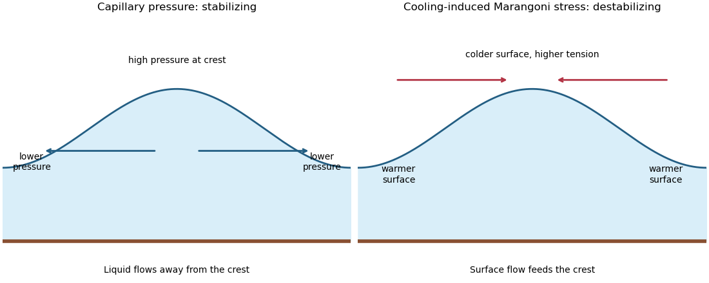
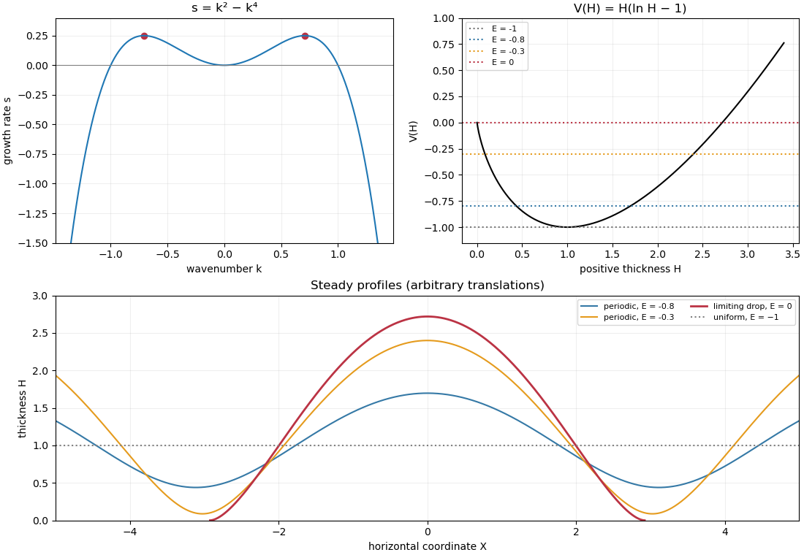

<h1 id="3/solution">Solution</h1>

↑ **Parent:** [3](../3.md)

For the motionless uniform layer, the [heat equation](../../../../../heat-equation.md) reduces to $T_{zz}=0$. The lower temperature and upper heat-transfer condition determine the [quasistatic temperature of a conductively cooled film](../../../../../quasistatic-temperature-of-a-conductively-cooled-film.md):

$$
\boxed{T(z)=T_0-\frac{\alpha\Delta T}{\kappa+\alpha h}z,\qquad
T_s=T(h)=T_0-\Delta T\frac{\alpha h}{\kappa+\alpha h}.}
$$

When $\alpha h/\kappa\ll1$, $T_s=T_0-\Delta T\alpha h/\kappa+O(\Delta T(\alpha h/\kappa)^2)$. For a varying film let its vertical [velocity](../../../../../velocity.md) scale as $Uh/L$, as required by [incompressible flow](../../../../../incompressible-flow.md). Relative to vertical thermal [diffusion](../../../../../diffusion.md), horizontal thermal [diffusion](../../../../../diffusion.md) is smaller by $(h/L)^2$, and either horizontal or vertical thermal [advection](../../../../../advection.md) is smaller by $Uh^2/(\kappa L)$. Time variation on the film's transport timescale $L/U$ has the same small factor. Thus the leading [heat equation](../../../../../heat-equation.md) is again $T_{zz}=0$ at each $x,t$ when both specified dimensionless parameters are small. This argument retains the small $\alpha h/\kappa$ assumption. If thickness were externally varied on a faster timescale $t_h$, one would additionally need $h^2/(\kappa t_h)\ll1$; the spatial conditions alone do not control arbitrary rapid time dependence.

Define $b=\gamma'\Delta T\alpha/\kappa>0$. The [surface tension](../../../../../surface-tension.md) at the surface is $\gamma_s=\gamma_0+bh$, so the [Marangoni stress](../../../../../marangoni-effect.md) is $\gamma_{s,x}=bh_x$. With [capillary pressure](../../../../../capillary-pressure.md) $p=-\gamma_0h_{xx}$ to leading order, horizontal [Stokes flow](../../../../../stokes-flow-split.md) in the film solves $\mu u_{zz}=p_x$, $u(0)=0$, $\mu u_z(h)=\gamma_{s,x}$. Hence

$$
u(z)=\frac{p_x}{2\mu}(z^2-2hz)+\frac{\gamma_{s,x}}\mu z,\qquad
q=\int_0^h u\,dz=-\frac{h^3}{3\mu}p_x+\frac{h^2}{2\mu}\gamma_{s,x}.
$$

The [continuity equation](../../../../../continuity-equation.md) gives the [thermocapillary thin-film equation](../../../../../thermocapillary-thin-film-equation.md)

$$
\boxed{h_t+\partial_x\left(\frac{\gamma_0}{3\mu}h^3h_{xxx}+\frac{b}{2\mu}h^2h_x\right)=0.}
$$

To justify using constant [surface tension](../../../../../surface-tension.md) in the [capillary pressure](../../../../../capillary-pressure.md), compare the two [volume fluxes](../../../../../volumetric-flow-rate.md) on horizontal scale $L$: their magnitudes are $\gamma_0h^4/(3\mu L^3)$ and $bh^3/(2\mu L)$. When both mechanisms are retained at leading order, their balance gives $bh/\gamma_0=O((h/L)^2)\ll1$. Thus replacing $\gamma_s$ by $\gamma_0$ in the curvature term incurs only a relative small correction. Equivalently, small $\alpha h/\kappa$ ensures this if $\gamma'\Delta T/\gamma_0$ is bounded; if it were parametrically large, the extra small surface-tension-variation condition would have to be imposed separately.

The [capillary pressure](../../../../../capillary-pressure.md) is higher beneath a crest than beneath a trough, so pressure-driven [volume flux](../../../../../volumetric-flow-rate.md) drains the crest and smooths thickness. The [Marangoni effect](../../../../../marangoni-effect.md) acts oppositely: a thicker region has a colder surface and therefore larger [surface tension](../../../../../surface-tension.md). Surface [velocity](../../../../../velocity.md) is pulled towards that region, supplying more liquid and amplifying the thickness variation. The arrows below represent these two mechanisms separately.

**[Figure 2](#3/image-capillary-pressure-drains-film-crests-whereas-cooling-induced-marangoni-stress-draws-liquid-towards-them). Capillary pressure drains film crests whereas cooling-induced Marangoni stress draws liquid towards them**.

Put $a_c=\gamma_0/(3\mu)$ and $a_m=b/(2\mu)$. Substitution of $h=\hat hH$, $x=\hat hX/\epsilon$, $t=\hat t\tau$ gives coefficients $a_m\epsilon^2\hat t$ and $a_c\epsilon^4\hat t/\hat h$. Making both equal to one yields

$$
\boxed{\epsilon^2=\frac{3\gamma'\Delta T\alpha\hat h}{2\kappa\gamma_0},\qquad
\hat t=\frac{4\mu\kappa^2\gamma_0}{3(\gamma'\Delta T\alpha)^2\hat h}.}
$$

In these scales the fractional [surface tension](../../../../../surface-tension.md) change is $b\hat h/\gamma_0=2\epsilon^2/3$, making the previous approximation explicit.

The [linear stability analysis](../../../../../linear-stability.md) about $H=1$ gives $\eta_\tau+\eta_{XX}+\eta_{XXXX}=0$. For a [normal mode](../../../../../normal-mode.md) $e^{s\tau+ikX}$,

$$
\boxed{s(k)=k^2-k^4,\qquad |k|_{\max}=1/\sqrt2,\qquad s_{\max}=1/4.}
$$

Long waves with $0<|k|<1$ grow, $|k|>1$ decay, and $k=0,\pm1$ are neutral. The neutral $k=0$ mode changes the mean film thickness. The [dispersion relation](../../../../../dispersion-relation.md) is even in $k$, with its two maxima at $\pm1/\sqrt2$.

For a steady positive film with zero [volume flux](../../../../../volumetric-flow-rate.md), divide $H^2H_X+H^3H_{XXX}=0$ by $H^3$ and integrate to obtain $H_{XX}+\ln H=C$. Choosing $\hat h$ as specified fixes $C=0$. Multiplication by $H_X$ and another integration then give the [zero-flux thermocapillary film profiles](../../../../../zero-flux-thermocapillary-film-profiles.md) first integral

$$
\boxed{\frac12H_X^2+V(H)=E,\qquad V(H)=H(\ln H-1).}
$$

For $H>0$, $V'=\ln H$ and $V''=1/H>0$: the unique minimum is $V(1)=-1$, while $V(0^+)=0$ and $V(e)=0$. This [potential energy](../../../../../potential-energy.md) interpretation classifies the profiles without assuming a sinusoidal shape at finite amplitude.

For $E=-1$, the only profile is **the uniform film $H=1$**. For $-1<E<0$, there are two positive turning heights $H_-<1<H_+<e$ and **a smooth periodic film oscillates between them**. Its [period](../../../../../period-of-a-function.md) is

$$
P(E)=2\int_{H_-}^{H_+}\frac{dH}{\sqrt{2[E-V(H)]}}.
$$

For $E=0$, the maximum is $e$ and the lower endpoint is zero. A drop reaches zero thickness in finite distance, with zero limiting slope but unbounded curvature since $H_{XX}=-\ln H$. Its half-width is

$$
\ell_0=\int_0^e\frac{dH}{\sqrt{2H(1-\ln H)}}
=\sqrt{\frac e2}\int_0^\infty u^{-1/2}e^{-u/2}\,du
=\boxed{\sqrt{\pi e}}.
$$

Thus the formal limiting profile consists of **drops of peak height $e$ and footprint width $2\sqrt{\pi e}$**, with zero limiting [contact angle](../../../../../contact-angle.md). Identical drops can touch, or a zero-thickness region can separate them in the degenerate zero-flux model. These are limiting wet-region solutions, not everywhere positive twice differentiable films; the singular contact region is not resolved by [lubrication theory](../../../../../lubrication-theory.md). A useful parametric drop profile is

$$
H=e e^{-w^2},\qquad |X-X_c|=\sqrt{\pi e}\operatorname{erf}(w/\sqrt2),\qquad w\geq0.
$$

Finally let $E=-1+\delta E$ with small positive $\delta E$. Writing $H=1+\eta$ gives $V=-1+\eta^2/2+O(\eta^3)$ and $H_{XX}=-\eta+O(\eta^2)$. The small-amplitude steady profile is $H=1+\sqrt{2\delta E}\cos(X-X_c)+O(\delta E)$, with [period](../../../../../period-of-a-function.md) tending to $2\pi$. **Its wavenumber tends to the neutral boundary $|k|=1$ of the unstable band, not to the fastest-growing wavenumber.**

**[Figure 3](#3/image-thermocapillary-film-dispersion-relation-energy-potential-and-periodic-or-dry-contact-steady-profiles). Thermocapillary-film dispersion relation, energy potential and periodic or dry-contact steady profiles**.

## ↑ Ancestors (10)

1. [3](../3.md)
2. [Paper 68](../../paper-68-split.md)
3. [Iii](../../split.md)
4. [2013](../../../split.md)
5. [Past exam of the mathematics course of the University of Cambridge](../../../../split.md)
6. [Mathematics course of the University of Cambridge](../../../../../mathematics-course-of-the-university-of-cambridge.md)
7. [Course of the University of Cambridge](../../../../../course-of-the-university-of-cambridge.md)
8. [University of Cambridge](../../../../../university-of-cambridge-split.md)
9. [List of universities](../../../../../list-of-universities.md)
10. [Codex Wiki](../../../../../split.md)
