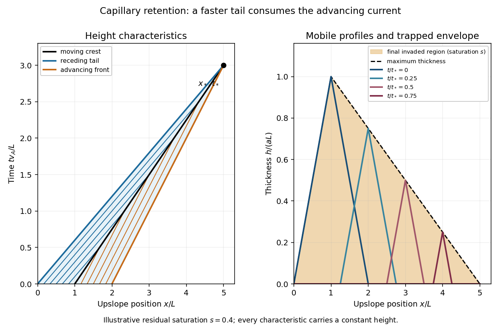

<h1 id="3/solution">Solution</h1>

↑ **Parent:** [3](../3.md)

Take $x$ increasing upslope and let $u$ be the superficial [Darcy velocity](../../../../../darcy-velocity.md), so the mobile discharge is $uh$. Its pore transport speed is $u/\phi$. This interpretation is required by the factors of [porosity](../../../../../porosity.md) in the printed equations; a literal pore-speed convention would instead replace $u$ there by $\phi u$.

For [capillary residual trapping](../../../../../capillary-residual-trapping.md), let $M(x,t)=\max_{0\leq\tau\leq t}h(x,\tau)$ be the maximum invaded thickness, including the initial state. The stored carbon-dioxide volume per plan area is

$$
\phi h+\phi s(M-h)=\phi[(1-s)h+sM].
$$

During advance, $M=h$ and new pores fill with mobile [carbon dioxide](../../../../../carbon-dioxide.md); during recession, $M$ is fixed and the newly vacated pores retain saturation $s$. Conservation of mobile plus trapped fluid is

$$
\partial_t\{\phi[(1-s)h+sM]\}+\partial_x(uh)=0.
$$

Consequently

$$
\boxed{h_t+v_Ah_x=0\quad(h_t>0),\qquad
h_t+v_Rh_x=0\quad(h_t<0),\quad
v_A=\frac u\phi,\quad v_R=\frac{u}{\phi(1-s)}}.
$$

Assume $a,L,u,\phi>0$ and $0<s<1$. The two speeds differ because the advancing front fills a whole pore volume while the receding tail removes only its mobile fraction.

The [method of characteristics](../../../../../method-of-characteristics.md) keeps height constant on $x=x_0+v_A t$ on the leading face and $x=x_0+v_Rt$ on the trailing face. Matching the two linear profiles gives the [triangular current with capillary retention](../../../../../triangular-current-with-capillary-retention.md):

$$
\boxed{h(x,t)=a\max\left\{0,\min\{x-v_Rt,\ 2L+v_At-x\}\right\}}.
$$

Before extinction, the rear, front, crest position and crest height are

$$
x_R=v_Rt,\quad x_F=2L+v_At,\quad
x_m=L+\frac{v_R+v_A}{2}t,\quad
h_m=a\left(L-\frac{v_R-v_A}{2}t\right).
$$

Every positive height has one trailing and one leading characteristic; their intersections trace the crest. The mobile current disappears at

$$
\boxed{t_* =\frac{2L}{v_R-v_A}=\frac{2\phi(1-s)L}{us},\qquad x_* =\frac{2L}{s}}.
$$

**[Figure 1](#3/image-advancing-and-receding-characteristics-shrinking-mobile-profiles-and-the-final-capillary-trapping-envelope). Advancing and receding characteristics, shrinking mobile profiles, and the final capillary trapping envelope**.

The final trapped region is the [maximum-invasion envelope of a retained current](../../../../../maximum-invasion-envelope-of-a-retained-current.md). For $0<x<L$, the initial height is already the maximum, $M_\infty=ax$. For $L<x<x_*$, the maximum occurs when the crest passes $x$, at $t_m=2(x-L)/(v_R+v_A)$. Substituting into the trailing profile gives

$$
\boxed{M_\infty(x)=\begin{cases}
ax,&0<x<L,\\
\dfrac{a(2L-sx)}{2-s},&L<x<2L/s,\\
0,&\text{otherwise}.
\end{cases}}
$$

If $z$ is distance into the aquifer measured normally from its upper boundary, trapped [carbon dioxide](../../../../../carbon-dioxide.md) occupies $0<z<M_\infty(x)$ at residual pore saturation $s$. The occupied pore volume per unit transverse width is

$$
\boxed{\phi s\int M_\infty(x)\,dx=\phi aL^2},
$$

exactly the initial mobile volume. This is an independent mass-conservation check of both the envelope and extinction distance. In the limit $s=0$, the current translates without shrinking and nothing is trapped; the finite-extinction formula is not used in that limit.

## ↑ Ancestors (10)

1. [3](../3.md)
2. [Paper 69](../../paper-69-split.md)
3. [Iii](../../split.md)
4. [2013](../../../split.md)
5. [Past exam of the mathematics course of the University of Cambridge](../../../../split.md)
6. [Mathematics course of the University of Cambridge](../../../../../mathematics-course-of-the-university-of-cambridge.md)
7. [Course of the University of Cambridge](../../../../../course-of-the-university-of-cambridge.md)
8. [University of Cambridge](../../../../../university-of-cambridge-split.md)
9. [List of universities](../../../../../list-of-universities.md)
10. [Codex Wiki](../../../../../split.md)
