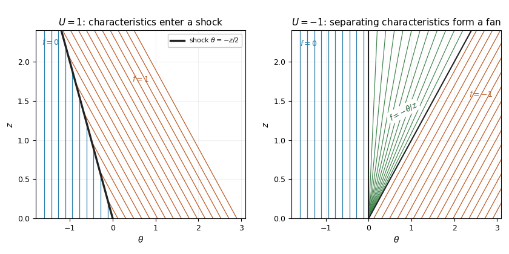

<h1 id="3/a/solution">Solution</h1>

↑ **Parent:** [A](../a.md)

For the negative-flux [Inviscid Burgers equation](../../../../../../inviscid-burgers-equation.md), the [method of characteristics](../../../../../../method-of-characteristics.md) gives

$$
\frac{d\theta}{dz}=-f,\qquad \frac{df}{dz}=0.
$$

The [characteristic curve](../../../../../../characteristic-curve.md) starting at $\theta_0$ therefore has $\theta=\theta_0-f_0(\theta_0)z$, and hence

$$
\boxed{f\big(z,\theta_0-f_0(\theta_0)z\big)=f_0(\theta_0).}
$$

For smooth data this describes a single-valued classical solution as long as the [characteristic flow map](../../../../../../characteristic-flow-map.md) is invertible. Its Jacobian is $1-zf_0'(\theta_0)$; after [characteristic crossing](../../../../../../characteristic-crossing.md), one must instead select a [weak solution](../../../../../../weak-solution.md) with the appropriate [entropy solution](../../../../../../entropy-solution.md) condition.

The conservation form is $f_z+G(f)_\theta=0$, with [conservation law flux](../../../../../../conservation-law-flux.md) $G(f)=-f^2/2$. Integrating this [scalar conservation law](../../../../../../scalar-conservation-law.md) across a moving discontinuity, or differentiating its Heaviside representation as a [distribution](../../../../../../distribution-mathematical-analysis.md), yields the [Rankine-Hugoniot condition](../../../../../../rankine-hugoniot-conditions.md)

$$
\theta_s'(f_R-f_L)=G(f_R)-G(f_L).
$$

For distinct one-sided limits it simplifies to

$$
\boxed{\theta_s'=-\frac{f_R+f_L}{2}.}
$$

This jump-speed relation is exact for the Burgers conservation law; an additional entropy condition is needed to distinguish a physical compressive [shock wave](../../../../../../shock-wave.md) from an expansion discontinuity.

The step gives the [Burgers Riemann problem with negative flux](../../../../../../burgers-riemann-problem-with-negative-flux.md). If $U>0$, [characteristic curves](../../../../../../characteristic-curve.md) from the left have speed zero, while those from the right have speed $-U$: they converge. The entropy [shock wave](../../../../../../shock-wave.md) has speed $-U/2$ and thus

$$
\boxed{f(z,\theta)=\begin{cases}0,&\theta<-Uz/2,\\ U,&\theta>-Uz/2,\end{cases}\qquad U>0.}
$$

Characteristics enter this [shock](../../../../../../shock-wave.md) from both sides, since $0>-U/2>-U$.

If $U<0$, the right-hand speed $-U$ is positive and the two families separate. A smooth steep approximation to the initial step spreads into a [rarefaction wave](../../../../../../rarefaction-wave.md). In the fan, the self-similar [characteristic curve](../../../../../../characteristic-curve.md) relation is $-f=\theta/z$, giving

$$
\boxed{f(z,\theta)=\begin{cases}0,&\theta<0,\\-\theta/z,&0\leq\theta\leq-Uz,\\U,&\theta>-Uz,\end{cases}\qquad U<0.}
$$

The endpoint values match continuously. The discontinuity moving at $-U/2$ would satisfy the jump condition even for $U<0$, but its [characteristic curves](../../../../../../characteristic-curve.md) leave the discontinuity and it fails entropy admissibility. For $U=0$ the solution is identically zero.

**[Figure 1](#3/a/image-characteristics-of-the-negative-flux-burgers-step-compression-gives-a-shock-for-positive-u-while-negative-u-gives-a-rarefaction-fan). Characteristics of the negative-flux Burgers step: compression gives a shock for positive U, while negative U gives a rarefaction fan**.

## ↑ Ancestors (11)

1. [A](../a.md)
2. [3](../../3.md)
3. [Paper 70](../../../paper-70-split.md)
4. [Iii](../../../split.md)
5. [2013](../../../../split.md)
6. [Past exam of the mathematics course of the University of Cambridge](../../../../../split.md)
7. [Mathematics course of the University of Cambridge](../../../../../../mathematics-course-of-the-university-of-cambridge.md)
8. [Course of the University of Cambridge](../../../../../../course-of-the-university-of-cambridge.md)
9. [University of Cambridge](../../../../../../university-of-cambridge-split.md)
10. [List of universities](../../../../../../list-of-universities.md)
11. [Codex Wiki](../../../../../../split.md)
