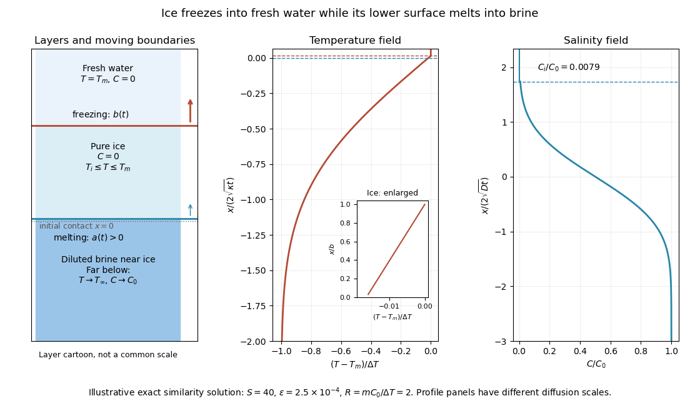
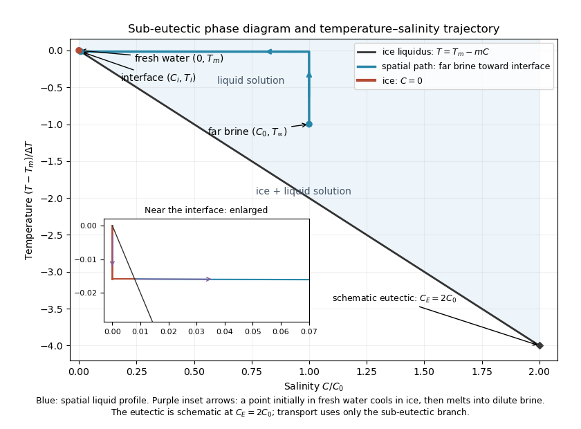

<h1 id="1/solution">Solution</h1>

↑ **Parent:** [1](../1.md)

Use a planar [saline Stefan problem](../../../../../saline-stefan-problem.md) with upward coordinate $z$, the initial contact at $z=0$, and [phase boundaries](../../../../../phase-boundary.md) $z=a(t)$ and $z=b(t)$ enclosing pure [ice](../../../../../ice.md), where $a<b$. Fresh liquid occupies $z>b$ and brine occupies $z<a$. We assume negligible bulk flow, equal constant [mass density](../../../../../density.md) $\rho$, [specific heat capacity](../../../../../specific-heat-capacity.md) $c_p$ and [thermal diffusivity](../../../../../thermal-diffusivity.md) $\kappa$ in all regions, and zero salt content and salt transport in the [ice](../../../../../ice.md). Equal densities remove phase-change volume flow; suppressing convection isolates the molecular-transport mechanism. Different material properties would change the numerical coefficients. Set $K=\rho c_p\kappa$ for the common [thermal conductivity](../../../../../thermal-conductivity.md) and $\Delta T=T_m-T_\infty>0$. Denote the brine salt [diffusion coefficient](../../../../../diffusion-coefficient.md) by $D$.

Use a linear [ice](../../../../../ice.md) [liquidus](../../../../../liquidus.md), $T_L(C)=T_m-mC$, with $m>0$ and $C$ the salt mass fraction. Assume the initial brine is a stable liquid, $T_\infty>T_L(C_0)$, and all concentrations considered are below the [eutectic composition](../../../../../eutectic-composition.md). Thus $R=mC_0/\Delta T>1$. These assumptions exclude independent nucleation in a supercooled brine or an [eutectic system](../../../../../eutectic-system.md) event, neither of which is specified by the initial data alone. Start with a negligible seed of [ice](../../../../../ice.md) and use local phase equilibrium without interfacial kinetics or curvature. [Temperature](../../../../../temperature.md) differences may be in Celsius, since only differences enter this calculation.

Write

$$
S=\frac{L}{c_p\Delta T},\qquad \epsilon=\sqrt{D/\kappa}.
$$

The paper calls $S$ a [Stefan number](../../../../../stefan-number.md); it is the [latent-to-sensible heat ratio](../../../../../latent-to-sensible-heat-ratio.md), reciprocal to another common [Stefan number](../../../../../stefan-number.md) convention. At the lower [phase boundary](../../../../../phase-boundary.md), define $T_i=T_L(C_i)$ and let

$$
\vartheta=\frac{T_m-T_i}{\Delta T},\qquad c=\frac{C_i}{C_0}.
$$

The [liquidus](../../../../../liquidus.md) relation is $\vartheta=Rc$.

A [similarity solution](../../../../../similarity-solution.md) gives an explicit calculation of the two positions. Put

$$
a(t)=2\delta\sqrt{\kappa t}=2A\sqrt{Dt},\qquad
b(t)=2B\sqrt{\kappa t},\qquad
\delta=\epsilon A,
$$

and use $u=z/(2\sqrt{\kappa t})$, $v=z/(2\sqrt{Dt})$. The [temperatures](../../../../../temperature.md) and salinities are

$$
T_f=T_m,\quad C_f=0\qquad(z>b),
$$

$$
T_s=T_m-\Delta T\,\vartheta
\frac{\operatorname{erf}B-\operatorname{erf}u}
{\operatorname{erf}B-\operatorname{erf}\delta},
\quad C_s=0\qquad(a<z<b),
$$

$$
T_l=T_\infty+\Delta T(1-\vartheta)
\frac{\operatorname{erfc}(-u)}{\operatorname{erfc}(-\delta)},
\quad
C_l=C_0+(C_i-C_0)
\frac{\operatorname{erfc}(-v)}{\operatorname{erfc}(-A)}
\qquad(z<a).
$$

These [error function](../../../../../error-function.md) and [complementary error function](../../../../../complementary-error-function.md) profiles satisfy the [heat equation](../../../../../heat-equation.md) and the salt [diffusion equation](../../../../../diffusion-equation-split.md), their far-field conditions, and the interfacial [temperature](../../../../../temperature.md) conditions. The fresh-water [temperature](../../../../../temperature.md) is constant because the interface and the far field are both at $T_m$.

Salt conservation at the moving lower [phase boundary](../../../../../phase-boundary.md) requires

$$
D\,C_{l,z}(a,t)=-\dot a\,C_i.
$$

For upward motion this is dilution by [melting](../../../../../melting.md) salt-free [ice](../../../../../ice.md), rather than [salt rejection](../../../../../salt-rejection.md) by [freezing](../../../../../freezing.md) brine. Substitution gives the [dilution function for a melting saline Stefan front](../../../../../dilution-function-for-a-melting-saline-stefan-front.md):

$$
\boxed{c=\frac1{1+\sqrt\pi A e^{A^2}\operatorname{erfc}(-A)}}.
$$

For $A>0$, $0<c<1$, so the interfacial brine is fresher than the remote liquid.

The [Stefan condition](../../../../../stefan-condition.md) at the upper boundary is $\rho L\dot b=K T_{s,z}(b)$, since the fresh liquid has no [temperature](../../../../../temperature.md) gradient. At the lower boundary it is

$$
\rho L\dot a=K\bigl(T_{s,z}(a)-T_{l,z}(a)\bigr).
$$

These signs follow from the jump in enthalpy: the upper front freezes liquid while a positive $\dot a$ melts solid. With $E=\operatorname{erf}B-\operatorname{erf}\delta$, they reduce to

$$
\boxed{
SB=\frac{\vartheta e^{-B^2}}{\sqrt\pi E},\qquad
S\delta=\frac{\vartheta e^{-\delta^2}}{\sqrt\pi E}
-\frac{(1-\vartheta)e^{-\delta^2}}
{\sqrt\pi\,\operatorname{erfc}(-\delta)},\qquad
\vartheta=\frac{R}{1+\sqrt\pi A e^{A^2}\operatorname{erfc}(-A)}.}
$$

Together with $\delta=\epsilon A$, these equations determine $A,B,\vartheta$, and hence both positions, without discarding the salt-diffusion correction.

For the stated large [latent-to-sensible heat ratio](../../../../../latent-to-sensible-heat-ratio.md), the layer is thin relative to the thermal [diffusion length](../../../../../diffusion-length.md). Expanding the thermal equations for $B,\delta\ll1$ gives

$$
S(B-\delta)\simeq\frac{1-\vartheta}{\sqrt\pi},\qquad
\vartheta\simeq2SB(B-\delta).
$$

Consequently a useful leading calculation is

$$
\boxed{
h(t)=b-a\simeq\frac{2\sqrt{\kappa t}}{S\sqrt\pi},\quad
a(t)=2A\sqrt{Dt},\quad
b(t)\simeq2\left(\epsilon A+\frac1{S\sqrt\pi}\right)\sqrt{\kappa t},}
$$

where the positive $A$ is obtained from

$$
\frac{R}{1+\sqrt\pi A e^{A^2}\operatorname{erfc}(-A)}
\simeq\frac2{\pi S}+\frac{2\epsilon A}{\sqrt\pi}.
$$

The left side decreases with $A\ge0$ while the right side increases, and their values at zero and infinity guarantee a unique positive root for large $S$. Thus this leading calculation includes the translation of the lower boundary as well as the increasing thickness.

If the scale separation also obeys $\epsilon SA\ll1$, the familiar simpler result is

$$
B\simeq\frac1{S\sqrt\pi},\qquad
\vartheta\simeq\frac2{\pi S},\qquad
\frac{C_i}{C_0}\simeq\frac2{\pi RS},
$$

with

$$
A e^{A^2}\simeq\frac{\sqrt\pi RS}{4},
\qquad A=O\!\left(\sqrt{\log(RS)}\right).
$$

This last simplification needs the logarithmic refinement $\epsilon S\sqrt{\log(RS)}\ll1$. The algebraic ordering $\epsilon\ll S^{-1}$ alone should not be used to discard an arbitrarily large logarithmic correction; the preceding coupled equations remain the appropriate calculation when that refinement is unavailable. This distinction is captured by [large latent heat in a freezing and melting ice layer](../../../../../large-latent-heat-in-a-freezing-and-melting-ice-layer.md).

**[Figure 1](#1/image-fresh-water-freezing-and-basal-ice-melting-with-the-temperature-and-salinity-profiles-on-their-distinct-diffusion-scales). Fresh-water freezing and basal ice melting with the temperature and salinity profiles on their distinct diffusion scales**.

The illustration uses $S=40$, $\epsilon=2.5\times10^{-4}$ and $R=2$. Solving the full equations gives $A=1.73707$, $B=0.0143053$ and $\vartheta=0.0158766$. It shows the [ice layer between freshwater and cold brine](../../../../../ice-layer-between-freshwater-and-cold-brine.md), with both fronts advancing upward and a strongly diluted lower liquid boundary.

**[Figure 2](#1/image-temperature-salinity-trajectory-from-cold-bulk-brine-to-the-ice-liquidus-and-through-salt-free-ice-to-fresh-water). Temperature-salinity trajectory from cold bulk brine to the ice liquidus and through salt-free ice to fresh water**.

The [phase diagram](../../../../../phase-diagram.md) shows the spatial path from remote brine to the lower interface: [temperature](../../../../../temperature.md) first changes over $\sqrt{\kappa t}$ at almost unchanged [salinity](../../../../../salinity.md), then [salinity](../../../../../salinity.md) changes over its much smaller diffusion scale at nearly constant [temperature](../../../../../temperature.md). The liquid path ends on the [liquidus](../../../../../liquidus.md) at $(C_i,T_i)$; the solid has $C=0$ and its [temperature](../../../../../temperature.md) rises from $T_i$ to $T_m$. The eutectic position is schematic, with $C_E=2C_0$ in the illustration, and is not used in the calculation. A point initially in the fresh layer freezes when $b$ reaches it, cools in the [ice](../../../../../ice.md), and later melts when $a$ reaches it. The inset indicates this temporal path in the opposite direction through the solid branch and into the liquid.

The mechanism is **simultaneous upper [freezing](../../../../../freezing.md) and lower [melting](../../../../../melting.md), with net growth of the [ice](../../../../../ice.md) thickness**. Cold brine accepts most of the [latent heat](../../../../../latent-heat.md) released by upper [freezing](../../../../../freezing.md). Salt reaching the lower contact lowers its equilibrium [melting](../../../../../melting.md) [temperature](../../../../../temperature.md), and [melting](../../../../../melting.md) freshens that liquid until its [liquidus](../../../../../liquidus.md) is close to $T_m$. The heat delivered through the [ice](../../../../../ice.md) supplies the much smaller [melting](../../../../../melting.md) demand there. The remote brine remains liquid even though it is below the pure-water [melting](../../../../../melting.md) [temperature](../../../../../temperature.md), because it lies above its own saline [liquidus](../../../../../liquidus.md). Thus “cold” does not by itself decide which phase is stable. These conclusions apply while the layers remain effectively deep and the stated no-convection, pure-[ice](../../../../../ice.md) and phase-equilibrium assumptions hold.

## ↑ Ancestors (10)

1. [1](../1.md)
2. [Paper 71](../../paper-71-split.md)
3. [Iii](../../split.md)
4. [2013](../../../split.md)
5. [Past exam of the mathematics course of the University of Cambridge](../../../../split.md)
6. [Mathematics course of the University of Cambridge](../../../../../mathematics-course-of-the-university-of-cambridge.md)
7. [Course of the University of Cambridge](../../../../../course-of-the-university-of-cambridge.md)
8. [University of Cambridge](../../../../../university-of-cambridge-split.md)
9. [List of universities](../../../../../list-of-universities.md)
10. [Codex Wiki](../../../../../split.md)
