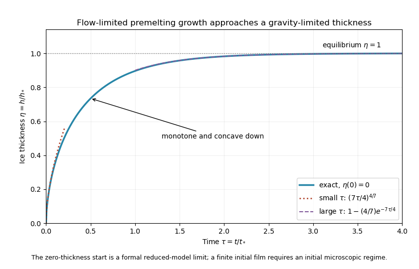

<h1 id="3/solution">Solution</h1>

↑ **Parent:** [3](../3.md)

Take $A>0$ for the repulsive molecular interaction, $p_0$ as the common reference pressure, and let $T_i=T_m-\delta T$ be the ice-film [temperature](../../../../../temperature.md). All ratios involving $T_m$ use its absolute value, approximately $273.15\,\mathrm K$, rather than the numerical Celsius value zero. The [premelting](../../../../../premelting.md) film permits water to reach and freeze at the bottom of the [ice](../../../../../ice.md) while the upper surface is displaced upward without [freezing](../../../../../freezing.md) there.

For equal phase [mass densities](../../../../../density.md), equality of the solid and liquid [chemical potentials](../../../../../chemical-potential.md) gives the [Clapeyron pressure relation for equal-density phases](../../../../../clapeyron-pressure-relation-for-equal-density-phases.md). Indeed, $d\mu=-s\,dT+dp/\rho$ and $s_l-s_s=L/T_m$, so expansion around coexistence at $(T_m,p_0)$ yields

$$
0=\mu_s-\mu_l=\frac{L}{T_m}(T_i-T_m)+\frac{p_s-p_l}{\rho},
\qquad
p_s-p_l=\frac{\rho L}{T_m}\delta T.
$$

This is a pressure difference between phases, not a same-pressure Clausius-Clapeyron slope. The molecular [disjoining pressure](../../../../../disjoining-pressure.md) supports this difference:

$$
p_T=p_s-p_l=\frac{A}{6\pi a^3}.
$$

Treat the normal solid load as its effective pressure in this planar model. The gravitational load corresponding to [hydrostatic pressure](../../../../../hydrostatic-pressure.md) is $p_s=p_0+\rho gh$, so $p_l=p_0+\rho gh-p_T$. Refer the bath pressure to the sheet's upper gravitational datum, or neglect the sheet-scale hydrostatic head. The [Darcy flow law](../../../../../darcy-law.md) then gives the upward supply and the [ice](../../../../../ice.md) growth rate

$$
\dot h=\frac{\Pi}{\mu d}(p_0-p_l)
=\frac{\Pi}{\mu d}(p_T-\rho gh).
$$

Here $\Pi$ is [permeability of a porous medium](../../../../../permeability-of-a-porous-medium.md), $\mu$ is [dynamic viscosity](../../../../../dynamic-viscosity.md), and equal densities identify supplied liquid volume with added [ice](../../../../../ice.md) volume to leading order in $a/h$.

To recover the printed law, use the usual [hydraulic control of frost heave](../../../../../hydraulic-control-of-frost-heave.md) idealization: the sheet's top is at $T_m$, the liquid film and [ice](../../../../../ice.md) have a common [thermal conductivity](../../../../../thermal-conductivity.md) $K$, and the flow is slow enough that latent-heat production is small compared with the conductive heat passing through the layer. In addition to a quasi-steady [ice](../../../../../ice.md) [temperature](../../../../../temperature.md) field, this needs

$$
\frac{\rho L|\dot h|h}{K\Delta T}\ll1.
$$

The leading [heat flux](../../../../../heat-flux-density.md) is consequently continuous through the film and [ice](../../../../../ice.md). Their thermal resistances give

$$
\frac{\delta T}{a}=\frac{\Delta T-\delta T}{h},
\qquad
\delta T=\frac{a}{h+a}\Delta T\simeq\frac ah\Delta T.
$$

Let $B_T=\rho L\Delta T/T_m$, a pressure scale. The [thermomolecular pressure](../../../../../thermomolecular-pressure.md) and the molecular law then give

$$
\frac{A}{6\pi a^3}\simeq B_T\frac ah,\qquad
a\simeq\left(\frac{Ah}{6\pi B_T}\right)^{1/4},\qquad
p_T\simeq B_T^{3/4}\left(\frac{A}{6\pi h^3}\right)^{1/4}.
$$

Substitute this pressure into the [Darcy flow law](../../../../../darcy-law.md):

$$
\boxed{\dot h=\frac{\Pi}{\mu d}
\left[\left(\frac{\rho L\Delta T}{T_m}\right)^{3/4}
\left(\frac{A}{6\pi h^3}\right)^{1/4}-\rho gh\right]}.
$$

The first term draws water toward the undercooled [ice](../../../../../ice.md); the increasing gravitational load eventually cancels it.

Quasi-steady [temperature](../../../../../temperature.md) alone is not sufficient to fix this exact prefactor. With film conductivity $K_l$, [ice](../../../../../ice.md) conductivity $K_s$, and nonnegligible latent heat, the appropriate additional balance is

$$
\rho L\dot h=\frac{K_s(\Delta T-\delta T)}h-\frac{K_l\delta T}{a},
\qquad
\delta T=\frac{T_mp_T}{\rho L},\qquad
a=\left(\frac{A}{6\pi p_T}\right)^{1/3}.
$$

Together with the Darcy equation, this is the implicit growth model. Even in the slow-flow limit, a conductivity ratio $K_s/K_l=r$ changes the leading driving pressure by $r^{3/4}$. Taking $r=2$ is a counterexample to obtaining the printed prefactor from quasi-steadiness alone. Thus the boxed equation is the intended equal-conductivity, thin-film, hydraulically limited model, rather than a consequence of only the stated quasi-steady assumption. This distinction is the [heat-balance correction to a premelted-film growth model](../../../../../heat-balance-correction-to-a-premelted-film-growth-model.md).

For that reduced equation define

$$
F=B_T^{3/4}\left(\frac{A}{6\pi}\right)^{1/4},\qquad
h_*=\left(\frac{F}{\rho g}\right)^{4/7},\qquad
t_*=\frac{\mu d}{\Pi\rho g},\qquad
\eta=\frac h{h_*},\quad\tau=\frac t{t_*}.
$$

The scale $h_*$ balances $Fh_*^{-3/4}$ against $\rho gh_*$; $F$ has units of pressure times length to the power $3/4$, so $h_*$ is a length and $t_*$ is a time. They yield

$$
\boxed{\frac{d\eta}{d\tau}=\eta^{-3/4}-\eta}.
$$

Set $u=\eta^{7/4}$. The equation becomes linear:

$$
\frac{du}{d\tau}=\frac74(1-u).
$$

For initial thickness $\eta(0)=\eta_0\ge0$, the [explicit solution of gravity-limited frost heave](../../../../../explicit-solution-of-gravity-limited-frost-heave.md) is

$$
\boxed{\eta(\tau)=
\left[1+\bigl(\eta_0^{7/4}-1\bigr)e^{-7\tau/4}\right]^{4/7}}.
$$

The usual zero-initial-thickness sketch uses

$$
\boxed{\eta(\tau)=\left(1-e^{-7\tau/4}\right)^{4/7}}.
$$

Its early and late behaviour are

$$
\eta(\tau)\sim\left(\frac{7\tau}{4}\right)^{4/7}
\quad(\tau\downarrow0),\qquad
\eta(\tau)=1-\frac47e^{-7\tau/4}+O(e^{-7\tau/2})
\quad(\tau\to\infty).
$$

For $0<\eta<1$, the derivative is positive and $\eta''=(-\tfrac34\eta^{-7/4}-1)\eta'<0$, so the curve is increasing and concave downward. It approaches the stable thickness $h_*$ exponentially. Initial thickness above $h_*$ instead relaxes downward; at $h_*$ it is stationary.

**[Figure 3](#3/image-exact-reduced-premelting-growth-from-zero-thickness-with-the-early-power-law-and-late-exponential-approach-to-equilibrium). Exact reduced premelting growth from zero thickness with the early power law and late exponential approach to equilibrium**.

The singular slope at zero belongs to the formal reduced solution. Since $a/h\propto h^{-3/4}$, the thin-film assumption eventually fails as $h\to0$. The early power law therefore describes an intermediate continuum regime after any microscopic startup, not arbitrarily early physical times. A finite positive $\eta_0$ supplies a regular initial condition when that regime begins. **Gravity limits the ultimate thickness; molecular suction and the Darcy resistance set the growth toward it.**

## ↑ Ancestors (10)

1. [3](../3.md)
2. [Paper 71](../../paper-71-split.md)
3. [Iii](../../split.md)
4. [2013](../../../split.md)
5. [Past exam of the mathematics course of the University of Cambridge](../../../../split.md)
6. [Mathematics course of the University of Cambridge](../../../../../mathematics-course-of-the-university-of-cambridge.md)
7. [Course of the University of Cambridge](../../../../../course-of-the-university-of-cambridge.md)
8. [University of Cambridge](../../../../../university-of-cambridge-split.md)
9. [List of universities](../../../../../list-of-universities.md)
10. [Codex Wiki](../../../../../split.md)
