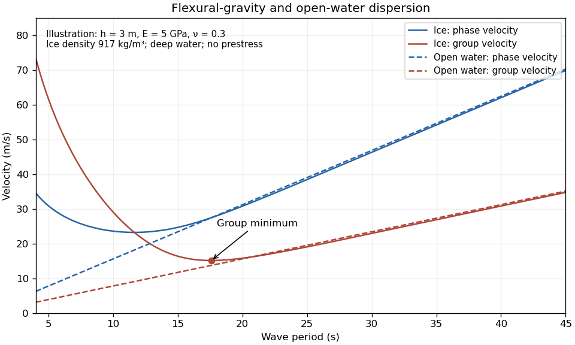

# Paper 72

↑ **Parent:** [Iii](../iii.md)

[https://www.maths.cam.ac.uk/postgrad/part-iii/files/pastpapers/2013/paper_72.pdf](https://www.maths.cam.ac.uk/postgrad/part-iii/files/pastpapers/2013/paper_72.pdf)

**Table of contents**

- [1](#1)
  - [a](#1/a)
    - [Solution](#1/a/solution)
  - [b](#1/b)
    - [i](#1/b/i)
      - [Solution](#1/b/i/solution)
    - [ii](#1/b/ii)
      - [Solution](#1/b/ii/solution)
- [2](#2)
  - [a](#2/a)
    - [Solution](#2/a/solution)
  - [b](#2/b)
    - [Solution](#2/b/solution)
- [3](#3)
  - [a](#3/a)
    - [Solution](#3/a/solution)
  - [b](#3/b)
    - [Solution](#3/b/solution)
  - [c](#3/c)
    - [Solution](#3/c/solution)
  - [d](#3/d)
    - [Solution](#3/d/solution)
- [4](#4)
  - [a](#4/a)
    - [Solution](#4/a/solution)
  - [b](#4/b)
    - [i](#4/b/i)
      - [Solution](#4/b/i/solution)
    - [ii](#4/b/ii)
      - [Solution](#4/b/ii/solution)
  - [c](#4/c)
    - [Solution](#4/c/solution)

## 1

↑ **Parent:** [Paper 72](paper-72.md)

<h3 id="1/a">a</h3>

↑ **Parent:** [1](#1)

<h4 id="1/a/solution">Solution</h4>

↑ **Parent:** [A](#1/a)

Write $w(x,t)$ for the vertical displacement of the [sea ice](../../../geophysics.md#sea-ice), and take the undisturbed water surface as $z=0$, with water occupying $z<0$. The [elastic plate](../../../continuum-mechanics.md#elastic-plate) has areal mass $m=\rho_i h$ and [bending stiffness](../../../continuum-mechanics.md#bending-stiffness)

$$
D=\frac{Eh^3}{12(1-\eta^2)}.
$$

Here $E$ is [Young's modulus](../../../continuum-mechanics.md#young-s-modulus) and $\eta$ is [Poisson's ratio](../../../continuum-mechanics.md#poisson-s-ratio). We neglect in-plane prestress, viscosity and plate shear deformation, and linearize about hydrostatic equilibrium. These are important assumptions: perfect elasticity alone does not specify every term in a floating-plate model.

For a [plane wave](../../../quantum-mechanics.md#plane-wave) $w=\widehat w e^{i(kx-\omega t)}$, $k>0$, [potential flow](../../../fluid-mechanics.md#potential-flow) in deep water has [velocity potential](../../../fluid-mechanics.md#velocity-potential) $\phi=\widehat\phi e^{kz}e^{i(kx-\omega t)}$. This solves [Laplace's equation](../../../partial-differential-equation.md#laplace-equation) and decays downwards. The [kinematic boundary condition](../../../fluid-mechanics.md#kinematic-boundary-condition) gives $k\widehat\phi=-i\omega\widehat w$. Linearizing the water pressure at the displaced interface gives an upward excess load

$$
\widehat p=-\rho_w(\phi_t+gw)
=\rho_w\left(\frac{\omega^2}{k}-g\right)\widehat w.
$$

The [elastic plate](../../../continuum-mechanics.md#elastic-plate) equation is $m w_{tt}+D w_{xxxx}=p$. Substitution and multiplication by $k$ therefore give the [flexural-gravity wave](../../../continuum-mechanics.md#flexural-gravity-wave) [dispersion relation](../../../wave-equation.md#dispersion-relation)

$$
\boxed{Dk^5+(\rho_wg-\rho_i h\omega^2)k-\rho_w\omega^2=0.}
$$

Equivalently, with $\alpha=\rho_i h/\rho_w$ and $\beta=D/\rho_w$,

$$
\boxed{\omega^2=\frac{gk+\beta k^5}{1+\alpha k}.}
$$

This determines the positive [wavenumber](../../../wave-equation.md#wavenumber) implicitly for prescribed positive [angular frequency](../../../classical-mechanics.md#angular-frequency). It is unambiguous: the [derivative](../../../calculus.md#derivative) of $\omega^2$ is $(g+5\beta k^4+4\alpha\beta k^5)/(1+\alpha k)^2>0$, while $\omega^2$ runs from zero to infinity.

The [phase velocity](../../../wave-equation.md#phase-velocity) and [group velocity](../../../wave-equation.md#group-velocity) are

$$
c_p=\frac{\omega}{k},\qquad
\boxed{c_g=\frac{g+5\beta k^4+4\alpha\beta k^5}{2\omega(1+\alpha k)^2}.}
$$

For open-water [deep-water gravity waves](../../../fluid-mechanics.md#deep-water-gravity-wave), $\omega^2=gk$, and hence $c_p=gT/(2\pi)$ and $c_g=gT/(4\pi)$. At large period the ice-covered curves approach these straight lines. At shorter period, plate bending raises the speeds, so both ice-covered curves turn upward as period decreases. In the bending regime with negligible plate inertia, $\omega\propto k^{5/2}$ and $c_g\simeq(5/2)c_p$; in the formal plate-inertia-dominated limit, $\omega\propto k^2$ and $c_g\simeq2c_p$. The latter extrapolation eventually leaves thin-plate validity and should not be read as a prediction at arbitrarily small [wavelength](../../../wave-equation.md#wavelength).

**[Figure 1](#1/a/image-phase-and-group-velocities-of-flexural-gravity-waves-compared-with-open-water-waves). Phase and group velocities of flexural-gravity waves compared with open-water waves**.

The plotted parameters are illustrative rather than measured at the observation site. They give a [group-velocity minimum of a flexural-gravity wave](../../../continuum-mechanics.md#group-velocity-minimum-of-a-flexural-gravity-wave) near $15.1\,\mathrm{m\,s^{-1}}$ at period $17.6\,\mathrm s$. **There is no arbitrarily slow wave-energy branch under a continuous elastic sheet.** Energy put into a localized disturbance travels away at at least this minimum [group velocity](../../../wave-equation.md#group-velocity); a slowly moving wind system cannot retain a [wave packet](../../../wave-equation.md#wave-packet) indefinitely beneath itself. This reduces the opportunity for sustained local growth compared with slow, short open-water waves, and the continuous cover also prevents direct wind forcing of an exposed water surface. Incoming long swell can still propagate.

A [group-velocity minimum of a flexural-gravity wave](../../../continuum-mechanics.md#group-velocity-minimum-of-a-flexural-gravity-wave) is not by itself a universal minimum wind speed for wave generation. A steadily translating forcing pattern requires a [phase velocity](../../../wave-equation.md#phase-velocity) matching its translation speed, so the minimum of $c_p$, not $c_g$, supplies the corresponding resonance threshold. Random wind forcing, dissipation and aerodynamic coupling must be specified before making an absolute generation claim.

<h3 id="1/b">b</h3>

↑ **Parent:** [1](#1)

<h4 id="1/b/i">i</h4>

↑ **Parent:** [B](#1/b)

<h5 id="1/b/i/solution">Solution</h5>

↑ **Parent:** [I](#1/b/i)

The [sea ice](../../../geophysics.md#sea-ice) acts as a frequency-selective filter. Over a long path, [wave attenuation in sea ice](../../../geophysics.md#wave-attenuation-in-sea-ice) is generally much stronger for shorter [surface gravity waves](../../../fluid-mechanics.md#surface-gravity-wave), through repeated scattering, internal ice losses and water-side dissipation. Their amplitude can fall below the tiltmeter's detection level even if the source initially generated them. Thus the long-period swell survives while the shorter-period tail does not.

**The disappearance near 14 s is an attenuation and detectability limit, not a forbidden-frequency interval of the ideal elastic plate.** The [flexural-gravity wave](../../../continuum-mechanics.md#flexural-gravity-wave) [dispersion relation](../../../wave-equation.md#dispersion-relation) admits a real positive [wavenumber](../../../wave-equation.md#wavenumber) for every positive [angular frequency](../../../classical-mechanics.md#angular-frequency). In an impulsive-source picture, shorter-period [deep-water gravity waves](../../../fluid-mechanics.md#deep-water-gravity-wave) also arrive later because their [group velocity](../../../wave-equation.md#group-velocity) is smaller, but delayed arrival alone does not explain a persistent observed cutoff.

<h4 id="1/b/ii">ii</h4>

↑ **Parent:** [B](#1/b)

<h5 id="1/b/ii/solution">Solution</h5>

↑ **Parent:** [Ii](#1/b/ii)

Use a common emission time $t_0$ and a path length $L$, and treat each observed period as a narrow [wave packet](../../../wave-equation.md#wave-packet). For [deep-water gravity waves](../../../fluid-mechanics.md#deep-water-gravity-wave), its [group velocity](../../../wave-equation.md#group-velocity) is $gT/(4\pi)$, not the [phase velocity](../../../wave-equation.md#phase-velocity) $gT/(2\pi)$. Therefore the [dispersive swell source inversion](../../../fluid-mechanics.md#dispersive-swell-source-inversion) gives

$$
t-t_0=\frac{4\pi L}{gT}=\frac{C}{T},\qquad
\boxed{T(t)=\frac{C}{t-t_0},\quad \frac{dT}{dt}=-\frac{T^2}{C}.}
$$

Thus period decreases hyperbolically, while frequency $1/T$ increases linearly. The elapsed time between the two observations is $40\,\mathrm h\,40\,\mathrm{min}=146400\,\mathrm s$, so

$$
C=\frac{146400}{1/14-1/30}=3.8430\times10^6\,\mathrm{s^2},
\qquad
\boxed{L=\frac{gC}{4\pi}=3.00\times10^6\,\mathrm m.}
$$

The frequency slope is $2.6021\times10^{-7}\,\mathrm{Hz\,s^{-1}}$. Initially $dT/dt=-0.843\,\mathrm{s\,h^{-1}}$; at 14 s it has slowed to $-0.184\,\mathrm{s\,h^{-1}}$. The inferred emission was $C/30=35\,\mathrm h\,35\,\mathrm{min}$ before the first arrival, namely **19 March at 1710 UT**. Both observed endpoints give this same time.

A northward-propagating swell with this distance scale points to a remote energetic storm south of the high Arctic rather than local wind acting on continuous [sea ice](../../../geophysics.md#sea-ice). Along a meridional route, 3,000 km is about $27^\circ$ of latitude, putting the source on the scale of the northern North Atlantic and adjacent open seas. A route through Fram Strait is plausible, but longitude and refraction are not supplied, so no particular storm or unique source position follows. Long swell arriving first and steadily increasing frequency are the expected signatures of remote [wave dispersion](../../../wave-equation.md#wave-dispersion). The distance and time are conditional on an approximately impulsive source and open-water propagation speeds; passage through ice, currents and finite storm duration produce corrections.

## 2

↑ **Parent:** [Paper 72](paper-72.md)

<h3 id="2/a">a</h3>

↑ **Parent:** [2](#2)

<h4 id="2/a/solution">Solution</h4>

↑ **Parent:** [A](#2/a)

It is important to distinguish loss of forward-going [surface-gravity-wave energy](../../../fluid-mechanics.md#surface-gravity-wave-energy) from conversion of mechanical [energy](../../../classical-mechanics.md#energy) into [heat](../../../thermodynamics.md#heat). [Scattering attenuation by ice floes](../../../geophysics.md#scattering-attenuation-by-ice-floes) redirects energy; it can attenuate a coherent transmitted wave without dissipating the total energy.

For fixed floe geometry, increasing frequency usually increases attenuation over the relevant swell range: shorter [wavelengths](../../../wave-equation.md#wavelength) respond more strongly to the contrast between water and the [elastic plate](../../../continuum-mechanics.md#elastic-plate), and to repeated floe edges. Long [surface gravity waves](../../../fluid-mechanics.md#surface-gravity-wave) have weak curvature and often penetrate much farther. This is a trend over a specified frequency range, not a theorem excluding resonances.

The diameter dependence is governed by $d/\lambda$. An [ice floe](../../../geophysics.md#ice-floe) much smaller than the [wavelength](../../../wave-equation.md#wavelength) moves nearly with the water and scatters weakly. Scattering becomes appreciable when floe size is comparable with the [wavelength](../../../wave-equation.md#wavelength), and interference between its two edges can give maxima and minima. At fixed ice concentration, larger [ice floes](../../../geophysics.md#ice-floe) also mean fewer edges per unit propagation distance, roughly proportional to $p/d$. Consequently the attenuation coefficient need not increase monotonically with diameter: the single-floe reflection and the number of encounters must both be considered. Thickness increases areal inertia as $\rho_i h$ and [bending stiffness](../../../continuum-mechanics.md#bending-stiffness) as $h^3$, generally increasing wave mismatch and reflection, although detailed frequency-dependent resonances again prevent a universal monotonic law.

When $d\ll\lambda$, particularly for [frazil ice](../../../geophysics.md#frazil-ice) and [pancake ice](../../../geophysics.md#pancake-ice), weak individual scattering leaves other processes dominant. Relative crystal and water motion causes [viscous dissipation](../../../stokes-flow.md#viscous-dissipation); an aggregate layer can behave as a viscous or viscoelastic material, and [pancake ice](../../../geophysics.md#pancake-ice) collisions, rubbing and overwash remove energy. Their importance depends on concentration and wave amplitude.

For a uniform continuous sheet with horizontal dimensions much greater than the [wavelength](../../../wave-equation.md#wavelength), there are no repeated floe edges in its interior. A perfectly elastic sheet over inviscid water supports undamped [flexural-gravity waves](../../../continuum-mechanics.md#flexural-gravity-wave), so internal scattering is not an explanation of decay there. Real attenuation can instead arise from internal ice anelasticity or [viscoelasticity](../../../rheology.md#viscoelasticity), a dissipative sub-ice [viscous boundary layer](../../../viscous-fluid-flow.md#viscous-boundary-layer), turbulence, cracks and brine-related processes. **Small-floe mixtures and continuous sheets require dissipation models beyond the isolated-floe scattering picture.**

<h3 id="2/b">b</h3>

↑ **Parent:** [2](#2)

<h4 id="2/b/solution">Solution</h4>

↑ **Parent:** [B](#2/b)

Take $x$ positive in the off-ice wind direction, from the compact pack towards the open sea. The wind initially separates the outer [ice floes](../../../geophysics.md#ice-floe), creating irregular [polynyas](../../../geophysics.md#polynya). A larger opening gives more [open-water fetch](../../../fluid-mechanics.md#wave-fetch), so stronger short wind waves develop before reaching its downwind edge. Their reflection supplies a positive force on the downwind [ice floes](../../../geophysics.md#ice-floe); these catch their neighbours and compact into an [ice-edge band](../../../geophysics.md#ice-edge-band). Incoming longer swell exerts force in the opposite direction. The short waves can exert substantial force despite their smaller amplitude because a small [ice floe](../../../geophysics.md#ice-floe) reflects them much more effectively than it reflects the long swell.

The [surface-gravity-wave energy](../../../fluid-mechanics.md#surface-gravity-wave-energy) of the short waves grows with fetch in the windward [polynya](../../../geophysics.md#polynya), then decays rapidly across the band. Swell enters from the seaward side and usually attenuates more slowly. This gives inward forcing from the two sides: short-wave forcing is largest at the windward face and swell forcing is largest at the seaward face. In the next open [polynya](../../../geophysics.md#polynya), short wind waves regrow from the weak transmitted component. Reflected waves also enhance energy locally on the incident side, with interference that is omitted from a smooth, phase-averaged sketch.

**[Figure 2](#2/b/image-schematic-short-wave-and-swell-energy-in-an-ice-band-and-the-polynyas-on-either-side). Schematic short-wave and swell energy in an ice band and the polynyas on either side**.

Each plotted component is normalized by its own incident energy; the curves do not assert equal absolute wind-wave and swell energies. The band is partially transmitting. For a perfectly opaque reflector, the transmitted component would instead vanish.

The initial bands have unequal floe inventories, widths and forcing. Differential drift and collisions merge some into composite bands. Larger bands tend to shield smaller downstream accumulations from the short-wave forcing needed to keep them separate, while sufficiently wide intervening [polynyas](../../../geophysics.md#polynya) can generate fresh wind waves and maintain separation. Finite available ice, available [wave fetch](../../../fluid-mechanics.md#wave-fetch), the opposing swell, wind strength and duration, floe size and thickness, and subsequent mergers limit the number of persistent bands. The wave-force formula alone does not select a universal count. This mechanism and its merger interpretation are supported by [the original ice-band study](https://doi.org/10.1029/JC088iC05p02813).

There is a normalization issue in the requested stress calculation. Let $\mathcal E=\rho_wga^2/2$ be standard linear [surface-gravity-wave energy](../../../fluid-mechanics.md#surface-gravity-wave-energy) for crest amplitude $a$. The deep-water [wave radiation stress](../../../fluid-mechanics.md#radiation-stress) is $S_{xx}=\mathcal E/2$. Hence standard momentum balance gives

$$
F_{\rm phys}=\frac{\rho_wg}{4}(a^2+r^2-t^2).
$$

For lossless reflection with amplitude [reflection coefficient](../../../partial-differential-equation.md#reflection-coefficient) $R$, $r^2=R^2a^2$ and $t^2=(1-R^2)a^2$, so $F_{\rm phys}=\rho_wgR^2a^2/2$.

In the usual independent-floe, weak-reflection approximation, there are about $p/d$ effective layers per unit distance. Each removes a fraction $R^2$ of the forward energy, giving

$$
\frac{d(a^2)}{dx}=-\frac{pR^2}{d}a^2,\qquad
a(x)=a_0\exp\left(-\frac{pR^2x}{2d}\right).
$$

This yields the intended [wave-driven ice-band compaction](../../../geophysics.md#wave-driven-ice-band-compaction):

$$
\boxed{-\frac{dF_{\rm phys}}{dx}
=\frac{\rho_wgpR^4a^2}{2d}.}
$$

The attenuation approximation retains the leading term in $R^2$; an independent discrete-layer model instead gives an energy coefficient $-(p/d)\log(1-R^2)$. Neither coefficient follows from the single-object force formula without this additional scattering closure.

For ordinary crest amplitudes, the force printed in the paper is $4F_{\rm phys}$. With that printed normalization and the same attenuation law, its [derivative](../../../calculus.md#derivative) is four times the requested stress. More generally, if $a^2=a_0^2e^{-\kappa x}$, the printed lossless force gives $-F'=2\rho_wgR^2\kappa a^2$. Recovering the stated stress from it requires $\kappa=pR^2/(4d)$ instead, a different unspecified attenuation convention. **The supplied force and stress cannot both be derived from standard amplitudes and the usual floe-layer attenuation law.** Restoring the factor $1/4$ in the force gives a consistent intended model.

Using the printed force for the numerical question, perfect reflection gives $r=a$, $t=0$, and therefore

$$
\boxed{F_{\rm printed}=2(1025)(9.81)(0.1)^2=201.1\,\mathrm{N\,m^{-1}}.}
$$

Using the requested stress formula for partial reflection gives

$$
\boxed{s=\frac{1025(9.81)(1)(0.5)^4(0.1)^2}{2(20)}
=0.157\,\mathrm{N\,m^{-2}}.}
$$

For comparison, the consistently normalized perfect-reflection force is $50.3\,\mathrm{N\,m^{-1}}$, and the printed force with standard attenuation would give $0.628\,\mathrm{N\,m^{-2}}$ for the partial-reflection [derivative](../../../calculus.md#derivative). The approximate stress is a force per horizontal area, not a direct measure of the three-dimensional ice-skeleton [stress](../../../continuum-mechanics.md#stress).

The inward force gradient helps maintain a coherent, close-packed band, especially near the incident-wave faces. It is modest enough that wind, current, swell changes or mergers can disrupt the arrangement; it does not guarantee permanent mechanical stability. Perfect reflection estimates a bounding force, whereas the much smaller partial-reflection stress varies as $R^4$. No mechanical-strength law is supplied, so stability can be assessed only qualitatively.

## 3

↑ **Parent:** [Paper 72](paper-72.md)

<h3 id="3/a">a</h3>

↑ **Parent:** [3](#3)

<h4 id="3/a/solution">Solution</h4>

↑ **Parent:** [A](#3/a)

A [sea-ice pressure ridge](../../../geophysics.md#sea-ice-pressure-ridge) forms where horizontal convergence compresses [sea ice](../../../geophysics.md#sea-ice). The initially thinner sheet or colliding [ice floes](../../../geophysics.md#ice-floe) fracture and ride over or under one another. Continued convergence piles broken blocks into an emergent sail and a submerged keel. The submerged volume is normally larger because buoyancy supports the pile. Pores and brine-filled gaps initially make the rubble unlike a solid intact sheet; refreezing can consolidate it.

A [sea-ice shear ridge](../../../geophysics.md#sea-ice-shear-ridge) develops along a fracture where neighbouring ice moves tangentially in opposite directions or at different speeds. Rough edges interlock, crush and locally converge, producing chains of piled blocks along the shear boundary. Thus the large-scale strain is mainly shear, but the actual production of ridge rubble involves local compression. Pure sliding of perfectly smooth parallel surfaces need not create a ridge. **Pressure ridging is driven by convergence; shear ridging is driven by relative tangential motion with local crushing and convergence.**

<h3 id="3/b">b</h3>

↑ **Parent:** [3](#3)

<h4 id="3/b/solution">Solution</h4>

↑ **Parent:** [B](#3/b)

Let $H$ denote a ridge's peak [sea-ice draft](../../../geophysics.md#sea-ice-draft), reserving $h$ for the draft at a randomly sampled position. In the [exponential ridge-draft model](../../../geophysics.md#exponential-ridge-draft-model), normalization by the line density $\mu$ gives

$$
\mu=\int_{h_0}^\infty Be^{-bH}\,dH
=\frac{B}{b}e^{-bh_0}.
$$

The mean peak [sea-ice draft](../../../geophysics.md#sea-ice-draft) is

$$
h_m=\frac1\mu\int_{h_0}^\infty HBe^{-bH}\,dH
=h_0+\frac1b.
$$

Consequently

$$
\boxed{b=\frac1{h_m-h_0},\qquad
B=\frac{\mu}{h_m-h_0}\exp\left(\frac{h_0}{h_m-h_0}\right),}
$$

with $h_m>h_0$, $b$ having dimensions inverse length and $B$ inverse length squared. The normalized peak [probability density function](../../../continuous-probability-distribution.md#probability-density-function) is a shifted [exponential distribution](../../../continuous-probability-distribution.md#exponential-distribution).

For the triangular argument, interpret the common ridge shape as geometrically similar triangles with common along-track slope $\tan\delta$ and variable peak height. Literal congruence would require identical sizes and could not coexist with an exponential peak-draft distribution. Each side of a triangle has $dx=|dh|/\tan\delta$. A ridge reaching draft $H\ge h$ therefore contributes $2\cot\delta\,dh$ of horizontal track in the interval $[h,h+dh]$. Summing this occupation length over all qualifying peaks proves the [triangular ridge occupation identity](../../../geophysics.md#triangular-ridge-occupation-identity):

$$
g(h)=2\cot\delta\int_h^\infty n(H)\,dH
=\frac{2B}{b\tan\delta}e^{-bh},
\qquad h\ge h_0.
$$

Thus

$$
\boxed{A=\frac{2B}{b\tan\delta}.}
$$

This is a tail relation for sampled draft occupation, not an instruction to normalize $n$ and $g$ identically. Below $h_0$, the ideal triangles contribute $2\mu\cot\delta$ rather than the same exponential; level ice and gaps contribute their own draft distributions. If triangular keels are referenced to a level-ice base, the vertical coordinate must be shifted consistently. We also require nonoverlapping occupation: arbitrary choices of $\mu$, mean draft and slope can otherwise demand more than the available track length.

Observed mean keel slopes are typically of order $20^\circ$–$30^\circ$, with broad individual variation rather than a single universal angle. Orientation matters: if a track crosses a straight ridge at angle $\psi$ to the crest, $\tan\delta_{\rm track}=\tan\delta_\perp|\sin\psi|$. The track slope can therefore approach zero at a grazing crossing. [A sonar morphology study](https://doi.org/10.1029/95JC00007) found location-dependent mean slopes about $22^\circ$–$27^\circ$ after correcting for ridge orientation.

Young [sea-ice pressure ridges](../../../geophysics.md#sea-ice-pressure-ridge) often have recognizably triangular sections with angular, porous rubble and comparatively continuous crests. Melting, refreezing and repeated cracking modify older ridges: their blocks can become rounded and consolidated, and their keel or crest can fragment into separated hummocks rather than retain one triangular shape. [A pre-exam multibeam study](https://doi.org/10.1016/j.polar.2012.03.002) found [first-year sea ice](../../../geophysics.md#first-year-sea-ice) ridge slopes averaging roughly $27^\circ$, while [multi-year sea ice](../../../geophysics.md#multi-year-sea-ice) ridges often consisted of irregular separated smooth blocks. Multi-year sections can be broader or locally shallower, but age alone does not determine one slope angle. **The constant-slope triangle is a useful statistical idealization, not a faithful shape for every old ridge.**

<h3 id="3/c">c</h3>

↑ **Parent:** [3](#3)

<h4 id="3/c/solution">Solution</h4>

↑ **Parent:** [C](#3/c)

Use the [exponential ridge-draft model](../../../geophysics.md#exponential-ridge-draft-model) along the direction of motion relative to the seabed. During time $dt$, the stationary point samples track length $|V|dt$. Peaks deeper than the seabed have line density

$$
\mu_D=\int_{\max(D,h_0)}^\infty n(H)\,dH
=\mu\exp\left[-\frac{\max(D,h_0)-h_0}{h_m-h_0}\right].
$$

The candidate [seabed gouging by ice](../../../geophysics.md#seabed-gouging-by-ice) encounter rate is therefore

$$
\boxed{\nu_D=|V|\mu
\exp\left[-\frac{\max(D,h_0)-h_0}{h_m-h_0}\right].}
$$

For the usual case $D\ge h_0$, replace $\max(D,h_0)$ by $D$. For $D<h_0$, every counted ridge is deep enough and $\nu_D=|V|\mu$.

The units are inverse time. This is the number of potentially scouring keel passages per unit time, not sediment volume removed per unit time. The latter also requires keel width, sediment properties and an erosion law. The expression assumes the ridge statistics remain applicable during drift and grounding does not arrest or reshape the deep keels before they reach the point. If speed fluctuates, use mean relative speed under independence from ridge occurrence, not the magnitude of a vector-mean drift that might cancel reversing motion.

<h3 id="3/d">d</h3>

↑ **Parent:** [3](#3)

<h4 id="3/d/solution">Solution</h4>

↑ **Parent:** [D](#3/d)

The independent, spatially homogeneous random-placement idealization gives a [Poisson process](../../../probability-theory.md#poisson-process) of intersections along the sampling line. With line intensity $\mu$, an interval of length $s$ contains no ridge with probability $e^{-\mu s}$. The spacing $X$ thus has [exponential distribution](../../../continuous-probability-distribution.md#exponential-distribution)

$$
\boxed{f_X(s)=\mu e^{-\mu s},\qquad s\ge0,\qquad
\mathbb E[X]=\frac1\mu.}
$$

Random orientation changes the intersection intensity, which has already been represented by the measured $\mu$. Merely saying that positions are random does not prove a [Poisson process](../../../probability-theory.md#poisson-process): independence and homogeneity are additional assumptions. Finite segments, clustering or excluded widths can invalidate them.

For a [shifted lognormal distribution](../../../probability-theory.md#shifted-lognormal-distribution), write $Z=\log(X-\theta)\sim N(m,\sigma^2)$ with $\sigma>0$. Applying the [change of variables](../../../calculus.md#change-of-variables-formula) formula, $dZ/dX=1/(X-\theta)$, gives

$$
\boxed{
f_X(x)=
\begin{cases}
\displaystyle\frac{1}{(x-\theta)\sigma\sqrt{2\pi}}
\exp\left[-\frac{(\log(x-\theta)-m)^2}{2\sigma^2}\right],
&x>\theta,\\
0,&x\le\theta .
\end{cases}}
$$

The threshold $\theta$ is a minimum observable separation. Finite keel widths impose geometric exclusion, and the [sonar](../../../physics.md#sonar)'s footprint and ridge-identification criterion can suppress a shallow peak near a deeper peak. This [sonar ridge shadowing](../../../geophysics.md#sonar-ridge-shadowing) or resolution effect means that $\theta$ need not be a universal physical distance between every pair of ridges; it can partly reflect how the profiles were processed.

A [lognormal distribution](../../../probability-theory.md#log-normal-distribution) is compatible with products of many positive factors: taking logarithms turns multiplicative changes into sums, which can approach a [normal distribution](../../../probability-theory.md#normal-distribution). Repeated deformation, breakup, convergence and merging across scales are plausible contributors. The observed form therefore suggests correlated or multistage ridging rather than the simplest independent-intersection model. **It does not identify a unique ridging mechanism.** For example, directly generating $X=\theta+\exp Z$ with a [normal distribution](../../../probability-theory.md#normal-distribution) for $Z$ produces the same spacing law without specifying any particular mechanics. Distributional agreement must be supplemented by dynamical and spatial evidence.

## 4

↑ **Parent:** [Paper 72](paper-72.md)

<h3 id="4/a">a</h3>

↑ **Parent:** [4](#4)

<h4 id="4/a/solution">Solution</h4>

↑ **Parent:** [A](#4/a)

Use historical changes up to 2012 rather than the present-day Arctic state, and separate extent, actual ice-covered area, thickness and age composition. They do not have interchangeable rates.

For summer horizontal coverage, September minimum extent fell from roughly $7$ million square kilometres around 1980 to $3.4$ million in 2012: about half the earlier extent. The fitted September monthly-mean trend through 2012 was about $-91{,}600\,\mathrm{km^2\,yr^{-1}}$, or $-13\%$ per decade relative to the 1979–2000 mean. Extent includes the whole area of grid cells above the specified ice-concentration threshold; actual covered area additionally weights fractional cover. A separate concentration-weighted September ice-area analysis for 1979–2012 gives a decline of roughly $0.95\times10^6\,\mathrm{km^2}$ per decade, or $95{,}000\,\mathrm{km^2\,yr^{-1}}$; this retrospective historical-period estimate is reported in [an observational-area comparison](https://presentations.copernicus.org/EGU2020/EGU2020-4729_presentation.pdf). It should not be confused with the extent trend, even though these two absolute slopes are similar. These figures and definitions are documented in [the 2012 Arctic sea-ice observations](https://arctic.noaa.gov/wp-content/uploads/2023/04/ArcticReportCard_full_report2012.pdf).

For thickness, the submarine and satellite record in the declassified submarine-data region, covering about $38\%$ of the Arctic Ocean, gives a winter mean of $3.64\,\mathrm m$ in 1980 versus $1.89\,\mathrm m$ in 2008: a $48\%$ reduction, averaging about $0.063\,\mathrm{m\,yr^{-1}}$. It is a regional winter comparison, not a basin-wide summer measurement. The same combined analysis reported recent 2003–2008 declines around $0.10\,\mathrm{m\,yr^{-1}}$ in winter and $0.20\,\mathrm{m\,yr^{-1}}$ in summer. The summer record is shorter and cannot justify extrapolating one constant summer-thickness slope back to 1980. See [the original thickness analysis](https://doi.org/10.1029/2009GL039035).

For composition, repeated summer loss and export depleted the thick [multi-year sea ice](../../../geophysics.md#multi-year-sea-ice) reservoir and increased the relative importance of young and [first-year sea ice](../../../geophysics.md#first-year-sea-ice). A directly comparable age indicator is the March fraction aged at least four years: about $26\%$ in 1988, $19\%$ in 2005 and only $7\%$ in 2012. This winter age measure records the loss of ice that had survived earlier summers; it is not the fraction of surviving September ice that is first-year ice. The youngest ice disproportionately melts in summer, so the age mix of survivors differs from that of the preceding winter cover. Overall, **summer cover became smaller, thinner and supported by a much depleted reservoir of older ice**.

Several mechanisms can accelerate [Arctic sea ice decline](../../../geophysics.md#arctic-sea-ice-decline). The [ice-albedo feedback](../../../geophysics.md#ice-albedo-feedback) increases solar absorption as dark water replaces bright ice. Additional [ocean heat content](../../../geophysics.md#ocean-heat-content) delays autumn freeze-up, leaving less time for winter growth. Thinner ice needs less [latent heat](../../../thermodynamics.md#latent-heat) to disappear, and fractured mobile ice is more easily exported or redistributed by [wind stress](../../../geophysical-fluid-dynamics.md#wind-stress) and currents. Melt ponds lower [surface albedo](../../../geophysics.md#surface-albedo); increased [open-water fetch](../../../fluid-mechanics.md#wave-fetch) permits waves that break the ice further. Persistent atmospheric warming and warmer incoming water act on this weakened cover.

However, strict irreversibility is not implied by these positive feedbacks. Winter open water loses [heat](../../../thermodynamics.md#heat), and thin ice grows rapidly because its conductive resistance is low. As a concrete counterexample to an unavoidable one-way transition, [a 2011 coupled-model experiment](https://doi.org/10.1029/2010GL045698) imposed an ice-free summer and found recovery of ice extent typically within two years. This establishes a physically consistent recovery mechanism, not a guarantee that every real loss reverses on that timescale.

**Under continued warming, rebuilding the former [multi-year sea ice](../../../geophysics.md#multi-year-sea-ice) cover is unlikely; loss of one summer's cover is nevertheless not intrinsically irreversible.** Sustained [greenhouse gas](../../../exoplanet.md#greenhouse-gas) forcing changes the climatic state towards which ice recovers, and rebuilding several age classes takes multiple summers of survival. The qualified conclusion is persistence or worsening under the continuing forcing, not a proved thermodynamic prohibition of recovery at fixed or reduced forcing.

<h3 id="4/b">b</h3>

↑ **Parent:** [4](#4)

<h4 id="4/b/i">i</h4>

↑ **Parent:** [B](#4/b)

<h5 id="4/b/i/solution">Solution</h5>

↑ **Parent:** [I](#4/b/i)

Use seawater [specific heat capacity](../../../thermodynamics.md#specific-heat-capacity) $c_w\simeq4.0\times10^3\,\mathrm{J\,kg^{-1}\,K^{-1}}$, which is an additional standard material approximation: the paper supplies the ice heat capacity, not the seawater heat capacity. Relative to freezing, the assumed uniform column has $\Delta T=7-(-1.8)=8.8\,\mathrm K$. Its [ocean heat content](../../../geophysics.md#ocean-heat-content) per horizontal area is

$$
\boxed{Q=\rho_wc_wH\Delta T
=(1025)(4000)(50)(8.8)
=1.804\times10^9\,\mathrm{J\,m^{-2}}.}
$$

This is heat above the reference freezing state, not the absolute internal energy of seawater.

If all this [heat](../../../thermodynamics.md#heat) reaches ice already at its fusion temperature, divide by the supplied [latent heat](../../../thermodynamics.md#latent-heat):

$$
\boxed{\frac{M_{\rm melt}}{\text{area}}
=\frac{Q}{L_f}
=\frac{1.804\times10^9}{336000}
=5.37\times10^3\,\mathrm{kg\,m^{-2}}.}
$$

For a chosen ice [mass density](../../../fluid-mechanics.md#density) $\rho_i=917\,\mathrm{kg\,m^{-3}}$, this corresponds to **about $5.86\,\mathrm m$ of ice**. Density was not specified for this conversion, so the mass per area is the result that needs no further ice-density assumption.

Cold ice must first be warmed. If its initial [temperature](../../../thermodynamics.md#temperature) is $T_i<T_m$, the corresponding ideal melt mass is $Q/[L_f+c_i(T_m-T_i)]$, using the supplied ice [specific heat capacity](../../../thermodynamics.md#specific-heat-capacity) $c_i=2100\,\mathrm{J\,kg^{-1}\,K^{-1}}$. No initial ice temperature or salinity-dependent fusion temperature is supplied. The latent-only result is therefore an upper bound; actual melting is smaller when sensible warming, ocean or atmospheric losses and incomplete heat transfer matter.

<h4 id="4/b/ii">ii</h4>

↑ **Parent:** [B](#4/b)

<h5 id="4/b/ii/solution">Solution</h5>

↑ **Parent:** [Ii](#4/b/ii)

Solar geometry must be included before multiplying by the summer duration. Let $\phi=71^\circ$, solar declination $\delta$, and hour angle $u$, measured from local noon. The cosine of solar zenith angle is

$$
\cos\zeta=\sin\phi\sin\delta+\cos\phi\cos\delta\cos u.
$$

Only positive values receive sunlight. Integrating through a day gives the [daily mean solar irradiance](../../../geophysics.md#daily-mean-solar-irradiance) at the top of the atmosphere:

$$
\overline S=\frac{S_0}{\pi}
[H_0\sin\phi\sin\delta+\cos\phi\cos\delta\sin H_0],
\qquad H_0=\arccos(-\tan\phi\tan\delta),
$$

with $H_0$ clipped to $\pi$ for polar day and to zero for polar night. At the solstice, for example, polar-day averaging gives $\overline S=S_0\sin71^\circ\sin23.44^\circ\simeq514\,\mathrm{W\,m^{-2}}$. It would be wrong to apply $S_0$ continuously to a horizontal surface.

A simple seasonal approximation $\delta(n)=23.44^\circ\sin[2\pi(n-80)/365]$, with calendar day $n$, gives a June–August daily-mean average of about $427\,\mathrm{W\,m^{-2}}$. There are 92 days. With [surface albedo](../../../geophysics.md#surface-albedo) $\alpha=0.1$, the no-atmosphere absorbed-solar ceiling is

$$
\boxed{Q_{\rm solar,TOA}
=(1-\alpha)\sum_{n=152}^{243}\overline S(n)(86400)
\simeq3.06\times10^9\,\mathrm{J\,m^{-2}}.}
$$

This calculation neglects the small seasonal change in Earth-Sun distance. The ceiling is larger than the $1.80\,\mathrm{GJ\,m^{-2}}$ required in part (i), so geometry alone does not make a uniform $7^\circ\mathrm C$ column impossible.

A reasonable conditional estimate includes an effective atmospheric short-wave transmission $\tau$ and net non-solar loss $\overline L$:

$$
Q_{\rm stored}\simeq\tau Q_{\rm solar,TOA}
-\overline L(92)(86400),
$$

before adding advection or subtracting ice melting. The parameters are scenario assumptions, not measurements supplied by the question. For example, $\tau=0.6$ gives $1.83\,\mathrm{GJ\,m^{-2}}$ before other losses, barely enough; with a modest mean loss of $50\,\mathrm{W\,m^{-2}}$, the retained amount is only $1.44\,\mathrm{GJ\,m^{-2}}$. That would raise a uniform 50 m column from freezing by about $7.0\,\mathrm K$, reaching roughly $5.2^\circ\mathrm C$. With no other losses the transmission required for $7^\circ\mathrm C$ is $1.804/3.058\simeq0.590$; with that illustrative loss it rises to about $0.720$. Clouds, emitted thermal radiation, evaporation, transfer to colder water and melting all affect the balance.

**The satellite surface temperature is insufficient evidence for a $7^\circ\mathrm C$ seabed.** A warm, shallow [ocean mixed layer](../../../gravity-wave.md#ocean-mixed-layer) can overlie colder water because meltwater and salinity maintain [stable density stratification](../../../gravity-wave.md#stable-density-stratification). Heating only the upper 10 m through $8.8\,\mathrm K$ costs $0.361\,\mathrm{GJ\,m^{-2}}$, much less than heating all 50 m. Warm Pacific-water advection can also raise surface temperature or supply additional heat. If measured net solar input were too small for full-depth warming, shallow surface heating would be the natural alternative; if mixing and additional heat supply were strong enough, full-depth warming remains possible. The missing transmission, loss, mixing and inflow information prevents a unique yes-or-no conclusion from the supplied surface observation.

<h3 id="4/c">c</h3>

↑ **Parent:** [4](#4)

<h4 id="4/c/solution">Solution</h4>

↑ **Parent:** [C](#4/c)

Identified Arctic [methane](../../../chemistry.md#methane) sources include anaerobic decomposition in wetlands and saturated tundra, bubbles from lakes and [thermokarst](../../../geophysics.md#thermokarst) lakes formed by thawing [permafrost](../../../geophysics.md#permafrost), geological gas seeps, and leakage from fossil-fuel extraction or transport. Warming can expose frozen organic carbon to microbes, promoting [methanogenesis](../../../chemistry.md#methanogenesis) where oxygen is scarce; it does not convert all thawed carbon into [methane](../../../chemistry.md#methane). [Field measurements of Siberian thaw lakes](https://doi.org/10.1038/nature05040) directly documented substantial [methane](../../../chemistry.md#methane) bubbling associated with lake expansion into [permafrost](../../../geophysics.md#permafrost).

Shelf sediments can also generate or release [methane](../../../chemistry.md#methane), including gas stored beneath frozen sediment and, where pressure and temperature permit, gas in hydrates. The proposed [Arctic methane feedback](../../../geophysics.md#arctic-methane-feedback) needs several links: seabed warming must reach the relevant material, release or production must occur, and enough [methane](../../../chemistry.md#methane) must reach the atmosphere rather than dissolve or be oxidized in sediment and water. Visible plumes alone do not establish an imminent large atmospheric pulse.

[Methane](../../../chemistry.md#methane) is a powerful [greenhouse gas](../../../exoplanet.md#greenhouse-gas) because it absorbs planetary thermal [infrared](../../../optics.md#infrared) radiation and alters the atmospheric emission balance. It also affects atmospheric chemistry, including ozone and stratospheric water vapour. Its relatively short atmospheric lifetime makes its warming contribution particularly strong over short horizons. The [global warming potential](../../../exoplanet.md#global-warming-potential) compares time-integrated forcing from equal-mass pulses with that of [carbon dioxide](../../../chemistry.md#carbon-dioxide); the horizon must always be stated. Values available before this examination were about **72 over 20 years and 25 over 100 years**, including the specified [methane](../../../chemistry.md#methane) indirect effects, as recorded in [the 2007 IPCC assessment](https://archive.ipcc.ch/publications_and_data/ar4/wg1/en/ch2s2-10-2.html). These are historical assessment values, not timeless material constants or instantaneous temperature multipliers.

A separate direct feedback is the [ice-albedo feedback](../../../geophysics.md#ice-albedo-feedback). When [sea ice](../../../geophysics.md#sea-ice) disappears, darker open water reflects less sunlight, stores more [ocean heat content](../../../geophysics.md#ocean-heat-content), and favours further melting and delayed freeze-up. Locally,

$$
\boxed{\Delta q=(\alpha_{\rm ice}-\alpha_{\rm water})S_\downarrow>0.}
$$

For illustration, replacing ice of [surface albedo](../../../geophysics.md#surface-albedo) $0.6$ by water of [surface albedo](../../../geophysics.md#surface-albedo) $0.1$ under $200\,\mathrm{W\,m^{-2}}$ incoming sunlight adds $100\,\mathrm{W\,m^{-2}}$ of absorption on the newly exposed area. Global forcing requires weighting by affected area, season and clouds; this is a local example. **Sea-ice loss can amplify warming through reduced reflection without requiring [methane](../../../chemistry.md#methane) release.** Increased evaporation and altered clouds supply further feedbacks, but their short-wave and long-wave effects can compete.

## ↑ Ancestors (8)

1. [Iii](../iii.md)
2. [2013](../../2013.md)
3. [Past exam of the mathematics course of the University of Cambridge](../../../past-exam-of-the-mathematics-course-of-the-university-of-cambridge.md)
4. [Mathematics course of the University of Cambridge](../../../university-of-cambridge.md#mathematics-course-of-the-university-of-cambridge)
5. [Course of the University of Cambridge](../../../university-of-cambridge.md#course-of-the-university-of-cambridge)
6. [University of Cambridge](../../../university-of-cambridge.md)
7. [List of universities](../../../README.md#list-of-universities)
8. [Codex Wiki](../../../README.md)
