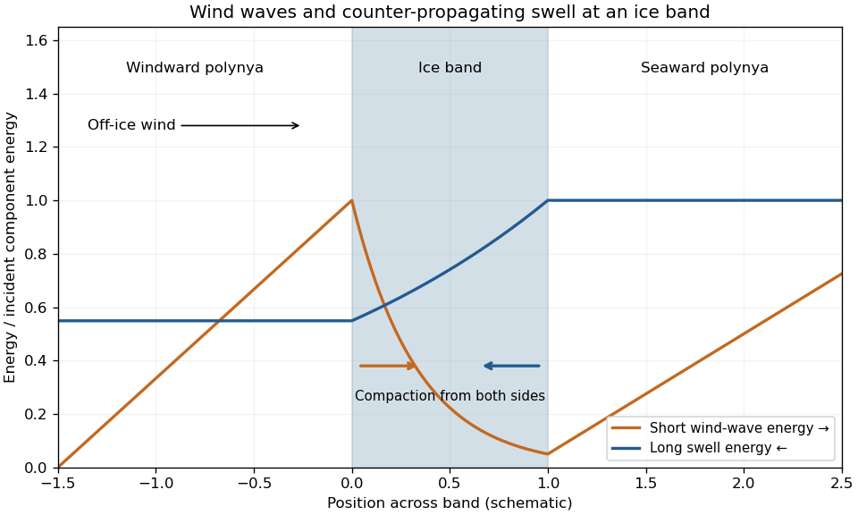

<h1 id="2/b/solution">Solution</h1>

↑ **Parent:** [B](../b.md)

Take $x$ positive in the off-ice wind direction, from the compact pack towards the open sea. The wind initially separates the outer [ice floes](../../../../../../ice-floe.md), creating irregular [polynyas](../../../../../../polynya.md). A larger opening gives more [open-water fetch](../../../../../../wave-fetch.md), so stronger short wind waves develop before reaching its downwind edge. Their reflection supplies a positive force on the downwind [ice floes](../../../../../../ice-floe.md); these catch their neighbours and compact into an [ice-edge band](../../../../../../ice-edge-band.md). Incoming longer swell exerts force in the opposite direction. The short waves can exert substantial force despite their smaller amplitude because a small [ice floe](../../../../../../ice-floe.md) reflects them much more effectively than it reflects the long swell.

The [surface-gravity-wave energy](../../../../../../surface-gravity-wave-energy.md) of the short waves grows with fetch in the windward [polynya](../../../../../../polynya.md), then decays rapidly across the band. Swell enters from the seaward side and usually attenuates more slowly. This gives inward forcing from the two sides: short-wave forcing is largest at the windward face and swell forcing is largest at the seaward face. In the next open [polynya](../../../../../../polynya.md), short wind waves regrow from the weak transmitted component. Reflected waves also enhance energy locally on the incident side, with interference that is omitted from a smooth, phase-averaged sketch.

**[Figure 2](#2/b/image-schematic-short-wave-and-swell-energy-in-an-ice-band-and-the-polynyas-on-either-side). Schematic short-wave and swell energy in an ice band and the polynyas on either side**.

Each plotted component is normalized by its own incident energy; the curves do not assert equal absolute wind-wave and swell energies. The band is partially transmitting. For a perfectly opaque reflector, the transmitted component would instead vanish.

The initial bands have unequal floe inventories, widths and forcing. Differential drift and collisions merge some into composite bands. Larger bands tend to shield smaller downstream accumulations from the short-wave forcing needed to keep them separate, while sufficiently wide intervening [polynyas](../../../../../../polynya.md) can generate fresh wind waves and maintain separation. Finite available ice, available [wave fetch](../../../../../../wave-fetch.md), the opposing swell, wind strength and duration, floe size and thickness, and subsequent mergers limit the number of persistent bands. The wave-force formula alone does not select a universal count. This mechanism and its merger interpretation are supported by [the original ice-band study](https://doi.org/10.1029/JC088iC05p02813).

There is a normalization issue in the requested stress calculation. Let $\mathcal E=\rho_wga^2/2$ be standard linear [surface-gravity-wave energy](../../../../../../surface-gravity-wave-energy.md) for crest amplitude $a$. The deep-water [wave radiation stress](../../../../../../radiation-stress.md) is $S_{xx}=\mathcal E/2$. Hence standard momentum balance gives

$$
F_{\rm phys}=\frac{\rho_wg}{4}(a^2+r^2-t^2).
$$

For lossless reflection with amplitude [reflection coefficient](../../../../../../reflection-coefficient.md) $R$, $r^2=R^2a^2$ and $t^2=(1-R^2)a^2$, so $F_{\rm phys}=\rho_wgR^2a^2/2$.

In the usual independent-floe, weak-reflection approximation, there are about $p/d$ effective layers per unit distance. Each removes a fraction $R^2$ of the forward energy, giving

$$
\frac{d(a^2)}{dx}=-\frac{pR^2}{d}a^2,\qquad
a(x)=a_0\exp\left(-\frac{pR^2x}{2d}\right).
$$

This yields the intended [wave-driven ice-band compaction](../../../../../../wave-driven-ice-band-compaction.md):

$$
\boxed{-\frac{dF_{\rm phys}}{dx}
=\frac{\rho_wgpR^4a^2}{2d}.}
$$

The attenuation approximation retains the leading term in $R^2$; an independent discrete-layer model instead gives an energy coefficient $-(p/d)\log(1-R^2)$. Neither coefficient follows from the single-object force formula without this additional scattering closure.

For ordinary crest amplitudes, the force printed in the paper is $4F_{\rm phys}$. With that printed normalization and the same attenuation law, its [derivative](../../../../../../derivative.md) is four times the requested stress. More generally, if $a^2=a_0^2e^{-\kappa x}$, the printed lossless force gives $-F'=2\rho_wgR^2\kappa a^2$. Recovering the stated stress from it requires $\kappa=pR^2/(4d)$ instead, a different unspecified attenuation convention. **The supplied force and stress cannot both be derived from standard amplitudes and the usual floe-layer attenuation law.** Restoring the factor $1/4$ in the force gives a consistent intended model.

Using the printed force for the numerical question, perfect reflection gives $r=a$, $t=0$, and therefore

$$
\boxed{F_{\rm printed}=2(1025)(9.81)(0.1)^2=201.1\,\mathrm{N\,m^{-1}}.}
$$

Using the requested stress formula for partial reflection gives

$$
\boxed{s=\frac{1025(9.81)(1)(0.5)^4(0.1)^2}{2(20)}
=0.157\,\mathrm{N\,m^{-2}}.}
$$

For comparison, the consistently normalized perfect-reflection force is $50.3\,\mathrm{N\,m^{-1}}$, and the printed force with standard attenuation would give $0.628\,\mathrm{N\,m^{-2}}$ for the partial-reflection [derivative](../../../../../../derivative.md). The approximate stress is a force per horizontal area, not a direct measure of the three-dimensional ice-skeleton [stress](../../../../../../stress.md).

The inward force gradient helps maintain a coherent, close-packed band, especially near the incident-wave faces. It is modest enough that wind, current, swell changes or mergers can disrupt the arrangement; it does not guarantee permanent mechanical stability. Perfect reflection estimates a bounding force, whereas the much smaller partial-reflection stress varies as $R^4$. No mechanical-strength law is supplied, so stability can be assessed only qualitatively.

## ↑ Ancestors (11)

1. [B](../b.md)
2. [2](../../2.md)
3. [Paper 72](../../../paper-72-split.md)
4. [Iii](../../../split.md)
5. [2013](../../../../split.md)
6. [Past exam of the mathematics course of the University of Cambridge](../../../../../split.md)
7. [Mathematics course of the University of Cambridge](../../../../../../mathematics-course-of-the-university-of-cambridge.md)
8. [Course of the University of Cambridge](../../../../../../course-of-the-university-of-cambridge.md)
9. [University of Cambridge](../../../../../../university-of-cambridge-split.md)
10. [List of universities](../../../../../../list-of-universities.md)
11. [Codex Wiki](../../../../../../split.md)
