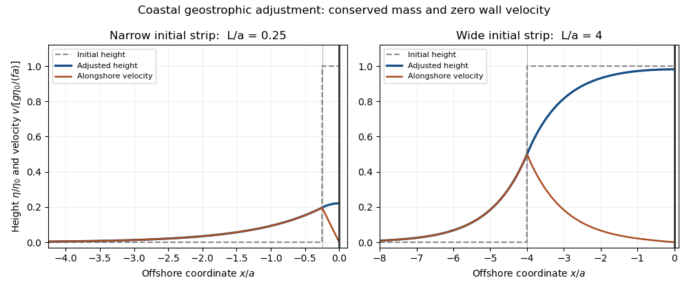

<h1 id="2/solution">Solution</h1>

↑ **Parent:** [2](../2.md)

The [shallow-water approximation](../../../../../shallow-water-approximation.md) requires depth much less than horizontal length, a homogeneous incompressible fluid, gentle surface/bottom slopes, and frequencies slow enough that vertical acceleration is negligible compared with gravity. Continuity gives $w\sim(H/L)U$, making vertical inertial acceleration smaller than the horizontal inertial scale by the aspect ratio. The vertical momentum equation therefore reduces to $p_z=-\rho_0g$. With constant atmospheric pressure,

$$
p=p_{\rm atm}+\rho_0g(\eta-z).
$$

The horizontal pressure gradient is independent of depth. Linearizing about rest and retaining the leading depth-uniform horizontal motion gives

$$
\boxed{u_t-fv=-g\eta_x,\quad v_t+fu=-g\eta_y,\quad
\eta_t+H(u_x+v_y)=0.}
$$

Their horizontal curl gives $\zeta_t=-f(u_x+v_y)$, so

$$
\boxed{\partial_t\left(\frac\zeta f-\frac\eta H\right)=0.}
$$

Here $\zeta=v_x-u_y$ is relative vorticity; the PDF sentence identifying $\eta$ as relative vorticity is a symbol error. This is the linear [shallow-water potential vorticity](../../../../../shallow-water-potential-vorticity.md) anomaly; advection of that perturbation is second order.

In the adjusted state take alongshore independence, decay offshore, and an impermeable coast. Steady continuity gives $u=0$, and [geostrophic balance](../../../../../geostrophic-balance.md) gives $v=g\eta_x/f$. Assume $f>0$ so the printed $a=\sqrt{gH}/f$ is a positive [barotropic deformation radius](../../../../../barotropic-deformation-radius.md). For either hemisphere the decay length is $\sqrt{gH}/|f|$, with the corresponding change in current direction. Initial rest makes the conserved anomaly $-\eta_{\rm initial}/H$, and therefore

$$
a^2\eta_{xx}-\eta=-\eta_{\rm initial}(x).
$$

The [coastal adjustment of an elevated strip](../../../../../coastal-adjustment-of-an-elevated-strip.md) uses a decaying offshore solution and a particular solution in the elevated strip are matched with continuous $\eta$ and $v$, hence continuous $\eta_x$, at $x=-L$. Integrating this equation over $x<0$ and conserving the initial volume per alongshore length, $\int_{-\infty}^0\eta\,dx=\eta_0L$, gives $a^2\eta_x(0)=0$. Solving those matching conditions yields

$$
\boxed{\eta(x)=\begin{cases}
\eta_0e^{x/a}\sinh(L/a),&x<-L,\\
\eta_0[1-e^{-L/a}\cosh(x/a)],&-L<x<0.
\end{cases}}
$$

Expanding the hyperbolic functions gives exactly the alternative summed form in the PDF. Both matching values at $-L$ are $\eta_0(1-e^{-2L/a})/2$, and the wall elevation is $\eta_0(1-e^{-L/a})$.

The adjusted flow is

$$
\boxed{u=0,\qquad v=\frac{g\eta_0}{fa}\begin{cases}
e^{x/a}\sinh(L/a),&x<-L,\\
-e^{-L/a}\sinh(x/a),&-L<x<0.
\end{cases}}
$$

Thus both velocity components vanish at the coast. In this inviscid problem tangential no-slip is not generally an independently imposed wall condition; here it follows from initial rest and alongshore uniformity. Indeed $v_t+fu=0$ at the impermeable wall keeps $v(0,t)=0$. The mass constraint recovers the same adjusted-state condition.

**[Figure 1](#2/image-adjusted-coastal-height-and-alongshore-velocity-for-narrow-and-wide-initial-elevated-strips). Adjusted coastal height and alongshore velocity for narrow and wide initial elevated strips**.

For $L\gg a$, the surface retains nearly its initial elevation through most of the strip. The offshore edge is smoothed over width of order $a$, with half-height at the original edge, while the coast remains at nearly $\eta_0$. The current is concentrated near the smoothed edge and vanishes at the coast.

For $L\ll a$, the elevation spreads over a much larger offshore scale $a$, with wall height approximately $\eta_0L/a$. Away from the thin original strip, $\eta\simeq\eta_0(L/a)e^{x/a}$. Within it the leading elevation is nearly that reduced constant, with a small curvature required to bring $v$ to zero at the wall. **Wide strips retain a broad high plateau; narrow strips spread into a low deformation-scale coastal bulge.** The total anomalous volume remains $\eta_0L$ in both limits.

## ↑ Ancestors (10)

1. [2](../2.md)
2. [Paper 73](../../paper-73-split.md)
3. [Iii](../../split.md)
4. [2013](../../../split.md)
5. [Past exam of the mathematics course of the University of Cambridge](../../../../split.md)
6. [Mathematics course of the University of Cambridge](../../../../../mathematics-course-of-the-university-of-cambridge.md)
7. [Course of the University of Cambridge](../../../../../course-of-the-university-of-cambridge.md)
8. [University of Cambridge](../../../../../university-of-cambridge-split.md)
9. [List of universities](../../../../../list-of-universities.md)
10. [Codex Wiki](../../../../../split.md)
