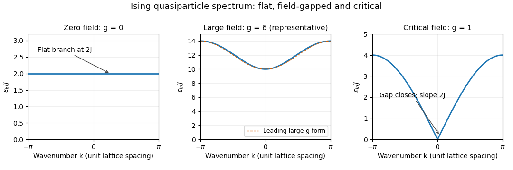

<h1 id="1/c/solution">Solution</h1>

↑ **Parent:** [C](../c.md)

Write $a_k=g-\cos k$, $s_k=\sin k$ and $r_k=\sqrt{a_k^2+s_k^2}$. The [Ising-chain Bogoliubov diagonalization](../../../../../../ising-chain-bogoliubov-diagonalization.md) uses the [eigenvalues](../../../../../../eigenvalue.md) $\pm r_k$ of the two-by-two Nambu matrix. For distinct paired modes $k\ne-k$, choose $\cos\theta_k=a_k/r_k$, $\sin\theta_k=-s_k/r_k$ and $\theta_{-k}=-\theta_k$. The rotation $U_k=e^{-i\theta_k\sigma_y/2}$ satisfies $U_k^\dagger M_kU_k=r_k\sigma_z$, and its first transformed component is

$$
\gamma_k=\cos(\theta_k/2)c_k-i\sin(\theta_k/2)c_{-k}^\dagger.
$$

The opposite signs of the paired angles preserve the [canonical anticommutation relations](../../../../../../canonical-anticommutation-relations.md). [Self-paired spinless fermion modes](../../../../../../self-paired-spinless-fermion-mode.md) have zero pairing and are treated directly as occupied or empty number levels; they do not require this paired-angle formula.

Both $k$ and $-k$ occur in the sum, so the physical [quasiparticle](../../../../../../quasiparticle.md) coefficient is $2Jr_k$, not $Jr_k$. Consequently

$$
\boxed{H=\sum_k\epsilon_k(\gamma_k^\dagger\gamma_k-1/2),\qquad
\epsilon_k=2J\sqrt{1+g^2-2g\cos k},\qquad E_0=-\frac12\sum_k\epsilon_k.}
$$

This is the bulk quadratic result under the stipulated boundary simplification. Restoring the finite-chain parity sectors adjusts allowed modes and global excitation constraints. In the [thermodynamic limit](../../../../../../thermodynamic-limit.md), the [ground-state energy](../../../../../../ground-state-energy.md) per site is

$$
\frac{E_0}{N}=-\frac J{2\pi}\int_{-\pi}^{\pi}\sqrt{1+g^2-2g\cos k}\,dk.
$$

For $g\ge0$, the bulk [quasiparticle](../../../../../../quasiparticle.md) gap is $2J|g-1|$. The requested three regimes are shown in the original sketch and discussed separately below.

**[Figure 1](#1/c/image-ising-chain-quasiparticle-dispersion-is-flat-at-zero-field-and-gapless-at-the-critical-field). Ising-chain quasiparticle dispersion is flat at zero field and gapless at the critical field**.

## ↑ Ancestors (11)

1. [C](../c.md)
2. [1](../../1.md)
3. [Paper 75](../../../paper-75-split.md)
4. [Iii](../../../split.md)
5. [2013](../../../../split.md)
6. [Past exam of the mathematics course of the University of Cambridge](../../../../../split.md)
7. [Mathematics course of the University of Cambridge](../../../../../../mathematics-course-of-the-university-of-cambridge.md)
8. [Course of the University of Cambridge](../../../../../../course-of-the-university-of-cambridge.md)
9. [University of Cambridge](../../../../../../university-of-cambridge-split.md)
10. [List of universities](../../../../../../list-of-universities.md)
11. [Codex Wiki](../../../../../../split.md)
