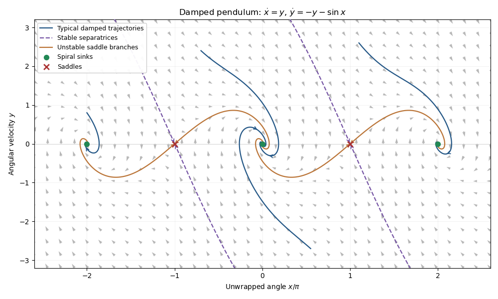

<h1 id="8b/iv/solution">Solution</h1>

↑ **Parent:** [Iv](../iv.md)

For $c=1$, the even equilibria are **[stable foci](../../../../../../stable-spiral.md)** with [eigenvalues](../../../../../../eigenvalue.md) $(-1\pm i\sqrt3)/2$, and the odd equilibria are **[saddle equilibria](../../../../../../saddle-equilibrium.md)** with [eigenvalues](../../../../../../eigenvalue.md) $r_\pm=(-1\pm\sqrt5)/2$. The local saddle directions are $y=r_\pm[x-(2j+1)\pi]$.

**[Figure 1](#8b/iv/image-phase-portrait-of-a-pendulum-with-unit-damping-showing-spiral-sinks-and-the-stable-and-unstable-saddle-branches). Phase portrait of a pendulum with unit damping, showing spiral sinks and the stable and unstable saddle branches**.

The [phase portrait](../../../../../../phase-portrait.md) shows clockwise spiraling into each even equilibrium: on its right-hand horizontal axis, the flow initially points down. The stable [separatrices](../../../../../../separatrix.md) of the saddles divide attraction basins on the unwrapped angle axis, while the unstable branches flow into neighboring sinks. Initial conditions with enough [mechanical energy](../../../../../../mechanical-energy.md) can cross one or more potential crests before being captured. The curves repeat under $x\mapsto x+2\pi$. They are trajectories, not conservative energy contours: [energy dissipation of a damped pendulum](../../../../../../energy-dissipation-of-a-damped-pendulum.md) rules out nonconstant periodic orbits.

## ↑ Ancestors (11)

1. [Iv](../iv.md)
2. [8B](../../8b.md)
3. [Paper 2](../../../paper-2-split.md)
4. [Ia](../../../split.md)
5. [2014](../../../../split.md)
6. [Past exam of the mathematics course of the University of Cambridge](../../../../../split.md)
7. [Mathematics course of the University of Cambridge](../../../../../../mathematics-course-of-the-university-of-cambridge.md)
8. [Course of the University of Cambridge](../../../../../../course-of-the-university-of-cambridge.md)
9. [University of Cambridge](../../../../../../university-of-cambridge-split.md)
10. [List of universities](../../../../../../list-of-universities.md)
11. [Codex Wiki](../../../../../../split.md)
