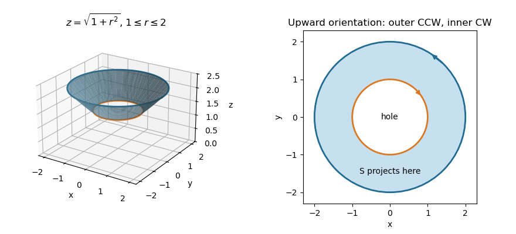

<h1 id="10a/b/solution">Solution</h1>

↑ **Parent:** [B](../b.md)

Use the positive graph $z=g(x,y)=\sqrt{1+x^2+y^2}$. The printed PDF bounds are $\sqrt2\le z\le\sqrt5$, so its projection is the [annulus](../../../../../../annulus-mathematics.md) $1\le r\le2$. The surface is the corresponding band of the upper sheet of a [two-sheeted hyperboloid](../../../../../../two-sheeted-hyperboloid.md), bounded by circles of radii $1$ and $2$ at heights $\sqrt2$ and $\sqrt5$.

**[Figure 2](#10a/b/image-the-upper-hyperboloid-band-between-heights-square-root-of-two-and-square-root-of-five-with-annular-projection). The upper hyperboloid band between heights square root of two and square root of five, with annular projection**.

For the parametrization $\mathbf R(x,y)=(x,y,g(x,y))$, its tangent [vectors](../../../../../../vector.md) are $(1,0,x/z)$ and $(0,1,y/z)$. Their [cross product](../../../../../../cross-product.md) gives the upward [vector surface element of a graph](../../../../../../vector-surface-element-of-a-graph.md):

$$
\boxed{d\mathbf S=\left(-\frac{x}{z},-\frac{y}{z},1\right)dx\,dy,
\qquad z=\sqrt{1+x^2+y^2}.}
$$

Its magnitude gives the scalar [surface area of a graph](../../../../../../surface-area-of-a-graph.md):

$$
\boxed{dS=\sqrt{\frac{1+2(x^2+y^2)}{1+x^2+y^2}}\,dx\,dy.}
$$

Both formulas apply on $1\le\sqrt{x^2+y^2}\le2$. Reversing the orientation changes only the sign of the [vector](../../../../../../vector.md) element.

## ↑ Ancestors (11)

1. [B](../b.md)
2. [10A](../../10a.md)
3. [Paper 3](../../../paper-3-split.md)
4. [Ia](../../../split.md)
5. [2014](../../../../split.md)
6. [Past exam of the mathematics course of the University of Cambridge](../../../../../split.md)
7. [Mathematics course of the University of Cambridge](../../../../../../mathematics-course-of-the-university-of-cambridge.md)
8. [Course of the University of Cambridge](../../../../../../course-of-the-university-of-cambridge.md)
9. [University of Cambridge](../../../../../../university-of-cambridge-split.md)
10. [List of universities](../../../../../../list-of-universities.md)
11. [Codex Wiki](../../../../../../split.md)
