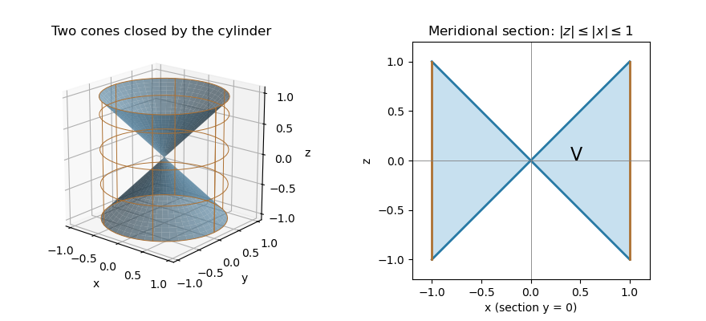

<h1 id="9a/c/solution">Solution</h1>

↑ **Parent:** [C](../c.md)

In [cylindrical coordinates](../../../../../../cylindrical-coordinate-system.md) $r=\sqrt{x^2+y^2}$, the bounded solid enclosed by the two conical sheets and the [circular cylinder](../../../../../../circular-cylinder.md) is

$$
0\le r\le1,\qquad -r\le z\le r,\qquad 0\le\theta<2\pi.
$$

Its meridional section consists of two triangular regions; revolving them about the $z$-axis gives the solid. The two conical sheets meet at the origin and meet the [circular cylinder](../../../../../../circular-cylinder.md) in its circles at $z=\pm1$.

**[Figure 1](#9a/c/image-the-bounded-solid-between-two-cones-and-a-unit-cylinder-with-its-meridional-section). The bounded solid between two cones and a unit cylinder, with its meridional section**.

Since $\mathbf F=(x,y,z)$, its [divergence](../../../../../../divergence.md) is $3$. Integrate directly with the [cylindrical coordinates](../../../../../../cylindrical-coordinate-system.md) volume element $r\,dz\,dr\,d\theta$:

$$
\int_V\nabla\cdot\mathbf F\,dV
=\int_0^{2\pi}\int_0^1\int_{-r}^r3r\,dz\,dr\,d\theta
=12\pi\int_0^1r^2\,dr
=\boxed{4\pi}.
$$

The same calculation gives $\operatorname{Vol}(V)=4\pi/3$.

## ↑ Ancestors (11)

1. [C](../c.md)
2. [9A](../../9a.md)
3. [Paper 3](../../../paper-3-split.md)
4. [Ia](../../../split.md)
5. [2014](../../../../split.md)
6. [Past exam of the mathematics course of the University of Cambridge](../../../../../split.md)
7. [Mathematics course of the University of Cambridge](../../../../../../mathematics-course-of-the-university-of-cambridge.md)
8. [Course of the University of Cambridge](../../../../../../course-of-the-university-of-cambridge.md)
9. [University of Cambridge](../../../../../../university-of-cambridge-split.md)
10. [List of universities](../../../../../../list-of-universities.md)
11. [Codex Wiki](../../../../../../split.md)
