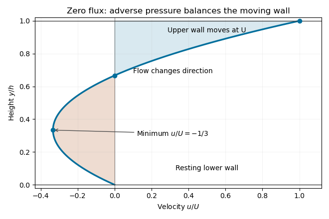

<h1 id="5b/solution">Solution</h1>

↑ **Parent:** [5B](../5b.md)

Take a steady parallel velocity $(u(y),0)$ and interpret the specified gradient as $p_x=G>0$. The horizontal [Navier-Stokes equation](../../../../../navier-stokes-equation.md) reduces to $\mu u''=G$: the pressure force opposes positive $x$ motion. The [no-slip boundary condition](../../../../../no-slip-boundary-condition.md) imposes $u(0)=0$, $u(h)=U$. Integrating twice gives

$$
\boxed{u(y)=-\frac G{2\mu}y(h-y)+\frac{Uy}{h}.}
$$

The [velocity gradient](../../../../../velocity-gradient.md) is $u'=G(y-h/2)/\mu+U/h$, an increasing function of $y$. It is negative somewhere in the channel exactly when its lower-wall limit is negative:

$$
\boxed{G>\frac{2\mu U}{h^2}.}
$$

Under this condition the negative-gradient interval is $0<y<h/2-\mu U/(Gh)$.

The [volume flux](../../../../../volumetric-flow-rate.md) per unit span is

$$
Q=\int_0^h u(y)\,dy=-\frac{Gh^3}{12\mu}+\frac{Uh}{2}.
$$

Thus the [zero-flux Couette-Poiseuille flow](../../../../../zero-flux-couette-poiseuille-flow.md) requires

$$
\boxed{G=\frac{6\mu U}{h^2},\qquad \frac uU=3s^2-2s,\quad s=y/h.}
$$

The profile starts at zero, reaches $u=-U/3$ at $y=h/3$, crosses zero at $y=2h/3$, and reaches $U$ at the moving wall. Negative and positive flux contributions cancel, even though the local velocity is nonzero.

**[Figure 1](#5b/image-zero-net-flux-channel-velocity-showing-reverse-flow-below-two-thirds-depth-its-minimum-at-one-third-depth-and-the-moving-upper-wall). Zero-net-flux channel velocity, showing reverse flow below two-thirds depth, its minimum at one-third depth, and the moving upper wall**.

## ↑ Ancestors (10)

1. [5B](../5b.md)
2. [Paper 1](../../paper-1-split.md)
3. [Ib](../../split.md)
4. [2014](../../../split.md)
5. [Past exam of the mathematics course of the University of Cambridge](../../../../split.md)
6. [Mathematics course of the University of Cambridge](../../../../../mathematics-course-of-the-university-of-cambridge.md)
7. [Course of the University of Cambridge](../../../../../course-of-the-university-of-cambridge.md)
8. [University of Cambridge](../../../../../university-of-cambridge-split.md)
9. [List of universities](../../../../../list-of-universities.md)
10. [Codex Wiki](../../../../../split.md)
