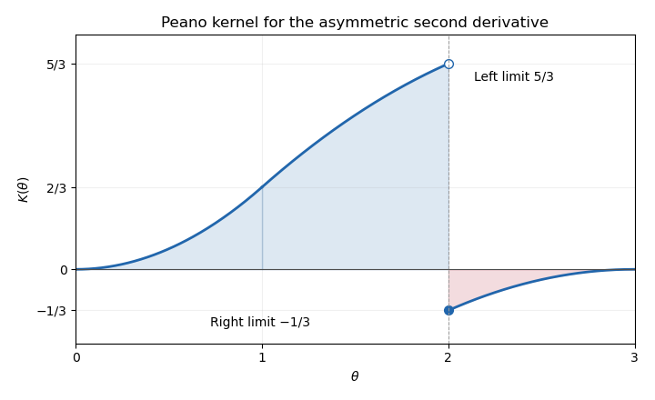

<h1 id="19c/solution">Solution</h1>

↑ **Parent:** [19C](../19c.md)

For the [Peano kernel theorem](../../../../../peano-kernel-theorem.md), the integral [Taylor remainder](../../../../../taylor-remainder.md) is

$$
f(x)=\sum_{j=0}^k\frac{f^{(j)}(a)}{j!}(x-a)^j
+\frac1{k!}\int_a^b(x-\theta)_+^k f^{(k+1)}(\theta)\,d\theta.
$$

Here $u_+=\max(u,0)$. The error functional must be linear, vanish on every polynomial of degree at most $k$, and permit its action to be interchanged with this remainder integral. The last regularity condition holds for the finite combinations of point evaluations and derivative evaluations used below, by applying the corresponding differentiated remainder formula. Under these conditions the polynomial terms vanish, yielding

$$
\boxed{\lambda(f)=\frac1{k!}\int_a^bK(\theta)f^{(k+1)}(\theta)\,d\theta,\qquad
K(\theta)=\lambda\bigl((x-\theta)_+^k\bigr).}
$$

For the [three-point asymmetric second-derivative formula](../../../../../three-point-asymmetric-second-derivative-formula.md), choose the error convention $\lambda(f)=f''(2)-L(f)$. Exactness on $1,x,x^2$ gives

$$
c_0+c_1+c_3=0,\quad c_1+3c_3=0,\quad c_1+9c_3=2,
$$

hence

$$
\boxed{c_0=\frac23,\qquad c_1=-1,\qquad c_3=\frac13.}
$$

Applying $\lambda$ to $(x-\theta)_+^2$, for almost every $\theta\in[0,3]$, gives the [Peano kernel](../../../../../peano-kernel.md)

$$
K(\theta)=2\mathbf1_{\{\theta<2\}}+(1-\theta)_+^2-\frac13(3-\theta)^2
=
\begin{cases}
\frac23\theta^2,&0\le\theta\le1,\\
2-\frac13(3-\theta)^2,&1\le\theta<2,\\
-\frac13(3-\theta)^2,&2<\theta\le3.
\end{cases}
$$

The value at $\theta=2$ is immaterial to the integral. The sketch rises from zero through $2/3$ at one to the left limit $5/3$ at two, jumps down to the right limit $-1/3$, and then rises to zero at three.

The [sharp error constants for a Peano kernel](../../../../../sharp-error-constants-for-a-peano-kernel.md) are the corresponding integral-operator norms. Here

$$
\|K\|_\infty=\frac53,\qquad
\int_0^2K(\theta)\,d\theta=\frac{13}{9},\qquad
\int_2^3|K(\theta)|\,d\theta=\frac19.
$$

As $k!=2$,

$$
\boxed{r=\frac12\|K\|_\infty=\frac56,\qquad
s=\frac12\|K\|_1=\frac79.}
$$

Indeed, $|\lambda(f)|\le(\|K\|_\infty/2)\|f^{(3)}\|_1$ and $|\lambda(f)|\le(\|K\|_1/2)\|f^{(3)}\|_\infty$. They are best possible even for $f\in C^3$: for $r$, choose continuous nonnegative third derivatives concentrated just left of two with unit integral; for $s$, approximate the sign of $K$ by continuous functions of supremum norm one. Integrating any such third derivative three times supplies an admissible $f$, and the resulting ratios approach the stated constants.

For $f(x)=x^3$, $L(f)=-1+27/3=8$, while $f''(2)=12$, so $\lambda(f)=4$. Also $\|f^{(3)}\|_1=18$ and $\|f^{(3)}\|_\infty=6$. The two bounds explicitly read

$$
\boxed{4\le\frac56\,18=15,\qquad
4\le\frac79\,6=\frac{14}{3}.}
$$

**[Figure 2](#19c/image-peano-kernel-for-the-asymmetric-three-point-second-derivative-showing-its-jump-at-two-and-the-positive-and-negative-regions-controlling-sharp-error-bounds). Peano kernel for the asymmetric three-point second derivative, showing its jump at two and the positive and negative regions controlling sharp error bounds**.

## ↑ Ancestors (10)

1. [19C](../19c.md)
2. [Paper 2](../../paper-2-split.md)
3. [Ib](../../split.md)
4. [2014](../../../split.md)
5. [Past exam of the mathematics course of the University of Cambridge](../../../../split.md)
6. [Mathematics course of the University of Cambridge](../../../../../mathematics-course-of-the-university-of-cambridge.md)
7. [Course of the University of Cambridge](../../../../../course-of-the-university-of-cambridge.md)
8. [University of Cambridge](../../../../../university-of-cambridge-split.md)
9. [List of universities](../../../../../list-of-universities.md)
10. [Codex Wiki](../../../../../split.md)
