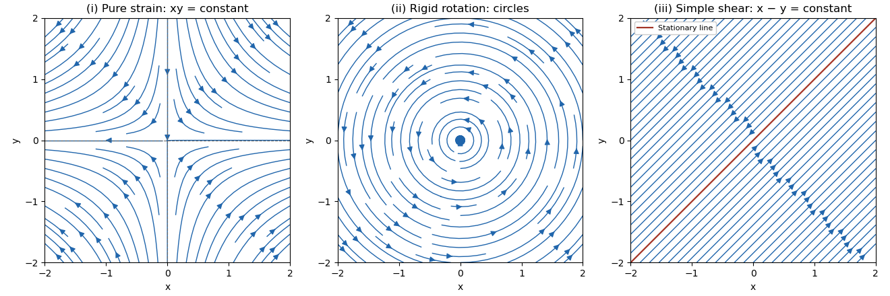

<h1 id="7b/iii/solution">Solution</h1>

↑ **Parent:** [Iii](../iii.md)

Here $u=v=x-y$. The [streamlines](../../../../../../streamline.md) are **$x-y=\text{constant}$**, straight lines parallel to $(1,1)$. The entire line $x=y$ is stationary. On the $x-y>0$ side the motion is northeast, and on the $x-y<0$ side it is southwest. In orthonormal coordinates $p=(x+y)/\sqrt2$, $q=(x-y)/\sqrt2$, the velocities are $\dot p=2q$, $\dot q=0$: this is [simple shear flow](../../../../../../simple-shear-flow.md). The right panel shows both moving families and the stationary line.

**[Figure 1](#7b/iii/image-planar-strain-counterclockwise-rigid-rotation-and-diagonal-simple-shear-with-arrows-showing-the-three-streamline-directions). Planar strain, counterclockwise rigid rotation and diagonal simple shear, with arrows showing the three streamline directions**.

## ↑ Ancestors (11)

1. [Iii](../iii.md)
2. [7B](../../7b.md)
3. [Paper 2](../../../paper-2-split.md)
4. [Ib](../../../split.md)
5. [2014](../../../../split.md)
6. [Past exam of the mathematics course of the University of Cambridge](../../../../../split.md)
7. [Mathematics course of the University of Cambridge](../../../../../../mathematics-course-of-the-university-of-cambridge.md)
8. [Course of the University of Cambridge](../../../../../../course-of-the-university-of-cambridge.md)
9. [University of Cambridge](../../../../../../university-of-cambridge-split.md)
10. [List of universities](../../../../../../list-of-universities.md)
11. [Codex Wiki](../../../../../../split.md)
