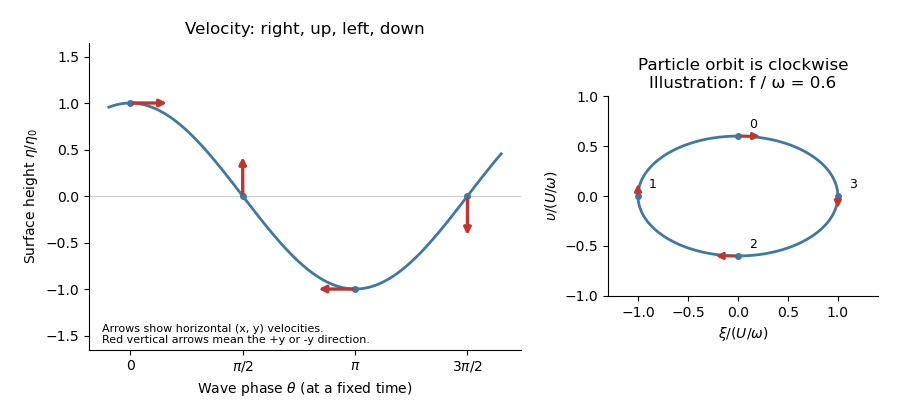

<h1 id="18b/solution">Solution</h1>

↑ **Parent:** [18B](../18b.md)

Apply [mass conservation](../../../../../mass-conservation.md) to a fixed horizontal region $D$. The layer mass is $\rho\int_Dh\,dx\,dy$ and the outward horizontal flux is $\rho\int_{\partial D}h(u,v)\cdot\mathbf n\,ds$. The [divergence theorem](../../../../../divergence-theorem.md) and arbitrary choice of $D$ give

$$
 \boxed{h_t+(hu)_x+(hv)_y=0.}
$$

This depth-integrated law retains free-surface motion; neglecting the vertical velocity in horizontal momentum is not the assumption that the depth cannot change.

Take the free-surface pressure to be constant. [hydrostatic pressure](../../../../../hydrostatic-pressure.md) gives $p=p_{\rm atm}+\rho g(h-z)$, so the horizontal pressure forces are $-g\eta_x,-g\eta_y$. Linearization about a resting layer gives the [linearized shallow water equations](../../../../../linearized-shallow-water-equations.md)

$$
 u_t-fv=-g\eta_x,\qquad v_t+fu=-g\eta_y,\qquad
 \eta_t+h_0(u_x+v_y)=0.
$$

Taking the curl of the momentum equations yields $\zeta_t=-f(u_x+v_y)$. Combining with continuity gives the [linearized shallow-water potential-vorticity anomaly](../../../../../linearized-shallow-water-potential-vorticity-anomaly.md)

$$
 \boxed{\partial_t\left(\zeta-\frac f{h_0}\eta\right)=0,\qquad Q=Q_0(x,y).}
$$

For $Q_0=0$, $\zeta=f\eta/h_0$. Taking the divergence of momentum gives $\partial_t(u_x+v_y)-f\zeta=-g\nabla_h^2\eta$. Eliminate the divergence with continuity to obtain

$$
 \boxed{\eta_{tt}-gh_0\nabla_h^2\eta+f^2\eta=0.}
$$

For $\theta=k(x-ct)$, substitution of $\eta=\eta_0\cos\theta$ gives the [inertia-gravity wave](../../../../../inertia-gravity-wave.md) [dispersion relation](../../../../../dispersion-relation.md)

$$
 \boxed{\omega^2=gh_0k^2+f^2,\qquad\omega=kc,\qquad c^2=gh_0+f^2/k^2.}
$$

The associated purely oscillatory [velocity field](../../../../../velocity-field.md) is

$$
 u=U\cos\theta,\qquad v=V\sin\theta,\qquad
 U=\frac{c\eta_0}{h_0},\quad V=\frac{f\eta_0}{kh_0}=\frac f\omega U.
$$

These formulas satisfy all three linearized equations and the zero-anomaly condition. A separately added spatially uniform inertial oscillation is not part of this monochromatic wave.

To first order in amplitude evaluate the wave at a particle's equilibrium coordinate $x_*$, so $\theta_* = kx_*-\omega t$. Integrating its [velocity](../../../../../velocity.md) gives displacements relative to the orbit centre

$$
 \xi=-\frac U\omega\sin\theta_*,\qquad
 \upsilon=\frac V\omega\cos\theta_*,\qquad
 \boxed{\frac{\xi^2}{(U/\omega)^2}+\frac{\upsilon^2}{(V/\omega)^2}=1.}
$$

These are [particle ellipses for rotating shallow-water waves](../../../../../particle-ellipses-for-rotating-shallow-water-waves.md), with axis ratio $V/U=f/\omega<1$. For the stipulated positive signs, the velocity at phases $0,\pi/2,\pi,3\pi/2$ points respectively **right, up, left, down**, with magnitudes $U,V,U,V$. The particle orbits are clockwise as time advances, since the phase decreases.

**[Figure 1](#18b/image-horizontal-velocity-directions-and-particle-ellipse-for-a-rotating-shallow-water-wave). Horizontal velocity directions and particle ellipse for a rotating shallow-water wave**.

## ↑ Ancestors (10)

1. [18B](../18b.md)
2. [Paper 4](../../paper-4-split.md)
3. [Ib](../../split.md)
4. [2014](../../../split.md)
5. [Past exam of the mathematics course of the University of Cambridge](../../../../split.md)
6. [Mathematics course of the University of Cambridge](../../../../../mathematics-course-of-the-university-of-cambridge.md)
7. [Course of the University of Cambridge](../../../../../course-of-the-university-of-cambridge.md)
8. [University of Cambridge](../../../../../university-of-cambridge-split.md)
9. [List of universities](../../../../../list-of-universities.md)
10. [Codex Wiki](../../../../../split.md)
