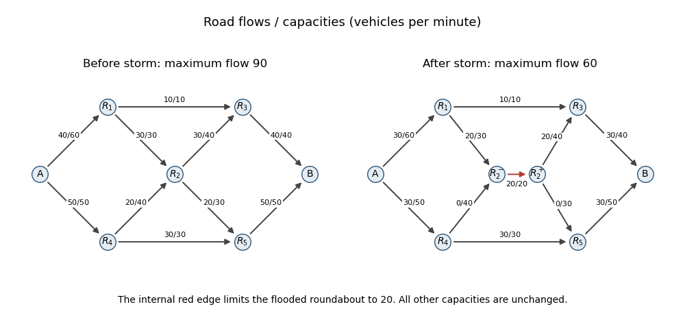

<h1 id="20h/solution">Solution</h1>

↑ **Parent:** [20H](../20h.md)

On a directed [flow network](../../../../../flow-network.md) with capacities $c_e$, choose [flows](../../../../../flow.md) $0\leq f_e\leq c_e$ satisfying inflow equals outflow at every vertex except source $s$ and sink $t$, and maximize the net source outflow $|f|$. For a [cut of a flow network](../../../../../cut-of-a-flow-network.md) $S$ containing $s$ but not $t$, its capacity is $\sum_{u\in S,v\notin S}c_{uv}$. The [max-flow min-cut theorem](../../../../../max-flow-min-cut-theorem.md) states

$$
 \boxed{\max_f |f|=\min_{s\in S,\ t\notin S}c(S,S^c).}
$$

Every feasible [flow](../../../../../flow.md) is bounded above by every cut capacity; equality for a feasible flow and a cut proves optimality.

The [Ford-Fulkerson algorithm](../../../../../ford-fulkerson-algorithm.md) starts with a feasible flow, for instance zero. A forward edge has residual capacity $c_{uv}-f_{uv}$ and its reverse edge has residual capacity $f_{uv}$. Find a source-to-sink [augmenting path](../../../../../augmenting-path.md) in this [residual network](../../../../../residual-network.md), and increase the flow along it by the minimum residual capacity on the path, reducing original-edge flows when reverse edges are used. Repeat until no such path exists. The vertices reachable from the source then define a saturated minimum [cut of a flow network](../../../../../cut-of-a-flow-network.md). With integer capacities and zero initial flow, all residual capacities and augmentations are integers. Each augmentation increases $|f|$ by at least one, while $|f|$ is bounded by the finite sum of source capacities, so termination takes finitely many steps.

For the original roads, a feasible maximizing flow is given below; every table entry is flow/capacity in vehicles per minute.

| Road | Before storm | After storm |
| --- | --- | --- |
| $A\to R_1$ | $40/60$ | $30/60$ |
| $A\to R_4$ | $50/50$ | $30/50$ |
| $R_1\to R_3$ | $10/10$ | $10/10$ |
| $R_1\to R_2$ | $30/30$ | $20/30$ |
| $R_4\to R_2$ | $20/40$ | $0/40$ |
| $R_4\to R_5$ | $30/30$ | $30/30$ |
| $R_2\to R_3$ | $30/40$ | $20/40$ |
| $R_2\to R_5$ | $20/30$ | $0/30$ |
| $R_3\to B$ | $40/40$ | $30/40$ |
| $R_5\to B$ | $50/50$ | $30/50$ |

All road capacities are respected, and direct summation verifies [flow conservation](../../../../../flow-conservation.md) at each roundabout. The original flow value is $90$. The cut separating $B$ from every other vertex consists of its two incoming roads and has capacity $40+50=90$. Therefore the original maximum is **90 vehicles per minute**.

To impose a [vertex capacity](../../../../../vertex-capacity.md), split $R_2$ into $R_2^-$ and $R_2^+$. Send its incoming roads to $R_2^-$ and its outgoing roads from $R_2^+$, and add a directed internal edge $R_2^-\to R_2^+$ of capacity $20$. Every unit passing through the roundabout must traverse this internal edge. This gives the standard [maximum flow with vertex capacities](../../../../../maximum-flow-with-vertex-capacities.md) construction.

Starting from zero, apply the [Ford-Fulkerson algorithm](../../../../../ford-fulkerson-algorithm.md) with the following [augmenting paths](../../../../../augmenting-path.md) in order. First use $A\to R_1\to R_3\to B$: its residual capacities are $60,10,40$, so augment by $10$. Next use $A\to R_4\to R_5\to B$: the residual capacities are $50,30,50$, so augment by $30$. Finally use $A\to R_1\to R_2^-\to R_2^+\to R_3\to B$: the residual capacities at this stage are $50,30,20,40,30$, so augment by $20$. No reverse edge is needed in this valid run. The resulting original-road flows are precisely the after-storm column above, and the internal edge carries $20$.

For termination and optimality, take the source-side set $\{A,R_1,R_4,R_2^-\}$. Its outgoing edges are $R_1\to R_3$, $R_4\to R_5$ and $R_2^-\to R_2^+$, of capacities $10,30,20$. They are all saturated, and no positive-flow original edge enters this set. Consequently no residual path leaves the set, and its cut capacity equals the constructed flow value. The new maximum is therefore

$$
 \boxed{60\ \text{vehicles per minute}.}
$$

**[Figure 2](#20h/image-optimal-road-flows-before-the-storm-and-after-splitting-the-flooded-roundabout). Optimal road flows before the storm and after splitting the flooded roundabout**.

## ↑ Ancestors (10)

1. [20H](../20h.md)
2. [Paper 4](../../paper-4-split.md)
3. [Ib](../../split.md)
4. [2014](../../../split.md)
5. [Past exam of the mathematics course of the University of Cambridge](../../../../split.md)
6. [Mathematics course of the University of Cambridge](../../../../../mathematics-course-of-the-university-of-cambridge.md)
7. [Course of the University of Cambridge](../../../../../course-of-the-university-of-cambridge.md)
8. [University of Cambridge](../../../../../university-of-cambridge-split.md)
9. [List of universities](../../../../../list-of-universities.md)
10. [Codex Wiki](../../../../../split.md)
