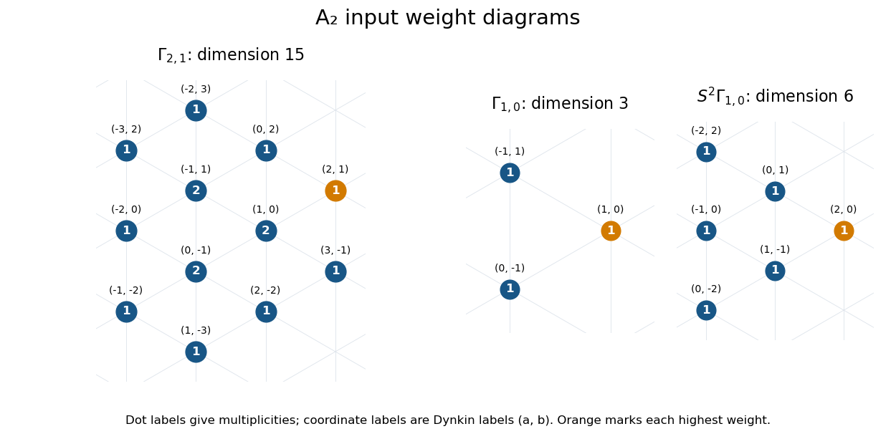
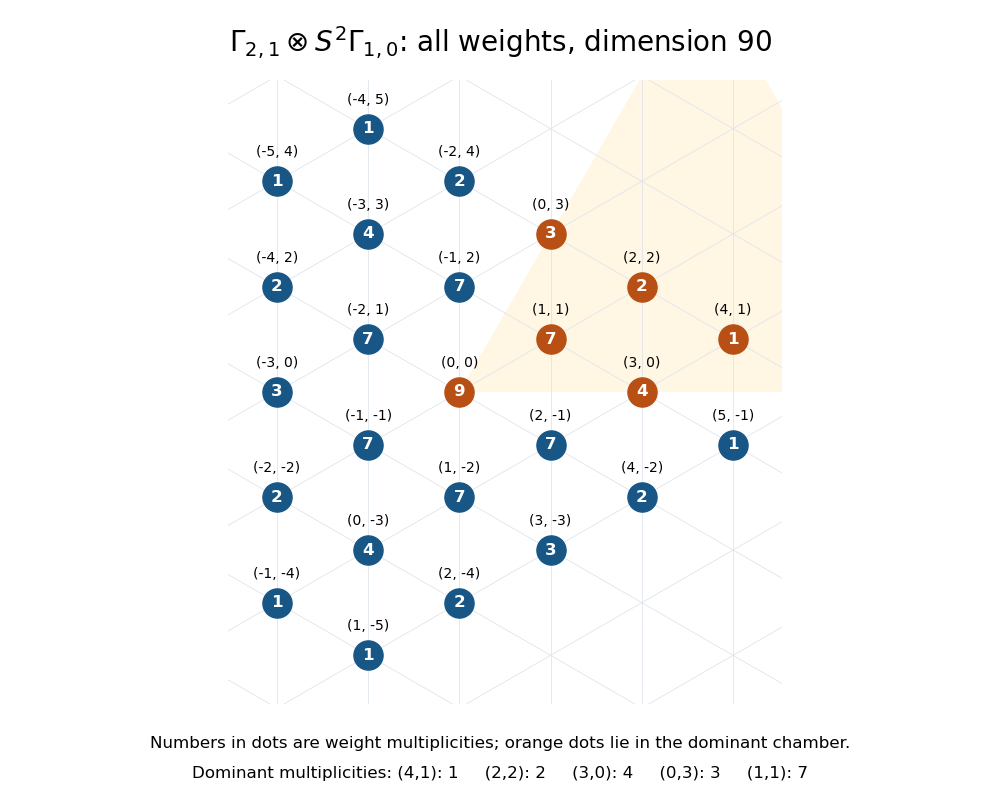

# Paper 2

↑ **Parent:** [Iii](../iii.md)

[https://www.maths.cam.ac.uk/postgrad/part-iii/files/pastpapers/2014/paper_2.pdf](https://www.maths.cam.ac.uk/postgrad/part-iii/files/pastpapers/2014/paper_2.pdf)

**Table of contents**

- [1](#1)
  - [Solution](#1/solution)
- [2](#2)
  - [Solution](#2/solution)
- [3](#3)
  - [Solution](#3/solution)
- [4](#4)
  - [Solution](#4/solution)
- [5](#5)
  - [Solution](#5/solution)
- [6](#6)
  - [Solution](#6/solution)

## 1

↑ **Parent:** [Paper 2](paper-2.md)

<h3 id="1/solution">Solution</h3>

↑ **Parent:** [1](#1)

For a [Lie algebra](../../../lie-algebra.md) $\mathfrak g$, write $[A,B]$ for the linear span of brackets with one argument in each indicated subspace. The three definitions are

$$
\begin{aligned}
\text{abelian:}&\quad[\mathfrak g,\mathfrak g]=0,\\
\text{solvable:}&\quad\mathfrak g^{(r)}=0\text{ for some }r,\quad\mathfrak g^{(0)}=\mathfrak g,\quad\mathfrak g^{(j+1)}=[\mathfrak g^{(j)},\mathfrak g^{(j)}],\\
\text{nilpotent:}&\quad\gamma_s(\mathfrak g)=0\text{ for some }s,\quad\gamma_1=\mathfrak g,\quad\gamma_{j+1}=[\mathfrak g,\gamma_j].
\end{aligned}
$$

These are respectively an [Abelian Lie algebra](../../../lie-algebra.md#abelian-lie-algebra), a [solvable Lie algebra](../../../lie-algebra.md#solvable-lie-algebra) and a [nilpotent Lie algebra](../../../lie-algebra.md#nilpotent-lie-algebra). The second and third sequences are the [derived series of a Lie algebra](../../../lie-algebra.md#derived-series-of-a-lie-algebra) and the [lower central series of a Lie algebra](../../../lie-algebra.md#lower-central-series-of-a-lie-algebra).

An [Abelian Lie algebra](../../../lie-algebra.md#abelian-lie-algebra) has $\gamma_2=0$, and a [nilpotent Lie algebra](../../../lie-algebra.md#nilpotent-lie-algebra) is a [solvable Lie algebra](../../../lie-algebra.md#solvable-lie-algebra): induction gives $\mathfrak g^{(j)}\subseteq\gamma_{j+1}$. Thus **all the implications are generated by**

$$
\boxed{\text{abelian}\ \Longrightarrow\ \text{nilpotent}\ \Longrightarrow\ \text{solvable}.}
$$

None of the reverse implications holds. The [Heisenberg Lie algebra](../../../lie-algebra.md#heisenberg-lie-algebra) with basis $x,y,z$ and $[x,y]=z$, all other basic brackets zero, is nonabelian but has $\gamma_2=\mathbb Cz$, $\gamma_3=0$. The two-dimensional [affine Lie algebra of the line](../../../lie-algebra.md#affine-lie-algebra-of-the-line) with $[h,e]=e$ has $\mathfrak g^{(1)}=\mathbb Ce$ and $\mathfrak g^{(2)}=0$, but $\gamma_j=\mathbb Ce$ for every $j\ge2$. It is solvable and neither nilpotent nor abelian. These two examples answer all six ordered-pair comparisons.

The [Lie theorem](../../../lie-algebra.md#lie-s-theorem) says that a finite-dimensional [Lie algebra representation](../../../lie-algebra.md#lie-algebra-representation) of a finite-dimensional [solvable Lie algebra](../../../lie-algebra.md#solvable-lie-algebra) over an [algebraically closed field](../../../algebra.md#algebraically-closed-field) of [characteristic](../../../algebra.md#characteristic-of-a-field) zero has a common [eigenvector](../../../linear-operator-theory.md#eigenvector) whenever its representation space is nonzero. Equivalently it admits an invariant [complete flag](../../../vector-space.md#complete-flag), or simultaneous upper triangularization. Here the field may be taken to be $\mathbb C$; these hypotheses are essential.

To prove the common-eigenvector assertion, induct on $\dim\mathfrak g$. The zero algebra is immediate. Since $\mathfrak g$ is nonzero and solvable, its [derived algebra](../../../lie-algebra.md#derived-algebra) is proper. Choose a codimension-one [Lie algebra ideal](../../../lie-algebra.md#ideal-of-a-lie-algebra) $\mathfrak h$ containing it, and write $\mathfrak g=\mathfrak h\oplus\mathbb Cx$. The [Lie algebra](../../../lie-algebra.md) $\mathfrak h$ is solvable, so induction supplies $v\ne0$ and a [linear functional](../../../linear-algebra.md#linear-functional) $\lambda:\mathfrak h\to\mathbb C$ with $hv=\lambda(h)v$.

Consider the finite-dimensional cyclic subspace $W=\operatorname{span}\{v,xv,x^2v,\ldots\}$. Until the first [linear dependence](../../../vector-space.md#linear-dependence), these powers form a basis. The identity

$$
hx^jv=x(hx^{j-1}v)+[h,x]x^{j-1}v
$$

and $[h,x]\in\mathfrak h$ show by induction, simultaneously for all $h\in\mathfrak h$, that $W$ is $\mathfrak h$-invariant and that $h$ is upper triangular on it with every diagonal entry $\lambda(h)$. It is also $x$-invariant by construction. Hence

$$
0=\operatorname{tr}_W[x,h]=(\dim W)\lambda([x,h]).
$$

The [trace](../../../linear-algebra.md#matrix-trace) of a [commutator](../../../lie-algebra.md#commutator) is zero, and [characteristic](../../../algebra.md#characteristic-of-a-field) zero gives $\lambda([x,h])=0$.

The simultaneous [eigenspace](../../../linear-operator-theory.md#eigenspace) $E_\lambda=\{w:hw=\lambda(h)w\text{ for every }h\in\mathfrak h\}$ is nonzero and $x$-invariant, since

$$
h(xw)=x(hw)+[h,x]w=\lambda(h)xw.
$$

Over an [algebraically closed field](../../../algebra.md#algebraically-closed-field), $x|_{E_\lambda}$ has an [eigenvector](../../../linear-operator-theory.md#eigenvector), which is therefore a common [eigenvector](../../../linear-operator-theory.md#eigenvector) for all of $\mathfrak g$. This finishes induction. Apply the same assertion to the [quotient representation](../../../representation-theory.md#quotient-representation) by its invariant line, and then to successive quotients. A [basis](../../../vector-space.md#basis) adapted to the resulting [complete flag](../../../vector-space.md#complete-flag) gives the stated [simultaneous triangularization of a Lie algebra representation](../../../lie-algebra.md#simultaneous-triangularization-of-a-lie-algebra-representation), completing the proof of the [Lie theorem](../../../lie-algebra.md#lie-s-theorem).

A [nilpotent Lie algebra](../../../lie-algebra.md#nilpotent-lie-algebra) is a [solvable Lie algebra](../../../lie-algebra.md#solvable-lie-algebra), so the inclusion $\mathfrak g\subseteq\mathfrak{gl}(V)$ satisfies the [Lie theorem](../../../lie-algebra.md#lie-s-theorem) and is upper triangular in a suitable [basis](../../../vector-space.md#basis), for finite-dimensional complex $V$.

This is insufficient to prove the [Engel theorem](../../../lie-algebra.md#engel-s-theorem). Its matrix version starts with a [Lie subalgebra](../../../lie-algebra.md#lie-subalgebra) of [nilpotent endomorphisms](../../../linear-operator-theory.md#nilpotent-linear-map) and concludes that they are simultaneously strictly upper triangular; its abstract version concludes nilpotence from nilpotence of every [Adjoint representation](../../../lie-algebra.md#adjoint-representation-of-a-lie-algebra) endomorphism. Merely [upper triangular matrices](../../../linear-algebra.md#upper-triangular-matrix) can have nonzero diagonal entries: the one-dimensional algebra $\mathbb CI_V$ is an [Abelian Lie algebra](../../../lie-algebra.md#abelian-lie-algebra) and a [nilpotent Lie algebra](../../../lie-algebra.md#nilpotent-lie-algebra), but acts by a nonnilpotent identity matrix. This is [nilpotent Lie algebras need not act nilpotently](../../../lie-algebra.md#nilpotent-lie-algebras-need-not-act-nilpotently). Moreover, in the abstract [Engel theorem](../../../lie-algebra.md#engel-s-theorem) nilpotence of the algebra is a conclusion, so assuming it first to invoke the [Lie theorem](../../../lie-algebra.md#lie-s-theorem) would be circular. **Abstract nilpotence and nilpotence of each representing matrix are different conditions.**

## 2

↑ **Parent:** [Paper 2](paper-2.md)

<h3 id="2/solution">Solution</h3>

↑ **Parent:** [2](#2)

The [Weyl complete reducibility theorem](../../../semisimple-lie-algebra.md#weyl-complete-reducibility-theorem) states that every finite-dimensional [Lie algebra representation](../../../lie-algebra.md#lie-algebra-representation) of a finite-dimensional complex [semisimple Lie algebra](../../../semisimple-lie-algebra.md) is a [direct sum](../../../vector-space.md#direct-sum) of [Irreducible Lie algebra representations](../../../lie-algebra.md#irreducible-lie-algebra-representation). Equivalently, every invariant [vector subspace](../../../vector-space.md#vector-subspace) has an invariant complement.

We use the permitted [Casimir operator](../../../semisimple-lie-algebra.md#casimir-element) properties in the following precise form. There is a central quadratic operator $C$ commuting with the action on every module; it is zero on the [trivial Lie algebra representation](../../../lie-algebra.md#trivial-lie-algebra-representation), and on every nontrivial finite-dimensional [Irreducible Lie algebra representation](../../../lie-algebra.md#irreducible-lie-algebra-representation) it is a nonzero scalar $c$. This follows from the [Schur lemma](../../../representation-theory.md#schur-s-lemma) and the [Casimir eigenvalue](../../../semisimple-lie-algebra.md#casimir-eigenvalue) $c_\lambda=(\lambda,\lambda+2\rho)$, using the [Killing form](../../../lie-algebra.md#killing-form) normalization. We also use the permitted one-dimensional-representation fact: a complex [semisimple Lie algebra](../../../semisimple-lie-algebra.md) has only trivial one-dimensional representations. Equivalently, it is a [perfect Lie algebra](../../../semisimple-lie-algebra.md#perfect-lie-algebra), $[\mathfrak g,\mathfrak g]=\mathfrak g$, so a character $\mathfrak g\to\mathbb C$ annihilating brackets must vanish. Neither fact assumes complete reducibility of the module being proved reducible.

First prove that every finite-dimensional [short exact sequence](../../../module-theory.md#short-exact-sequence)

$$
0\longrightarrow W\longrightarrow E\longrightarrow\mathbb C\longrightarrow0
$$

with trivial quotient splits. If $W$ is nontrivial irreducible, the [Casimir operator](../../../semisimple-lie-algebra.md#casimir-element) $C_E$ has image in $W$ and restricts to $cI_W$ there. Consequently $\ker C_E$ is a one-dimensional invariant complement to $W$. If $W$ is trivial irreducible, $E$ has a [basis](../../../vector-space.md#basis) in which every action is $\begin{pmatrix}0&a(x)\\0&0\end{pmatrix}$. The [Lie algebra representation](../../../lie-algebra.md#lie-algebra-representation) identity makes $a([x,y])=0$, so the one-dimensional-representation fact gives $a=0$ and again the sequence splits.

For general $W$, induct on $\dim W$. Choose an irreducible submodule $W_1\subseteq W$. The induced sequence with kernel $W/W_1$ and middle term $E/W_1$ splits by induction. The inverse image $E_1\subseteq E$ of its invariant complement is a submodule fitting into $0\to W_1\to E_1\to\mathbb C\to0$. The irreducible-kernel case gives an invariant line in $E_1$ mapping isomorphically to the quotient. It is also an invariant complement to $W$ in $E$. The case $W=0$ starts this induction. This proves [splitting of a trivial quotient for a semisimple Lie algebra](../../../semisimple-lie-algebra.md#casimir-splitting-of-a-trivial-quotient), including kernels that are not assumed completely reducible.

Now let $U\subseteq V$ be any [invariant subspace](../../../representation-theory.md#invariant-subspace). On the [Hom representation](../../../lie-algebra.md#hom-representation) $\operatorname{Hom}(V,U)$ the action is

$$
(x\cdot T)(v)=x\cdot T(v)-T(x\cdot v).
$$

Let $E$ consist of the maps whose restriction to $U$ is a scalar multiple of $I_U$. This is a submodule, and restriction gives

$$
0\longrightarrow\operatorname{Hom}(V/U,U)\longrightarrow E\longrightarrow\mathbb C\longrightarrow0.
$$

The right-hand map is surjective because an ordinary [linear projection](../../../vector-space.md#projection-linear-algebra) $V\to U$ exists; its quotient action is trivial because a commutator with $I_U$ is zero. The splitting just proved supplies an invariant $T\in E$ with $T|_U=I_U$. Thus $T$ intertwines the actions, $T^2=T$, and

$$
\boxed{V=U\oplus\ker T\quad\text{as }\mathfrak g\text{-modules}.}
$$

The cases $U=0$ and $U=V$ are immediate. Choosing an irreducible submodule and repeating this complement construction proves the [Weyl complete reducibility theorem](../../../semisimple-lie-algebra.md#weyl-complete-reducibility-theorem). This last step is [invariant complement from an equivariant projection](../../../semisimple-lie-algebra.md#invariant-complement-from-an-equivariant-projection).

Dropping finite dimensionality gives an example with the complex [simple Lie algebra](../../../semisimple-lie-algebra.md#simple-lie-algebra) $\mathfrak{sl}_2$. Its [Verma module](../../../semisimple-lie-algebra.md#verma-module) of [highest weight](../../../semisimple-lie-algebra.md#highest-weight-of-a-representation) zero has a [basis](../../../vector-space.md#basis) $v_0,v_1,\ldots$ with

$$
fv_k=v_{k+1},\qquad hv_k=-2kv_k,\qquad ev_k=k(1-k)v_{k-1},
$$

where $ev_0=0$. These actions obey $[h,e]=2e$, $[h,f]=-2f$, $[e,f]=h$. The span of $v_1,v_2,\ldots$ is a proper submodule and the quotient is trivial. It has no invariant complement: such a complement would be a trivial line, while $f$ is injective on the entire module. Thus **a simple Lie algebra can have an infinite-dimensional representation that is not completely reducible**, even over $\mathbb C$.

## 3

↑ **Parent:** [Paper 2](paper-2.md)

<h3 id="3/solution">Solution</h3>

↑ **Parent:** [3](#3)

Use [Dynkin labels](../../../semisimple-lie-algebra.md#dynkin-label) $(a,b)$ for the [highest weight](../../../semisimple-lie-algebra.md#highest-weight-of-a-representation) $a\omega_1+b\omega_2$ of the complex [special linear Lie algebra](../../../semisimple-lie-algebra.md#special-linear-lie-algebra) $\mathfrak{sl}_3$. The [A2 root system](../../../semisimple-lie-algebra.md#a2-root-system) has $\alpha_1=(2,-1)$ and $\alpha_2=(-1,2)$ in these coordinates. In the drawings, $\omega_1$ and $\omega_2$ have equal lengths and angle $60^\circ$; a label at a point records its [weight multiplicity](../../../semisimple-lie-algebra.md#weight-multiplicity), not a further copy at a different position.

The defining [fundamental representation](../../../semisimple-lie-algebra.md#fundamental-representation) has the three [weights](../../../semisimple-lie-algebra.md#weight-representation-theory)

$$
\boxed{\Gamma_{1,0}:\quad(1,0),\ (-1,1),\ (0,-1),\quad\text{each of multiplicity }1.}
$$

For $\Gamma_{2,1}$, lower from its [highest weight](../../../semisimple-lie-algebra.md#highest-weight-of-a-representation) by the [simple roots](../../../semisimple-lie-algebra.md#simple-root), retaining multiplicities. One convenient way to calculate them is the [sl3 interlacing character formula](../../../semisimple-lie-algebra.md#sl3-interlacing-character-formula): for shape $(3,1,0)$ the integer patterns satisfy $1\le p\le3$, $0\le q\le1$, $q\le r\le p$, and contribute the [weight](../../../semisimple-lie-algebra.md#weight-representation-theory)

$$
(r-(p+q-r),\ (p+q-r)-(4-p-q)).
$$

Enumerating these patterns gives the [weight diagram](../../../semisimple-lie-algebra.md#weight-diagram)

$$
\begin{array}{c|l}
\text{multiplicity}&\text{weights of }\Gamma_{2,1}\\\hline
2&(1,0),\ (-1,1),\ (0,-1)\\
1&(2,1),\ (3,-1),\ (2,-2),\ (1,-3),\ (-1,-2),\ (-2,0),\ (-3,2),\ (-2,3),\ (0,2).
\end{array}
$$

Its dimension is $3\cdot2+9=15$. The diagram below draws all twelve distinct positions, with the three inner multiplicities equal to two. The extra panel gives the [symmetric square](../../../linear-algebra.md#symmetric-square) used in the calculation.

**[Figure 1](#3/image-a2-weight-diagrams-for-gamma-2-1-the-defining-gamma-1-0-and-its-symmetric-square-with-every-weight-multiplicity). A2 weight diagrams for Gamma(2,1), the defining Gamma(1,0), and its symmetric square, with every weight multiplicity**.

The six symmetric monomials in the defining [basis](../../../vector-space.md#basis) give $S^2\Gamma_{1,0}=\Gamma_{2,0}$, with [weights](../../../semisimple-lie-algebra.md#weight-representation-theory)

$$
(2,0),\ (0,1),\ (1,-1),\ (-2,2),\ (-1,0),\ (0,-2),
$$

each occurring once. Thus **the tensor product has dimension**

$$
\boxed{\dim V=15\cdot6=90.}
$$

In a [tensor product of Lie algebra representations](../../../lie-algebra.md#tensor-product-of-lie-algebra-representations), [weights](../../../semisimple-lie-algebra.md#weight-representation-theory) add and their multiplicities multiply. In terms of [formal characters](../../../semisimple-lie-algebra.md#formal-character-of-a-weight-module), $\operatorname{ch}V=\operatorname{ch}\Gamma_{2,1}\operatorname{ch}\Gamma_{2,0}$. Consequently $m_V(\mu)=\sum_\nu m_{2,1}(\mu-\nu)$, summing over the six [weights](../../../semisimple-lie-algebra.md#weight-representation-theory) just listed. To show the indicated dominant multiplicities explicitly, the contributions in that order are

$$
\begin{array}{c|rrrrrr|r}
\mu& (2,0)&(0,1)&(1,-1)&(-2,2)&(-1,0)&(0,-2)&m_V(\mu)\\\hline
(4,1)&1&0&0&0&0&0&1\\
(2,2)&1&1&0&0&0&0&2\\
(3,0)&2&1&1&0&0&0&4\\
(0,3)&1&1&0&1&0&0&3\\
(1,1)&2&2&1&1&1&0&7
\end{array}
$$

The [tensor-product weight diagram](../../../semisimple-lie-algebra.md#tensor-product-weight-diagram) below includes every position, and highlights these dominant [weights](../../../semisimple-lie-algebra.md#weight-representation-theory). It also records the zero-weight multiplicity nine; that multiplicity is not a count of trivial summands.

**[Figure 2](#3/image-all-weights-of-the-ninety-dimensional-sl3-tensor-product-gamma-2-1-tensor-sym2-gamma-1-0-with-dominant-weights-highlighted-and-multiplicities-labelled). All weights of the ninety-dimensional sl3 tensor product Gamma(2,1) tensor Sym2 Gamma(1,0), with dominant weights highlighted and multiplicities labelled**.

Apply the [Weyl complete reducibility theorem](../../../semisimple-lie-algebra.md#weyl-complete-reducibility-theorem) and subtract irreducible [formal characters](../../../semisimple-lie-algebra.md#formal-character-of-a-weight-module) in decreasing [dominance order](../../../semisimple-lie-algebra.md#dominance-order). The multiplicities at these five dominant positions in the potential summands are

$$
\begin{array}{c|rrrrr|r}
& (4,1)&(2,2)&(3,0)&(0,3)&(1,1)&\text{dimension}\\\hline
\Gamma_{4,1}&1&1&2&1&2&35\\
\Gamma_{2,2}&0&1&1&1&2&27\\
\Gamma_{3,0}&0&0&1&0&1&10\\
\Gamma_{0,3}&0&0&0&1&1&10\\
\Gamma_{1,1}&0&0&0&0&1&8
\end{array}
$$

These entries can be obtained by the same interlacing enumeration or by [weight strings](../../../semisimple-lie-algebra.md#weight-string). Starting with $(1,2,4,3,7)$, subtracting $\Gamma_{4,1}$ leaves $(0,1,2,2,5)$; subtracting $\Gamma_{2,2}$ leaves $(0,0,1,1,3)$; then the two ten-dimensional modules leave a single copy of the dominant [weight](../../../semisimple-lie-algebra.md#weight-representation-theory) $(1,1)$. This is [highest-weight character subtraction](../../../semisimple-lie-algebra.md#highest-weight-character-subtraction). Therefore

$$
\boxed{V\cong\Gamma_{4,1}\oplus\Gamma_{2,2}\oplus\Gamma_{3,0}\oplus\Gamma_{0,3}\oplus\Gamma_{1,1}.}
$$

Every summand occurs once. The [Weyl dimension formula](../../../semisimple-lie-algebra.md#weyl-dimension-formula) gives $35+27+10+10+8=90$, exhausting the dimension of $V$ and ruling out further irreducible summands. Computing the complete [formal character](../../../semisimple-lie-algebra.md#formal-character-of-a-weight-module) also leaves no residual [weight multiplicities](../../../semisimple-lie-algebra.md#weight-multiplicity).

## 4

↑ **Parent:** [Paper 2](paper-2.md)

<h3 id="4/solution">Solution</h3>

↑ **Parent:** [4](#4)

The appropriate abstract object is a finite reduced [crystallographic root system](../../../semisimple-lie-algebra.md#crystallographic-root-system) $R$ in a real [inner product space](../../../linear-algebra.md#inner-product-space) $E$. Its axioms are: $R$ is finite, spans $E$, and does not contain zero; for $\alpha\in R$, $R\cap\mathbb R\alpha=\{\alpha,-\alpha\}$; each [root reflection](../../../semisimple-lie-algebra.md#root-reflection)

$$
s_\alpha(v)=v-\frac{2(v,\alpha)}{(\alpha,\alpha)}\alpha
$$

permutes $R$; and every [Cartan integer](../../../semisimple-lie-algebra.md#cartan-integer) $n_{\alpha\beta}=2(\alpha,\beta)/(\beta,\beta)$ is an [integer](../../../number-theory.md#integer). The restriction to a [reduced root system](../../../semisimple-lie-algebra.md#reduced-root-system) and crystallographic integrality distinguishes roots of complex [semisimple Lie algebras](../../../semisimple-lie-algebra.md) from more general reflection configurations.

For any two [roots of a root system](../../../semisimple-lie-algebra.md#root-of-a-root-system), the [Cauchy-Schwarz inequality](../../../probability-and-statistics.md#cauchy-schwarz-inequality) gives

$$
0\le n_{\alpha\beta}n_{\beta\alpha}=\frac{4(\alpha,\beta)^2}{(\alpha,\alpha)(\beta,\beta)}\le4.
$$

If the inner product is zero, both [Cartan integers](../../../semisimple-lie-algebra.md#cartan-integer) vanish. Otherwise their signs agree, and the absolute value of each is a positive [integer](../../../number-theory.md#integer). Dividing their product by an integer of absolute value at least one proves

$$
\boxed{0\le|n_{\alpha\beta}|\le4.}
$$

For nonproportional roots the product is strictly less than four. In a [reduced root system](../../../semisimple-lie-algebra.md#reduced-root-system), proportional roots are just $\pm\alpha$ and have Cartan integers $\pm2$, so the printed bound is intentionally looser than the resulting bound of three.

A [fundamental system of a root system](../../../semisimple-lie-algebra.md#fundamental-system-of-a-root-system) is a [basis](../../../vector-space.md#basis) $\Delta$ of $E$ made of roots, such that each root is an integer combination of $\Delta$ with either all coefficients nonnegative or all nonpositive. Its members are the [simple roots](../../../semisimple-lie-algebra.md#simple-root). Suppose distinct $\alpha,\beta\in\Delta$ had $n_{\alpha\beta}>0$. Then

$$
s_\beta(\alpha)=\alpha-n_{\alpha\beta}\beta\in R
$$

has a positive coefficient of $\alpha$ and a negative coefficient of $\beta$, contradicting the defining sign condition. Thus $n_{\alpha\beta}\le0$. Distinct [simple roots](../../../semisimple-lie-algebra.md#simple-root) are linearly independent, so their Cartan-integer product is strictly less than four. Combining integrality and the sign condition gives

$$
\boxed{n_{\alpha\beta}\in\{0,-1,-2,-3\}\quad(\alpha\ne\beta\text{ simple}).}
$$

Here **nonpositive** is the intended sense of the printed convention that includes zero among “negative” numbers; orthogonal simple roots really do give zero.

To form a [Dynkin diagram](../../../semisimple-lie-algebra.md#dynkin-diagram), place a vertex at each [simple root](../../../semisimple-lie-algebra.md#simple-root). Join two vertices by $n_{\alpha\beta}n_{\beta\alpha}$ bonds, hence zero, one, two or three. A multiple bond has an arrow toward the [short root](../../../semisimple-lie-algebra.md#short-root). Indeed $n_{\alpha\beta}/n_{\beta\alpha}=(\alpha,\alpha)/(\beta,\beta)$ determines the squared length ratio, and the diagram with the [Cartan matrix](../../../semisimple-lie-algebra.md#cartan-matrix) reconstructs the angles and relative lengths. A single bond joins equal-length roots.

The connected finite [Dynkin diagrams](../../../semisimple-lie-algebra.md#dynkin-diagram) are the following. The descriptions include bond multiplicities and arrow directions, so distinguish dual diagrams:

- [An Dynkin diagram](../../../semisimple-lie-algebra.md#an-dynkin-diagram), $A_n$ for $n\ge1$: a chain of $n$ vertices with only single bonds.
- [Bn Dynkin diagram and affine extension](../../../semisimple-lie-algebra.md#bn-dynkin-diagram-and-affine-extension), $B_n$ for $n\ge2$: a chain whose last bond is double, with its arrow toward the terminal short root; all earlier bonds are single. Only its finite diagram is used here.
- [Cn Dynkin diagram](../../../semisimple-lie-algebra.md#cn-dynkin-diagram), $C_n$ for $n\ge3$: the same chain with the double-bond arrow toward the penultimate short root and away from the terminal long root. $C_2$ and $B_2$ describe the same rank-two type after relabelling.
- [Dn Dynkin diagram](../../../semisimple-lie-algebra.md#dn-dynkin-diagram), $D_n$ for $n\ge4$: a simply laced tree with one trivalent vertex and arms of lengths $1,1,n-3$, counting edges.
- [En Dynkin diagram](../../../semisimple-lie-algebra.md#en-dynkin-diagram), $E_6,E_7,E_8$: simply laced trees with a trivalent vertex and arms of lengths respectively $(1,2,2)$, $(1,2,3)$, $(1,2,4)$.
- [F4 Dynkin diagram](../../../semisimple-lie-algebra.md#f4-dynkin-diagram), $F_4$: a chain of four vertices, with a double central bond and two single outer bonds. Two consecutive vertices are long and two are short; the arrow goes from the long pair toward the short pair.
- [G2 Dynkin diagram](../../../semisimple-lie-algebra.md#g2-dynkin-diagram), $G_2$: two vertices joined by a triple bond, with arrow toward the short root.

There are no other connected finite [Dynkin diagrams](../../../semisimple-lie-algebra.md#dynkin-diagram). Low-rank conventions also identify $B_1=C_1=A_1$ and $D_3=A_3$; $D_2$ is disconnected, so introduces no further connected type. Affine diagrams are outside this finite classification.

Finally suppose the underlying graph contained a cycle on $m\ge3$ distinct [simple roots](../../../semisimple-lie-algebra.md#simple-root) $\alpha_1,\ldots,\alpha_m$. Put $u_i=\alpha_i/\|\alpha_i\|$. Any bonded pair has

$$
(u_i,u_j)=-\frac12\sqrt{n_{\alpha_i\alpha_j}n_{\alpha_j\alpha_i}}\le-\frac12,
$$

and all other distinct pairs have nonpositive inner products. The cycle contributes at least $m$ bonded pairs, so

$$
\left\|\sum_{i=1}^m u_i\right\|^2=m+2\sum_{i<j}(u_i,u_j)\le m-m=0.
$$

But the [simple roots](../../../semisimple-lie-algebra.md#simple-root), and hence these normalized vectors, are linearly independent, making the displayed sum nonzero. Positive definiteness gives a contradiction. Thus **the underlying graph of a finite Dynkin diagram has no cycle**. This [acyclicity of a finite Dynkin diagram](../../../semisimple-lie-algebra.md#acyclicity-of-a-finite-dynkin-diagram) argument also excludes cycles with extra chords or multiple bonds; multiple bonds themselves are not treated as two-edge cycles.

## 5

↑ **Parent:** [Paper 2](paper-2.md)

<h3 id="5/solution">Solution</h3>

↑ **Parent:** [5](#5)

Let $\rho:\mathfrak g\to\mathfrak{gl}(V)$ be a finite-dimensional [Lie algebra representation](../../../lie-algebra.md#lie-algebra-representation). The form denoted $B_V$ is

$$
\boxed{B_V(X,Y)=\operatorname{tr}_V\bigl(\rho(X)\rho(Y)\bigr).}
$$

It is the [Trace form of a Lie algebra representation](../../../lie-algebra.md#trace-form-of-a-lie-algebra-representation); the [Killing form](../../../lie-algebra.md#killing-form) $B$ without a subscript is specifically the case $V=\mathfrak g$, $\rho=\operatorname{ad}$. The distinction matters: the form of the trivial representation cannot detect whether the algebra is semisimple.

Linearity of $\rho$ and [trace](../../../linear-algebra.md#matrix-trace) proves bilinearity, and cyclicity of the [trace](../../../linear-algebra.md#matrix-trace) gives symmetry. With $A=\rho(X)$, $D=\rho(Y)$ and $C=\rho(Z)$, the representation identity gives

$$
\begin{aligned}
B_V([X,Y],Z)&=\operatorname{tr}((AD-DA)C)\\
&=\operatorname{tr}(ADC-ACD)=\operatorname{tr}(A(DC-CD))\\
&=B_V(X,[Y,Z]).
\end{aligned}
$$

Thus it is an [invariant bilinear form on a Lie algebra](../../../lie-algebra.md#invariant-bilinear-form-on-a-lie-algebra), and in particular the [Adjoint representation](../../../lie-algebra.md#adjoint-representation-of-a-lie-algebra) preserves the [Killing form](../../../lie-algebra.md#killing-form).

The [Cartan solvability criterion](../../../lie-algebra.md#cartan-solvability-criterion) has two useful formulations. For a finite-dimensional complex [Lie algebra](../../../lie-algebra.md) $\mathfrak g$,

$$
\boxed{\mathfrak g\text{ is solvable}\quad\Longleftrightarrow\quad B(\mathfrak g,[\mathfrak g,\mathfrak g])=0.}
$$

Its matrix version says that a [Lie subalgebra](../../../lie-algebra.md#lie-subalgebra) $L\subseteq\mathfrak{gl}(V)$ is solvable precisely when $\operatorname{tr}(xy)=0$ for all $x\in[L,L]$ and $y\in L$. We prove the matrix version first, with ordinary [trace](../../../linear-algebra.md#matrix-trace) in $V$.

If $L$ is solvable, the [Lie theorem](../../../lie-algebra.md#lie-s-theorem) makes all its matrices upper triangular. Their [commutators](../../../lie-algebra.md#commutator) are strictly upper triangular, so multiplying such a matrix by an upper triangular one still has zero diagonal and hence zero [trace](../../../linear-algebra.md#matrix-trace). This proves the easy direction.

Conversely assume the trace-orthogonality condition and fix $x\in[L,L]$. We show that all [eigenvalues](../../../linear-operator-theory.md#eigenvalue) of $x$ vanish. Use its [Additive Jordan decomposition](../../../linear-operator-theory.md#jordan-chevalley-decomposition) $x=x_s+x_n$ with $[x_s,x_n]=0$. On the [generalized eigenspace](../../../linear-operator-theory.md#generalized-eigenspace) $V_\lambda$ of $x$, define an auxiliary endomorphism $y$ to be $\overline\lambda I$. This $y$ need not be in $L$; we only need control of its [commutator](../../../lie-algebra.md#commutator) with $L$.

On $\operatorname{Hom}(V_\mu,V_\lambda)$, $\operatorname{ad}x_s$ acts by $\lambda-\mu$ and $\operatorname{ad}y$ by $\overline\lambda-\overline\mu$. Choose a [polynomial](../../../polynomial.md) $q$ with $q(0)=0$ and $q(\lambda-\mu)=\overline{\lambda-\mu}$ at the finitely many distinct differences. [Polynomial interpolation](../../../numerical-analysis.md#polynomial-interpolation) supplies it because equal differences have equal conjugates. Therefore $\operatorname{ad}y=q(\operatorname{ad}x_s)$.

The [adjoint compatibility of additive Jordan decomposition](../../../linear-operator-theory.md#adjoint-compatibility-of-additive-jordan-decomposition) identifies $\operatorname{ad}x_s$ as the semisimple part of $\operatorname{ad}x$. Elementary [Jordan–Chevalley decomposition](../../../linear-operator-theory.md#jordan-chevalley-decomposition) gives $\operatorname{ad}x_s=p(\operatorname{ad}x)$ for a [polynomial](../../../polynomial.md) $p$ with $p(0)=0$. Hence $\operatorname{ad}y$ is a [polynomial](../../../polynomial.md) in $\operatorname{ad}x$ with zero constant term. Since $\operatorname{ad}x$ maps $L$ into $[L,L]$ and preserves that [Lie algebra ideal](../../../lie-algebra.md#ideal-of-a-lie-algebra), we obtain

$$
[y,L]\subseteq[L,L].
$$

No assumption that $x_s$, $x_n$ or $y$ belongs to $L$ was made.

Write $x=\sum_i[a_i,b_i]$ with $a_i,b_i\in L$. Cyclicity and the assumed orthogonality now give

$$
\operatorname{tr}(xy)=\sum_i\operatorname{tr}([a_i,b_i]y)=\sum_i\operatorname{tr}(a_i[b_i,y])=0.
$$

On the other hand the nilpotent parts have zero [trace](../../../linear-algebra.md#matrix-trace) on each [generalized eigenspace](../../../linear-operator-theory.md#generalized-eigenspace), so

$$
\operatorname{tr}(xy)=\sum_\lambda (\dim V_\lambda)\lambda\overline\lambda=\sum_\lambda (\dim V_\lambda)|\lambda|^2.
$$

Thus all $\lambda$ are zero and $x$ is a [nilpotent endomorphism](../../../linear-operator-theory.md#nilpotent-linear-map). This is the [Conjugate-spectrum proof of Cartan solvability](../../../lie-algebra.md#conjugate-spectrum-proof-of-cartan-solvability).

The permitted [Engel theorem](../../../lie-algebra.md#engel-s-theorem), in the form needed here, states: a finite-dimensional [Lie subalgebra](../../../lie-algebra.md#lie-subalgebra) of [endomorphisms](../../../algebra.md#endomorphism) in which every element is nilpotent has a nonzero vector annihilated by all its elements, and iteration on quotients makes every element simultaneously strictly upper triangular. Apply it to $[L,L]$. The strictly upper triangular algebra is nilpotent, so $[L,L]$ is a [nilpotent Lie algebra](../../../lie-algebra.md#nilpotent-lie-algebra) and therefore solvable. Since $L/[L,L]$ is abelian, the [derived series of a Lie algebra](../../../lie-algebra.md#derived-series-of-a-lie-algebra) of $L$ terminates too. This proves the matrix criterion.

Apply it to $L=\operatorname{ad}\mathfrak g$. The condition on $B$ is exactly the matrix condition on $L$. Thus $\operatorname{ad}\mathfrak g$ is solvable. The [kernel](../../../linear-algebra.md#kernel-of-a-linear-map) of $\operatorname{ad}$ is the [center of a Lie algebra](../../../lie-algebra.md#center-of-a-lie-algebra), which is abelian, so $\mathfrak g$ is solvable as well: once the derived series maps to zero it is central, and its next term vanishes. Conversely a solvable $\mathfrak g$ has solvable adjoint image, proving the abstract [Cartan solvability criterion](../../../lie-algebra.md#cartan-solvability-criterion) in both directions.

A finite-dimensional [Lie algebra](../../../lie-algebra.md) is a [semisimple Lie algebra](../../../semisimple-lie-algebra.md) when it has no nonzero solvable [Lie algebra ideal](../../../lie-algebra.md#ideal-of-a-lie-algebra), equivalently its [solvable radical](../../../lie-algebra.md#radical-of-a-lie-algebra) is zero. Let $R=\operatorname{rad}B=\{x:B(x,\mathfrak g)=0\}$. Invariance makes $R$ an ideal. For $x,y\in R$, $\operatorname{ad}x$ induces zero on $\mathfrak g/R$, and the block [trace](../../../linear-algebra.md#matrix-trace) gives $B_R(x,y)=B_{\mathfrak g}(x,y)=0$, where $B_R$ is the adjoint [Killing form](../../../lie-algebra.md#killing-form) of $R$ itself. The [Cartan solvability criterion](../../../lie-algebra.md#cartan-solvability-criterion) therefore makes $R$ solvable. If $\mathfrak g$ is semisimple, $R=0$.

Conversely suppose $B$ is a [nondegenerate bilinear form](../../../linear-algebra.md#nondegenerate-bilinear-form). If a nonzero solvable ideal existed, its last nonzero derived term $A$ would be an abelian ideal of $\mathfrak g$. For $a\in A$ and $x\in\mathfrak g$, the operator $\operatorname{ad}a\,\operatorname{ad}x$ has image in $A$ and is zero on $A$, so its square and its [trace](../../../linear-algebra.md#matrix-trace) are zero. Thus $B(A,\mathfrak g)=0$, contradicting nondegeneracy. This is [Abelian ideals lie in the radical of the Killing form](../../../lie-algebra.md#abelian-ideals-lie-in-the-radical-of-the-killing-form). We conclude the [Cartan criterion for semisimplicity](../../../lie-algebra.md#cartan-criterion-for-semisimplicity):

$$
\boxed{\mathfrak g\text{ is semisimple}\quad\Longleftrightarrow\quad B\text{ is nondegenerate}.}
$$

## 6

↑ **Parent:** [Paper 2](paper-2.md)

<h3 id="6/solution">Solution</h3>

↑ **Parent:** [6](#6)

A real [Lie group](../../../lie-theory.md#lie-group) is a group $G$ equipped with a finite-dimensional real [smooth manifold](../../../differential-geometry.md#smooth-manifold) structure, conventionally Hausdorff and second countable, for which multiplication $G\times G\to G$ and inversion $G\to G$ are smooth.

Its [tangent space](../../../differential-geometry.md#tangent-space) at the identity $e$ is defined by smooth curves through $e$: two curves represent the same tangent vector when their derivatives in a local chart agree at zero. For $X\in T_eG$, left translation $L_g(h)=gh$ determines the [left-invariant vector field](../../../lie-theory.md#left-invariant-vector-field)

$$
X^L(g)=(dL_g)_eX.
$$

The commutator of these derivations on smooth functions is another [left-invariant vector field](../../../lie-theory.md#left-invariant-vector-field), so define the [Lie bracket](../../../lie-algebra.md#lie-bracket)

$$
\boxed{[X,Y]=[X^L,Y^L](e),\qquad\operatorname{Lie}(G)=T_eG.}
$$

This construction supplies the [Lie algebra](../../../lie-algebra.md) structure. In a [Matrix Lie group](../../../lie-theory.md#matrix-lie-group), $X^L(g)=gX$ and differentiating the two fields gives $[X,Y]=XY-YX$.

For the [special linear group](../../../group-theory.md#special-linear-group), differentiate the [determinant](../../../linear-algebra.md#determinant) along a curve $g(t)$ through $I$. Expansion of the [determinant](../../../linear-algebra.md#determinant), or its differential $D\det_A(H)=\det(A)\operatorname{tr}(A^{-1}H)$, gives

$$
\left.\frac d{dt}\det(I+tX)\right|_{t=0}=\operatorname{tr}X.
$$

The [determinant](../../../linear-algebra.md#determinant) differential is surjective at $I$, so the level set $\det=1$ has [tangent space](../../../differential-geometry.md#tangent-space) equal to its differential's [kernel](../../../linear-algebra.md#kernel-of-a-linear-map). Equivalently, every tangent matrix has zero [trace](../../../linear-algebra.md#matrix-trace), and every zero-trace matrix supplies a curve $e^{tX}$ of [determinant](../../../linear-algebra.md#determinant) $e^{t\operatorname{tr}X}=1$. Hence

$$
\boxed{\operatorname{Lie}(\mathrm{SL}_n(\mathbb R))=\mathfrak{sl}_n(\mathbb R)=\{X:\operatorname{tr}X=0\},}
$$

with the matrix [commutator](../../../lie-algebra.md#commutator) bracket. The same calculation over $\mathbb C$ gives the complex [special linear Lie algebra](../../../semisimple-lie-algebra.md#special-linear-lie-algebra) $\mathfrak{sl}_n(\mathbb C)$; as a real group, the complex group has that space viewed as a real [Lie algebra](../../../lie-algebra.md).

The [matrix exponential](../../../linear-operator-theory.md#matrix-exponential) is the everywhere-convergent series

$$
\boxed{\exp X=\sum_{k=0}^\infty\frac{X^k}{k!},\qquad X\in\mathfrak{gl}_n,}
$$

whose inverse matrix is $\exp(-X)$. The [matrix logarithm](../../../vector-space.md#matrix-logarithm) is locally defined near $I$ by

$$
\boxed{\log(I+A)=\sum_{k=1}^\infty\frac{(-1)^{k+1}}kA^k,\qquad\|A\|<1.}
$$

These maps are inverse on suitable neighbourhoods of zero and $I$, giving a [logarithmic chart of a matrix Lie group](../../../lie-theory.md#logarithmic-chart-of-a-matrix-lie-group). A logarithm is not a globally single-valued inverse of the exponential.

Every invertible complex matrix nevertheless has at least one [matrix logarithm](../../../vector-space.md#matrix-logarithm). Put it in [Jordan normal form](../../../linear-operator-theory.md#jordan-normal-form). For a block $J=\lambda I+N$, $\lambda\ne0$ and $N^s=0$, choose any complex scalar logarithm $\ell$ of $\lambda$ and set

$$
L=\ell I+\sum_{k=1}^{s-1}\frac{(-1)^{k+1}}k\left(\frac N\lambda\right)^k.
$$

The finite logarithm and exponential identities in the nilpotent variable give $e^L=\lambda(I+N/\lambda)=J$. Combine the blocks and conjugate back. Thus **the exponential map is surjective on** $\mathrm{GL}_n(\mathbb C)$, by [existence of a logarithm for every invertible complex matrix](../../../vector-space.md#existence-of-a-logarithm-for-every-invertible-complex-matrix).

A connected counterexample is $\mathrm{SL}_2(\mathbb R)$. It is connected: [polar decomposition of an invertible real matrix](../../../linear-algebra.md#polar-decomposition-of-an-invertible-real-matrix) writes each element as $KP$, with $K\in\mathrm{SO}(2)$ and $P$ positive definite symmetric of [determinant](../../../linear-algebra.md#determinant) one; $\mathrm{SO}(2)$ is connected and $P$ is connected to $I$ through $P^t$.

But $g=\operatorname{diag}(-2,-1/2)$ belongs to this group and is not $e^X$ for any real $X$. Such an $X$ would commute with $e^X=g$. Since $g$ has two distinct real [eigenvalues](../../../linear-operator-theory.md#eigenvalue), direct commutation makes $X$ a real [diagonal matrix](../../../linear-algebra.md#diagonal-matrix). Its exponential has positive diagonal entries, a contradiction. Therefore

$$
\boxed{\exp:\mathfrak{sl}_2(\mathbb R)\longrightarrow\mathrm{SL}_2(\mathbb R)\text{ is not surjective}.}
$$

This is an [exponential-surjectivity obstruction from distinct negative eigenvalues](../../../lie-theory.md#exponential-surjectivity-obstruction-from-distinct-negative-eigenvalues); connectedness does not eliminate the obstruction.

## ↑ Ancestors (8)

1. [Iii](../iii.md)
2. [2014](../../2014.md)
3. [Past exam of the mathematics course of the University of Cambridge](../../../past-exam-of-the-mathematics-course-of-the-university-of-cambridge.md)
4. [Mathematics course of the University of Cambridge](../../../university-of-cambridge.md#mathematics-course-of-the-university-of-cambridge)
5. [Course of the University of Cambridge](../../../university-of-cambridge.md#course-of-the-university-of-cambridge)
6. [University of Cambridge](../../../university-of-cambridge.md)
7. [List of universities](../../../README.md#list-of-universities)
8. [Codex Wiki](../../../README.md)
