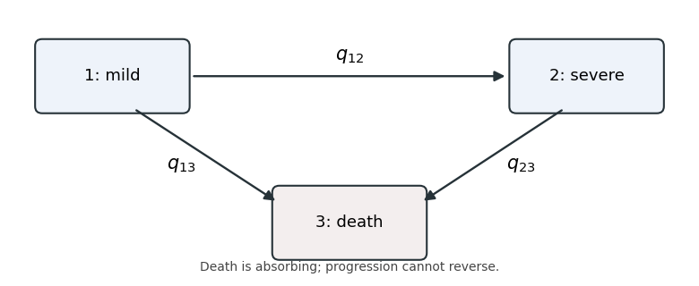

<h1 id="2/a/solution">Solution</h1>

↑ **Parent:** [A](../a.md)

**There are three free [transition intensities](../../../../../../transition-intensity.md): progression, death from the initial state, and death from the advanced state.** In the three-state [illness-death model](../../../../../../illness-death-model.md), state 3 is an [absorbing state](../../../../../../absorbing-state.md), and there is no recovery transition.

**[Figure 1](#2/a/image-irreversible-three-state-progression-model-with-mild-severe-and-absorbing-death-states). Irreversible three-state progression model with mild, severe and absorbing death states**.

Writing $a=q_{12}$, $b=q_{13}$ and $c=q_{23}$, with all three nonnegative, the [transition intensity matrix](../../../../../../transition-intensity-matrix.md) is

$$
\boxed{Q=\begin{pmatrix}-(a+b)&a&b\\0&-c&c\\0&0&0\end{pmatrix}.}
$$

Each diagonal entry is minus the sum of the row's outgoing [transition intensities](../../../../../../transition-intensity.md), rather than an additional unknown parameter. A [continuous-time multi-state model](../../../../../../continuous-time-multi-state-model.md) with these rates describes the severity labels in the observations; an explicit cured state would require a richer state space.

## ↑ Ancestors (11)

1. [A](../a.md)
2. [2](../../2.md)
3. [Paper 32](../../../paper-32-split.md)
4. [Iii](../../../split.md)
5. [2014](../../../../split.md)
6. [Past exam of the mathematics course of the University of Cambridge](../../../../../split.md)
7. [Mathematics course of the University of Cambridge](../../../../../../mathematics-course-of-the-university-of-cambridge.md)
8. [Course of the University of Cambridge](../../../../../../course-of-the-university-of-cambridge.md)
9. [University of Cambridge](../../../../../../university-of-cambridge-split.md)
10. [List of universities](../../../../../../list-of-universities.md)
11. [Codex Wiki](../../../../../../split.md)
