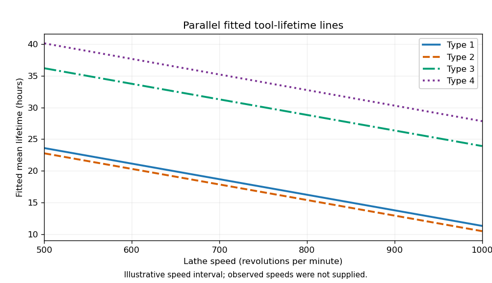

<h1 id="2/solution">Solution</h1>

↑ **Parent:** [2](../2.md)

Let $s_i$ be speed and $j_i\in\{1,2,3,4\}$ the tool type. Each fit is a [normal linear model](../../../../../normal-linear-model.md) with independent $N(0,\sigma^2)$ errors. The three mean specifications are

$$
\begin{aligned}
\text{model 1}:&\quad E(Y_i)=\alpha+\beta s_i,\\
\text{model 2}:&\quad E(Y_i)=\alpha+\tau_{j_i}+\beta s_i,\qquad\tau_1=0,\\
\text{model 3}:&\quad E(Y_i)=\alpha+\tau_{j_i}+(\beta+\delta_{j_i})s_i,
\qquad\tau_1=\delta_1=0.
\end{aligned}
$$

The constraints are treatment coding with type 1 as reference. The parameter counts are $2,5,8$, respectively. Model 2 gives parallel lines; model 3 allows [interaction terms](../../../../../interaction-term.md) and distinct slopes.

In the [analysis of variance](../../../../../analysis-of-variance.md) interaction row, adding three independent slope differences costs three [degrees of freedom](../../../../../degree-of-freedom.md). Its [extra sum of squares](../../../../../extra-sum-of-squares.md) is the reduction in [residual sum of squares](../../../../../residual-sum-of-squares.md), $118.53-91.51=27.02$. Its mean square is $27.02/3\approx9.007$, and its [F-test](../../../../../f-test.md) statistic is

$$
\boxed{F=\frac{27.02/3}{91.51/12}\approx1.181.}
$$

Thus the four missing entries are **$3$, $27.02$, $9.01$, and $1.18$**, to the precision allowed by the rounded output. This tests $H_0:\delta_2=\delta_3=\delta_4=0$ against the alternative that at least one slope difference is nonzero. Under $H_0$ and the [normal linear model](../../../../../normal-linear-model.md) assumptions, the statistic has distribution $F_{3,12}$. Its [p-value](../../../../../p-value.md) $0.3579213$ gives no reason to reject at 5%.

The simpler common-line model is inadequate compared with the parallel-line model. Testing $H_0:\tau_2=\tau_3=\tau_4=0$ against at least one nonzero type effect, while retaining speed, gives the partial [F-test](../../../../../f-test.md)

$$
F=\frac{(1282.08-118.53)/3}{118.53/15}\approx49.08,
\qquad F\sim F_{3,15}\quad\text{under }H_0.
$$

Its [p-value](../../../../../p-value.md) is far below $0.001$, so reject the common-line restriction. This reduction differs from the sequential type sum of squares in the displayed table, because that table adds type before speed. **Recommend model 2: different intercepts and a common decreasing slope.**

The selected coefficient estimates give

$$
\boxed{\begin{aligned}
\widehat m_1(s)&=35.891690-0.024585s,\\
\widehat m_2(s)&=35.058282-0.024585s,\\
\widehat m_3(s)&=48.499350-0.024585s,\\
\widehat m_4(s)&=52.430811-0.024585s.
\end{aligned}}
$$

The intercept estimates the expected lifetime of type 1 at speed zero; if zero speed is outside the data range, it is only an extrapolated intercept. Its [standard error](../../../../../standard-error.md) is $4.039533$, and its [Student t-test](../../../../../student-s-t-test.md) ratio is $8.885$, with two-sided [p-value](../../../../../p-value.md) $2.31\times10^{-7}$. At any fixed speed, type 2 differs from type 1 by $-0.833408$ hours, with [standard error](../../../../../standard-error.md) $1.904707$, $t=-0.438$ and [p-value](../../../../../p-value.md) $0.668$, giving little evidence of a difference. Types 3 and 4 exceed type 1 by $12.607660$ and $16.539121$ hours, with [standard errors](../../../../../standard-error.md) $1.777937$ and $1.876116$; their test ratios $7.091$ and $8.816$ and [p-values](../../../../../p-value.md) $3.68\times10^{-6}$ and $2.55\times10^{-7}$ support positive differences. Each of these individual coefficient tests has null value zero, alternative nonzero, and null distribution $t_{15}$.

The speed coefficient means a reduction of $0.024585$ hours per extra revolution per minute, or $2.4585$ hours per additional 100 rpm, for every type. Its [standard error](../../../../../standard-error.md) is $0.004682$; the ratio $-5.251$ has null distribution $t_{15}$ when the common slope is zero, and two-sided [p-value](../../../../../p-value.md) $9.77\times10^{-5}$.

The [residual standard error](../../../../../residual-standard-error.md) $2.811$ estimates the common noise standard deviation in hours using 15 [residual degrees of freedom](../../../../../residual-degrees-of-freedom.md), since $20-5=15$. The [coefficient of determination](../../../../../coefficient-of-determination.md) $0.9247$ means that about $92.47\%$ of the corrected lifetime variation is explained by this fit. The overall [F-test](../../../../../f-test.md) statistic $46.08$ tests the simultaneous restriction $\tau_2=\tau_3=\tau_4=\beta=0$ against at least one nonzero coefficient; its null distribution is $F_{4,15}$ and its [p-value](../../../../../p-value.md) $2.974\times10^{-8}$ rejects an intercept-only mean. These conclusions remain conditional on suitable [regression diagnostics](../../../../../regression-diagnostics.md) for independent, homoscedastic, approximately normal errors.

The required sketch plots the four fitted lines. Its speed interval is illustrative because the observed speeds are not supplied; the ordering and vertical gaps are determined by the fitted coefficients.

**[Figure 1](#2/image-parallel-fitted-tool-lifetime-lines-for-the-four-tool-types). Parallel fitted tool-lifetime lines for the four tool types**.

## ↑ Ancestors (10)

1. [2](../2.md)
2. [Paper 33](../../paper-33-split.md)
3. [Iii](../../split.md)
4. [2014](../../../split.md)
5. [Past exam of the mathematics course of the University of Cambridge](../../../../split.md)
6. [Mathematics course of the University of Cambridge](../../../../../mathematics-course-of-the-university-of-cambridge.md)
7. [Course of the University of Cambridge](../../../../../course-of-the-university-of-cambridge.md)
8. [University of Cambridge](../../../../../university-of-cambridge-split.md)
9. [List of universities](../../../../../list-of-universities.md)
10. [Codex Wiki](../../../../../split.md)
