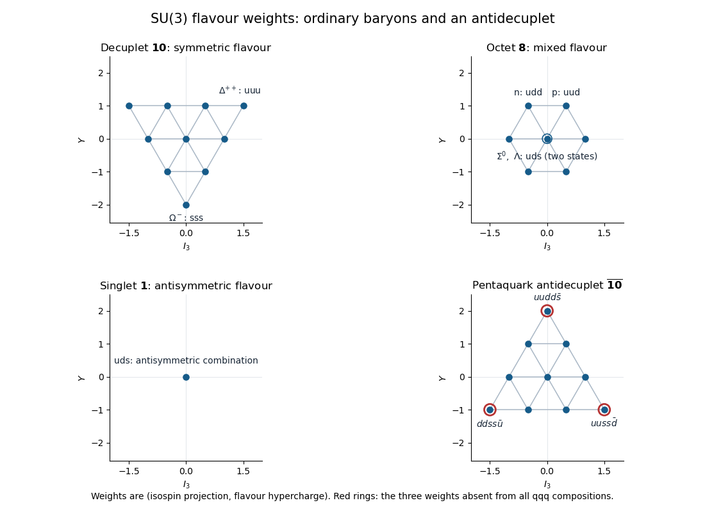

<h1 id="3/solution">Solution</h1>

↑ **Parent:** [3](../3.md)

Treat the [quarks](../../../../../quark.md) as the fundamental triplet of approximate [flavour symmetry](../../../../../flavor-symmetry.md). The flavour product follows by splitting the first two [quarks](../../../../../quark.md) into symmetric and antisymmetric pieces:

$$
\mathbf3\otimes\mathbf3=\mathbf6\oplus\overline{\mathbf3},\qquad
\mathbf6\otimes\mathbf3=\mathbf{10}\oplus\mathbf8,\qquad
\overline{\mathbf3}\otimes\mathbf3=\mathbf8\oplus\mathbf1.
$$

Therefore

$$
\boxed{\mathbf3^{\otimes3}=\mathbf{10}\oplus\mathbf8\oplus\mathbf8\oplus\mathbf1.}
$$

The dimension check is $27=10+8+8+1$. The [baryon decuplet](../../../../../baryon-decuplet.md) is the completely symmetric flavour sector, the [three-quark flavour singlet](../../../../../three-quark-flavour-singlet.md) is completely antisymmetric, and the two copies of the [baryon octet](../../../../../baryon-octet.md) carry mixed permutation symmetry. The two octet copies are a multiplicity space for permutations of the three [quark](../../../../../quark.md) slots, not automatically two distinct ground-state [baryon](../../../../../baryon.md) octets.

For the [weight diagrams](../../../../../weight-diagram.md) use [isospin](../../../../../isospin.md) projection $I_3$ and [flavour hypercharge](../../../../../flavor-hypercharge.md) $Y$. The [quark](../../../../../quark.md) weights are

$$
u:\left(\frac12,\frac13\right),\qquad
d:\left(-\frac12,\frac13\right),\qquad
s:\left(0,-\frac23\right).
$$

Weights add in a [tensor product](../../../../../tensor-product.md). In a three-[quark](../../../../../quark.md) composition, $Y=1-n_s$ and $I_3=(n_u-n_d)/2$. The [baryon decuplet](../../../../../baryon-decuplet.md) has rows $(Y,I)=(1,3/2),(0,1),(-1,1/2),(-2,0)$. Its upper-right weight is $uuu$, the $\Delta^{++}$, while its bottom weight is $sss$, the $\Omega^-$. In the [baryon octet](../../../../../baryon-octet.md), the upper weights are $uud$ and $udd$, giving the proton and neutron. The origin has two independent states with content $uds$: the $I=1$ $\Sigma^0$ and the $I=0$ $\Lambda$. Their equal weights do not make them the same state. The [three-quark flavour singlet](../../../../../three-quark-flavour-singlet.md) has only $(I_3,Y)=(0,0)$ and content $uds$, with normalized flavour wavefunction

$$
|\mathbf1\rangle=\frac{1}{\sqrt6}
\bigl(|uds\rangle+|dsu\rangle+|sud\rangle-|usd\rangle-|dus\rangle-|sdu\rangle\bigr).
$$

This singlet is a different representation from the octet $\Lambda$, despite the same [quark](../../../../../quark.md) content and weight.

**[Figure 1](#3/image-flavour-weight-diagrams-for-the-baryon-decuplet-octet-singlet-and-pentaquark-antidecuplet-red-rings-mark-the-three-exotic-weights). Flavour weight diagrams for the baryon decuplet, octet, singlet and pentaquark antidecuplet; red rings mark the three exotic weights**.

The [Pauli exclusion principle](../../../../../pauli-exclusion-principle.md) requires the full three-[quark](../../../../../quark.md) wavefunction to change sign under exchange of any two [quarks](../../../../../quark.md), including their spatial, [spin](../../../../../spin.md), flavour and colour labels. A [three-quark colour singlet](../../../../../three-quark-colour-singlet.md) has the antisymmetric colour factor $\epsilon_{abc}/\sqrt6$. Consequently the remaining spatial-[spin](../../../../../spin.md)-flavour factor must be symmetric. The flavour representation alone is not the full exchange wavefunction.

For the lowest orbital state, the spatial wavefunction is symmetric. Completely symmetric decuplet flavour then requires the symmetric [spin](../../../../../spin.md)-$3/2$ wavefunction; this includes states such as $uuu$ with aligned spins and does not violate Pauli because their colours are antisymmetrized. Mixed octet flavour combines with mixed [spin](../../../../../spin.md)-$1/2$ wavefunctions to give a symmetric [spin](../../../../../spin.md)-flavour factor. More explicitly, the two-dimensional permutation representation of mixed symmetry tensored with itself contains the trivial representation, which selects the physical symmetric combination. These are the familiar ground-state [spin](../../../../../spin.md) assignments.

Antisymmetric singlet flavour in a symmetric orbital state would instead require a completely antisymmetric three-[quark](../../../../../quark.md) [spin](../../../../../spin.md) state. But $\bigwedge^3\mathbb C^2=0$, so three [spin](../../../../../spin.md)-$1/2$ [quarks](../../../../../quark.md) have no such state. **There is no flavour-singlet three-[quark](../../../../../quark.md) ground-state S-wave [baryon](../../../../../baryon.md).** A singlet is allowed with orbital excitation: mixed spatial and mixed [spin](../../../../../spin.md) symmetry can combine antisymmetrically, and their product with the antisymmetric flavour sector is symmetric. For example an $L=1$, [spin](../../../../../spin.md)-$1/2$ configuration can give negative-parity total spins $1/2$ or $3/2$. This [Pauli constraint on three-quark flavour multiplets](../../../../../pauli-constraint-on-three-quark-flavour-multiplets.md) distinguishes a permitted representation in the flavour [tensor product](../../../../../tensor-product.md) from its possible orbital-[spin](../../../../../spin.md) realization.

For a [pentaquark](../../../../../pentaquark.md), choose each of two [quark](../../../../../quark.md) pairs in $\overline{\mathbf3}$. Their symmetric flavour combination lies in $\overline{\mathbf6}$, and combining with the [antiquark](../../../../../antiquark.md) gives

$$
\boxed{\overline{\mathbf6}\otimes\overline{\mathbf3}
=\overline{\mathbf{10}}\oplus\mathbf8.}
$$

Thus $\mathbf3^{\otimes4}\otimes\overline{\mathbf3}$ contains a [pentaquark antidecuplet](../../../../../pentaquark-antidecuplet.md). This identifies a flavour sector; it does not by itself prove binding or fix the [spin](../../../../../spin.md) and orbital structure needed for overall fermion antisymmetry.

The antidecuplet is the conjugate of the symmetric decuplet, so its rows are $(Y,I)=(2,0),(1,1/2),(0,1),(-1,3/2)$. A three-[quark](../../../../../quark.md) state only has $Y=1,0,-1,-2$, and at $Y=-1$ it contains two strange [quarks](../../../../../quark.md) and one light [quark](../../../../../quark.md), allowing only $I_3=\pm1/2$. Hence the exotic weights are precisely

$$
\boxed{(I_3,Y)=(0,2),\quad(-3/2,-1),\quad(3/2,-1):\quad\textbf{three states}.}
$$

Possible minimal contents are $uudd\bar s$, $ddss\bar u$, and $uuss\bar d$. By the [Gell-Mann--Nishijima formula](../../../../../gell-mann-nishijima-formula.md), their charges are respectively $+1,-2,+1$. Every other antidecuplet weight is also a weight of some three-[quark](../../../../../quark.md) composition, although its total [isospin](../../../../../isospin.md) representation can differ.

Exotic weights do not imply a weak-decay lifetime. The [strong interaction](../../../../../strong-interaction.md) can conserve all the quantum numbers in [baryon](../../../../../baryon.md)-plus-[meson](../../../../../meson.md) channels, for example

$$
uudd\bar s\ \longrightarrow\ pK^0\ \text{or}\ nK^+,
\qquad ddss\bar u\ \longrightarrow\ \Xi^-\pi^-,
\qquad uuss\bar d\ \longrightarrow\ \Xi^0\pi^+.
$$

These are [quark](../../../../../quark.md) rearrangements into a three-[quark](../../../../../quark.md) [baryon](../../../../../baryon.md) and a [quark](../../../../../quark.md)-[antiquark](../../../../../antiquark.md) [meson](../../../../../meson.md), not decay into a single three-[quark](../../../../../quark.md) state. Accordingly **they are generically short-lived strong resonances if these channels are kinematically open**. Flavour representation theory alone gives no masses or widths; a state below all strong thresholds, or one with dynamically suppressed couplings, can be longer-lived. The quantum numbers provide no general protection against the displayed strong decays.

## ↑ Ancestors (10)

1. [3](../3.md)
2. [Paper 41](../../paper-41-split.md)
3. [Iii](../../split.md)
4. [2014](../../../split.md)
5. [Past exam of the mathematics course of the University of Cambridge](../../../../split.md)
6. [Mathematics course of the University of Cambridge](../../../../../mathematics-course-of-the-university-of-cambridge.md)
7. [Course of the University of Cambridge](../../../../../course-of-the-university-of-cambridge.md)
8. [University of Cambridge](../../../../../university-of-cambridge-split.md)
9. [List of universities](../../../../../list-of-universities.md)
10. [Codex Wiki](../../../../../split.md)
