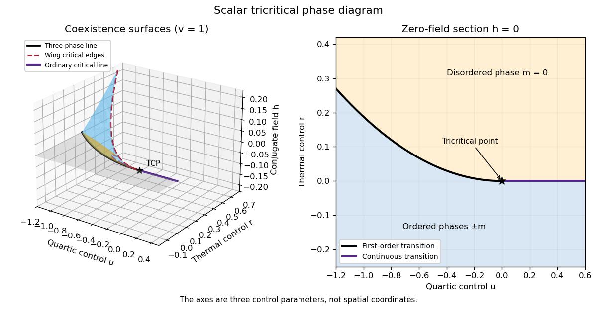

<h1 id="1/v/solution">Solution</h1>

↑ **Parent:** [V](../v.md)

A [tricritical point](../../../../../../tricritical-point.md) joins continuous and first-order transition loci and requires tuning an additional temperature-independent control. In the scalar sextic potential

$$
V(m)=\frac r2m^2+\frac u4m^4+\frac v6m^6-hm,\qquad v>0,
$$

it occurs at **$r=u=h=0$**: both the quadratic and quartic terms vanish. At $h=0,u>0$, the transition is continuous at $r=0$; at $h=0,u<0$, it is first-order at $r=3u^2/(16v)$. The jump tends to zero as $u\uparrow0$, so these loci meet at the [tricritical point](../../../../../../tricritical-point.md).

For the three-control phase diagram with coordinates $(u,r,h)$, the sheet $h=0$ below these transition loci has coexistence of the two ordered phases. For $u>0$ its boundary is the ordinary continuous critical line $r=h=0$. For $u<0$ the boundary $r=3u^2/(16v),h=0$ is a [tricritical three-phase line](../../../../../../tricritical-three-phase-line.md), where $m=0$ and $m=\pm\sqrt{-3u/(4v)}$ all coexist. Two symmetry-related [tricritical wings](../../../../../../tricritical-wing.md) extend from that line into $h>0$ and $h<0$, describing first-order coexistence between small- and large-magnitude phases of the same sign. Each wing ends along an ordinary [wing critical edge](../../../../../../tricritical-wing-critical-edge.md).

The critical-edge conditions $V'=V''=V^{(3)}=0$ give

$$
\boxed{m_c^2=-\frac{3u}{10v},\quad r_c=\frac{9u^2}{20v},\quad h_c=\frac{6u^2m_c}{25v}\qquad(u<0).}
$$

Here $V^{(4)}(m_c)=-12u>0$, so these are ordinary quartic endpoints. The two [wing critical edges](../../../../../../tricritical-wing-critical-edge.md) and the zero-field ordinary critical line are three continuous critical lines meeting at the [tricritical point](../../../../../../tricritical-point.md); the three-phase first-order line also ends there. The “3D” phase diagram refers to three independent controls; it is distinct from the spatial dimension $D$ of the field theory.

The figure uses actual sextic-potential coexistence surfaces rather than drawing arbitrary wings. For two coexisting nonnegative minima $a\leq b$, put $s=a+b,q=ab$. The [tricritical wing coexistence factorization](../../../../../../tricritical-wing-coexistence-factorization.md)

$$
V(m)-V(a)=\frac v6(m-a)^2(m-b)^2\bigl[(m+s)^2+q\bigr]
$$

holds when $u=(2v/3)(-2s^2+3q)$, $r=(v/3)(s^4-s^2q+3q^2)$ and $h=(v/3)s^3q$. It proves that both minima are globally stable. The limits $q=0$ and $q=s^2/4$ produce the three-phase line and critical edge, respectively; reflection gives the other wing.

**[Figure 1](#1/v/image-scalar-tricritical-coexistence-wings-and-the-zero-field-phase-diagram). Scalar tricritical coexistence wings and the zero-field phase diagram**.

At $u=h=0$, $m_0=(-r/v)^{1/4}$ on the ordered side and $V(m_0)=-(-r)^{3/2}/(3\sqrt v)$. At the critical isotherm $h=vm^5$. Thus the tricritical [mean-field critical exponents](../../../../../../mean-field-critical-exponent.md) are

$$
\boxed{\beta=\tfrac14,\quad\alpha=\tfrac12,\quad\delta=5,\quad\gamma=1,\quad\nu=\tfrac12,\quad\eta=0.}
$$

The source's extra control is required to tune $u$ to zero; simply changing temperature in a generic quartic system does not produce tricriticality. The tricritical [upper critical dimension](../../../../../../upper-critical-dimension.md) is three, as established in Question 3.

## ↑ Ancestors (11)

1. [V](../v.md)
2. [1](../../1.md)
3. [Paper 42](../../../paper-42-split.md)
4. [Iii](../../../split.md)
5. [2014](../../../../split.md)
6. [Past exam of the mathematics course of the University of Cambridge](../../../../../split.md)
7. [Mathematics course of the University of Cambridge](../../../../../../mathematics-course-of-the-university-of-cambridge.md)
8. [Course of the University of Cambridge](../../../../../../course-of-the-university-of-cambridge.md)
9. [University of Cambridge](../../../../../../university-of-cambridge-split.md)
10. [List of universities](../../../../../../list-of-universities.md)
11. [Codex Wiki](../../../../../../split.md)
