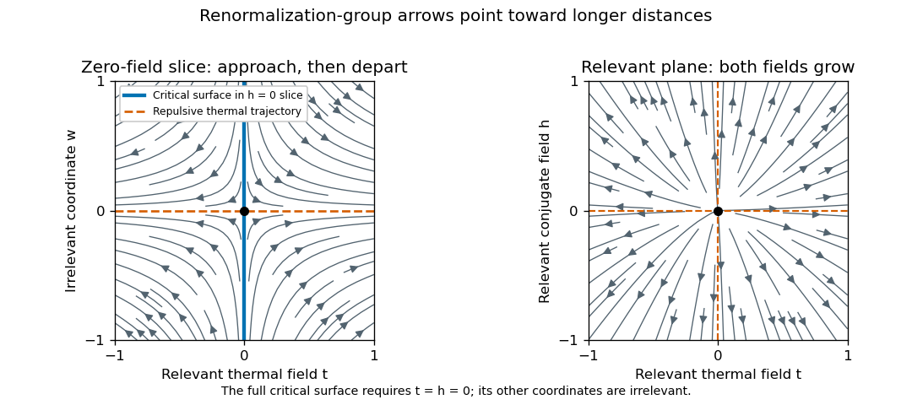

<h1 id="2/solution">Solution</h1>

↑ **Parent:** [2](../2.md)

Work in a translation-invariant [pure thermodynamic phase](../../../../../pure-thermodynamic-phase.md), and write $\beta_{\rm th}=1/(k_BT)$ to distinguish inverse temperature from the order-parameter exponent. The [connected correlation function](../../../../../connected-correlation-function.md) is

$$
\boxed{G(\mathbf r)=\langle\sigma_{\mathbf0}\sigma_{\mathbf n}\rangle-\langle\sigma\rangle^2,\qquad\mathbf r=a\mathbf n.}
$$

Away from criticality in the massive scalar order channel, it decays exponentially, possibly multiplied by an algebraic factor. An exponential [correlation length](../../../../../correlation-length.md) is defined by $\xi^{-1}=-\lim_{r\to\infty}r^{-1}\log|G(r)|$ when that limit exists. At a continuous transition $\xi$ diverges and the critical decay is algebraic. In an ordered symmetric mixture, a nondecaying contribution can remain; selecting a pure branch prevents confusing it with connected critical fluctuations.

Let $M=\sum_{\mathbf n}\sigma_{\mathbf n}$ and $m=\langle M\rangle/N$. Differentiating the [partition function](../../../../../canonical-partition-function.md) with the energy term $-hM$ gives the [correlation-function susceptibility sum rule](../../../../../correlation-function-susceptibility-sum-rule.md)

$$
\boxed{\chi=\frac{\partial m}{\partial h}=\frac{\beta_{\rm th}}N\bigl(\langle M^2\rangle-\langle M\rangle^2\bigr)=\beta_{\rm th}\sum_{\mathbf r}G(\mathbf r).}
$$

If the source is instead the dimensionless $\beta_{\rm th}h$, the explicit inverse-temperature factor is absent. In continuum physical coordinates the lattice sum is approximately $a^{-D}\int d^Dr\,G(\mathbf r)$.

Choose a [normalized blocking kernel](../../../../../normalized-blocking-kernel.md) $B_b(\sigma',\sigma)\geq0$ such that $\sum_{\sigma'}B_b(\sigma',\sigma)=1$, replacing the sum by an integral for continuous variables. A deterministic example is a product of delta functions imposing that each coarse variable equals the average of spins in a block of $b^D$ sites, with its field normalization included consistently. Define the effective Boltzmann weight by

$$
e^{-\beta_{\rm th}[\mathcal H(\mathbf u',\sigma')+N'C']}
=\sum_\sigma B_b(\sigma',\sigma)e^{-\beta_{\rm th}[\mathcal H(\mathbf u,\sigma)+NC]}.
$$

Kernel normalization makes the blocked [partition function](../../../../../canonical-partition-function.md) exactly equal to the original. Its [coarse-grained variables](../../../../../coarse-grained-variable.md) retain the long-distance observables through their defining relation to the original fields. An exact [RG](../../../../../renormalization-group.md) step generally generates all symmetry-allowed operators; keeping only a small coupling set is an approximation, not an exact closure assumption. The geometrical coarse lattice has

$$
\boxed{a_p=b^pa,\qquad N_p=b^{-pD}N,}
$$

so its physical volume is unchanged. A subsequent coordinate rescaling may restore the numerical lattice spacing to its initial value, which is the equivalent rescaled-coordinate convention.

Here define $F(\mathbf u,C)$ as [free energy](../../../../../thermodynamic-free-energy.md) per lattice site, $F=-(\beta_{\rm th}N)^{-1}\log\mathcal Z=C+f(\mathbf u)$. Exact partition-function invariance gives

$$
F(\mathbf u_0,C_0)=b^{-pD}F(\mathbf u_p,C_p).
$$

Because $C$ multiplies the identity operator, a blocking step has $C'=b^DC+c(\mathbf u)$, where $c$ is the generated constant per blocked site. With $g(\mathbf u)=b^{-D}c(\mathbf u)$ this implies

$$
f(\mathbf u)=b^{-D}f(\mathbf u')+g(\mathbf u),
\qquad
\boxed{f(\mathbf u_0)=b^{-pD}f(\mathbf u_p)+\sum_{j=0}^{p-1}b^{-jD}g(\mathbf u_j).}
$$

The [identity-operator contribution to renormalization-group free energy](../../../../../identity-operator-contribution-to-renormalization-group-free-energy.md) includes the eliminated modes' [entropy](../../../../../entropy.md), connected vacuum terms and field-measure normalization. It cannot be discarded when calculating an absolute [free energy](../../../../../thermodynamic-free-energy.md), even though it cancels out of normalized correlation functions.

There is a useful convention behind the word “singular” in this inhomogeneous equation. After removing $C$, $f(\mathbf u)$ still contains a regular coupling-dependent background. If $f=f_{\rm reg}+F_s$ and $f_{\rm reg}(\mathbf u)=b^{-D}f_{\rm reg}(\mathbf u')+g(\mathbf u)$, then the genuinely nonanalytic part obeys $F_s(\mathbf u)=b^{-D}F_s(\mathbf u')$. Thus the printed inhomogeneous representative and homogeneous singular scaling below are consistent after background subtraction. At resonances or marginal points this subtraction may leave additive or multiplicative logarithms; a strictly homogeneous pure-power form is then qualified accordingly.

A [renormalization-group fixed point](../../../../../renormalization-group-fixed-point.md) satisfies $R_b(\mathbf u_*)=\mathbf u_*$. Diagonalizing the linearized map gives scaling coordinates $s_i'=b^{\lambda_i}s_i$. For increasing coarse-graining length, $\lambda_i>0$ defines a [relevant operator](../../../../../relevant-operator.md), $\lambda_i<0$ an [irrelevant operator](../../../../../irrelevant-operator.md), and $\lambda_i=0$ a [marginal operator](../../../../../marginal-operator.md), whose fate needs nonlinear analysis. Here the $\lambda_i$ are logarithmic scaling exponents: the eigenvalues of the discrete [Jacobian matrix](../../../../../jacobian-matrix.md) are $b^{\lambda_i}$, not the numbers $\lambda_i$ themselves. The [critical surface](../../../../../critical-surface.md) is the stable manifold flowing into the critical fixed point after every relevant scaling field is tuned to zero. A [repulsive renormalization-group trajectory](../../../../../repulsive-renormalization-group-trajectory.md) leaves the fixed point along relevant directions and flows toward a different long-distance phase.

**[Figure 2](#2/image-linearized-renormalization-group-flows-in-a-zero-field-slice-and-the-relevant-field-plane). Linearized renormalization-group flows in a zero-field slice and the relevant-field plane**.

For the requested two relevant fields, take $t'=b^{\lambda_t}t$ and $h'=b^{\lambda_h}h$, with $\lambda_t,\lambda_h>0$. Ignoring nonsingular irrelevant corrections and choosing a total blocking scale $\ell=b^p$, the homogeneous singular [free-energy density](../../../../../free-energy-density.md) obeys

$$
F_s(t,h)=\ell^{-D}F_s(\ell^{\lambda_t}t,\ell^{\lambda_h}h).
$$

Choose $\ell=|t|^{-1/\lambda_t}$ so the renormalized thermal field is $\pm1$. This proves

$$
\boxed{F_s(t,h)=|t|^{D/\lambda_t}f_\pm\left(\frac h{|t|^{\lambda_h/\lambda_t}}\right).}
$$

Metric factors and regular analytic redefinitions of the scaling fields only change amplitudes. Likewise $\xi(t,h)=\ell\,\xi(\ell^{\lambda_t}t,\ell^{\lambda_h}h)$, so at $h=0$ the [correlation-length critical exponent](../../../../../correlation-length-critical-exponent.md) is $\nu=1/\lambda_t$. Two thermal derivatives of $F_s$ give the [heat-capacity critical exponent](../../../../../heat-capacity-critical-exponent.md) $\alpha=2-D/\lambda_t$, proving the [hyperscaling relation](../../../../../hyperscaling-relation.md)

$$
\boxed{\alpha=2-D\nu.}
$$

Two field derivatives also give $\gamma=(2\lambda_h-D)/\lambda_t$; one field derivative gives $\beta=(D-\lambda_h)/\lambda_t$, and using $h$ to set the blocking scale on the critical isotherm gives $\delta=\lambda_h/(D-\lambda_h)$. These statements assume that no [dangerously irrelevant coupling](../../../../../dangerously-irrelevant-coupling.md) makes the scaling function singular as it is removed. In particular the naive hyperscaling form need not describe the quartic ordered phase above four dimensions, where its stabilizing quartic coupling is dangerously irrelevant. That restriction reconciles this derivation with the mean-field exponents and Question 3.

The scaling form of the [connected correlation function](../../../../../connected-correlation-function.md) is $G(r)=r^{-(D-2+\eta)}f_G(r/\xi)$ in the continuum long-distance regime. For $r\ll\xi$, $f_G$ tends to a finite nonzero constant. For $r\gg\xi$, it decays exponentially with a possible algebraic prefactor; an isolated massive pole gives the familiar [Ornstein--Zernike correlation function](../../../../../ornstein-zernike-correlation-function.md) tail $G(r)\propto r^{-(D-1)/2}e^{-r/\xi}$ with a temperature-dependent amplitude. Exponential decay is the essential feature; the same critical algebraic power need not remain the exact large-distance prefactor.

Using the susceptibility sum rule and spherical integration gives

$$
\chi\simeq\beta_{\rm th}a^{-D}S_{D-1}\,\xi^{2-\eta}
\int_{a/\xi}^{\infty}dy\,y^{1-\eta}f_G(y).
$$

For $\eta<2$ and an ordinary exponentially decaying scaling function the integral tends to a finite constant: it converges at zero because $f_G(0)$ is finite, and at infinity because of the exponential decay. Microscopic distances add a regular background. Thus $\chi_s\propto\xi^{2-\eta}\propto|t|^{-(2-\eta)\nu}$, establishing the [Fisher scaling relation](../../../../../fisher-scaling-relation.md)

$$
\boxed{\gamma=(2-\eta)\nu.}
$$

For a continuous field, [field scaling and anomalous dimension](../../../../../field-scaling-and-anomalous-dimension.md) give

$$
\boxed{x_\sigma=\frac{D-2+\eta}{2},\qquad
\sigma'(\mathbf x')=b^{x_\sigma}\sigma_< (b\mathbf x').}
$$

This field renormalization is additional to the canonical engineering factor $b^{(D-2)/2}$. It makes $G(r)=b^{-2x_\sigma}G'(r/b)$. Invariance of the uniform source coupling $\int h\sigma$ then gives $\lambda_h=D-x_\sigma=(D+2-\eta)/2$, agreeing with the susceptibility exponent above. With a convention $\sigma'=b^{(D-2)/2}Z_\sigma^{-1/2}\sigma_<$, the fixed-point choice is $Z_\sigma(b)\propto b^{-\eta}$; the sign of the logarithmic derivative depends on this stated convention.

## ↑ Ancestors (10)

1. [2](../2.md)
2. [Paper 42](../../paper-42-split.md)
3. [Iii](../../split.md)
4. [2014](../../../split.md)
5. [Past exam of the mathematics course of the University of Cambridge](../../../../split.md)
6. [Mathematics course of the University of Cambridge](../../../../../mathematics-course-of-the-university-of-cambridge.md)
7. [Course of the University of Cambridge](../../../../../course-of-the-university-of-cambridge.md)
8. [University of Cambridge](../../../../../university-of-cambridge-split.md)
9. [List of universities](../../../../../list-of-universities.md)
10. [Codex Wiki](../../../../../split.md)
