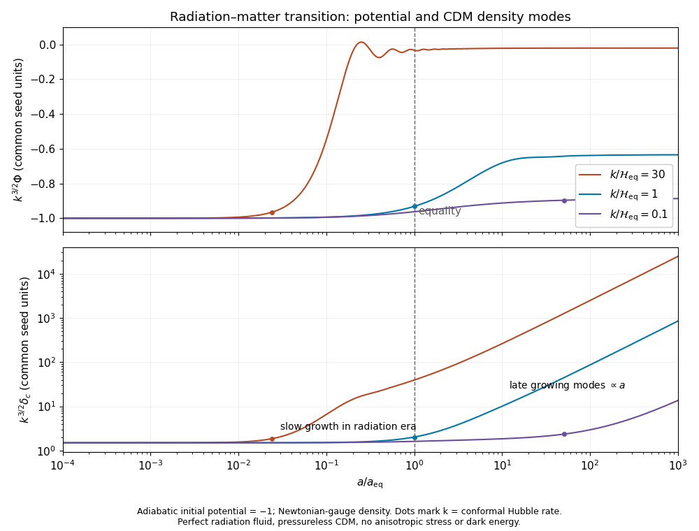

# Paper 49

↑ **Parent:** [Iii](../iii.md)

[https://www.maths.cam.ac.uk/postgrad/part-iii/files/pastpapers/2014/paper_49.pdf](https://www.maths.cam.ac.uk/postgrad/part-iii/files/pastpapers/2014/paper_49.pdf)

**Table of contents**

- [1](#1)
  - [i](#1/i)
    - [Solution](#1/i/solution)
  - [ii](#1/ii)
    - [Solution](#1/ii/solution)
- [2](#2)
  - [i](#2/i)
    - [Solution](#2/i/solution)
  - [ii](#2/ii)
    - [Solution](#2/ii/solution)
  - [iii](#2/iii)
    - [Solution](#2/iii/solution)
- [3](#3)
  - [Solution](#3/solution)
- [4](#4)
  - [Solution](#4/solution)
  - [i](#4/i)
    - [Solution](#4/i/solution)
  - [ii](#4/ii)
    - [Solution](#4/ii/solution)
  - [iii](#4/iii)
    - [Solution](#4/iii/solution)

## 1

↑ **Parent:** [Paper 49](paper-49.md)

<h3 id="1/i">i</h3>

↑ **Parent:** [1](#1)

<h4 id="1/i/solution">Solution</h4>

↑ **Parent:** [I](#1/i)

Take a fixed comoving volume, whose physical volume is $V=V_*a^3$. For adiabatic [cosmic expansion](../../../cosmology.md#expansion-of-the-universe), the [first law of thermodynamics](../../../thermodynamics.md#first-law-of-thermodynamics) gives $d(\rho V)=-P\,dV$. Therefore

$$
\boxed{\dot\rho+3H(\rho+P)=0},\qquad
\frac{d\rho}{d\ln a}=-3(1+w)\rho,\qquad
\rho(a)=\rho_*a^{-3(1+w)}.
$$

Spatial curvature does not change the $a^3$ scaling of a fixed comoving volume. With $C=8\pi G\rho_*/3$ and $d=1+3w$, the [Friedmann equation](../../../cosmology.md#friedmann-equations) becomes

$$
(aH)^2=Ca^{-d}-k,\qquad
\Omega_k=\frac{-k}{Ca^{-d}-k},\qquad
1-\Omega_k=\frac{Ca^{-d}}{Ca^{-d}-k}.
$$

Differentiating this expression, rather than dividing by $\Omega_k$ at a fixed point, yields the [cosmological density parameter flow](../../../cosmology.md#cosmological-density-parameter-flow)

$$
\boxed{\frac{d\Omega_k}{d\ln a}=(1+3w)\Omega_k(1-\Omega_k)}.
$$

This holds on an expanding branch with $H\ne0$. The spatially flat solution $\Omega_k=0$ is a fixed point. For $|\Omega_k|\ll1$, $\Omega_k\propto a^{1+3w}$. Consequently curvature deviations grow as $a^2$ during [radiation domination](../../../linear-cosmological-density-perturbation.md#radiation-domination) and as $a$ during [matter domination](../../../linear-cosmological-density-perturbation.md#matter-domination). A small present curvature therefore requires a much smaller initial deviation: this is the [flatness problem](../../../cosmology.md#flatness-problem) of a decelerating [Big Bang](../../../cosmology.md#big-bang). The issue applies to either sign of curvature, not just an open universe. Conversely, accelerated expansion with $w<-1/3$ suppresses small deviations, which is the [inflationary solution of the flatness problem](../../../cosmology.md#inflationary-solution-of-the-flatness-problem).

<h3 id="1/ii">ii</h3>

↑ **Parent:** [1](#1)

<h4 id="1/ii/solution">Solution</h4>

↑ **Parent:** [Ii](#1/ii)

The [cosmological perfect-fluid continuity equation](../../../cosmology.md#cosmological-perfect-fluid-continuity-equation) gives $\rho_r=\rho_{r,0}a^{-4}$ and $\rho_m=\rho_{m,0}a^{-3}$. In [conformal time](../../../cosmology.md#conformal-time), $\dot a=a'/a$ and $H=a'/a^2$. Thus the flat [Friedmann equation](../../../cosmology.md#friedmann-equations) is

$$
\boxed{(a')^2=H_0^2(\Omega_{r,0}+\Omega_{m,0}a)}.
$$

Choose the expanding branch and put the [Big Bang](../../../cosmology.md#big-bang) at $\tau=0$. Integration gives

$$
\tau(a)=\frac{2}{H_0\Omega_{m,0}}
\left[\sqrt{\Omega_{r,0}+\Omega_{m,0}a}-\sqrt{\Omega_{r,0}}\right].
$$

Inverting it supplies the [radiation-matter scale factor in conformal time](../../../cosmology.md#radiation-matter-scale-factor-in-conformal-time):

$$
\boxed{a(\tau)=\frac{H_0^2\Omega_{m,0}}4\tau^2
+H_0\sqrt{\Omega_{r,0}}\,\tau},\qquad
A=\frac{H_0^2\Omega_{m,0}}4,\quad B=H_0\sqrt{\Omega_{r,0}}.
$$

The early linear term gives [radiation domination](../../../linear-cosmological-density-perturbation.md#radiation-domination), while the late quadratic term gives [matter domination](../../../linear-cosmological-density-perturbation.md#matter-domination). The solution presumes the stated radiation-plus-matter model, without a [cosmological constant](../../../cosmology.md#cosmological-constant).

At [matter-radiation equality](../../../cosmology.md#matter-radiation-equality), $a_{\rm eq}=\Omega_{r,0}/\Omega_{m,0}$. Since $\Omega_{r,0}+\Omega_{m,0}=1$,

$$
\tau_{\rm eq}=\frac{2\sqrt{\Omega_{r,0}}}{H_0\Omega_{m,0}}(\sqrt2-1),
\qquad
\tau_0=\frac{2}{H_0\Omega_{m,0}}(1-\sqrt{\Omega_{r,0}}).
$$

In units $c=1$, the comoving [particle horizon](../../../cosmology.md#particle-horizon) at equality is $\tau_{\rm eq}$; its physical size is $a_{\rm eq}\tau_{\rm eq}$. The [angular diameter distance](../../../cosmology.md#angular-diameter-distance) to the equality surface is $a_{\rm eq}(\tau_0-\tau_{\rm eq})$. Therefore the [horizon angle at matter-radiation equality](../../../cosmology.md#horizon-angle-at-matter-radiation-equality) corresponding to one horizon length is

$$
\boxed{\theta_{\rm hor}\simeq\frac{\tau_{\rm eq}}{\tau_0-\tau_{\rm eq}}
=\frac{(\sqrt2-1)\sqrt{\Omega_{r,0}}}{1-\sqrt{2\Omega_{r,0}}}}.
$$

For $\Omega_{r,0}=10^{-4}$, this is $4.20\times10^{-3}$ radians, or $0.241^\circ$, about $14.4$ arcminutes. If quoting the full diameter of a horizon-sized patch, the result is twice this, $0.481^\circ$. The small-angle approximation is excellent. Expanding in $\sqrt{\Omega_{r,0}}\ll1$ would give $4.14\times10^{-3}$ radians; retaining both cosmic components near equality avoids an inaccurate pure-matter extrapolation there. The [scale factor](../../../cosmology.md#scale-factor-cosmology) cancels between physical size and [angular diameter distance](../../../cosmology.md#angular-diameter-distance), and $H_0$ cancels from the ratio.

If [cosmological recombination](../../../cosmology.md#recombination-cosmology) occurs only a modest expansion after equality, its causal patch still subtends a small part of the sky. Widely separated regions of the observed [cosmic microwave background](../../../cosmology.md#cosmic-microwave-background) have nearly the same temperature even though their past [particle horizons](../../../cosmology.md#particle-horizon) did not overlap in the ordinary decelerating history. Local thermalization after the [Big Bang](../../../cosmology.md#big-bang) therefore cannot explain this large-angle uniformity. This is the [horizon problem](../../../cosmology.md#horizon-problem); inflation supplies an earlier connected region that can grow to encompass the observed sky.

## 2

↑ **Parent:** [Paper 49](paper-49.md)

<h3 id="2/i">i</h3>

↑ **Parent:** [2](#2)

<h4 id="2/i/solution">Solution</h4>

↑ **Parent:** [I](#2/i)

Use $\hbar=c=k_B=1$ and count one populated helicity per [neutrino](../../../standard-model.md#neutrino) or [antineutrino](../../../standard-model.md#antineutrino). For massless particles, the [Fermi-Dirac distribution](../../../statistical-physics.md#fermi-dirac-distribution) gives

$$
\rho_\nu=\frac1{2\pi^2}\int_0^\infty dp\,
\frac{p^3}{e^{(p-\mu_\nu)/T_\nu}+1}.
$$

When $\mu_\nu/T_\nu\gg1$, the occupied states form an almost sharp [Fermi sea](../../../statistical-physics.md#fermi-sea). Replacing the distribution by $\Theta(\mu_\nu-p)$ gives

$$
\boxed{\rho_\nu\simeq\frac1{2\pi^2}\int_0^{\mu_\nu}p^3\,dp
=\frac{\mu_\nu^4}{8\pi^2}}.
$$

The relative finite-temperature correction is of order $(T_\nu/\mu_\nu)^2$.

Chemical equilibrium gives $\mu_{\bar\nu}=-\mu_\nu$. For positive large $\mu_\nu$, the corresponding [antineutrino](../../../standard-model.md#antineutrino) distribution is dilute, so

$$
\rho_{\bar\nu}\simeq\frac{e^{-\mu_\nu/T_\nu}}{2\pi^2}\int_0^\infty p^3e^{-p/T_\nu}dp
=\frac{3T_\nu^4}{\pi^2}e^{-\mu_\nu/T_\nu}.
$$

It is exponentially negligible. The [neutrino degeneracy parameter](../../../cosmology.md#neutrino-degeneracy-parameter) $\xi_\nu=\mu_\nu/T_\nu$ is conserved in the assumed adiabatic massless evolution: redshifting preserves the distribution with both $T_\nu$ and $\mu_\nu$ proportional to $a^{-1}$.

There is a sign qualification in the printed absolute-value formula. If $\mu_\nu<0$, the distribution of [neutrinos](../../../standard-model.md#neutrino) themselves is exponentially suppressed, and the [antineutrinos](../../../standard-model.md#antineutrino), with positive [chemical potential](../../../thermodynamics.md#chemical-potential), form the degenerate sea. In either case the [degenerate neutrino and antineutrino energy density](../../../cosmology.md#degenerate-neutrino-and-antineutrino-energy-density) is

$$
\boxed{\rho_\nu+\rho_{\bar\nu}\simeq\frac{|\mu_\nu|^4}{8\pi^2}}.
$$

Thus the formula with $|\mu_\nu|$ describes the dominant member of the pair, or their leading total, rather than the named [neutrino](../../../standard-model.md#neutrino) distribution for both signs. No extra factor of two is present: only one member is densely occupied. Additional populated internal states multiply the result by their degeneracy.

<h3 id="2/ii">ii</h3>

↑ **Parent:** [2](#2)

<h4 id="2/ii/solution">Solution</h4>

↑ **Parent:** [Ii](#2/ii)

Let $r_\nu=T_{\nu,0}/T_0$, and retain the assumption that these [neutrinos](../../../standard-model.md#neutrino) remain massless. Constancy of the [neutrino degeneracy parameter](../../../cosmology.md#neutrino-degeneracy-parameter) gives $|\mu_{\nu,0}|=|\xi_\nu|r_\nu T_0$. The condition on the [critical density](../../../cosmology.md#critical-density) therefore yields the [critical-density bound on massless neutrino degeneracy](../../../cosmology.md#critical-density-bound-on-massless-neutrino-degeneracy)

$$
\frac{|\xi_\nu|^4r_\nu^4T_0^4}{8\pi^2}\lesssim6\times10^3T_0^4,
\qquad
\boxed{|\xi_\nu|\lesssim(48\times10^3\pi^2)^{1/4}r_\nu^{-1}
=26.24\,\frac{T_0}{T_{\nu,0}}}.
$$

For the standard instantaneous-[neutrino decoupling](../../../cosmology.md#neutrino-decoupling) approximation before [electron-positron annihilation in cosmology](../../../cosmology.md#electron-positron-annihilation-in-cosmology), [cosmological entropy conservation](../../../cosmology.md#cosmological-entropy-conservation) heats [photons](../../../quantum-mechanics.md#photon) relative to the decoupled [neutrinos](../../../standard-model.md#neutrino). The electromagnetic entropy degrees of freedom change from $2+(7/8)4=11/2$ to $2$, giving

$$
T_{\nu,0}=\left(\frac4{11}\right)^{1/3}T_0,
\qquad
\boxed{\left|\frac{\mu_\nu}{T_\nu}\right|\lesssim36.8\ \text{for one flavor}}.
$$

This numerical value requires that thermal-history assumption; the bound in terms of $r_\nu$ is the general answer if large degeneracy changes decoupling or subsequent entropy transfer. Setting $T_{\nu,0}=T_0$ would instead give $26.2$. For $N$ equally degenerate flavors with the same temperature, the leading bound becomes $36.8N^{-1/4}$ under the standard temperature assumption. The neglected thermal corrections make a small change near this loose energy-density limit; this is not a detailed [Big Bang nucleosynthesis](../../../cosmology.md#big-bang-nucleosynthesis) bound.

<h3 id="2/iii">iii</h3>

↑ **Parent:** [2](#2)

<h4 id="2/iii/solution">Solution</h4>

↑ **Parent:** [Iii](#2/iii)

Two effects must be distinguished in [Big Bang nucleosynthesis](../../../cosmology.md#big-bang-nucleosynthesis). The positive extra [neutrino](../../../standard-model.md#neutrino) [energy density](../../../statistical-physics.md#energy-density) increases the [Hubble parameter](../../../cosmology.md#hubble-parameter) through the [Friedmann equation](../../../cosmology.md#friedmann-equations). Holding weak rates fixed, faster expansion causes earlier neutron-proton [cosmological weak freeze-out](../../../cosmology.md#cosmological-weak-freeze-out), leaving more [neutrons](../../../physics.md#neutron), and leaves less time for neutron decay before nuclear reactions begin. Both tendencies increase the [primordial helium mass fraction](../../../cosmology.md#primordial-helium-mass-fraction).

Electron-flavor degeneracy also changes the charged-current balance directly. Chemical equilibrium for $n+\nu_e\leftrightarrow p+e^-$ gives, with negligible electron [chemical potential](../../../thermodynamics.md#chemical-potential),

$$
\frac{n_n}{n_p}\simeq\exp\!\left[-\frac{m_n-m_p}{T}-\xi_{\nu_e}\right].
$$

This is the [primordial helium response to electron-neutrino degeneracy](../../../cosmology.md#primordial-helium-response-to-electron-neutrino-degeneracy). Positive $\xi_{\nu_e}$ favors conversion of [neutrons](../../../physics.md#neutron) to [protons](../../../physics.md#proton) and reduces the neutron abundance; negative $\xi_{\nu_e}$ favors the opposite balance. When [neutrons](../../../physics.md#neutron) are the limiting ingredient and nearly all surviving [neutrons](../../../physics.md#neutron) enter helium-4, the [neutron-limited helium synthesis](../../../cosmology.md#neutron-limited-helium-synthesis) estimate is

$$
Y_p\simeq\frac{2r}{1+r},\qquad r=\frac{n_n}{n_p}\ \text{at nucleosynthesis}.
$$

In this usual proton-rich regime, the direct electron-neutrino effect lowers $Y_p$ for positive degeneracy and raises it for negative degeneracy, other conditions held fixed. At sufficiently large negative degeneracy the equilibrium ratio can instead exceed one; protons then become limiting. The corresponding ideal complete-capture estimate is $Y_p\simeq2\min(r,1)/(1+r)$, so the neutron-limited trend is not a universal monotonic law at arbitrary negative chemical potential. Degeneracy in the other flavors primarily affects helium through the expansion rate in this simplified discussion.

For very large degeneracy the weak reaction rates themselves also change, so a quantitative freeze-out calculation must include both the altered distributions and the altered expansion rate. The two effects can compete for a positive electron-neutrino asymmetry. **The [primordial helium mass fraction](../../../cosmology.md#primordial-helium-mass-fraction) change is not determined by $|\mu_\nu|$ alone: its flavor and sign matter as well as its [energy density](../../../statistical-physics.md#energy-density).**

## 3

↑ **Parent:** [Paper 49](paper-49.md)

<h3 id="3/solution">Solution</h3>

↑ **Parent:** [3](#3)

The [quantum harmonic oscillator](../../../quantum-mechanics.md#quantum-harmonic-oscillator) has $\hat H=(\dot{\hat q}^{\,2}+\omega^2\hat q^{\,2})/2$, with $\omega>0$. Using $\hat a|0\rangle=0$ and the [canonical commutation relation](../../../quantum-mechanics.md#canonical-commutation-relation) gives

$$
E_0\equiv\langle0|\hat H|0\rangle=\frac12\left(|\dot q|^2+\omega^2|q|^2\right).
$$

For $q=re^{is}$, the [Wronskian normalization](../../../quantum-field-theory.md#wronskian-normalization) is

$$
q\dot q^*-\dot q q^*=-2ir^2\dot s=i,
\qquad \dot s=-\frac1{2r^2}.
$$

Consequently

$$
E_0=\frac{\dot r^2}{2}+\frac1{8r^2}+\frac{\omega^2r^2}{2}
\geq\frac\omega2.
$$

Equality requires $\dot r=0$ and $r^2=1/(2\omega)$. The [minimum-energy normalized oscillator mode](../../../quantum-mechanics.md#minimum-energy-normalized-oscillator-mode) is therefore

$$
\boxed{q(t)=\frac{e^{-i\omega t+i\alpha}}{\sqrt{2\omega}},\quad
E_0=\frac\omega2,\quad
\langle0|\hat q^\dagger\hat q|0\rangle=|q|^2=\frac1{2\omega}}.
$$

The constant phase $\alpha$ is irrelevant. This mode also solves the oscillator [equation of motion](../../../classical-mechanics.md#equation-of-motion); an arbitrary squeezed mode would have larger [vacuum energy](../../../perturbative-quantum-field-theory.md#vacuum-energy).

For inflation, introduce the [Mukhanov-Sasaki variable](../../../cosmic-inflation.md#mukhanov-sasaki-variable) $v=z\mathcal R$. Since $z$ depends only on [conformal time](../../../cosmology.md#conformal-time),

$$
z^2(\mathcal R')^2=\left(v'-\frac{z'}zv\right)^2,
\qquad z^2(\partial_i\mathcal R)^2=(\partial_iv)^2.
$$

Integrating the cross term by parts gives the canonical bulk [action](../../../classical-mechanics.md#action)

$$
\boxed{S=\frac12\int d\tau\,d^3x\left[(v')^2-(\nabla v)^2+\frac{z''}zv^2\right]}
$$

up to the boundary term $-\tfrac12\int d^3x\,[(z'/z)v^2]_{\rm boundary}$. The resulting [Euler-Lagrange field equation](../../../quantum-field-theory.md#euler-lagrange-field-equation) and its [Fourier transform](../../../analysis.md#fourier-transform) are

$$
v''-\nabla^2v-\frac{z''}zv=0,\qquad
\boxed{v_k''+\left(k^2-\frac{z''}z\right)v_k=0}.
$$

At leading order in the [slow-roll approximation](../../../cosmic-inflation.md#slow-roll-approximation), retain a small positive, nearly constant $\epsilon$ in $z=a\sqrt{2\epsilon}$, while approximating $a=-1/(H\tau)$ and $H$ as constant. Then $z''/z\simeq2/\tau^2$, so

$$
v_k''+\left(k^2-\frac2{\tau^2}\right)v_k=0.
$$

Strict exact [de Sitter spacetime](../../../general-relativity.md#de-sitter-spacetime) would have $\epsilon=0$ and would not supply the nonzero curvature kinetic coefficient assumed here; the calculation is the leading quasi-de Sitter limit, not a substitution of zero into $z$.

For $-k\tau\gg1$, the expansion correction is negligible and each canonical mode is a [quantum harmonic oscillator](../../../quantum-mechanics.md#quantum-harmonic-oscillator) of conformal frequency $k$. The [Bunch-Davies vacuum](../../../cosmic-inflation.md#bunch-davies-vacuum) selects its positive-frequency, minimum-energy mode $e^{-ik\tau}/\sqrt{2k}$ in that early subhorizon regime. It does not minimize an instantaneous Hamiltonian after the effective squared frequency has become negative outside the horizon.

A basis of exact solutions to the leading mode equation is $e^{-ik\tau}(1-i/(k\tau))$ and its complex conjugate. Write the normalized [Bogoliubov transformation](../../../quantum-field-theory.md#bogoliubov-transformation) combination as

$$
v_k=\frac1{\sqrt{2k}}\left[
\alpha_k e^{-ik\tau}\left(1-\frac{i}{k\tau}\right)
+\beta_k e^{ik\tau}\left(1+\frac{i}{k\tau}\right)\right],
\qquad |\alpha_k|^2-|\beta_k|^2=1.
$$

The [Bunch-Davies vacuum](../../../cosmic-inflation.md#bunch-davies-vacuum) boundary condition sets $\beta_k=0$ and $\alpha_k=1$ up to phase. Hence

$$
\boxed{v_k(\tau)=\frac{e^{-ik\tau}}{\sqrt{2k}}\left(1-\frac{i}{k\tau}\right)}.
$$

Substitution verifies the equation, and $v_kv_k^{*\prime}-v_k'v_k^*=i$ verifies the [Wronskian normalization](../../../quantum-field-theory.md#wronskian-normalization).

Dividing by $z$ gives the [comoving curvature perturbation](../../../cosmic-inflation.md#comoving-curvature-perturbation) variance

$$
|\mathcal R_k(\tau)|^2
=\frac{H^2}{4\epsilon k^3}(1+k^2\tau^2),
\qquad
\boxed{P_{\mathcal R}(k)=\frac{H^2}{4\epsilon k^3}}.
$$

This is the dimensional [slow-roll curvature power spectrum](../../../cosmic-inflation.md#slow-roll-curvature-power-spectrum) in the printed normalization, with the [reduced Planck mass](../../../physics.md#reduced-planck-mass) set to one. The corresponding [dimensionless cosmological power spectrum](../../../cosmic-inflation.md#dimensionless-cosmological-power-spectrum) is $k^3P_{\mathcal R}/(2\pi^2)=H^2/(8\pi^2\epsilon)$, which is independent of $k$ at this order. Restoring the [reduced Planck mass](../../../physics.md#reduced-planck-mass) divides both power expressions by $M_{\rm Pl}^2$. Slowly varying background quantities are evaluated near each mode's horizon exit; their variation generates the small departure from exact scale invariance.

## 4

↑ **Parent:** [Paper 49](paper-49.md)

<h3 id="4/solution">Solution</h3>

↑ **Parent:** [4](#4)

For a single barotropic [perfect fluid in general relativity](../../../general-relativity.md#perfect-fluid-in-general-relativity), the perturbations obey $\delta P=w\,\delta\rho=w\bar\rho\delta$. This adiabatic closure is needed: constant background $P/\rho$ alone would not eliminate an independent entropy perturbation. The absence of [scalar anisotropic stress](../../../linear-cosmological-perturbation-theory.md#scalar-anisotropic-stress) allows the common potential used in [Newtonian gauge in cosmology](../../../linear-cosmological-perturbation-theory.md#newtonian-gauge).

Substituting the density constraint into the pressure equation gives the [gravitational potential evolution of a barotropic fluid](../../../linear-cosmological-perturbation-theory.md#gravitational-potential-evolution-of-a-barotropic-fluid)

$$
\Phi''+3(1+w)\mathcal H\Phi'
+\left[2\mathcal H'+(1+3w)\mathcal H^2\right]\Phi-w\nabla^2\Phi=0.
$$

Since $a\propto\tau^{2/(1+3w)}$, the [conformal Hubble parameter](../../../cosmology.md#conformal-hubble-parameter) is $\mathcal H=2/[(1+3w)\tau]$. The bracket cancels identically, leaving

$$
\boxed{\Phi''+\frac{6(1+w)}{1+3w}\frac{\Phi'}\tau-w\nabla^2\Phi=0}.
$$

For a [Fourier transform](../../../analysis.md#fourier-transform) mode, $\nabla^2$ becomes $-k^2$.

During [radiation domination](../../../linear-cosmological-density-perturbation.md#radiation-domination), $w=1/3$ and $\Phi_k''+4\Phi_k'/\tau+(k^2/3)\Phi_k=0$. Set $x=k\tau/\sqrt3$ and write $\Phi=u/x$. The resulting equation is $u_{xx}+2u_x/x+(1-2/x^2)u=0$, so the two [Spherical Bessel functions](../../../analysis.md#spherical-bessel-function) in the hint give

$$
\boxed{\Phi_r(k,\tau)=C(k)\frac{\sin x-x\cos x}{x^3}
+D(k)\frac{\cos x+x\sin x}{x^3}}.
$$

At $x\ll1$, the two solutions approach a constant and a mode proportional to $\tau^{-3}$. The regular [adiabatic mode](../../../linear-cosmological-perturbation-theory.md#adiabatic-mode), normalized to its primordial potential, is

$$
\Phi_r=3\Phi_{\rm prim}(k)\frac{\sin x-x\cos x}{x^3}
=\Phi_{\rm prim}(k)\left[1-\frac{x^2}{10}+O(x^4)\right].
$$

After entry into the [sound horizon](../../../cosmic-microwave-background-anisotropy.md#sound-horizon), $x\gg1$, the potential oscillates at [cosmological sound speed](../../../linear-cosmological-density-perturbation.md#cosmological-sound-speed) $1/\sqrt3$ with envelope $x^{-2}\propto a^{-2}$. The [Hubble radius](../../../cosmology.md#hubble-radius) and [sound horizon](../../../cosmic-microwave-background-anisotropy.md#sound-horizon) differ by the sound-speed factor; outside the [Hubble radius](../../../cosmology.md#hubble-radius) the regular potential is constant, while well inside it radiation supports acoustic oscillations.

During [matter domination](../../../linear-cosmological-density-perturbation.md#matter-domination), $w=0$ gives $\Phi_k''+6\Phi_k'/\tau=0$ at every wavenumber. Hence

$$
\boxed{\Phi_m(k,\tau)=A(k)+B(k)\tau^{-5}=A(k)+\widetilde B(k)a^{-5/2}}.
$$

The growing density mode has a constant potential both outside and inside the [Hubble radius](../../../cosmology.md#hubble-radius); the other potential mode decays. Pressureless matter has zero [cosmological sound speed](../../../linear-cosmological-density-perturbation.md#cosmological-sound-speed), so horizon entry does not produce the radiation acoustic decay. These formulas cover both independent solutions, while the subsequent sketches select the regular adiabatic growing mode.

<h3 id="4/i">i</h3>

↑ **Parent:** [4](#4)

<h4 id="4/i/solution">Solution</h4>

↑ **Parent:** [I](#4/i)

Take regular [adiabatic initial conditions](../../../cosmic-microwave-background-anisotropy.md#adiabatic-initial-conditions) and a common scale-invariant primordial amplitude, $k^{3/2}\Phi_{\rm prim}(k)=\text{constant}$. Let $k_{\rm eq}=\mathcal H_{\rm eq}$. The three histories are distinguished by their time of [cosmological horizon crossing](../../../linear-cosmological-density-perturbation.md#cosmological-horizon-crossing):

- For $k\ll k_{\rm eq}$, the mode remains outside the [Hubble radius](../../../cosmology.md#hubble-radius) throughout [radiation domination](../../../linear-cosmological-density-perturbation.md#radiation-domination). Its potential remains nearly constant through equality, changing to $9/10$ of the primordial radiation value for a purely adiabatic transition. It stays constant after later horizon entry in [matter domination](../../../linear-cosmological-density-perturbation.md#matter-domination).
- For $k\gg k_{\rm eq}$, horizon entry occurs during [radiation domination](../../../linear-cosmological-density-perturbation.md#radiation-domination). Radiation pressure produces oscillations and a rapidly decreasing potential. The small [cold dark matter](../../../cosmology.md#cold-dark-matter) component eventually supports a much smaller constant matter-era potential; the pure-radiation oscillations are not continued forever after equality.
- For $k\sim k_{\rm eq}$, the transition and horizon entry overlap, giving an intermediate suppression before the potential approaches a constant.

The $9/10$ factor follows from conserving the large-scale adiabatic curvature: the constant potential is proportional to $3(1+w)/(5+3w)$, whose matter-to-radiation ratio is $(3/5)/(2/3)=9/10$. Define the [cold-dark-matter transfer function](../../../linear-cosmological-perturbation-theory.md#cold-dark-matter-transfer-function) by $\Phi_{\rm late}=(9/10)T(k)\Phi_{\rm prim}$. Then $T\to1$ on large scales, while $T\sim(k_{\rm eq}/k)^2\ln(k/k_{\rm eq})$ far below the equality length, as explained by the density growth below.

**Late amplitudes are $\Phi_{\rm late}=(9/10)T(k)\Phi_{\rm prim}$, with $T\simeq1$ for $k\ll k_{\rm eq}$ and $T\ll1$ for $k\gg k_{\rm eq}$.**

The upper panel sketches $k^{3/2}\Phi$ for the three modes. The lower panel provides the corresponding [density contrast](../../../linear-cosmological-density-perturbation.md#density-contrast) histories used in the next part. A negative common primordial potential was chosen so the growing density is positive; this arbitrary phase has no effect on a [cosmological density power spectrum](../../../linear-cosmological-density-perturbation.md#matter-power-spectrum).

**[Figure 1](#4/i/image-evolution-of-scale-invariant-gravitational-potential-and-cold-dark-matter-density-modes-across-radiation-matter-equality). Evolution of scale-invariant gravitational-potential and cold-dark-matter density modes across radiation–matter equality**.

The curves integrate the ideal coupled radiation-fluid and pressureless-matter equations, rather than patching a pure-radiation solution onto a matter solution. They neglect baryons, free-streaming anisotropic stress, dark energy and nonlinear evolution, consistently with the stated mixture. Dots mark $k=\mathcal H$; equality is the dashed vertical line.

<h3 id="4/ii">ii</h3>

↑ **Parent:** [4](#4)

<h4 id="4/ii/solution">Solution</h4>

↑ **Parent:** [Ii](#4/ii)

In [matter domination](../../../linear-cosmological-density-perturbation.md#matter-domination), the [Einstein field equations](../../../general-relativity.md#einstein-field-equations) with constant $\Phi$ give the [Newtonian-gauge matter density from a constant gravitational potential](../../../linear-cosmological-density-perturbation.md#newtonian-gauge-matter-density-from-a-constant-gravitational-potential)

$$
-k^2\Phi-3\mathcal H^2\Phi=4\pi Ga^2\bar\rho_c\delta_c
=\frac32\mathcal H^2\delta_c,
\qquad
\boxed{\delta_c=-2\Phi-\frac{2k^2}{3\mathcal H^2}\Phi}.
$$

Well inside the [Hubble radius](../../../cosmology.md#hubble-radius), the first term is negligible. Since $\mathcal H^2\propto a^{-1}$ and $\Phi$ is constant,

$$
\boxed{\delta_{c,\rm grow}\propto a}.
$$

Equivalently, the [matter-era growing and decaying density modes](../../../linear-cosmological-density-perturbation.md#matter-era-growing-and-decaying-density-modes) follow from $\delta_c''+\mathcal H\delta_c'-(3/2)\mathcal H^2\delta_c=0$: they are $\tau^2\propto a$ and $\tau^{-3}\propto a^{-3/2}$.

The lower panel of the preceding figure gives the three requested [density contrast](../../../linear-cosmological-density-perturbation.md#density-contrast) sketches in [Newtonian gauge in cosmology](../../../linear-cosmological-perturbation-theory.md#newtonian-gauge). Their early superhorizon density is nearly constant, rather than proportional to $a^2$ in this gauge. A large-$k$ mode enters first and grows only approximately logarithmically during [radiation domination](../../../linear-cosmological-density-perturbation.md#radiation-domination). Once the rapid radiation forcing has subsided, $\delta_c''+\mathcal H\delta_c'\simeq0$ with $\mathcal H\simeq1/\tau$, so $\delta_c\simeq C+D\ln\tau\simeq C+D\ln a$. This is the [Mészáros effect](../../../linear-cosmological-density-perturbation.md#meszaros-effect); forcing around entry determines the coefficients. After equality its growing part becomes proportional to $a$.

A mode near $k_{\rm eq}$ begins substantial growth around equality. A small-$k$ mode keeps its superhorizon constant term until entering during [matter domination](../../../linear-cosmological-density-perturbation.md#matter-domination), then follows the same $a$ growth law. Their entry scale factors satisfy $a_{\rm ent}\propto k^{-1}$ during [radiation domination](../../../linear-cosmological-density-perturbation.md#radiation-domination) and $a_{\rm ent}\propto k^{-2}$ during [matter domination](../../../linear-cosmological-density-perturbation.md#matter-domination). At a common late time, the scaled amplitudes are therefore of order

$$
k^{3/2}\delta_c\propto
\begin{cases}
a\,k^2,&\mathcal H(a)\ll k\ll k_{\rm eq},\\
a\,\ln(k/k_{\rm eq}),&k\gg k_{\rm eq},
\end{cases}
$$

up to common dimensional constants and order-one matching terms. Thus the three late growth curves have the same logarithmic slope one as functions of $a$, but different amplitudes. These amplitude statements require the modes to have entered the [Hubble radius](../../../cosmology.md#hubble-radius); the full Newtonian-gauge formula above remains available for modes that have not.

<h3 id="4/iii">iii</h3>

↑ **Parent:** [4](#4)

<h4 id="4/iii/solution">Solution</h4>

↑ **Parent:** [Iii](#4/iii)

A scale-invariant primordial potential has $P_\Phi(k)\propto k^{-3}$. On subhorizon linear scales, the [cosmological Poisson equation](../../../linear-cosmological-perturbation-theory.md#cosmological-poisson-equation) and the [cold-dark-matter transfer function](../../../linear-cosmological-perturbation-theory.md#cold-dark-matter-transfer-function) give $\delta_c(k,a)\propto D(a)k^2T(k)\Phi_{\rm prim}(k)$, where $D(a)\propto a$ during [matter domination](../../../linear-cosmological-density-perturbation.md#matter-domination). Consequently

$$
P_{\delta_c}(k,a)\propto D(a)^2k\,T(k)^2.
$$

Large scales enter only after equality and have $T(k)\simeq1$. Small scales enter during [radiation domination](../../../linear-cosmological-density-perturbation.md#radiation-domination); their approximately logarithmic growth up to equality gives $T(k)\propto(k_{\rm eq}/k)^2\ln(k/k_{\rm eq})$. Therefore

$$
\boxed{P_{\delta_c}(k,z=1)\propto D(1)^2
\begin{cases}
k,&\mathcal H(z=1)\ll k\ll k_{\rm eq},\\
k^{-3}\ln^2(k/k_{\rm eq}),&k\gg k_{\rm eq}.
\end{cases}}
$$

If the slow logarithm is suppressed in a rough sketch, the slopes are $+1$ and $-3$, with a turnover near $k_{\rm eq}$. The logarithmic correction is real and should not be mistaken for a different primordial spectral index. In the matter-only late-time approximation with $D(0)=1$, the [cosmological redshift](../../../cosmology.md#cosmological-redshift) $z=1$ means $a=1/2$ and $D(1)^2=1/4$; it changes the amplitude, not these asymptotic shapes. Neither the initial normalization nor cosmological parameters needed for an absolute power are supplied.

**[Figure 2](#4/iii/image-linear-cold-dark-matter-power-at-redshift-one-with-the-equality-turnover-and-its-large-and-small-wavenumber-asymptotes). Linear cold-dark-matter power at redshift one with the equality turnover and its large- and small-wavenumber asymptotes**.

This is a schematic smooth interpolation with the derived asymptotes, not a precision transfer-function fit. The linear ideal-fluid model excludes baryonic acoustic structure and small-scale nonlinear evolution.

There is also a gauge and horizon qualification. For a mode still outside the [Hubble radius](../../../cosmology.md#hubble-radius) at $z=1$, the printed Newtonian-gauge density has $\delta_c\simeq-2\Phi$, and its formal dimensional spectrum is instead proportional to $k^{-3}$. The conventional large-scale $k$ branch describes modes that are large relative to the equality scale but already subhorizon at the observation time. Alternatively, the comoving matter density, $\Delta_c=\delta_c+3\mathcal H\theta_c/k^2$ with $\theta_c=\nabla\cdot\boldsymbol v_c$, removes that constant gauge term and obeys $\Delta_c=-2k^2\Phi/(3\mathcal H^2)$ in the growing matter solution. The usual matter-spectrum sketch can be continued to small $k$ in this comoving-density convention. The dimensional spectrum requested here is $P$, rather than the [dimensionless cosmological power spectrum](../../../cosmic-inflation.md#dimensionless-cosmological-power-spectrum) $k^3P/(2\pi^2)$, whose slopes would differ by three.

## ↑ Ancestors (8)

1. [Iii](../iii.md)
2. [2014](../../2014.md)
3. [Past exam of the mathematics course of the University of Cambridge](../../../past-exam-of-the-mathematics-course-of-the-university-of-cambridge.md)
4. [Mathematics course of the University of Cambridge](../../../university-of-cambridge.md#mathematics-course-of-the-university-of-cambridge)
5. [Course of the University of Cambridge](../../../university-of-cambridge.md#course-of-the-university-of-cambridge)
6. [University of Cambridge](../../../university-of-cambridge.md)
7. [List of universities](../../../README.md#list-of-universities)
8. [Codex Wiki](../../../README.md)
