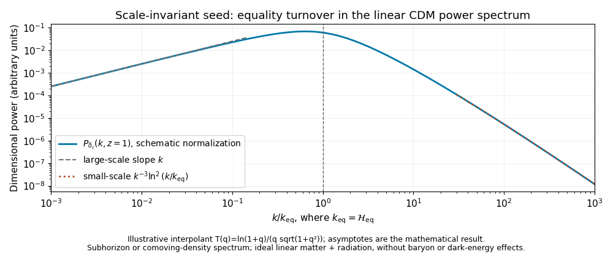

<h1 id="4/iii/solution">Solution</h1>

↑ **Parent:** [Iii](../iii.md)

A scale-invariant primordial potential has $P_\Phi(k)\propto k^{-3}$. On subhorizon linear scales, the [cosmological Poisson equation](../../../../../../cosmological-poisson-equation.md) and the [cold-dark-matter transfer function](../../../../../../cold-dark-matter-transfer-function.md) give $\delta_c(k,a)\propto D(a)k^2T(k)\Phi_{\rm prim}(k)$, where $D(a)\propto a$ during [matter domination](../../../../../../matter-domination.md). Consequently

$$
P_{\delta_c}(k,a)\propto D(a)^2k\,T(k)^2.
$$

Large scales enter only after equality and have $T(k)\simeq1$. Small scales enter during [radiation domination](../../../../../../radiation-domination.md); their approximately logarithmic growth up to equality gives $T(k)\propto(k_{\rm eq}/k)^2\ln(k/k_{\rm eq})$. Therefore

$$
\boxed{P_{\delta_c}(k,z=1)\propto D(1)^2
\begin{cases}
k,&\mathcal H(z=1)\ll k\ll k_{\rm eq},\\
k^{-3}\ln^2(k/k_{\rm eq}),&k\gg k_{\rm eq}.
\end{cases}}
$$

If the slow logarithm is suppressed in a rough sketch, the slopes are $+1$ and $-3$, with a turnover near $k_{\rm eq}$. The logarithmic correction is real and should not be mistaken for a different primordial spectral index. In the matter-only late-time approximation with $D(0)=1$, the [cosmological redshift](../../../../../../cosmological-redshift.md) $z=1$ means $a=1/2$ and $D(1)^2=1/4$; it changes the amplitude, not these asymptotic shapes. Neither the initial normalization nor cosmological parameters needed for an absolute power are supplied.

**[Figure 2](#4/iii/image-linear-cold-dark-matter-power-at-redshift-one-with-the-equality-turnover-and-its-large-and-small-wavenumber-asymptotes). Linear cold-dark-matter power at redshift one with the equality turnover and its large- and small-wavenumber asymptotes**.

This is a schematic smooth interpolation with the derived asymptotes, not a precision transfer-function fit. The linear ideal-fluid model excludes baryonic acoustic structure and small-scale nonlinear evolution.

There is also a gauge and horizon qualification. For a mode still outside the [Hubble radius](../../../../../../hubble-radius.md) at $z=1$, the printed Newtonian-gauge density has $\delta_c\simeq-2\Phi$, and its formal dimensional spectrum is instead proportional to $k^{-3}$. The conventional large-scale $k$ branch describes modes that are large relative to the equality scale but already subhorizon at the observation time. Alternatively, the comoving matter density, $\Delta_c=\delta_c+3\mathcal H\theta_c/k^2$ with $\theta_c=\nabla\cdot\boldsymbol v_c$, removes that constant gauge term and obeys $\Delta_c=-2k^2\Phi/(3\mathcal H^2)$ in the growing matter solution. The usual matter-spectrum sketch can be continued to small $k$ in this comoving-density convention. The dimensional spectrum requested here is $P$, rather than the [dimensionless cosmological power spectrum](../../../../../../dimensionless-cosmological-power-spectrum.md) $k^3P/(2\pi^2)$, whose slopes would differ by three.

## ↑ Ancestors (11)

1. [Iii](../iii.md)
2. [4](../../4.md)
3. [Paper 49](../../../paper-49-split.md)
4. [Iii](../../../split.md)
5. [2014](../../../../split.md)
6. [Past exam of the mathematics course of the University of Cambridge](../../../../../split.md)
7. [Mathematics course of the University of Cambridge](../../../../../../mathematics-course-of-the-university-of-cambridge.md)
8. [Course of the University of Cambridge](../../../../../../course-of-the-university-of-cambridge.md)
9. [University of Cambridge](../../../../../../university-of-cambridge-split.md)
10. [List of universities](../../../../../../list-of-universities.md)
11. [Codex Wiki](../../../../../../split.md)
