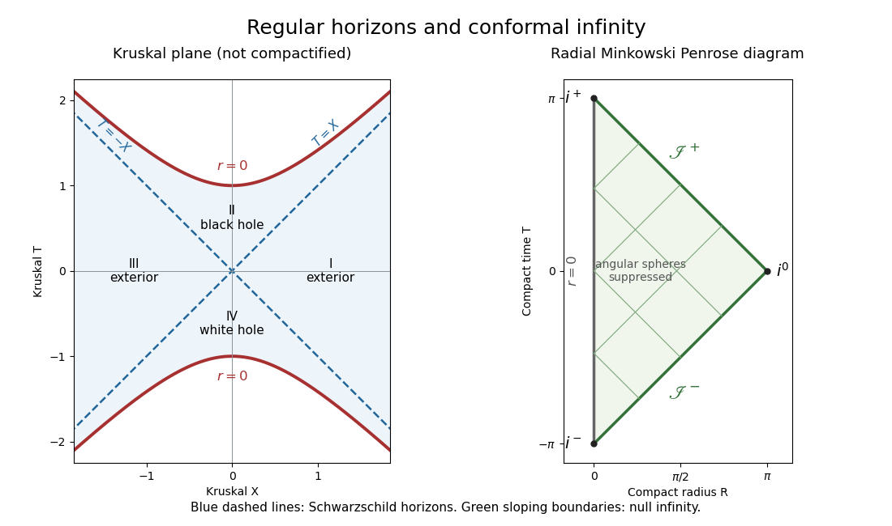

<h1 id="1/b/solution">Solution</h1>

↑ **Parent:** [B](../b.md)

Start with the four-dimensional [Minkowski metric](../../../../../../minkowski-metric.md) $ds^2=-dt^2+dr^2+r^2d\Omega^2$, where $r\geq0$. Choose an arbitrary length $L>0$, and use the [retarded and advanced null coordinates](../../../../../../retarded-and-advanced-null-coordinates.md) $u=t-r$, $v=t+r$. For the [Minkowski conformal compactification](../../../../../../minkowski-conformal-compactification.md), set

$$
p=\arctan(u/L),\quad q=\arctan(v/L),\qquad T=p+q,\quad R=q-p.
$$

Both $p,q$ lie between $-\pi/2$ and $\pi/2$. Since $v\geq u$, we have $R\geq0$; the remaining inequalities are $|T|+R<\pi$. Moreover,

$$
r=\frac{L\sin R}{2\cos p\cos q},\qquad ds^2=\frac{L^2}{4\cos^2p\cos^2q}\left(-dT^2+dR^2+\sin^2R\,d\Omega^2\right).
$$

Multiply by the square of the [conformal factor](../../../../../../conformal-factor.md) $\Omega_c=2\cos p\cos q/L$. The resulting metric is regular on the appropriate boundary pieces and preserves the [null directions](../../../../../../null-directions.md). Suppressing the angular two-spheres gives a triangular [Penrose diagram](../../../../../../penrose-diagram.md) with radial [null geodesics](../../../../../../null-geodesic.md) at $45$ degrees.

The line $R=0$ is the ordinary timelike centre $r=0$. The upper sloping edge $T+R=\pi$ is [future null infinity](../../../../../../future-null-infinity.md), reached with $v\to+\infty$ and finite $u$; the lower sloping edge $T-R=-\pi$ is [past null infinity](../../../../../../past-null-infinity.md), reached with $u\to-\infty$ and finite $v$. The vertices $(T,R)=(\pi,0)$ and $(-\pi,0)$ are future and past [timelike infinity](../../../../../../timelike-infinity.md), denoted $i^+$ and $i^-$. The vertex $(0,\pi)$ is [spacelike infinity](../../../../../../spacelike-infinity.md), $i^0$. These are limiting endpoints in the [conformal completion](../../../../../../conformal-completion.md), rather than ordinary physical events. In particular, finite diagram coordinates at [null infinity](../../../../../../null-infinity.md) do not imply finite physical [affine parameter](../../../../../../affine-parameter.md).

**The four-dimensional radial diagram is the triangle $R\geq0$, $|T|+R\leq\pi$.** If one instead draws two-dimensional [Minkowski spacetime](../../../../../../minkowski-spacetime.md) with a signed Cartesian spatial coordinate, the diagram is the full diamond. The centre is a boundary of the radial quotient, not a boundary of the physical four-dimensional [Minkowski spacetime](../../../../../../minkowski-spacetime.md).

**[Figure 1](#1/b/image-kruskal-extension-and-the-radial-minkowski-penrose-diagram). Kruskal extension and the radial Minkowski Penrose diagram**.

## ↑ Ancestors (11)

1. [B](../b.md)
2. [1](../../1.md)
3. [Paper 52](../../../paper-52-split.md)
4. [Iii](../../../split.md)
5. [2014](../../../../split.md)
6. [Past exam of the mathematics course of the University of Cambridge](../../../../../split.md)
7. [Mathematics course of the University of Cambridge](../../../../../../mathematics-course-of-the-university-of-cambridge.md)
8. [Course of the University of Cambridge](../../../../../../course-of-the-university-of-cambridge.md)
9. [University of Cambridge](../../../../../../university-of-cambridge-split.md)
10. [List of universities](../../../../../../list-of-universities.md)
11. [Codex Wiki](../../../../../../split.md)
