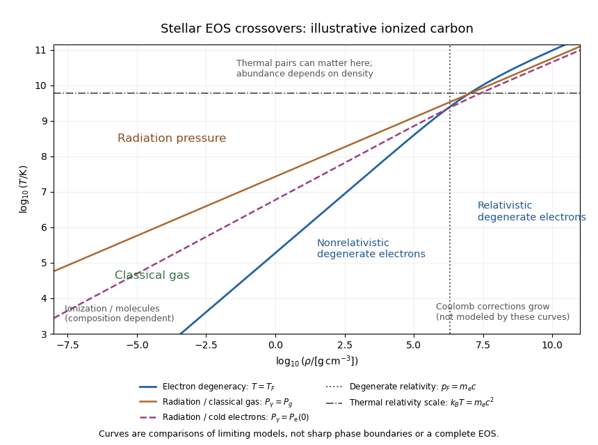

# Paper 55

↑ **Parent:** [Iii](../iii.md)

[https://www.maths.cam.ac.uk/postgrad/part-iii/files/pastpapers/2014/paper_55.pdf](https://www.maths.cam.ac.uk/postgrad/part-iii/files/pastpapers/2014/paper_55.pdf)

**Table of contents**

- [1](#1)
  - [Solution](#1/solution)
- [2](#2)
  - [Solution](#2/solution)
- [3](#3)
  - [a](#3/a)
  - [b](#3/b)
  - [c](#3/c)
  - [d](#3/d)
  - [i](#3/i)
    - [Solution](#3/i/solution)
  - [ii](#3/ii)
    - [Solution](#3/ii/solution)
  - [iii](#3/iii)
    - [Solution](#3/iii/solution)
  - [iv](#3/iv)
    - [Solution](#3/iv/solution)
- [4](#4)
  - [Solution](#4/solution)

## 1

↑ **Parent:** [Paper 55](paper-55.md)

<h3 id="1/solution">Solution</h3>

↑ **Parent:** [1](#1)

For a spherical [stellar polytrope](../../../stellar-structure.md#stellar-polytrope) in [hydrostatic equilibrium](../../../statistical-physics.md#hydrostatic-equilibrium), combine $dm_r/dr=4\pi r^2\rho$ with $dP/dr=-Gm_r\rho/r^2$ to eliminate the [enclosed mass](../../../stellar-structure.md#enclosed-mass):

$$
\frac1{r^2}\frac d{dr}\left(\frac{r^2}{\rho}\frac{dP}{dr}\right)=-4\pi G\rho.
$$

For $n>0$, put $P=K\rho^{1+1/n}$, $\rho=\rho_c\theta^n$, $P=P_c\theta^{n+1}$ and $r=a\xi$. Since $\rho^{-1}dP/dr=(n+1)P_c\theta'/(a\rho_c)$, choose

$$
a^2=\frac{(n+1)P_c}{4\pi G\rho_c^2}
=\frac{(n+1)K}{4\pi G}\rho_c^{(1-n)/n}.
$$

The [Lane-Emden equation](../../../nonlinear-analysis.md#lane-emden-equation) is then

$$
\boxed{\frac1{\xi^2}\frac d{d\xi}(\xi^2\theta')=-\theta^n.}
$$

A regular center requires **$\theta(0)=1$ and $\theta'(0)=0$**, with positive chosen central [mass density](../../../fluid-mechanics.md#density) and [pressure](../../../thermodynamics.md#pressure). Locally $\theta=1-\xi^2/6+n\xi^4/120+\cdots$. The stellar surface is the first positive zero $\xi_1$, where the idealized external [pressure](../../../thermodynamics.md#pressure) is zero; retain the positive solution before it. Thus $R=a\xi_1$ and the [Lane-Emden mass formula](../../../stellar-structure.md#lane-emden-mass-formula) is

$$
M=4\pi a^3\rho_c\omega_n,\qquad
\omega_n=-\xi_1^2\theta'(\xi_1)
=\int_0^{\xi_1}\xi^2\theta^n\,d\xi.
$$

The surface condition selects where to stop a centrally regular solution, rather than replacing its central regularity conditions.

For a [polytrope of index zero](../../../stellar-structure.md#polytrope-of-index-zero), the density is constant and $(\xi^2\theta')'=-\xi^2$. Regularity gives

$$
\boxed{\theta_0=1-\xi^2/6,\quad\xi_1=\sqrt6,\quad R=\sqrt6\,a.}
$$

The [pressure](../../../thermodynamics.md#pressure) is $P_c\theta_0$ and $a^2=P_c/(4\pi G\rho_c^2)$, so $R^2=3P_c/(2\pi G\rho_c^2)$. **Index zero is the structural incompressible limit**: the expression $K\rho^{1+1/n}$ is not itself defined at $n=0$.

For a [polytrope of index one](../../../stellar-structure.md#polytrope-of-index-one), set $u=\xi\theta$. The equation becomes $u''+u=0$, while central regularity requires $u(0)=0$, $u'(0)=1$. Hence

$$
\boxed{\theta_1=\frac{\sin\xi}{\xi},\quad\xi_1=\pi,\quad
R=\pi a=\sqrt{\frac{\pi K}{2G}},\quad\omega_1=\pi.}
$$

The mass is $4\pi^2a^3\rho_c$, so it can change with central [mass density](../../../fluid-mechanics.md#density) while the radius stays fixed.

The [moment of inertia of a polytropic star](../../../stellar-structure.md#moment-of-inertia-of-a-polytropic-star) about any axis through its center follows by integrating $r^2\sin^2\vartheta$ over spherical shells:

$$
I=\frac{8\pi}{3}\int_0^R\rho(r)r^4\,dr
=\frac{8\pi}{3}\rho_ca^5\int_0^{\xi_1}\xi^4\theta^n\,d\xi.
$$

For constant [mass density](../../../fluid-mechanics.md#density) this gives **$I_0=2MR^2/5$**. For index one, [integration by parts](../../../calculus.md#integration-by-parts) gives $\int_0^\pi\xi^3\sin\xi\,d\xi=\pi(\pi^2-6)$, and therefore

$$
\boxed{I_1=\frac23\left(1-\frac6{\pi^2}\right)MR^2\simeq0.26138MR^2.}
$$

These are axial [moments of inertia](../../../classical-mechanics.md#moment-of-inertia), not the scalar second mass moment $\int r^2dm$.

For a finite-radius centrally regular [stellar polytrope](../../../stellar-structure.md#stellar-polytrope) with $0<n<5$ and $n\ne1$, eliminate $\rho_c$ from $R=a\xi_1$ and $M=4\pi a^3\rho_c\omega_n$. The resulting [polytropic mass-radius relation](../../../stellar-structure.md#polytropic-mass-radius-relation) is

$$
\boxed{M=AR^{p(n)},\quad p(n)=\frac{n-3}{n-1},\quad
A=4\pi\omega_n\,\xi_1^{-p(n)}
\left(\frac{(n+1)K}{4\pi G}\right)^{n/(n-1)}.}
$$

Here $\xi_1,\omega_n$ are dimensionless functions of $n$. **At $n=1$ no such single-valued mass-as-a-power-of-radius relation exists at fixed $K$**: the radius is fixed instead. At $n=3$ the exponent is zero and $M=4\pi\omega_3(K/(\pi G))^{3/2}$ is independent of central [mass density](../../../fluid-mechanics.md#density). For the incompressible case, $M=(4\pi\rho_c/3)R^3$ at fixed [mass density](../../../fluid-mechanics.md#density). Regular $n\ge5$ solutions have no finite zero-pressure surface, so the finite-radius formula does not apply to them.

## 2

↑ **Parent:** [Paper 55](paper-55.md)

<h3 id="2/solution">Solution</h3>

↑ **Parent:** [2](#2)

In [stellar homology](../../../stellar-structure.md#stellar-homology), the dimensionless radial profiles are the same after scaling radius, [enclosed mass](../../../stellar-structure.md#enclosed-mass), [pressure](../../../thermodynamics.md#pressure), [temperature](../../../thermodynamics.md#temperature) and [luminosity](../../../astrophysics.md#luminosity). At corresponding radii let $r'=\xi r$, $m_r'=m m_r$, $T'=tT$, $P'=pP$ and $L_r'=lL_r$. The printed $R'=\xi r$ is understood as this local radial scaling, with surface radius $R'=\xi R$.

Let $q=\rho'/\rho$ and keep composition, [opacity](../../../stellar-structure.md#opacity) coefficient and nuclear coefficient fixed first. [Mass conservation](../../../continuum-mechanics.md#mass-conservation) gives $q=m/\xi^3$, and [hydrostatic equilibrium](../../../statistical-physics.md#hydrostatic-equilibrium) gives $p=mq/\xi=m^2/\xi^4$. The [ideal gas](../../../thermodynamics.md#ideal-gas) law then gives $t=p/q=m/\xi$. Scaling the [stellar energy-generation rate](../../../stellar-astrophysics.md#stellar-energy-generation-rate) equation and the [stellar radiative temperature gradient](../../../stellar-structure.md#stellar-radiative-temperature-gradient) gives respectively

$$
l=\xi^3q^2t^\eta=m^{\eta+2}\xi^{-(\eta+3)},\qquad
l=\xi t^{4-\nu}q^{-(\lambda+1)}
=m^{3-\lambda-\nu}\xi^{3\lambda+\nu}.
$$

The second follows from $dT/dr\propto-\kappa\rho L_r/(r^2T^3)$, not from energy production. Equating the two [luminosity](../../../astrophysics.md#luminosity) scalings gives

$$
\boxed{R\propto M^X,\quad
X=\frac{\eta+\lambda+\nu-1}{\eta+3\lambda+\nu+3},\qquad
L\propto M^Y,\quad Y=\eta+2-(\eta+3)X.}
$$

This assumes the denominator is nonzero and a consistent homologous family exists. If the [mean molecular weight](../../../thermodynamics.md#mean-molecular-weight) differs by $u=\mu'/\mu$, then $t=um/\xi$ and

$$
\xi^{\eta+3\lambda+\nu+3}
=u^{\eta+\nu-4}m^{\eta+\lambda+\nu-1}.
$$

Ratios of the [opacity](../../../stellar-structure.md#opacity) and energy-generation coefficients multiply the right-hand side. Thus fixed composition is a real restriction, not an automatic property of every stellar sequence.

Use the [Stefan–Boltzmann law](../../../thermodynamics.md#stefan-boltzmann-law) $L=4\pi R^2\sigma T_{\rm eff}^4$ to locate the family on a [Hertzsprung-Russell diagram](../../../stellar-astrophysics.md#hertzsprung-russell-diagram). It implies $T_{\rm eff}\propto M^{(Y-2X)/4}$ and

$$
\boxed{\frac{d\log L}{d\log T_{\rm eff}}=\frac{4Y}{Y-2X}.}
$$

For [proton–proton chain](../../../stellar-astrophysics.md#proton-proton-chain) burning take the usual local approximation $\eta=4$, with [Kramers' opacity law](../../../stellar-structure.md#kramers-opacity-law) $\lambda=1$, $\nu=-7/2$. Then

$$
\boxed{R\propto M^{1/13},\quad L\propto M^{71/13},\quad
T_{\rm eff}\propto M^{69/52},\quad
\frac{d\log L}{d\log T_{\rm eff}}=\frac{284}{69}\simeq4.12.}
$$

For the [CNO cycle](../../../stellar-astrophysics.md#cno-cycle) with [electron-scattering opacity](../../../stellar-structure.md#electron-scattering-opacity), $\lambda=\nu=0$, so

$$
\boxed{R\propto M^{(\eta-1)/(\eta+3)},\quad L\propto M^3,\quad
\frac{d\log L}{d\log T_{\rm eff}}=\frac{12(\eta+3)}{\eta+11}.}
$$

A conventional local choice $\eta=16$ gives $R\propto M^{15/19}$ and slope **$76/9\simeq8.44$**. Choosing $\eta=17$ instead gives slope $60/7\simeq8.57$. The source specifies no numerical nuclear exponents, and the effective exponent changes with [temperature](../../../thermodynamics.md#temperature); the general expression is the unambiguous answer.

**[Figure 1](#2/image-idealized-radiative-homology-branches-on-a-hertzsprung-russell-diagram-with-pp-exponent-4-and-cno-exponent-16). Idealized radiative homology branches on a Hertzsprung-Russell diagram, with pp exponent 4 and CNO exponent 16**.

The [Hertzsprung-Russell diagram](../../../stellar-astrophysics.md#hertzsprung-russell-diagram) places hotter stars to the left. Its branches rise toward higher [luminosity](../../../astrophysics.md#luminosity) and mass, and the [CNO cycle](../../../stellar-astrophysics.md#cno-cycle)/[electron-scattering opacity](../../../stellar-structure.md#electron-scattering-opacity) branch has the steeper logarithmic slope. Their illustrative joining point and normalization are arbitrary because the proportional [opacity](../../../stellar-structure.md#opacity) and reaction laws do not specify absolute stellar scales. **These are the fully radiative ideal-gas homology predictions**, not exact observed [main sequence](../../../stellar-astrophysics.md#main-sequence) relations: [convection](../../../fluid-mechanics.md#convection) and increasing radiation support limit those assumptions in real stars.

## 3

↑ **Parent:** [Paper 55](paper-55.md)

<h3 id="3/a">a</h3>

↑ **Parent:** [3](#3)

Radiative transport supplies the [temperature](../../../thermodynamics.md#temperature) gradient used below. A purely radiative equilibrium model also needs [stellar convective stability](../../../stellar-structure.md#stellar-convective-stability); the transport assumption alone is not a general proof of stability.

<h3 id="3/b">b</h3>

↑ **Parent:** [3](#3)

The total [pressure](../../../thermodynamics.md#pressure) is the sum of [ideal gas](../../../thermodynamics.md#ideal-gas) and [radiation pressure](../../../thermodynamics.md#radiation-pressure) contributions. The gas fraction and its complement will be obtained from the structure equations, rather than prescribed independently at each radius.

<h3 id="3/c">c</h3>

↑ **Parent:** [3](#3)

Chemical homogeneity makes the [mean molecular weight](../../../thermodynamics.md#mean-molecular-weight) spatially constant. This is what allows the pressure-density coefficient derived below to be a single polytropic constant.

<h3 id="3/d">d</h3>

↑ **Parent:** [3](#3)

The chosen [opacity](../../../stellar-structure.md#opacity) law makes $\kappa L_r/m_r=\alpha L/M$ spatially constant. This closes the [Eddington standard model](../../../stellar-structure.md#eddington-standard-model) relation between its radiation-pressure and total-pressure gradients. The four roman-numbered proofs use the whole model, not only this [opacity](../../../stellar-structure.md#opacity) assumption.

<h3 id="3/i">i</h3>

↑ **Parent:** [3](#3)

<h4 id="3/i/solution">Solution</h4>

↑ **Parent:** [I](#3/i)

Divide the radiation-pressure gradient by the total-pressure gradient. [Radiative diffusion in a star](../../../stellar-structure.md#radiative-diffusion-in-a-star) and [hydrostatic equilibrium](../../../statistical-physics.md#hydrostatic-equilibrium) give

$$
\frac{dP_r}{dr}=-\frac{\kappa\rho L_r}{4\pi c r^2},\qquad
\frac{dP}{dr}=-\frac{Gm_r\rho}{r^2},\qquad
\frac{dP_r}{dP}=\frac{\kappa L_r}{4\pi cGm_r}
=\frac{\alpha L}{4\pi cGM}=:f.
$$

This last quantity is independent of radius under the specified [opacity](../../../stellar-structure.md#opacity) assumption. Integration gives $P_r=fP+C$. With the standard idealized zero-pressure outer boundary, where both components vanish, $C=0$. The [stellar gas-pressure fraction](../../../stellar-structure.md#stellar-gas-pressure-fraction) is therefore

$$
\boxed{\beta=\frac{P_g}{P}=1-f
=1-\frac{\alpha L}{4\pi cGM},}
$$

**constant throughout the model**. This is the [Eddington standard model](../../../stellar-structure.md#eddington-standard-model) idealization. A finite photospheric [pressure](../../../thermodynamics.md#pressure) offset would need its boundary treatment; the differential relation alone does not set the integration constant to zero.

<h3 id="3/ii">ii</h3>

↑ **Parent:** [3](#3)

<h4 id="3/ii/solution">Solution</h4>

↑ **Parent:** [Ii](#3/ii)

Both gas and radiation pressures are nonnegative, so $0\le\beta\le1$. Rearranging the constant-fraction result gives

$$
\boxed{L=(1-\beta)\frac{4\pi cGM}{\alpha}\le L_E,
\qquad L_E=\frac{4\pi cGM}{\alpha}.}
$$

This is the [Eddington luminosity](../../../stellar-structure.md#eddington-luminosity) for the effective [opacity](../../../stellar-structure.md#opacity) constant of this model. Positive gas support gives a strict inequality, with equality only in the radiation-only limiting case. **Exceeding the limit would require a negative gas-pressure fraction**, which is incompatible with the assumed [equation of state](../../../thermodynamics.md#equation-of-state).

<h3 id="3/iii">iii</h3>

↑ **Parent:** [3](#3)

<h4 id="3/iii/solution">Solution</h4>

↑ **Parent:** [Iii](#3/iii)

Put $\mathcal R=k_B/m_u$, with $m_u$ the atomic mass constant and $a_r$ the radiation energy-density constant. The [ideal gas](../../../thermodynamics.md#ideal-gas) and [radiation pressure](../../../thermodynamics.md#radiation-pressure) contributions obey $P_g=\rho\mathcal RT/\mu$ and $P_r=a_rT^4/3$. With the constant [stellar gas-pressure fraction](../../../stellar-structure.md#stellar-gas-pressure-fraction), eliminate $T=\mu\beta P/(\mathcal R\rho)$ to get

$$
(1-\beta)P=\frac{a_r}{3}\left(\frac{\mu\beta P}{\mathcal R\rho}\right)^4.
$$

Hence

$$
\boxed{P=K\rho^{4/3},\qquad
K=\left(\frac3{a_r}\right)^{1/3}
\left(\frac{\mathcal R}{\mu}\right)^{4/3}
\left(\frac{1-\beta}{\beta^4}\right)^{1/3}.}
$$

Since $\mu$ and $\beta$ are spatially constant, so is $K$. Comparing with $P=K\rho^{1+1/n}$ gives **[polytropic index](../../../stellar-structure.md#polytropic-index) $n=3$**. This structural [stellar polytrope](../../../stellar-structure.md#stellar-polytrope) relation does not assert that every perturbed fluid parcel has [stellar adiabatic exponent](../../../stellar-structure.md#stellar-adiabatic-exponent) $4/3$.

<h3 id="3/iv">iv</h3>

↑ **Parent:** [3](#3)

<h4 id="3/iv/solution">Solution</h4>

↑ **Parent:** [Iv](#3/iv)

For [polytropic index](../../../stellar-structure.md#polytropic-index) three, the [Lane-Emden mass formula](../../../stellar-structure.md#lane-emden-mass-formula) cancels the central [mass density](../../../fluid-mechanics.md#density):

$$
M=4\pi\omega_3\left(\frac K{\pi G}\right)^{3/2},\qquad
\omega_3=-\xi_1^2\theta'(\xi_1)\simeq2.01824.
$$

Substituting the preceding constant $K$ gives

$$
\boxed{M=\frac{4\omega_3}{\sqrt\pi\,G^{3/2}}
\left(\frac3{a_r}\right)^{1/2}
\left(\frac{\mathcal R}{\mu}\right)^2
\frac{\sqrt{1-\beta}}{\beta^2}.}
$$

For fixed composition this is **$M\propto\sqrt{1-\beta}/\beta^2$**, as required. Squaring and rearranging yields the [Eddington quartic relation](../../../stellar-structure.md#eddington-quartic-relation), $(1-\beta)/\beta^4\propto\mu^4M^2$. The larger masses in this model have smaller gas fractions and relatively more radiation support.

## 4

↑ **Parent:** [Paper 55](paper-55.md)

<h3 id="4/solution">Solution</h3>

↑ **Parent:** [4](#4)

A stellar [equation of state](../../../thermodynamics.md#equation-of-state) supplies [pressure](../../../thermodynamics.md#pressure) and [internal energy](../../../thermodynamics.md#internal-energy) as functions of density, [temperature](../../../thermodynamics.md#temperature) and composition, together with thermodynamic derivatives needed for stability and transport. [Hydrostatic equilibrium](../../../statistical-physics.md#hydrostatic-equilibrium) fixes the [pressure gradient](../../../fluid-mechanics.md#pressure-gradient), but does not determine which microscopic components provide the [pressure](../../../thermodynamics.md#pressure). In ordinary dense interiors [local thermodynamic equilibrium](../../../astrophysics.md#local-thermodynamic-equilibrium) is a useful starting point. A consistent mixture is

$$
\boxed{P=P_i+P_e(\rho,T,\{X_A\})+P_\gamma+P_{\rm int},}
$$

where ions, [Electrons](../../../physics.md#electron), radiation and interaction corrections are distinguished. **The classical [Electron](../../../physics.md#electron) [pressure](../../../thermodynamics.md#pressure) and [electron degeneracy pressure](../../../statistical-physics.md#electron-degeneracy-pressure) are two limits of the same [Electron](../../../physics.md#electron) contribution**, and must not be added as if they belonged to different particles. The [finite-temperature electron equation of state](../../../statistical-physics.md#finite-temperature-electron-equation-of-state) interpolates between them.

In a fully ionized, nondegenerate, nonrelativistic gas, $P_g=\rho k_BT/(\mu m_u)$ and specific thermal energy is $u_g=3k_BT/(2\mu m_u)$. With nuclear mass fractions $X_A$, charges $Z_A$ and mass numbers $A_A$, the [mean molecular weight](../../../thermodynamics.md#mean-molecular-weight) satisfies $\mu^{-1}=\sum_A X_A(1+Z_A)/A_A$, and $\mu_e^{-1}=\sum_A X_AZ_A/A_A$ is the [mean molecular weight per electron](../../../thermodynamics.md#mean-molecular-weight-per-electron). This regime describes much of an ordinary [main sequence](../../../stellar-astrophysics.md#main-sequence) interior. Toward cooler layers, [ionization](../../../physics.md#ionization) and molecular dissociation change particle numbers and consume heat. The [Saha equation](../../../cosmology.md#saha-ionization-equation) relates [ionization](../../../physics.md#ionization) to both [temperature](../../../thermodynamics.md#temperature) and [Electron](../../../physics.md#electron) density: there is no universal horizontal [ionization](../../../physics.md#ionization) boundary. These regions have larger [heat capacity](../../../thermodynamics.md#heat-capacity) and can have a reduced [stellar adiabatic exponent](../../../stellar-structure.md#stellar-adiabatic-exponent). The simple fully ionized formula is then insufficient.

Equilibrium [photons](../../../quantum-mechanics.md#photon) give [radiation pressure](../../../thermodynamics.md#radiation-pressure) $P_\gamma=a_rT^4/3$ and energy per volume $a_rT^4$, or specific energy $u_\gamma=a_rT^4/\rho$. In the nondegenerate gas regime, equality with gas [pressure](../../../thermodynamics.md#pressure) gives the [radiation-to-gas pressure boundary](../../../stellar-structure.md#radiation-to-gas-pressure-boundary)

$$
\boxed{T^3=\frac{3k_B\rho}{a_r\mu m_u},}
$$

a line of slope $1/3$ on a $(\log\rho,\log T)$ plot. Higher temperatures at fixed [mass density](../../../fluid-mechanics.md#density) favor [photon](../../../quantum-mechanics.md#photon) support. A monatomic gas has [stellar adiabatic exponent](../../../stellar-structure.md#stellar-adiabatic-exponent) $5/3$, while radiation alone has $4/3$; their [adiabatic exponents of a monatomic gas-radiation mixture](../../../stellar-structure.md#adiabatic-exponents-of-a-monatomic-gas-radiation-mixture) are not obtained by assuming a fixed [pressure](../../../thermodynamics.md#pressure) fraction during compression. Radiation support is particularly important in massive stars.

For [Electrons](../../../physics.md#electron), [Pauli exclusion principle](../../../quantum-mechanics.md#pauli-exclusion-principle) and the [Fermi-Dirac distribution](../../../statistical-physics.md#fermi-dirac-distribution) determine occupation numbers. The net [Electron](../../../physics.md#electron) density is $n_e=\rho/(\mu_em_u)$ and the [Fermi momentum](../../../statistical-physics.md#fermi-momentum) is $p_F=\hbar(3\pi^2n_e)^{1/3}$. Define the kinetic [electron Fermi temperature](../../../statistical-physics.md#electron-fermi-temperature)

$$
\boxed{k_BT_F=\sqrt{m_e^2c^4+p_F^2c^2}-m_ec^2.}
$$

For $T\gg T_F$ the [Electrons](../../../physics.md#electron) are nearly classical; for $T\ll T_F$ they are strongly degenerate and their [pressure](../../../thermodynamics.md#pressure) depends primarily on density. The intermediate region requires [finite-temperature electron equation of state](../../../statistical-physics.md#finite-temperature-electron-equation-of-state) integrals, not a discontinuous switch of formulas.

The [equation of state of a cold electron gas](../../../statistical-physics.md#equation-of-state-of-a-cold-electron-gas) gives, in its two limits,

$$
\boxed{P_e\simeq\frac{\hbar^2(3\pi^2)^{2/3}}{5m_e}n_e^{5/3}
\quad(p_F\ll m_ec),\qquad
P_e\simeq\frac{\hbar c(3\pi^2)^{1/3}}4n_e^{4/3}
\quad(p_F\gg m_ec).}
$$

These are respectively the $n=3/2$ and $n=3$ pressure-density powers, explaining the approximate [white dwarf](../../../stellar-astrophysics.md#white-dwarf) [polytropic mass-radius relation](../../../stellar-structure.md#polytropic-mass-radius-relation) sequence and the [Chandrasekhar limit](../../../stellar-astrophysics.md#chandrasekhar-limit). The kinetic energy per volume is $3P_e/2$ in the nonrelativistic limit and $3P_e$ in the ultrarelativistic limit. Ions can still supply much of the [heat capacity](../../../thermodynamics.md#heat-capacity) even when the [Electron](../../../physics.md#electron) [pressure](../../../thermodynamics.md#pressure) supplies the mechanical support.

The [Electron](../../../physics.md#electron) degeneracy crossover $T\sim T_F$ has slope $2/3$ at low [mass density](../../../fluid-mechanics.md#density) and $1/3$ at high [mass density](../../../fluid-mechanics.md#density). The [electron relativistic density threshold](../../../statistical-physics.md#electron-relativistic-density-threshold) is

$$
\rho_*=\frac{\mu_em_u}{3\pi^2}\left(\frac{m_ec}{\hbar}\right)^3
\simeq9.74\times10^5\mu_e\,\mathrm{g\,cm^{-3}},
$$

a vertical marker where $p_F=m_ec$. It is different from the [thermal electron relativistic threshold](../../../stellar-structure.md#thermal-electron-relativistic-threshold) $k_BT\sim m_ec^2$, near $5.93\times10^9\,\mathrm K$, a horizontal [temperature](../../../thermodynamics.md#temperature) scale. Hot dilute matter can have relativistic thermal [Electrons](../../../physics.md#electron) without degeneracy; cold dense matter can have relativistic degenerate [Electrons](../../../physics.md#electron) without reaching that [temperature](../../../thermodynamics.md#temperature).

[Electron](../../../physics.md#electron) degeneracy also does not automatically imply that [Electrons](../../../physics.md#electron) dominate the total [pressure](../../../thermodynamics.md#pressure). Comparing the cold [Electron](../../../physics.md#electron) limit with radiation gives the [radiation-to-degeneracy pressure boundary](../../../stellar-structure.md#radiation-to-degeneracy-pressure-boundary)

$$
\boxed{T=\left(\frac{3P_e(\rho,0)}{a_r}\right)^{1/4}.}
$$

Its logarithmic slopes are $5/12$ for nonrelativistic [Electrons](../../../physics.md#electron) and $1/3$ for ultrarelativistic [Electrons](../../../physics.md#electron). One must compare the pressures separately from the degeneracy criterion; extrapolating the classical gas-radiation line into a degenerate region is incorrect.

**[Figure 2](#4/image-density-temperature-crossover-diagram-for-classical-gas-radiation-and-electron-degeneracy-illustrated-for-fully-ionized-carbon). Density-temperature crossover diagram for classical gas, radiation and electron degeneracy, illustrated for fully ionized carbon**.

The [stellar equation-of-state regime diagram](../../../stellar-structure.md#stellar-equation-of-state-regime-diagram) uses an illustrative fully ionized [carbon](../../../chemistry.md#carbon) composition, $\mu_e=2$, $\mu=12/7$. It displays the electron-degeneracy crossover, both radiation-pressure comparisons, and distinct thermal and density-driven relativity scales. The curves are limiting-model comparisons, not sharp phase boundaries or a calibrated complete equation of state. Partial [ionization](../../../physics.md#ionization), molecular physics and interactions modify the low-temperature regions indicated on the plot.

At sufficiently high [temperature](../../../thermodynamics.md#temperature), [electron-positron thermal pair abundance](../../../statistical-physics.md#electron-positron-thermal-pair-abundance) can become important. The pair abundance depends on density and [chemical potential](../../../thermodynamics.md#chemical-potential) as well as [temperature](../../../thermodynamics.md#temperature); $k_BT=m_ec^2$ is not a universal onset line. In the dilute ultrarelativistic limit, both pair species together add energy density $7a_rT^4/4$ to the [photons](../../../quantum-mechanics.md#photon)' $a_rT^4$, and have [pressure](../../../thermodynamics.md#pressure) one third of their energy density. While pairs are being created, thermal energy is spent on rest mass, which can reduce the [stellar adiabatic exponent](../../../stellar-structure.md#stellar-adiabatic-exponent) below $4/3$ and contribute to [pair-instability supernova](../../../stellar-astrophysics.md#pair-instability-supernova) physics.

At high [mass density](../../../fluid-mechanics.md#density) and low [temperature](../../../thermodynamics.md#temperature), Interactions governed by [Coulomb's law](../../../electromagnetism.md#coulomb-s-law) invalidate the noninteracting-ion approximation. The [ionic Coulomb coupling parameter](../../../stellar-structure.md#ionic-coulomb-coupling-parameter) $\Gamma=Z^2e^2/(4\pi\epsilon_0a_i k_BT)$, where $a_i=(3/(4\pi n_i))^{1/3}$, grows as $\rho^{1/3}/T$. Corrections become significant when $\Gamma$ is of order one, and a sufficiently strongly coupled plasma can crystallize. At still greater [mass density](../../../fluid-mechanics.md#density), [electron capture](../../../physics.md#electron-capture) alters $\mu_e$ and nuclear matter replaces the ideal electron-ion model; [neutron star](../../../stellar-astrophysics.md#neutron-star) interiors require strong-interaction and relativistic equations of state. These further regimes lie beyond the simple [pressure](../../../thermodynamics.md#pressure) curves plotted here. **A useful stellar EOS is thermodynamically consistent across the crossovers**, rather than just the maximum of unrelated [pressure](../../../thermodynamics.md#pressure) laws.

## ↑ Ancestors (8)

1. [Iii](../iii.md)
2. [2014](../../2014.md)
3. [Past exam of the mathematics course of the University of Cambridge](../../../past-exam-of-the-mathematics-course-of-the-university-of-cambridge.md)
4. [Mathematics course of the University of Cambridge](../../../university-of-cambridge.md#mathematics-course-of-the-university-of-cambridge)
5. [Course of the University of Cambridge](../../../university-of-cambridge.md#course-of-the-university-of-cambridge)
6. [University of Cambridge](../../../university-of-cambridge.md)
7. [List of universities](../../../README.md#list-of-universities)
8. [Codex Wiki](../../../README.md)
