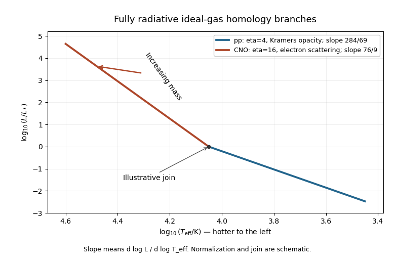

<h1 id="2/solution">Solution</h1>

↑ **Parent:** [2](../2.md)

In [stellar homology](../../../../../stellar-homology.md), the dimensionless radial profiles are the same after scaling radius, [enclosed mass](../../../../../enclosed-mass.md), [pressure](../../../../../pressure.md), [temperature](../../../../../temperature.md) and [luminosity](../../../../../luminosity.md). At corresponding radii let $r'=\xi r$, $m_r'=m m_r$, $T'=tT$, $P'=pP$ and $L_r'=lL_r$. The printed $R'=\xi r$ is understood as this local radial scaling, with surface radius $R'=\xi R$.

Let $q=\rho'/\rho$ and keep composition, [opacity](../../../../../opacity.md) coefficient and nuclear coefficient fixed first. [Mass conservation](../../../../../mass-conservation.md) gives $q=m/\xi^3$, and [hydrostatic equilibrium](../../../../../hydrostatic-equilibrium.md) gives $p=mq/\xi=m^2/\xi^4$. The [ideal gas](../../../../../ideal-gas.md) law then gives $t=p/q=m/\xi$. Scaling the [stellar energy-generation rate](../../../../../stellar-energy-generation-rate.md) equation and the [stellar radiative temperature gradient](../../../../../stellar-radiative-temperature-gradient.md) gives respectively

$$
l=\xi^3q^2t^\eta=m^{\eta+2}\xi^{-(\eta+3)},\qquad
l=\xi t^{4-\nu}q^{-(\lambda+1)}
=m^{3-\lambda-\nu}\xi^{3\lambda+\nu}.
$$

The second follows from $dT/dr\propto-\kappa\rho L_r/(r^2T^3)$, not from energy production. Equating the two [luminosity](../../../../../luminosity.md) scalings gives

$$
\boxed{R\propto M^X,\quad
X=\frac{\eta+\lambda+\nu-1}{\eta+3\lambda+\nu+3},\qquad
L\propto M^Y,\quad Y=\eta+2-(\eta+3)X.}
$$

This assumes the denominator is nonzero and a consistent homologous family exists. If the [mean molecular weight](../../../../../mean-molecular-weight.md) differs by $u=\mu'/\mu$, then $t=um/\xi$ and

$$
\xi^{\eta+3\lambda+\nu+3}
=u^{\eta+\nu-4}m^{\eta+\lambda+\nu-1}.
$$

Ratios of the [opacity](../../../../../opacity.md) and energy-generation coefficients multiply the right-hand side. Thus fixed composition is a real restriction, not an automatic property of every stellar sequence.

Use the [Stefan–Boltzmann law](../../../../../stefan-boltzmann-law.md) $L=4\pi R^2\sigma T_{\rm eff}^4$ to locate the family on a [Hertzsprung-Russell diagram](../../../../../hertzsprung-russell-diagram.md). It implies $T_{\rm eff}\propto M^{(Y-2X)/4}$ and

$$
\boxed{\frac{d\log L}{d\log T_{\rm eff}}=\frac{4Y}{Y-2X}.}
$$

For [proton–proton chain](../../../../../proton-proton-chain.md) burning take the usual local approximation $\eta=4$, with [Kramers' opacity law](../../../../../kramers-opacity-law.md) $\lambda=1$, $\nu=-7/2$. Then

$$
\boxed{R\propto M^{1/13},\quad L\propto M^{71/13},\quad
T_{\rm eff}\propto M^{69/52},\quad
\frac{d\log L}{d\log T_{\rm eff}}=\frac{284}{69}\simeq4.12.}
$$

For the [CNO cycle](../../../../../cno-cycle.md) with [electron-scattering opacity](../../../../../electron-scattering-opacity.md), $\lambda=\nu=0$, so

$$
\boxed{R\propto M^{(\eta-1)/(\eta+3)},\quad L\propto M^3,\quad
\frac{d\log L}{d\log T_{\rm eff}}=\frac{12(\eta+3)}{\eta+11}.}
$$

A conventional local choice $\eta=16$ gives $R\propto M^{15/19}$ and slope **$76/9\simeq8.44$**. Choosing $\eta=17$ instead gives slope $60/7\simeq8.57$. The source specifies no numerical nuclear exponents, and the effective exponent changes with [temperature](../../../../../temperature.md); the general expression is the unambiguous answer.

**[Figure 1](#2/image-idealized-radiative-homology-branches-on-a-hertzsprung-russell-diagram-with-pp-exponent-4-and-cno-exponent-16). Idealized radiative homology branches on a Hertzsprung-Russell diagram, with pp exponent 4 and CNO exponent 16**.

The [Hertzsprung-Russell diagram](../../../../../hertzsprung-russell-diagram.md) places hotter stars to the left. Its branches rise toward higher [luminosity](../../../../../luminosity.md) and mass, and the [CNO cycle](../../../../../cno-cycle.md)/[electron-scattering opacity](../../../../../electron-scattering-opacity.md) branch has the steeper logarithmic slope. Their illustrative joining point and normalization are arbitrary because the proportional [opacity](../../../../../opacity.md) and reaction laws do not specify absolute stellar scales. **These are the fully radiative ideal-gas homology predictions**, not exact observed [main sequence](../../../../../main-sequence.md) relations: [convection](../../../../../convection.md) and increasing radiation support limit those assumptions in real stars.

## ↑ Ancestors (10)

1. [2](../2.md)
2. [Paper 55](../../paper-55-split.md)
3. [Iii](../../split.md)
4. [2014](../../../split.md)
5. [Past exam of the mathematics course of the University of Cambridge](../../../../split.md)
6. [Mathematics course of the University of Cambridge](../../../../../mathematics-course-of-the-university-of-cambridge.md)
7. [Course of the University of Cambridge](../../../../../course-of-the-university-of-cambridge.md)
8. [University of Cambridge](../../../../../university-of-cambridge-split.md)
9. [List of universities](../../../../../list-of-universities.md)
10. [Codex Wiki](../../../../../split.md)
