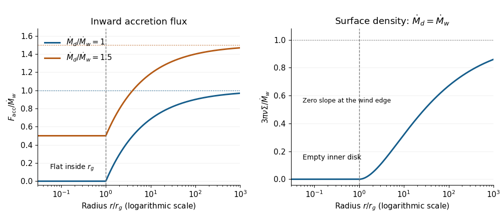

<h1 id="1/c/solution">Solution</h1>

↑ **Parent:** [C](../c.md)

Positive $F_{\mathrm{acc}}$ denotes inward flow. In [steady state](../../../../../../steady-state.md), [mass conservation](../../../../../../mass-conservation.md) gives $dF_{\mathrm{acc}}/dr=2\pi rW$. In the remote-feeding approximation, take the incoming flux at large radius inside the feeding region to approach $\dot M_d$. The cumulative loss exterior to $r\geq r_g$ is $\dot M_w\sqrt{r_g/r}$, so the [steady photoevaporating-disk mass flux](../../../../../../steady-photoevaporating-disk-mass-flux.md) is

$$
\boxed{F_{\mathrm{acc}}(r)=
\begin{cases}
\dot M_d-\dot M_w,&0<r<r_g,\\
\dot M_d-\dot M_w\sqrt{r_g/r},&r\geq r_g.
\end{cases}}
$$

It is constant inside $r_g$, continuous at $r_g$, and increases outwards towards $\dot M_d$. Its right derivative is positive and decreases as $r^{-3/2}$. The curve has a change of slope at $r_g$ because the wind turns on there. Physically less mass survives to cross successively smaller radii, while the inner disk has no wind sink. The star accretes at $\dot M_d-\dot M_w$.

For constant [kinematic viscosity](../../../../../../kinematic-viscosity.md) $\nu$, set $Y=\nu\Sigma\sqrt r$. The supplied [viscous evolution of an accretion disk](../../../../../../viscous-evolution-of-an-accretion-disk.md) relation becomes $Y'=F_{\mathrm{acc}}/(6\pi\sqrt r)$. The [viscous torque in an accretion disk](../../../../../../viscous-torque-in-an-accretion-disk.md) is proportional to $Y$, so the zero-stress condition at the idealized origin sets $Y(0)=0$. Thus

$$
\nu\Sigma(r)\sqrt r=\frac1{6\pi}\int_0^r\frac{F_{\mathrm{acc}}(r')}{\sqrt{r'}}dr'.
$$

For $r<r_g$ the integral is $2(\dot M_d-\dot M_w)\sqrt r$. For $r\geq r_g$, separating the two intervals gives

$$
\int_0^r\frac{F_{\mathrm{acc}}(r')}{\sqrt{r'}}dr'
=2\dot M_d\sqrt r-2\dot M_w\sqrt{r_g}-\dot M_w\sqrt{r_g}\log\frac r{r_g}.
$$

Consequently the [surface density of a steady photoevaporating disk](../../../../../../surface-density-of-a-steady-photoevaporating-disk.md) is

$$
\boxed{\Sigma(r)=\frac1{3\pi\nu}
\begin{cases}
\dot M_d-\dot M_w,&0<r<r_g,\\
\dot M_d-\dot M_w\sqrt{r_g/r}\left(1+\frac12\log(r/r_g)\right),&r\geq r_g.
\end{cases}}
$$

Both the density and its first derivative match at $r_g$. Let $x=r/r_g$ and take the special case $\dot M_d=\dot M_w$. Then $\Sigma=0$ throughout the inner disk, while outside

$$
\frac{3\pi\nu\Sigma}{\dot M_w}=1-\frac{1+\frac12\log x}{\sqrt x},\qquad
\frac{d}{dx}\left(\frac{3\pi\nu\Sigma}{\dot M_w}\right)=\frac{\log x}{4x^{3/2}}>0.
$$

The profile leaves zero with zero slope at $x=1$, rising as $(x-1)^2/8$ locally, and approaches $\dot M_w/(3\pi\nu)$ from below at large radius. The requested sketches are:

**[Figure 1](#1/c/image-steady-photoevaporating-disk-inward-mass-flux-and-the-surface-density-when-feeding-balances-wind-loss). Steady photoevaporating-disk inward mass flux and the surface density when feeding balances wind loss**.

The analytic profiles describe the region interior to a distant feeding boundary. A finite outer radius and the disk outside the feeding point need additional boundary conditions. For example, if the wind is truncated at $R\gg r_g$ and $F_{\mathrm{acc}}(R)=\dot M_d$, the exact interior formulas above replace $\dot M_d$ by $\dot M_d+\dot M_w\sqrt{r_g/R}$; the total wind inside $R$ is $\dot M_w(1-\sqrt{r_g/R})$. The displayed profiles are their remote-boundary limit. Extending the prescribed wind to infinity is useful for estimating mass loss but is not a complete global angular-momentum boundary condition for a finite feeding radius.

As the viscous supply decreases towards the wind rate, the inner accretion flux approaches zero. Wind removal near $r_g$ can cut off replenishment of the inner disk, which then drains on its own [viscous timescale](../../../../../../viscous-timescale.md), leaving a gap or inner hole. This is [photoevaporative gap opening](../../../../../../photoevaporative-gap-opening.md). If supply falls below wind loss, the formal steady profile would require negative inner density and is unphysical; time-dependent depletion must replace it. The exposed outer edge may then be removed rapidly. Equality of the two rates indicates the onset of rapid clearing, rather than a negative steady surface density.

## ↑ Ancestors (11)

1. [C](../c.md)
2. [1](../../1.md)
3. [Paper 57](../../../paper-57-split.md)
4. [Iii](../../../split.md)
5. [2014](../../../../split.md)
6. [Past exam of the mathematics course of the University of Cambridge](../../../../../split.md)
7. [Mathematics course of the University of Cambridge](../../../../../../mathematics-course-of-the-university-of-cambridge.md)
8. [Course of the University of Cambridge](../../../../../../course-of-the-university-of-cambridge.md)
9. [University of Cambridge](../../../../../../university-of-cambridge-split.md)
10. [List of universities](../../../../../../list-of-universities.md)
11. [Codex Wiki](../../../../../../split.md)
