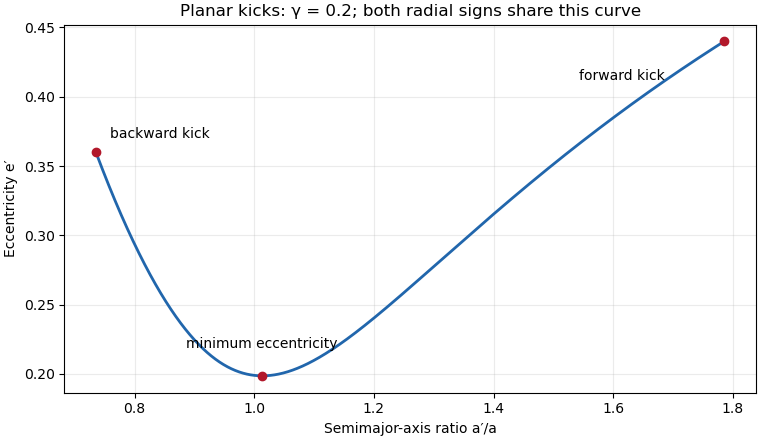
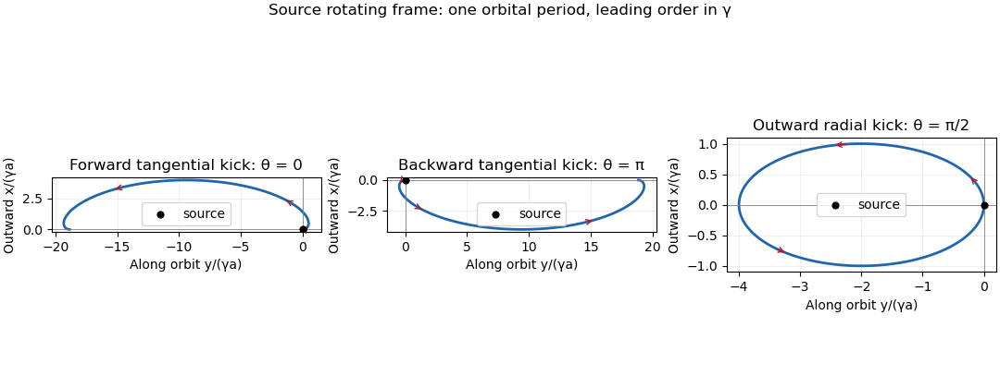

<h1 id="2/solution">Solution</h1>

↑ **Parent:** [2](../2.md)

**[Specific orbital energy](../../../../../specific-orbital-energy.md), [orbital eccentricity](../../../../../orbital-eccentricity.md) and the distribution.** Let $\mu=GM_\star$, $v_K=\sqrt{\mu/a}$ and $c=\cos\theta$. Choose positive $\sin\theta$ to mean an outward radial kick. At release the tangential and radial [velocities](../../../../../velocity.md) are $v_t=v_K(1+\gamma c)$ and $v_r=\gamma v_K\sin\theta$. The [specific orbital energy](../../../../../specific-orbital-energy.md) and [specific angular momentum](../../../../../specific-angular-momentum.md) are

$$
\varepsilon'=\frac{\mu}{2a}(-1+2\gamma c+\gamma^2),\qquad h'=av_K(1+\gamma c).
$$

Using $\varepsilon'=-\mu/(2a')$ and $e'^2=1+2\varepsilon'h'^2/\mu^2$ therefore gives

$$
\boxed{\frac{a'}a=\frac1{1-2\gamma c-\gamma^2},\qquad
 e'^2=1-(1-2\gamma c-\gamma^2)(1+\gamma c)^2.}
$$

The denominator must be positive for an [elliptic Kepler orbit](../../../../../elliptic-orbit.md). A vanishing denominator describes a [parabolic Kepler orbit](../../../../../parabolic-trajectory.md); negative $a'$ is the signed [semi-major axis](../../../../../semi-major-axis.md) of a [hyperbolic Kepler orbit](../../../../../hyperbolic-kepler-orbit.md).

Differentiating the squared [orbital eccentricity](../../../../../orbital-eccentricity.md) gives

$$
\frac{d(e'^2)}{dc}=2\gamma^2(3c+\gamma)(1+\gamma c).
$$

In the small-kick regime $0<\gamma<1$, $1+\gamma c>0$. Thus the minimum is at $c=-\gamma/3$, with

$$
\boxed{e'_{\min}=\gamma\sqrt{1-\frac{\gamma^2}{3}+\frac{\gamma^4}{27}},\qquad
\left.\frac{a'}a\right|_{e'_{\min}}=\frac1{1-\gamma^2/3}.}
$$

The entire expression, including the $\gamma^4/27$ term, lies under the square root in the PDF. This minimum is not a universal statement for arbitrary kick size. For example $\gamma=2$, $c=-1$ reverses the circular velocity and gives a retrograde [circular orbit](../../../../../circular-orbit.md) with $e'=0$; the displayed stationary value is then not the global minimum.

For $0<\gamma<\sqrt2-1$, every kick direction gives a bound prograde [Kepler orbit](../../../../../kepler-orbit.md). The two endpoint maxima, one at each end of the accessible curve, are

$$
\begin{array}{c|c|c}
 c&a'/a&e'\\ \hline
 -1&(1+2\gamma-\gamma^2)^{-1}&2\gamma-\gamma^2\\
 +1&(1-2\gamma-\gamma^2)^{-1}&2\gamma+\gamma^2 .
\end{array}
$$

The positive endpoint is the global maximum. There is one interior minimum, at the location just found. Uniform $\theta$ gives the [kick-orbit distribution](../../../../../kick-orbit-distribution.md)

$$
f_c(c)=\frac1{\pi\sqrt{1-c^2}},\qquad
f_\alpha(\alpha)=\frac1{2\pi\gamma\alpha^2\sqrt{1-c(\alpha)^2}},\qquad
c(\alpha)=\frac{1-\gamma^2-\alpha^{-1}}{2\gamma},\quad \alpha=\frac{a'}a.
$$

Both signs of the radial kick occupy the same $e'$–$a'/a$ curve; they have opposite apsidal orientations. The distribution is concentrated near its endpoints, with integrable square-root singularities. For larger kicks retain the parametric curve and its bound portion $c<(1-\gamma^2)/(2\gamma)$; an unbound branch begins at $e'=1$, $a'/a\to\pm\infty$. In particular, a sketch of a wholly elliptic population presupposes the bound-kick restriction above.

**[Figure 1](#2/image-eccentricity-and-semimajor-axis-distribution-for-isotropic-planar-velocity-kicks-of-magnitude-0-2-times-the-circular-speed). Eccentricity and semimajor-axis distribution for isotropic planar velocity kicks of magnitude 0.2 times the circular speed**.

The [eccentricity vector](../../../../../eccentricity-vector.md) at release has radial component $v_t^2/v_K^2-1$ and tangential component $-v_rv_t/v_K^2$. With the release radius chosen as zero longitude,

$$
\boxed{e'\cos\varpi'=\gamma c(2+\gamma c),\qquad
 e'\sin\varpi'=-\gamma\sin\theta(1+\gamma c).}
$$

This also directly verifies the squared [orbital eccentricity](../../../../../orbital-eccentricity.md) above and fixes the sign convention for the [longitude of periapsis](../../../../../longitude-of-periapsis.md).

**The 1:1 encounter window.** Exact equality of [orbital periods](../../../../../orbital-period.md) requires $a'=a$, hence $c_0=-\gamma/2$. There are two kick directions with this cosine when $0<\gamma<2$. To quantify a finite window one must specify a return time: near exact commensurability, consider the particle's first complete return to its release point. During that time the source advances through $2\pi(a'/a)^{3/2}$. Its longitudinal miss distance is, to first order,

$$
d\simeq2\pi a\left|\left(\frac{a'}a\right)^{3/2}-1\right|
\simeq3\pi a\left|\frac{a'}a-1\right|.
$$

Thus $d<\Delta$ gives the two-sided cosine window

$$
|c-c_0|<\frac{\Delta}{6\pi a\gamma}.
$$

Integrating $f_c$ over that window gives, to leading order for a narrow window away from $\gamma=2$,

$$
\boxed{f_{\mathrm{return}}\simeq\frac{\Delta}{3\pi^2a\gamma\sqrt{1-\gamma^2/4}}.}
$$

The printed fraction is half this value. It is obtained by retaining only one side of the [semi-major axis](../../../../../semi-major-axis.md) window, or only one of the two kick-angle branches. Neither restriction is in the question. Thus the printed coefficient cannot be shown for the stated uniform $0\leq\theta<2\pi$ population and a symmetric first-return distance criterion. This already exhibits the discrepancy under the usual longitudinal approximation; minimizing the distance over the encounter interval introduces a further velocity-direction correction, not a missing branch. With arbitrarily long observation times, noncommensurate bound trajectories can also return arbitrarily close to the common release point, so an eventual-encounter fraction is a different, time-dependent question.

**Rotating-frame sketches.** In the [rotating reference frame](../../../../../rotating-reference-frame.md) of the source put $x$ radially outward, $y$ along the source's motion and $s=nt$, where $n=v_K/a$. The linear [Hill equations](../../../../../hill-equations.md) for a stellar [Kepler orbit](../../../../../kepler-orbit.md), with initial displacement zero, give the [velocity-kick epicycle](../../../../../velocity-kick-epicycle.md)

$$
\boxed{\begin{aligned}
\frac{x}{\gamma a}&=2\cos\theta(1-\cos s)+\sin\theta\sin s,\\
\frac{y}{\gamma a}&=\cos\theta(4\sin s-3s)+2\sin\theta(\cos s-1).
\end{aligned}}
$$

These solve $\ddot x-2n\dot y-3n^2x=0$, $\ddot y+2n\dot x=0$ and reproduce the initial kick. For $\theta=0$, the particle starts forward, moves outward and drifts backward; the curve has a loop each orbital cycle, with net $\Delta y=-6\pi\gamma a$ per cycle. For $\theta=\pi$, both coordinates reverse: it moves inward and drifts forward by $6\pi\gamma a$. For $\theta=\pi/2$, the leading trajectory is a closed [epicyclic ellipse](../../../../../epicyclic-ellipse.md),

$$
\left(\frac{x}{\gamma a}\right)^2+
\left(\frac{y+2\gamma a}{2\gamma a}\right)^2=1.
$$

It starts at the top of the ellipse moving radially outward and returns to the source after one period to this order. Its exact [semi-major axis](../../../../../semi-major-axis.md) differs from $a$ at order $\gamma^2$, so exact closure is not implied. The local sketches require $|x|,|y|\ll a$, in particular $\gamma s\ll1$ for the drifting cases.

**[Figure 2](#2/image-particle-trajectories-after-tangential-prograde-tangential-retrograde-and-outward-radial-kicks-in-the-source-rotating-frame). Particle trajectories after tangential prograde, tangential retrograde and outward radial kicks in the source rotating frame**.

## ↑ Ancestors (10)

1. [2](../2.md)
2. [Paper 59](../../paper-59-split.md)
3. [Iii](../../split.md)
4. [2014](../../../split.md)
5. [Past exam of the mathematics course of the University of Cambridge](../../../../split.md)
6. [Mathematics course of the University of Cambridge](../../../../../mathematics-course-of-the-university-of-cambridge.md)
7. [Course of the University of Cambridge](../../../../../course-of-the-university-of-cambridge.md)
8. [University of Cambridge](../../../../../university-of-cambridge-split.md)
9. [List of universities](../../../../../list-of-universities.md)
10. [Codex Wiki](../../../../../split.md)
