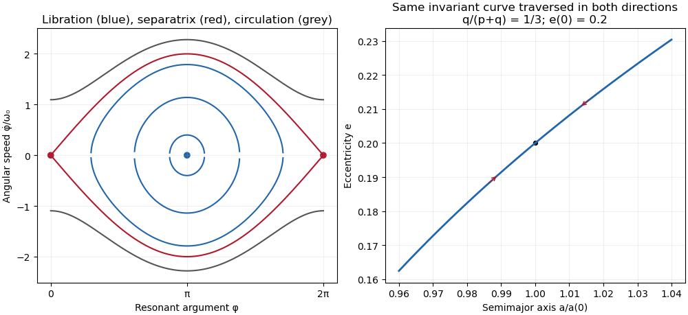

<h1 id="3/solution">Solution</h1>

↑ **Parent:** [3](../3.md)

**Validity and the complete angular equation.** The [Lagrange planetary equations](../../../../../lagrange-planetary-equations.md) here describe a planar, circular-planet, small-[orbital eccentricity](../../../../../orbital-eccentricity.md), weakly perturbed [exterior mean-motion resonance](../../../../../exterior-mean-motion-resonance.md). Require $M_{\rm pl}/M_\star\ll1$, $e\ll1$, one isolated slowly varying [resonant argument](../../../../../resonant-argument.md), perturbation times long compared with an [orbital period](../../../../../orbital-period.md), and no close planetary encounters. Other resonant harmonics and short-period terms must be negligible; coefficients may be frozen only across a narrow range of [semi-major axis](../../../../../semi-major-axis.md). Take $p>0$, $q=1$ or $2$ in a reduced integer ratio. Exactly $e=0$ makes the [longitude of periapsis](../../../../../longitude-of-periapsis.md) undefined, so the displayed angular variables must then be replaced by nonsingular [eccentricity vector](../../../../../eccentricity-vector.md) components.

Neglecting the perturbation to the accumulated [mean longitude](../../../../../mean-longitude.md) gives $\dot\lambda\simeq n(a)$; this is an accumulated-phase approximation, not differentiation of a fictitious expression $n(t)t$ while discarding $t\dot n$. With $n^2a^3=GM_\star$,

$$
\dot\phi=(p+q)n-pn_{\rm pl}-2qC_s-q^2C_r e^{q-2}\cos\phi.
$$

Differentiating, using $\dot n=-3n\dot a/(2a)$ and the supplied [orbital element](../../../../../orbital-element.md) equations, gives the full result within this constant-coefficient model:

$$
\boxed{\ddot\phi=\left[3(p+q)^2nC_r e^q
+q^3(q-2)C_r^2e^{2q-4}\cos\phi
+q^2C_r e^{q-2}\dot\phi\right]\sin\phi.}
$$

An equivalent formula replaces the last two terms in brackets by $q^2C_r e^{q-2}[(p+q)n-pn_{\rm pl}-2qC_s]-2q^3C_r^2e^{2q-4}\cos\phi$. No derivatives of $C_r,C_s$ are included because they were specified as constants.

A full [fixed point](../../../../../fixed-point.md) requires $\sin\phi=0$ and $\dot\phi=0$. Hence $\phi_*=0$ or $\pi$, with its corresponding detuned [semi-major axis](../../../../../semi-major-axis.md) fixed by

$$
(p+q)n_*=pn_{\rm pl}+2qC_s+q^2C_r e_*^{q-2}\cos\phi_*.
$$

At either point $\dot a=\dot e=0$. The [longitude of periapsis](../../../../../longitude-of-periapsis.md) still precesses, so the fixed point refers to the reduced resonant dynamics.

**[Linear stability analysis](../../../../../linear-stability.md) and encounter geometry.** Linearizing the full equation about a fixed point gives

$$
\ddot u=\cos\phi_*\left[3(p+q)^2n_*C_r e_*^q
+q^3(q-2)C_r^2e_*^{2q-4}\cos\phi_*\right]u.
$$

For $q=2$, $\pi$ is a [center equilibrium](../../../../../center-equilibrium.md) and zero is a [saddle equilibrium](../../../../../saddle-equilibrium.md). For $q=1$, $\pi$ is always a [center equilibrium](../../../../../center-equilibrium.md), while zero is a [saddle equilibrium](../../../../../saddle-equilibrium.md) if

$$
3(p+1)^2n_*e_*^3>C_r.
$$

At sufficiently small [orbital eccentricity](../../../../../orbital-eccentricity.md) the full truncated equations instead admit a center at zero as well; equality is a degenerate case requiring higher-order analysis. Thus an unconditional instability claim at zero does not follow from the full equation. In the usual fixed-eccentricity weak-resonance regime the inequality holds and **the stable libration center is $\pi$ for either order**.

The physical explanation is [resonance protection](../../../../../resonance-protection.md). At equal [mean longitudes](../../../../../mean-longitude.md), the conjunction direction relative to [periapsis](../../../../../periapsis.md) obeys $q(\Lambda-\varpi)=\phi$ modulo $2\pi$. For $q=1$, $\phi=0$ places conjunction near [periapsis](../../../../../periapsis.md), where the exterior particle comes closest to the [planet](../../../../../planet.md); $\phi=\pi$ places it near [apoapsis](../../../../../apoapsis.md). For $q=2$, zero includes both apsidal conjunctions, one of them near [periapsis](../../../../../periapsis.md), whereas $\pi$ places the two conjunction branches near quadrature. The protected arrangements give restoring kicks in the positive-$C_r$ leading-harmonic model. This geometric explanation is conditional on its non-crossing, small-[orbital eccentricity](../../../../../orbital-eccentricity.md) approximation; it does not override the low-$e$ term retained in the full stability calculation.

**Small [resonant-argument librations](../../../../../resonant-argument-libration.md).** Define the nominal [resonant semi-major axis](../../../../../resonant-semi-major-axis.md) and the displaced center by

$$
a_r=a_{\rm pl}\left(\frac{p+q}{p}\right)^{2/3},\qquad
n_r=\frac{p}{p+q}n_{\rm pl},\qquad
 a_c=a_r\left[1-\frac{2}{3pn_{\rm pl}}(2qC_s-q^2C_r e_0^{q-2})\right].
$$

This follows by expanding $n=n_r[1-3(a-a_r)/(2a_r)]$ and taking $\cos(\pi+\delta)=-1+O(\delta^2)$. It gives the requested initial [semi-major axis](../../../../../semi-major-axis.md) to first order in the precession-induced detuning; $e_0=e(0)$ and $\delta=\Delta\phi$.

For the [pendulum approximation of a mean-motion resonance](../../../../../pendulum-approximation-of-a-mean-motion-resonance.md), also require fractional changes in $e$ small across a libration, and precession terms small compared with $n$. In particular $C_r/(n_re_0^3)\ll1$ for $q=1$ makes the extra full-equation curvature negligible; for $q=2$, small fractional eccentricity changes require $C_r/(n_re_0^2)\ll1$. Freeze $e=e_0$ in the leading restoring coefficient and set

$$
\boxed{\omega_0^2=3(p+q)^2n_r C_r e_0^q=3p(p+q)n_{\rm pl}C_r e_0^q.}
$$

Then $u=\phi-\pi$ obeys [simple harmonic motion](../../../../../simple-harmonic-motion.md). Using $u(0)=\delta$, $\dot u(0)=0$ and integrating the remaining [Lagrange planetary equations](../../../../../lagrange-planetary-equations.md) gives

$$
\boxed{\begin{aligned}
\phi(t)&=\pi+\delta\cos(\omega_0t),\\
a(t)&=a_c+\frac{2a_r\omega_0\delta}{3pn_{\rm pl}}\sin(\omega_0t),\\
e(t)&=e_0+\frac{qC_r e_0^{q-1}\delta}{\omega_0}\sin(\omega_0t),\\
\varpi(t)&=\varpi_0+(2C_s-qC_r e_0^{q-2})t.
\end{aligned}}
$$

The omitted apsidal modulation comes from higher perturbative orders and $u^2$. All expressions are leading resonant approximations, valid while the omitted fractional changes remain small. The small-libration [phase portrait](../../../../../phase-portrait.md) is

$$
\frac{(\phi-\pi)^2}{\delta^2}+\frac{\dot\phi^2}{\omega_0^2\delta^2}=1,
$$

with period $2\pi/\omega_0$. The [semi-major axis](../../../../../semi-major-axis.md) half-width is $2a_r\omega_0|\delta|/(3pn_{\rm pl})$ and the [orbital eccentricity](../../../../../orbital-eccentricity.md) half-width is $qC_re_0^{q-1}|\delta|/\omega_0$.

Dividing the original $\dot e$ and $\dot a$ equations gives the exact invariant of their retained terms,

$$
\boxed{e^2-e_0^2=\frac{q}{p+q}\log\frac{a}{a(0)}.}
$$

Thus the $e$–$a$ plot is a segment of this increasing curve traversed back and forth, not a closed ellipse. Locally its slope is $q/[2(p+q)e_0a_c]$.

**Finite amplitude and the [separatrix](../../../../../separatrix.md).** Keep the same weak-resonance approximation but allow $\delta$ to be finite. The leading angular equation is $\ddot\phi=\omega_0^2\sin\phi$, or $\ddot u=-\omega_0^2\sin u$. Multiplication by $\dot u$ gives

$$
\boxed{E=\frac12\dot\phi^2+2\omega_0^2\sin^2\frac{\phi-\pi}{2}
=2\omega_0^2\sin^2\frac\delta2.}
$$

This [resonant pendulum energy](../../../../../resonant-pendulum-energy.md) is constant in the [pendulum approximation of a mean-motion resonance](../../../../../pendulum-approximation-of-a-mean-motion-resonance.md). It is not an exact integral of the earlier full equation when $e$ and its restoring coefficient vary: the $\dot\phi\sin\phi$ term alone prevents that conclusion in general.

For $|\delta|<\pi$ the [phase portrait](../../../../../phase-portrait.md) has closed libration curves around $\pi$, with

$$
\dot\phi=\pm2\omega_0\sqrt{\sin^2(\delta/2)-\sin^2((\phi-\pi)/2)},\qquad
T_{\rm lib}=\frac4{\omega_0}K\left(\sin\frac{|\delta|}{2}\right),
$$

where $K$ is the [complete elliptic integral of the first kind](../../../../../complete-elliptic-integral-of-the-first-kind.md). The largest speed is $2\omega_0\sin(|\delta|/2)$ and the leading [semi-major axis](../../../../../semi-major-axis.md) half-width is $4a_r\omega_0\sin(|\delta|/2)/(3pn_{\rm pl})$. As $|\delta|\to\pi$, the energy approaches $2\omega_0^2$, the [separatrix](../../../../../separatrix.md) through the saddles at zero and $2\pi$; the particle spends increasingly long intervals near those saddles. With $\epsilon=\pi-|\delta|$,

$$
T_{\rm lib}\sim\frac4{\omega_0}\log\frac8\epsilon.
$$

At exactly $\delta=\pi$, $\dot\phi=0$, the particle stays at the unstable fixed point in the ideal model. Nonstationary separatrix trajectories approach the saddle only in infinite time; above separatrix energy, the [resonant argument](../../../../../resonant-argument.md) circulates and [resonance protection](../../../../../resonance-protection.md) is lost. These distinctions matter when describing the limiting motion.

**[Figure 3](#3/image-resonant-pendulum-libration-curves-separatrix-and-circulation-with-the-eccentricity-versus-semimajor-axis-invariant). Resonant pendulum libration curves, separatrix and circulation, with the eccentricity versus semimajor-axis invariant**.

## ↑ Ancestors (10)

1. [3](../3.md)
2. [Paper 59](../../paper-59-split.md)
3. [Iii](../../split.md)
4. [2014](../../../split.md)
5. [Past exam of the mathematics course of the University of Cambridge](../../../../split.md)
6. [Mathematics course of the University of Cambridge](../../../../../mathematics-course-of-the-university-of-cambridge.md)
7. [Course of the University of Cambridge](../../../../../course-of-the-university-of-cambridge.md)
8. [University of Cambridge](../../../../../university-of-cambridge-split.md)
9. [List of universities](../../../../../list-of-universities.md)
10. [Codex Wiki](../../../../../split.md)
