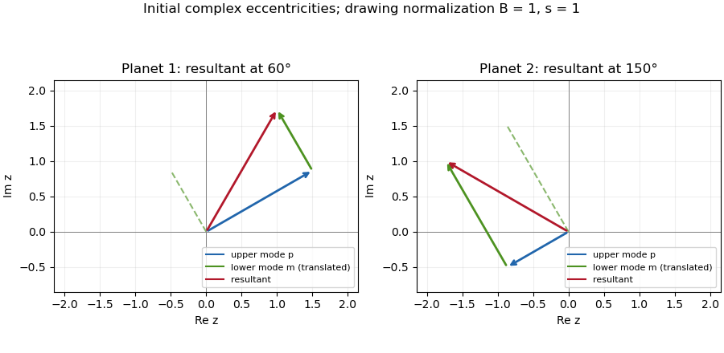

<h1 id="4/solution">Solution</h1>

↑ **Parent:** [4](../4.md)

**[Eigenfrequencies](../../../../../eigenfrequency.md) and mode geometry.** Write $d=A_{11}-A_{22}$ and $D=\sqrt{d^2+4A_{12}A_{21}}>0$. The [characteristic polynomial](../../../../../characteristic-polynomial.md) is $\lambda^2-(A_{11}+A_{22})\lambda+A_{11}A_{22}-A_{12}A_{21}$. Therefore the two distinct real [eigenvalues](../../../../../eigenvalue.md) are

$$
\boxed{\lambda_p=\frac{A_{11}+A_{22}+D}{2},\qquad
\lambda_m=\frac{A_{11}+A_{22}-D}{2}.}
$$

The sign assumptions imply $\lambda_p>\max(A_{11},A_{22})$ and $\lambda_m<\min(A_{11},A_{22})$; they do not alone imply $\lambda_m>0$. A positive lower frequency additionally requires $\det A>0$, as in the usual nondegenerate physical [Laplace-Lagrange secular matrix](../../../../../laplace-lagrange-secular-matrix.md).

Distinct [eigenvalues](../../../../../eigenvalue.md) give an [eigenbasis](../../../../../eigenbasis.md), and each [secular eigenmode](../../../../../secular-eigenmode.md) evolves by multiplication by $e^{i\lambda t}$. Hence

$$
z_j(t)=e_{jp}e^{i(\phi_{jp}+\lambda_pt)}+e_{jm}e^{i(\phi_{jm}+\lambda_mt)},
$$

with nonnegative amplitudes and initial phases. The second row of each [eigenvalue equation](../../../../../eigenvalue-equation.md) gives $z_1/z_2=(\lambda-A_{22})/A_{21}$. For the upper [eigenvalue](../../../../../eigenvalue.md) this ratio is negative, whereas for the lower one it is positive. Thus

$$
\boxed{\begin{aligned}
r_p=\frac{e_{1p}}{e_{2p}}&=\frac{A_{22}-\lambda_p}{A_{21}},&\phi_{1p}&=\phi_{2p}+\pi,\\
r_m=\frac{e_{1m}}{e_{2m}}&=\frac{\lambda_m-A_{22}}{A_{21}},&\phi_{1m}&=\phi_{2m}.
\end{aligned}}
$$

The upper [secular eigenmode](../../../../../secular-eigenmode.md) has anti-aligned apsides, and the lower has aligned apsides. If one amplitude vanishes, its phase is immaterial.

**The initial vector sums.** The planet-1 modal vectors point at $30^\circ$ and $120^\circ$. Their resultant at $60^\circ$ requires $e_{1p}=\sqrt3e_{1m}$. The planet-2 vectors point at $210^\circ$ and $120^\circ$; their resultant at $150^\circ$ requires $e_{2m}=\sqrt3e_{2p}$. These follow by resolving components perpendicular to each resultant. In particular the specified phases constrain the matrix: $r_p/r_m=3$. They cannot be imposed on an arbitrary matrix satisfying only the sign assumptions.

Put $s=r_pr_m=A_{12}/A_{21}$ and let $B=e_{2p}>0$. For a matrix compatible with those phases,

$$
\begin{aligned}
z_1(t)&=B\sqrt s\left[\sqrt3e^{i(\pi/6+\lambda_pt)}+e^{i(2\pi/3+\lambda_mt)}\right],\\
z_2(t)&=B\left[e^{i(7\pi/6+\lambda_pt)}+\sqrt3e^{i(2\pi/3+\lambda_mt)}\right].
\end{aligned}
$$

At zero the resultants have lengths $2B\sqrt s$ and $2B$ and precisely the specified [longitudes of periapsis](../../../../../longitude-of-periapsis.md). The diagram uses $B=1$, $s=1$ as a drawing normalization, not as an additional assumption on the physical planets.

**[Figure 4](#4/image-initial-secular-eigenmode-vectors-and-their-resultants-at-apsidal-longitudes-60-and-150-degrees). Initial secular eigenmode vectors and their resultants at apsidal longitudes 60 and 150 degrees**.

Each modal vector rotates counterclockwise if its [eigenvalue](../../../../../eigenvalue.md) is positive; their sum executes a beat at frequency $D=\lambda_p-\lambda_m$. For these phases,

$$
\boxed{e_1^2(t)=sB^2[4+2\sqrt3\sin(Dt)],\qquad
e_2^2(t)=B^2[4-2\sqrt3\sin(Dt)].}
$$

The [orbital eccentricities](../../../../../orbital-eccentricity.md) exchange their maxima and minima, with respective ranges $B\sqrt s(\sqrt3-1)$ to $B\sqrt s(\sqrt3+1)$ and $B(\sqrt3-1)$ to $B(\sqrt3+1)$. The [longitude of periapsis](../../../../../longitude-of-periapsis.md) is the argument of each displayed vector sum; it does not in general advance uniformly at either individual [eigenfrequency](../../../../../eigenfrequency.md). The [complex eccentricity](../../../../../complex-eccentricity.md) trajectories are generally quasiperiodic; they close only for commensurate modal frequencies. This example has a dominating upper mode in [planet](../../../../../planet.md) 1 and a dominating lower mode in [planet](../../../../../planet.md) 2, so their apsidal phases have different winding rates.

**Amplitude product and the angular-momentum convention.** Since $(\lambda_p-A_{22})(\lambda_m-A_{22})=-A_{12}A_{21}$,

$$
\boxed{r_pr_m=-\frac{(\lambda_p-A_{22})(\lambda_m-A_{22})}{A_{21}^2}
=\frac{A_{12}}{A_{21}}.}
$$

Under the ratio supplied in the paper, this is approximately $L_1/L_2$, to the same accuracy as that supplied ratio. There is a physical convention issue: with the usual planet labels and $L_j=m_j\sqrt{GM_\star a_j}$, conservation of quadratic [angular momentum deficit](../../../../../angular-momentum-deficit.md) requires $L_1A_{12}=L_2A_{21}$, giving $A_{12}/A_{21}=L_2/L_1$. This follows directly by differentiating $\frac12(L_1|z_1|^2+L_2|z_2|^2)$. Thus the paper's stated angular-momentum ratio is reversed for the conventional column-vector equation $\dot z=iAz$. The exact algebraic product above is independent of that naming discrepancy.

**[Tidal dissipation](../../../../../tidal-dissipation.md) and damping.** Assume the [tidal dissipation](../../../../../tidal-dissipation.md) contributes only the specified linear [eccentricity damping](../../../../../eccentricity-damping.md), without changing the conservative matrix or adding apsidal precession. Then

$$
\dot z=iA'z,\qquad
\boxed{A'=A+\frac{i}{\tau}\begin{pmatrix}1&0\\0&0\end{pmatrix}.}
$$

The plus sign in $A'$ is crucial: multiplication by $i$ produces the negative real damping rate. Its exact [eigenvalues](../../../../../eigenvalue.md) are

$$
\boxed{\lambda'_{p,m}=\frac12\left[A_{11}+A_{22}+\frac{i}{\tau}
\ \pm\sqrt{\left(d+\frac{i}{\tau}\right)^2+4A_{12}A_{21}}\right].}
$$

The square-root branch is chosen to approach $D>0$ as $\tau\to\infty$. With $D\tau\gg1$, their first-order imaginary parts are

$$
\lambda'_p=\lambda_p+i g_p+O(\tau^{-2}),\quad
\lambda'_m=\lambda_m+i g_m+O(\tau^{-2}),\qquad
\boxed{g_p=\frac1{2\tau}\left(1+\frac dD\right),\quad
g_m=\frac1{2\tau}\left(1-\frac dD\right).}
$$

Both $g_p,g_m$ are positive because $D>|d|$, so both [secular eigenmodes](../../../../../secular-eigenmode.md) decay as $e^{-g_{p,m}t}$, although only [planet](../../../../../planet.md) 1 feels direct [eccentricity damping](../../../../../eccentricity-damping.md). The coupling transmits that damping to [planet](../../../../../planet.md) 2. Their precession frequencies change only at second order; their [eigenvectors](../../../../../eigenvector.md) acquire small complex corrections, so exact alignment or anti-alignment becomes a small apsidal phase lag. The more slowly damped mode eventually dominates, unless its initial coefficient vanishes: it is the lower aligned mode for $d>0$ and the upper anti-aligned mode for $d<0$. At $d=0$ both leading damping rates equal $1/(2\tau)$.

The stated slow-secular condition presumes a nonzero positive $\lambda_m$. It need not imply $D\tau\gg1$ near a nearly degenerate pair, so the exact square-root formula is the appropriate answer there. Exceptionally, the discriminant vanishes at $d=0$, $4A_{12}A_{21}=\tau^{-2}$; then a [generalized eigenvector](../../../../../generalized-eigenvector.md) supplies a $t e^{i\lambda't}$ term. There is still decay. Indeed positive diagonal weights satisfying $w_1A_{12}=w_2A_{21}$ give

$$
\frac{d}{dt}\left(w_1|z_1|^2+w_2|z_2|^2\right)=-\frac{2w_1}{\tau}|z_1|^2\leq0.
$$

Nonzero off-diagonal coupling excludes a nondecaying mode supported solely on [planet](../../../../../planet.md) 2. This checks the damping signs without relying on the weak-damping expansion.

## ↑ Ancestors (10)

1. [4](../4.md)
2. [Paper 59](../../paper-59-split.md)
3. [Iii](../../split.md)
4. [2014](../../../split.md)
5. [Past exam of the mathematics course of the University of Cambridge](../../../../split.md)
6. [Mathematics course of the University of Cambridge](../../../../../mathematics-course-of-the-university-of-cambridge.md)
7. [Course of the University of Cambridge](../../../../../course-of-the-university-of-cambridge.md)
8. [University of Cambridge](../../../../../university-of-cambridge-split.md)
9. [List of universities](../../../../../list-of-universities.md)
10. [Codex Wiki](../../../../../split.md)
