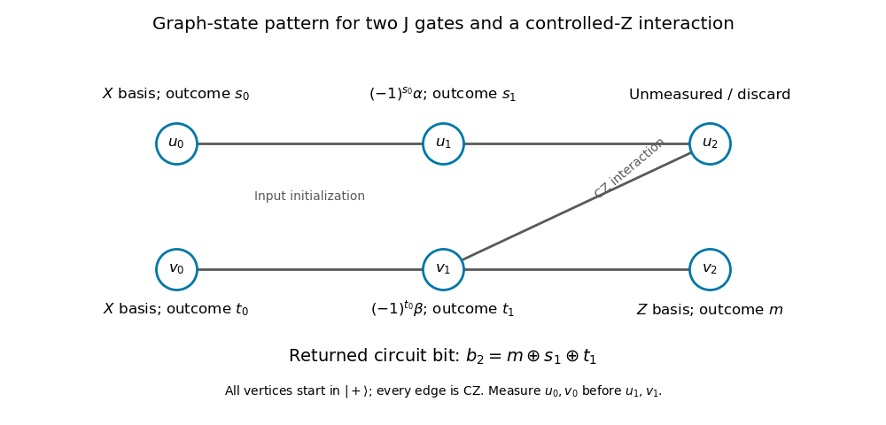

# Paper 61

↑ **Parent:** [Iii](../iii.md)

[https://www.maths.cam.ac.uk/postgrad/part-iii/files/pastpapers/2014/paper_61.pdf](https://www.maths.cam.ac.uk/postgrad/part-iii/files/pastpapers/2014/paper_61.pdf)

**Table of contents**

- [1](#1)
  - [a](#1/a)
    - [Solution](#1/a/solution)
  - [b](#1/b)
    - [i](#1/b/i)
      - [Solution](#1/b/i/solution)
    - [ii](#1/b/ii)
      - [Solution](#1/b/ii/solution)
- [2](#2)
  - [i](#2/i)
    - [Solution](#2/i/solution)
  - [ii](#2/ii)
    - [Solution](#2/ii/solution)
  - [iii](#2/iii)
    - [Solution](#2/iii/solution)
  - [iv](#2/iv)
    - [Solution](#2/iv/solution)
- [3](#3)
  - [i](#3/i)
    - [Solution](#3/i/solution)
  - [ii](#3/ii)
    - [Solution](#3/ii/solution)
  - [iii](#3/iii)
    - [Solution](#3/iii/solution)
- [4](#4)
  - [a](#4/a)
    - [i](#4/a/i)
      - [Solution](#4/a/i/solution)
    - [ii](#4/a/ii)
      - [Solution](#4/a/ii/solution)
  - [b](#4/b)
    - [Solution](#4/b/solution)

## 1

↑ **Parent:** [Paper 61](paper-61.md)

<h3 id="1/a">a</h3>

↑ **Parent:** [1](#1)

<h4 id="1/a/solution">Solution</h4>

↑ **Parent:** [A](#1/a)

Use the positive-sign [quantum Fourier transform](../../../quantum-theory.md#quantum-fourier-transform)

$$
F_N|x\rangle=\frac1{\sqrt N}\sum_{j=0}^{N-1}e^{2\pi ijx/N}|j\rangle.
$$

Orthogonality of the finite-group characters makes $F_N$ a [unitary operator](../../../vector-space.md#unitary-operator). Here $r$ is the least positive period. The injectivity within one period implies $r\mid N$: write $N=qr+s$, $0\leq s<r$. Periodicity gives $f(s)=f(N)=f(0)$, and injectivity forces $s=0$. Put $L=N/r$.

Start with two available [computational basis](../../../quantum-theory.md#computational-basis) states $|0\rangle|0\rangle$. Apply $F_N$ to the first register and query the [modular-addition quantum oracle](../../../quantum-theory.md#modular-addition-quantum-oracle):

$$
|0\rangle|0\rangle\longmapsto\frac1{\sqrt N}\sum_x|x\rangle|0\rangle
\longmapsto\frac1{\sqrt N}\sum_x|x\rangle|f(x)\rangle.
$$

Measure the second register. For some $t\in\{0,\ldots,r-1\}$, the first register becomes the normalized coset state

$$
\frac1{\sqrt L}\sum_{h=0}^{L-1}|t+hr\rangle.
$$

The [quantum Fourier transform of a periodic coset state](../../../quantum-theory.md#quantum-fourier-transform-of-a-periodic-coset-state) is

$$
\frac1{\sqrt r}\sum_{s=0}^{r-1}e^{2\pi ist/r}\left|\frac{sN}{r}\right\rangle.
$$

Indeed, the inner geometric sum vanishes unless the Fourier label is a multiple of $N/r$. Measuring that label gives $j=sN/r$ for a uniformly random $s$. Compute, by the [Euclidean algorithm](../../../number-theory.md#euclidean-algorithm),

$$
R=\frac{N}{\gcd(j,N)}=\frac{r}{\gcd(s,r)}.
$$

Thus [exact period recovery from a Fourier sample](../../../quantum-theory.md#exact-period-recovery-from-a-fourier-sample) succeeds whenever $s$ is [coprime](../../../number-theory.md#coprime-integers) to $r$, and

$$
\boxed{\Pr(R=r)=\frac{\varphi(r)}r=\Omega\!\left(\frac1{\log\log N}\right)}.
$$

Here $\varphi$ is the [Euler totient function](../../../number-theory.md#euler-totient-function). The classical number-theory input is the [totient lower bound from the Mertens product](../../../analytic-number-theory.md#totient-lower-bound-from-the-mertens-product): for sufficiently large $m$, $\varphi(m)/m\geq c/\log\log m$ for an absolute $c>0$, with the finitely many small cases handled separately. For $r=1$ recovery is certain; for $r=2$ its probability is $1/2$. The useful asymptotic probability statement is a lower bound, hence $\Omega$ notation; it can be much larger for particular periods, for example a prime period.

There is one oracle query, two Fourier transforms and two measurements. The final [greatest common divisor](../../../number-theory.md#greatest-common-divisor) and division use [polynomial time](../../../computer-science.md#polynomial-time) in $\log N$. This meets the specified primitive-operation model without assuming that an arbitrary-$N$ Fourier gate is free in another gate model. If a constant success probability is wanted, repeat independently $O(\log\log N)$ times and return the [least common multiple](../../../number-theory.md#least-common-multiple) of the candidates: each candidate divides $r$, and one successful sample makes that [least common multiple](../../../number-theory.md#least-common-multiple) exactly $r$.

<h3 id="1/b">b</h3>

↑ **Parent:** [1](#1)

<h4 id="1/b/i">i</h4>

↑ **Parent:** [B](#1/b)

<h5 id="1/b/i/solution">Solution</h5>

↑ **Parent:** [I](#1/b/i)

Prepare an additional [qubit](../../../quantum-mechanics.md#qubit) in $|{-}\rangle=(|0\rangle-|1\rangle)/\sqrt2$ by applying $X$ and then the [Hadamard gate](../../../quantum-theory.md#hadamard-gate) to $|0\rangle$. Apply $H^{\otimes n}$ to the data register. The [Boolean quantum oracle](../../../quantum-theory.md#boolean-quantum-oracle) then produces [quantum phase kickback](../../../quantum-theory.md#phase-kickback):

$$
\frac1{\sqrt{2^n}}\sum_x|x\rangle|{-}\rangle
\stackrel{U_f}{\longmapsto}
\frac1{\sqrt{2^n}}\sum_x(-1)^{a\cdot x}|x\rangle|{-}\rangle.
$$

A final [Walsh-Hadamard transform](../../../quantum-theory.md#walsh-hadamard-transform) gives an amplitude for $z$ equal to

$$
\frac1{2^n}\sum_x(-1)^{(a\oplus z)\cdot x}=\delta_{z,a}.
$$

To see this identity, the sum factors over the bits; any position at which $a$ and $z$ differ contributes $1-1=0$. This is [Bernstein-Vazirani phase kickback](../../../quantum-theory.md#bernstein-vazirani-phase-kickback), and its output is

$$
\boxed{|a\rangle|{-}\rangle}.
$$

There is exactly one oracle query, $O(n)$ fixed [quantum gates](../../../quantum-circuit.md#quantum-logic-gate), and no probabilistic intermediate step. The [ancilla qubit](../../../quantum-information-theory.md#ancilla-qubit) can be left in $|A\rangle=|{-}\rangle$ or reset to $|0\rangle$ using its known inverse preparation. The construction includes the case $a=0$.

<h4 id="1/b/ii">ii</h4>

↑ **Parent:** [B](#1/b)

<h5 id="1/b/ii/solution">Solution</h5>

↑ **Parent:** [Ii](#1/b/ii)

The linear decoding must be done coherently, so its output is available inside the next [Boolean quantum oracle](../../../quantum-theory.md#boolean-quantum-oracle) call. Use registers $Z,X$ of $n$ [qubits](../../../quantum-mechanics.md#qubit) and a shared phase [ancilla qubit](../../../quantum-information-theory.md#ancilla-qubit) in $|{-}\rangle$. Define the [Bernstein-Vazirani decoding controlled by a quantum register](../../../quantum-theory.md#bernstein-vazirani-decoding-controlled-by-a-quantum-register)

$$
W_g=(H_Z^{\otimes n}\otimes I_X)\,U_g\,(H_Z^{\otimes n}\otimes I_X).
$$

The [ancilla qubit](../../../quantum-information-theory.md#ancilla-qubit) is implicit. For every computational index $x$, the [Walsh-Hadamard transform](../../../quantum-theory.md#walsh-hadamard-transform) calculation gives

$$
W_g|z\rangle_Z|x\rangle_X|{-}\rangle
=|z\oplus a_x\rangle_Z|x\rangle_X|{-}\rangle.
$$

In particular $W_g^2=I$ on these states. Initialize $Z$ to $|0\rangle$ and $X$ to $H^{\otimes n}|0\rangle$. The three query stages are

$$
\frac1{\sqrt{2^n}}\sum_x|0\rangle|x\rangle|{-}\rangle
\stackrel{W_g}{\longmapsto}
\frac1{\sqrt{2^n}}\sum_x|a_x\rangle|x\rangle|{-}\rangle
\stackrel{U_f}{\longmapsto}
\frac1{\sqrt{2^n}}\sum_x(-1)^{a\cdot x}|a_x\rangle|x\rangle|{-}\rangle
\stackrel{W_g}{\longmapsto}
|0\rangle\frac1{\sqrt{2^n}}\sum_x(-1)^{a\cdot x}|x\rangle|{-}\rangle.
$$

The middle equality uses the matching index $z=a_x$, not a classical guess of that string. The second $W_g$ performs [uncomputation](../../../quantum-theory.md#uncomputation), removing the hidden-string register without losing its phase on $X$. Apply $H^{\otimes n}$ to $X$ to obtain

$$
\boxed{|0\rangle_Z|a\rangle_X|{-}\rangle}.
$$

This requires precisely two queries to $U_g$ and one to $U_f$, and only $O(n)$ additional fixed [quantum gates](../../../quantum-circuit.md#quantum-logic-gate). No measurement of $a_x$ is made: such a measurement would spoil the required coherence. Preparing all registers and the phase [ancilla qubit](../../../quantum-information-theory.md#ancilla-qubit) uses only the initially available zero states.

## 2

↑ **Parent:** [Paper 61](paper-61.md)

<h3 id="2/i">i</h3>

↑ **Parent:** [2](#2)

<h4 id="2/i/solution">Solution</h4>

↑ **Parent:** [I](#2/i)

Assume $|\xi\rangle$ is normalized and the [Hilbert space](../../../hilbert-space.md) has dimension $d$. The rank-one [orthogonal projection](../../../hilbert-space.md#orthogonal-projection) $P=|\xi\rangle\langle\xi|$ satisfies $P^\dagger=P$ and $P^2=P$.

For $d>1$, $P$ has [eigenvalue](../../../linear-operator-theory.md#eigenvalue) zero on the orthogonal complement of $|\xi\rangle$, so it cannot be a [unitary operator](../../../vector-space.md#unitary-operator). The complementary [orthogonal projection](../../../hilbert-space.md#orthogonal-projection) $I-P$ kills $|\xi\rangle$ and is not unitary in any positive dimension. In contrast, the [Householder reflection](../../../linear-algebra.md#householder-transformation)

$$
R=I-2P
$$

is Hermitian and obeys $R^\dagger R=R^2=I-4P+4P^2=I$. Its [eigenvalues](../../../linear-operator-theory.md#eigenvalue) are $-1$ along $|\xi\rangle$ and $+1$ on the orthogonal complement.

**For $d>1$, only $I-2|\xi\rangle\langle\xi|$ is unitary. In the exceptional one-dimensional case, $|\xi\rangle\langle\xi|=I$ is also unitary; its complement remains zero.**

<h3 id="2/ii">ii</h3>

↑ **Parent:** [2](#2)

<h4 id="2/ii/solution">Solution</h4>

↑ **Parent:** [Ii](#2/ii)

Let $\Pi_G$ be the [orthogonal projection](../../../hilbert-space.md#orthogonal-projection) onto the good [vector subspace](../../../vector-space.md#vector-subspace) $G$, and let the normalized input be $|\psi\rangle$. Set $p=\|\Pi_G\psi\|^2=\sin^2\theta$ with $0<\theta<\pi/2$, and define

$$
|g\rangle=\frac{\Pi_G|\psi\rangle}{\sqrt p},\qquad
|b\rangle=\frac{(I-\Pi_G)|\psi\rangle}{\sqrt{1-p}},\qquad
|\psi\rangle=\sin\theta|g\rangle+\cos\theta|b\rangle.
$$

Assuming coherent access to the two reflections, the [amplitude amplification theorem](../../../quantum-theory.md#amplitude-amplification) states that

$$
Q=(2|\psi\rangle\langle\psi|-I)(I-2\Pi_G)
$$

preserves the plane spanned by $|g\rangle,|b\rangle$ and acts as a rotation, giving

$$
\boxed{Q^j|\psi\rangle=\sin((2j+1)\theta)|g\rangle+
\cos((2j+1)\theta)|b\rangle}.
$$

Hence the good-outcome probability is $\sin^2((2j+1)\theta)$. When $p$ is known, choose the nearest nonnegative integer to $\pi/(4\theta)-1/2$. The resulting angle is within $\theta$ of $\pi/2$, so the good probability is at least $\cos^2\theta=1-p$. For small $p$ this is close to one and requires $O(1/\sqrt p)$ iterations. Exact success occurs when $(2j+1)\theta=\pi/2$. Known $p$ also allows [exact amplitude amplification](../../../quantum-theory.md#exact-amplitude-amplification) by [ancilla qubit](../../../quantum-information-theory.md#ancilla-qubit) dilution or selective phase adjustment when ordinary integer iterations would overshoot.

If $|\psi\rangle=A|0\rangle$ has a known coherent preparation, its reflection is implemented with $A$, $A^\dagger$ and a zero-state phase flip. A coherent membership test supplies the reflection about $G$. Merely possessing an unknown copy of $|\psi\rangle$ does not automatically supply its reflection. For $p=1$ the state is already good; for $p=0$ this two-reflection construction cannot generate a good component. These cases delimit the theorem's algorithmic assumptions.

<h3 id="2/iii">iii</h3>

↑ **Parent:** [2](#2)

<h4 id="2/iii/solution">Solution</h4>

↑ **Parent:** [Iii](#2/iii)

Prepare the two data [qubits](../../../quantum-mechanics.md#qubit) in $|s\rangle=\tfrac12\sum_{x\in B_2}|x\rangle$ and a phase [ancilla qubit](../../../quantum-information-theory.md#ancilla-qubit) in $|{-}\rangle$. A single [Boolean quantum oracle](../../../quantum-theory.md#boolean-quantum-oracle) query flips only the marked amplitude. Its success fraction is $p=1/4$, so $\theta=\pi/6$ in [amplitude amplification](../../../quantum-theory.md#amplitude-amplification). The fixed diffusion reflection $D=2|s\rangle\langle s|-I$ gives $\sin(3\theta)=1$ after one iteration.

Directly, after the query the marked amplitude is $-1/2$ and the other three are $1/2$. Their mean is $1/4$. The diffusion reflection replaces each amplitude $c_x$ by $2(1/4)-c_x$, yielding one at the marked input and zero elsewhere. Thus

$$
\boxed{D U_f\bigl(|s\rangle|{-}\rangle\bigr)=|x_*\rangle|{-}\rangle}.
$$

Here $U_f$ is understood with its target [ancilla qubit](../../../quantum-information-theory.md#ancilla-qubit), and $D$ acts only on the data. It is independent of $f$: $D=H^{\otimes2}(2|00\rangle\langle00|-I)H^{\otimes2}$, with the central diagonal gate implementable using two [Pauli Z gates](../../../quantum-theory.md#pauli-z-gate) and one [Controlled-Z gate](../../../quantum-theory.md#controlled-z-gate). Measuring the data in the [computational basis](../../../quantum-theory.md#computational-basis) therefore finds the unique marked string with certainty after one oracle query.

<h3 id="2/iv">iv</h3>

↑ **Parent:** [2](#2)

<h4 id="2/iv/solution">Solution</h4>

↑ **Parent:** [Iv](#2/iv)

Write $Q=2^n$, $t=(p-1)(q-1)$ and $a=t/Q$. The easy starting state is uniform over all $n$-bit labels, so its good fraction is $a$, not $t/N$. For distinct primes one has $a\geq1/4$. If both primes are odd, $t/N\geq(1-1/3)(1-1/5)=8/15$ and $N/Q\geq1/2$, giving $a\geq4/15$. If one prime is two, the other is an odd prime $q$; since $2q$ has $n$ bits, $q>2^{n-2}$, and $t=q-1\geq2^{n-2}=Q/4$.

The [uniform coprime state for a semiprime](../../../quantum-circuit.md#uniform-coprime-state-for-a-semiprime) can now be prepared by one exact Grover rotation. Set

$$
\lambda=\frac{Q}{4t}=\frac1{4a}\leq1,
\qquad |b_\lambda\rangle=\sqrt{1-\lambda}|0\rangle+\sqrt\lambda|1\rangle.
$$

Prepare

$$
|\Psi\rangle=H^{\otimes n}|0^n\rangle\otimes|b_\lambda\rangle.
$$

Use the good subspace spanned by $|k\rangle|1\rangle$ with $1\leq k<N$ and $\gcd(k,N)=1$. Its squared overlap with $|\Psi\rangle$ is exactly $a\lambda=1/4$. The [Euclidean algorithm](../../../number-theory.md#euclidean-algorithm) supplies a [reversible computation](../../../computer-science.md#reversible-computation) of the membership predicate, including the range check; condition a sign flip on membership and the extra [qubit](../../../quantum-mechanics.md#qubit) being one, then uncompute the workspace. This implements $S_G=I-2\Pi_G$.

The starting-state reflection $D_\Psi=2|\Psi\rangle\langle\Psi|-I$ uses the inverse of its known preparation and a reflection on the all-zero state. Applying $D_\Psi S_G$ once invokes [exact amplitude amplification](../../../quantum-theory.md#exact-amplitude-amplification) at $\theta=\pi/6$, and gives

$$
\boxed{D_\Psi S_G|\Psi\rangle
=\frac1{\sqrt t}\sum_{k\in A}|k\rangle|1\rangle
=|\xi\rangle|1\rangle}.
$$

The extra [qubit](../../../quantum-mechanics.md#qubit) factors off, and the arithmetic workspace is returned to zero. Although the stated range includes $N$, that label is not [coprime](../../../number-theory.md#coprime-integers) to itself, so the predicate $k<N$ is equivalent and avoids admitting labels outside the intended range.

The supplied $p,q$ determine $t$ in [polynomial time](../../../computer-science.md#polynomial-time); no factoring procedure is needed. Binary arithmetic, range comparison, the reversible [greatest common divisor](../../../number-theory.md#greatest-common-divisor), the two starting-state reflections and the controlled sign flip all have polynomial-size circuits. Thus the construction takes **polynomial time in $n$ in the ideal model allowing the specified one-qubit state preparation**. Exactness uses the rotation with known amplitudes $\sqrt\lambda,\sqrt{1-\lambda}$; with a fixed finite approximate gate library one obtains arbitrary accuracy with precision overhead, rather than an automatic promise of exact state preparation. In the ideal model the preparation succeeds with certainty, without rejection sampling. If desired, the extra $|1\rangle$ can be reset by a [Pauli X gate](../../../quantum-theory.md#pauli-x-gate).

## 3

↑ **Parent:** [Paper 61](paper-61.md)

<h3 id="3/i">i</h3>

↑ **Parent:** [3](#3)

<h4 id="3/i/solution">Solution</h4>

↑ **Parent:** [I](#3/i)

Let $L=2^n$ and use an $n$-qubit phase register. Begin with $|0^n\rangle|v\rangle$ and apply $H^{\otimes n}$ to the phase register, creating $L^{-1/2}\sum_{m=0}^{L-1}|m\rangle|v\rangle$. Controlled powers implement

$$
|m\rangle|v\rangle\longmapsto|m\rangle U^m|v\rangle
=e^{2\pi im\phi}|m\rangle|v\rangle.
$$

For phase [qubit](../../../quantum-mechanics.md#qubit) $j$, counted from the most significant bit, the controlled power is $U^{2^{n-j}}$. It can be built from $2^{n-j}$ calls to the supplied controlled-$U$ gate. By [quantum phase kickback](../../../quantum-theory.md#phase-kickback), the phase-register state is

$$
\frac1{\sqrt L}\sum_m e^{2\pi imy/L}|m\rangle=F_L|y\rangle.
$$

Apply the inverse [quantum Fourier transform](../../../quantum-theory.md#quantum-fourier-transform) to obtain the [exact quantum phase estimation](../../../quantum-theory.md#exact-quantum-phase-estimation) mapping

$$
\boxed{V:\ |0^n\rangle|v\rangle\longmapsto|y\rangle|v\rangle}.
$$

A [computational basis](../../../quantum-theory.md#computational-basis) measurement of the first register determines $y$ with certainty, hence $\phi=y/L$ and the [eigenvalue](../../../linear-operator-theory.md#eigenvalue) $e^{2\pi i\phi}$. Exactness follows from the promised dyadic phase; no approximation or continued-fraction reconstruction is needed.

With only controlled-$U$ available as a query, the repeated-power construction uses $L-1=2^n-1$ oracle calls. The other Fourier-transform circuitry has polynomial size in $n$ in the ideal phase-gate model. The [cost of exact phase estimation on a dyadic spectrum](../../../quantum-theory.md#cost-of-exact-phase-estimation-on-a-dyadic-spectrum) is therefore not polynomial in $n$ in this primitive-query model unless powered queries have additional implementations. The task does not require such a polynomial bound.

<h3 id="3/ii">ii</h3>

↑ **Parent:** [3](#3)

<h4 id="3/ii/solution">Solution</h4>

↑ **Parent:** [Ii](#3/ii)

Since $U$ is a [unitary operator](../../../vector-space.md#unitary-operator), its [eigenstates](../../../quantum-mechanics.md#eigenstate) form an [orthonormal](../../../linear-algebra.md#orthonormal-set) basis. Expand $|\xi\rangle=\sum_j c_j|v_j\rangle$, with eigenphases $\phi_j=y_j/2^n$. By linearity, the unmeasured [quantum phase estimation](../../../quantum-theory.md#quantum-phase-estimation) output is

$$
\boxed{V\bigl(|0^n\rangle|\xi\rangle\bigr)
=\sum_j c_j|y_j\rangle|v_j\rangle}.
$$

This is generally an [entangled](../../../bell-state.md#entangled-state) state, not a phase label attached to an unchanged pure system state. The distinct [eigenvalues](../../../linear-operator-theory.md#eigenvalue) give distinct phase labels, so a [computational basis](../../../quantum-theory.md#computational-basis) measurement yields $y_j$ with [Born rule](../../../quantum-mechanics.md#born-rule) probability $|c_j|^2$ and leaves $|v_j\rangle$ in the system register. Before measurement, all relative phases remain coherent; that is essential for the following spectral transformation. If phases were degenerate, a measured label would instead select the corresponding eigenspace component.

<h3 id="3/iii">iii</h3>

↑ **Parent:** [3](#3)

<h4 id="3/iii/solution">Solution</h4>

↑ **Parent:** [Iii](#3/iii)

The binary phase is $\phi=0.i_1\cdots i_n=\sum_{j=1}^ni_j2^{-j}$. Therefore

$$
\boxed{\frac{2\pi\phi}{M}=\sum_{j=1}^ni_j\frac{2\pi}{2^jM}}.
$$

On the phase register, apply the [tensor product](../../../linear-algebra.md#tensor-product) of [phase gates](../../../quantum-theory.md#phase-gate)

$$
D_M=\bigotimes_{j=1}^nP\!\left(\frac{2\pi}{2^jM}\right).
$$

Its action on $|y\rangle=|i_1\cdots i_n\rangle$ is multiplication by $e^{2\pi i\phi/M}$. Thus the [positive-phase fractional power of a unitary operator](../../../quantum-theory.md#positive-phase-fractional-power-of-a-unitary-operator) is implemented by [uncomputation](../../../quantum-theory.md#uncomputation) after coherent phase estimation:

$$
|0^n\rangle\sum_jc_j|v_j\rangle
\stackrel V\longmapsto\sum_jc_j|y_j\rangle|v_j\rangle
\stackrel{D_M}\longmapsto\sum_jc_je^{2\pi i\phi_j/M}|y_j\rangle|v_j\rangle
\stackrel{V^\dagger}\longmapsto
|0^n\rangle\sum_jc_je^{2\pi i\phi_j/M}|v_j\rangle.
$$

Hence

$$
\boxed{V^\dagger(D_M\otimes I)V\bigl(|0^n\rangle|\xi\rangle\bigr)
=|0^n\rangle U^{1/M}|\xi\rangle}.
$$

The inverse phase-estimation circuit uses controlled powers of $U^{-1}$ built from the supplied inverse oracle, with all other [quantum gates](../../../quantum-circuit.md#quantum-logic-gate) reversed. No phase-register measurement is made, so arbitrary superpositions are preserved and the [ancilla qubits](../../../quantum-information-theory.md#ancilla-qubit) return to zero. The straightforward implementation uses $2(2^n-1)$ controlled-unitary queries plus the Fourier and phase circuitry; the arbitrary [phase gates](../../../quantum-theory.md#phase-gate) are accepted exactly as stipulated.

The branch convention matters. This construction uses the phase representative $0<\phi<1$ specified here, corresponding to argument in $(0,2\pi)$. It implements that explicitly defined root, even for $\phi>1/2$. The usual complex principal branch with argument in $(-\pi,\pi]$ would choose a different root on some [eigenvalues](../../../linear-operator-theory.md#eigenvalue). No substitution of that alternative branch is implicit.

## 4

↑ **Parent:** [Paper 61](paper-61.md)

<h3 id="4/a">a</h3>

↑ **Parent:** [4](#4)

<h4 id="4/a/i">i</h4>

↑ **Parent:** [A](#4/a)

<h5 id="4/a/i/solution">Solution</h5>

↑ **Parent:** [I](#4/a/i)

The [J gate](../../../bell-state.md#j-gate-in-measurement-based-quantum-computation) is $J(\alpha)=HP(\alpha)$, with $P(\alpha)=\operatorname{diag}(1,e^{i\alpha})$. Prepare a fresh [qubit](../../../quantum-mechanics.md#qubit) in $|+\rangle$ and apply the [Controlled-Z gate](../../../quantum-theory.md#controlled-z-gate) $E$ between it and the input $|\psi\rangle=u|0\rangle+v|1\rangle$. The resulting state is

$$
u|0\rangle|+\rangle+v|1\rangle|-\rangle.
$$

Measure the input in the [equatorial qubit measurement](../../../quantum-measurement.md#equatorial-qubit-measurement) basis $|\alpha_s\rangle=(|0\rangle+(-1)^se^{-i\alpha}|1\rangle)/\sqrt2$. The unnormalized output is

$$
\frac1{\sqrt2}\left(u|+\rangle+(-1)^se^{i\alpha}v|-\rangle\right)
=\frac1{\sqrt2}X^sJ(\alpha)|\psi\rangle.
$$

Each outcome has probability $1/2$. Thus [one-bit teleportation](../../../bell-state.md#one-bit-teleportation) realizes

$$
\boxed{|\psi\rangle\longmapsto X^sJ(\alpha)|\psi\rangle}
$$

on the new [qubit](../../../quantum-mechanics.md#qubit). Apply the known [Pauli X gate](../../../quantum-theory.md#pauli-x-gate) correction $X^s$ for the literal $J(\alpha)$ output, or keep the correction in a [Pauli frame](../../../quantum-circuit.md#pauli-frame) and adapt later measurements. The old [qubit](../../../quantum-mechanics.md#qubit) is measured, so this is not cloning the input.

Direct multiplication of the given matrices gives $J(\alpha)X^s=e^{+is\alpha}Z^sJ((-1)^s\alpha)$. The displayed negative exponent in the supplied relation has the wrong sign for exact matrix equality. The discrepancy is only a [global phase](../../../quantum-mechanics.md#global-phase) in a fixed measurement branch, so it does not change this measurement implementation or its outcome probabilities. The positive-sign identity is used when tracking exact matrices.

<h4 id="4/a/ii">ii</h4>

↑ **Parent:** [A](#4/a)

<h5 id="4/a/ii/solution">Solution</h5>

↑ **Parent:** [Ii](#4/a/ii)

An explicit [measurement-based quantum computation](../../../quantum-circuit.md#measurement-based-quantum-computation) pattern uses six vertices $u_0,u_1,u_2,v_0,v_1,v_2$. Prepare a [graph state](../../../quantum-circuit.md#graph-state) with every vertex in $|+\rangle$ and apply a [Controlled-Z gate](../../../quantum-theory.md#controlled-z-gate) for each edge

$$
(u_0,u_1),\ (u_1,u_2),\ (v_0,v_1),\ (v_1,v_2),\ (u_2,v_1).
$$

The first two links on each wire permit [graph-state preparation of a computational-basis input](../../../bell-state.md#graph-state-preparation-of-a-computational-basis-input) followed by the logical [J gate](../../../bell-state.md#j-gate-in-measurement-based-quantum-computation). Use the following single-qubit measurements:

- Measure $u_0$ and $v_0$ in the $X$ basis, obtaining $s_0,t_0$.
- Measure $u_1$ in the equatorial basis with angle $(-1)^{s_0}\alpha$, obtaining $s_1$.
- Measure $v_1$ in the equatorial basis with angle $(-1)^{t_0}\beta$, obtaining $t_1$.
- Measure $v_2$ in the $Z$ basis, obtaining $m$, and return $b_2=m\oplus s_1\oplus t_1$. The unmeasured $u_2$ can be discarded.

All entangling edges can be made at preparation time because [Controlled-Z gates](../../../quantum-theory.md#controlled-z-gate) commute. A future edge that does not touch a currently measured vertex can equivalently be deferred, which allows the [one-bit teleportation](../../../bell-state.md#one-bit-teleportation) identities to be applied in their logical order.

The two initial $X$ measurements implement $H|+\rangle=|0\rangle$ with [Pauli frames](../../../quantum-circuit.md#pauli-frame) $X^{s_0},X^{t_0}$ on the logical inputs. The first adaptive [J gate](../../../bell-state.md#j-gate-in-measurement-based-quantum-computation) then has output frame $X^{s_1}Z^{s_0}$ on $u_2$. Propagating through $E_{u_2v_1}$ gives frames

$$
X^{s_1}Z^{s_0\oplus t_0}\ \text{on }u_2,
\qquad X^{t_0}Z^{s_1}\ \text{on }v_1,
$$

up to branchwise global phase. The second adaptive [J gate](../../../bell-state.md#j-gate-in-measurement-based-quantum-computation) converts the latter into

$$
X^{t_1\oplus s_1}Z^{t_0}\ \text{on }v_2.
$$

A $Z$ correction does not alter a computational-basis measurement, while an $X$ correction flips its bit. Consequently the deterministic classical postprocessing is

$$
\boxed{b_2=m\oplus s_1\oplus t_1}.
$$

This reproduces the output-bit distribution of the original [quantum circuit](../../../quantum-circuit.md), including its known byproduct corrections.

**[Figure 1](#4/a/ii/image-six-vertex-graph-state-adaptive-equatorial-measurements-and-classical-parity-correction-for-the-two-wire-circuit). Six-vertex graph state, adaptive equatorial measurements and classical parity correction for the two-wire circuit**.

There is an additional simplification for these particular zero inputs. Since $J(\alpha)|0\rangle=|+\rangle$, $E(|+\rangle|0\rangle)=|+\rangle|0\rangle$, and $J(\beta)|0\rangle=|+\rangle$, the exact final state is $|+\rangle|+\rangle$, independently of the angles. The requested bit is therefore fair. A single isolated graph-state vertex measured in $Z$ already simulates that bit distribution; the six-vertex pattern also explicitly realizes the circuit and its corrections.

<h3 id="4/b">b</h3>

↑ **Parent:** [4](#4)

<h4 id="4/b/solution">Solution</h4>

↑ **Parent:** [B](#4/b)

Use the [operator norm](../../../continuous-dual-space.md#operator-norm) induced by the usual vector norm, and assume the input [quantum state](../../../quantum-mechanics.md#quantum-state) is normalized. Since $J(\alpha)=HP(\alpha)$ and the [Hadamard gate](../../../quantum-theory.md#hadamard-gate) is unitary, the [J-gate phase-error operator norm](../../../bell-state.md#j-gate-phase-error-operator-norm) is

$$
\|J(\alpha')-J(\alpha)\|
=\|P(\alpha')-P(\alpha)\|
=|e^{i\alpha'}-e^{i\alpha}|
=2\left|\sin\frac{\alpha'-\alpha}{2}\right|
\leq|\alpha'-\alpha|<\eta.
$$

Write the exact and implemented [quantum circuits](../../../quantum-circuit.md) as ordered products $C=U_m\cdots U_1$ and $C'=U'_m\cdots U'_1$. The [quantum circuit gate-error telescoping bound](../../../quantum-circuit.md#quantum-circuit-gate-error-telescoping-bound) follows from

$$
C'-C=\sum_{j=1}^mU'_m\cdots U'_{j+1}(U'_j-U_j)U_{j-1}\cdots U_1.
$$

Every surrounding factor is unitary, including gates tensored with identities on other [qubits](../../../quantum-mechanics.md#qubit), so the [triangle inequality](../../../topological-analysis.md#triangle-inequality) and the [submultiplicativity of the operator norm](../../../continuous-dual-space.md#submultiplicativity-of-the-operator-norm) give

$$
\|C'-C\|\leq\sum_j\|U'_j-U_j\|<k\eta.
$$

The exact [Controlled-Z gates](../../../quantum-theory.md#controlled-z-gate) contribute zero to that sum. Thus

$$
\||\psi'_{\rm out}\rangle-|\psi_{\rm out}\rangle\|
\leq\|C'-C\|<k\eta,
\qquad
\boxed{0<\eta\leq\frac{\epsilon}{k}\quad(k\geq1)}.
$$

The endpoint $\eta=\epsilon/k$ is sufficient because each implemented angle error is strictly smaller than $\eta$. If $k=0$, the circuits are identical and any positive $\eta$ works. The bound controls the stated vector distance with actual gate phases retained, so no adjustment of the global phase of one output is needed.

## ↑ Ancestors (8)

1. [Iii](../iii.md)
2. [2014](../../2014.md)
3. [Past exam of the mathematics course of the University of Cambridge](../../../past-exam-of-the-mathematics-course-of-the-university-of-cambridge.md)
4. [Mathematics course of the University of Cambridge](../../../university-of-cambridge.md#mathematics-course-of-the-university-of-cambridge)
5. [Course of the University of Cambridge](../../../university-of-cambridge.md#course-of-the-university-of-cambridge)
6. [University of Cambridge](../../../university-of-cambridge.md)
7. [List of universities](../../../README.md#list-of-universities)
8. [Codex Wiki](../../../README.md)
