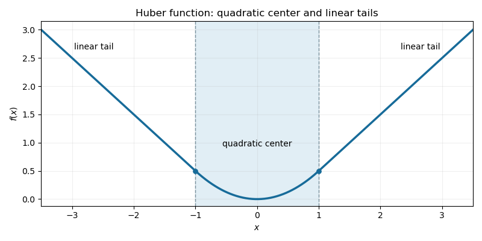

<h1 id="1/c/solution">Solution</h1>

↑ **Parent:** [C](../c.md)

The [conjugate of an infimal convolution](../../../../../../conjugate-of-an-infimal-convolution.md) is the sum of the conjugates:

$$
f^*(p)=\sup_{y,z}\{\langle p,y+z\rangle-g(y)-h(z)\}=g^*(p)+h^*(p).
$$

Here $g^*(p)=\frac12\|p\|_2^2$, and $h^*(p)=\delta_{[-1,1]^n}(p)$, the [indicator functional](../../../../../../indicator-functional-of-a-constraint-set.md) of the unit infinity-norm ball. Thus

$$
f(x)=\sup_{\|p\|_\infty\leq1}\left(\langle p,x\rangle-\frac12\|p\|_2^2\right).
$$

The [infimal convolution](../../../../../../infimal-convolution.md) is finite convex and continuous, so the [Fenchel-Moreau theorem](../../../../../../fenchel-moreau-theorem.md) applies without a closure defect. By equality in the [Fenchel–Young inequality](../../../../../../fenchel-young-inequality.md) and the [subdifferential sum rule](../../../../../../subdifferential-sum-rule.md),

$$
p\in\partial f(x)\quad\Longleftrightarrow\quad x\in\partial(g^*+h^*)(p)
=p+N_{[-1,1]^n}(p).
$$

This is precisely the variational characterization of projecting $x$ onto the cube. Consequently

$$
\boxed{\partial f(x)=\{\operatorname{clip}(x,-1,1)\},\qquad
f(x)=\sum_{i=1}^n\begin{cases}\frac12x_i^2,&|x_i|\leq1,\\|x_i|-\frac12,&|x_i|>1.\end{cases}}
$$

For the primal split, $y_i=\operatorname{clip}(x_i,-1,1)$ and $z_i=\operatorname{sign}(x_i)(|x_i|-1)_+$. These directly minimize the two scalar terms. The [Huber loss](../../../../../../huber-loss.md) is continuously differentiable, including at $x_i=\pm1$, but its second derivative changes there. The one-dimensional sketch shows a quadratic center joined tangentially to linear tails:

**[Figure 1](#1/c/image-the-scalar-huber-function-with-quadratic-center-and-linear-tails-joined-at-minus-one-and-one). The scalar Huber function with quadratic center and linear tails joined at minus one and one**.

Applied to a discrete gradient, the [Huber gradient regularizer](../../../../../../huber-gradient-regularizer.md) penalizes small slopes quadratically and large slopes linearly. Compared with pure squared-gradient smoothing it preserves large edges better; compared with pure [total variation denoising](../../../../../../total-variation-denoising.md) it encourages small smooth variations and reduces the strong preference for piecewise-constant plateaus. It can therefore be useful for denoising signals or images containing both smooth regions and sharp transitions. It still penalizes edges and can bias their amplitude, and it does not guarantee complete elimination of [staircasing in total variation denoising](../../../../../../staircasing-in-total-variation-denoising.md). The unit threshold must be scaled appropriately for data units and grid spacing.

## ↑ Ancestors (11)

1. [C](../c.md)
2. [1](../../1.md)
3. [Paper 65](../../../paper-65-split.md)
4. [Iii](../../../split.md)
5. [2014](../../../../split.md)
6. [Past exam of the mathematics course of the University of Cambridge](../../../../../split.md)
7. [Mathematics course of the University of Cambridge](../../../../../../mathematics-course-of-the-university-of-cambridge.md)
8. [Course of the University of Cambridge](../../../../../../course-of-the-university-of-cambridge.md)
9. [University of Cambridge](../../../../../../university-of-cambridge-split.md)
10. [List of universities](../../../../../../list-of-universities.md)
11. [Codex Wiki](../../../../../../split.md)
