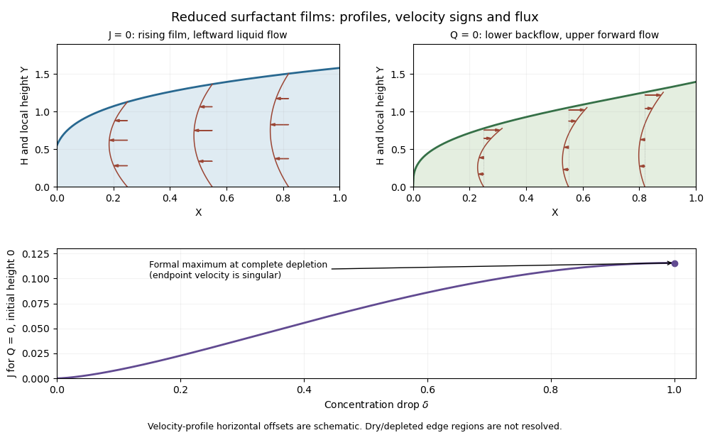

<h1 id="2/ii/solution">Solution</h1>

↑ **Parent:** [Ii](../ii.md)

For zero liquid flux the reduced gradients are $\Gamma_X=-4J/(H\Gamma)$ and $H_X=6J/(H^2\Gamma)$. Their ratio gives

$$
\boxed{\Gamma=B-\frac{H^2}{3},\qquad B=1+\frac{H_0^2}{3}.}
$$

Integrate $dX/dH=H^2\Gamma/(6J)$ to obtain the requested implicit height profile:

$$
\boxed{X=\frac1{6J}\left[\frac B3(H^3-H_0^3)-\frac1{15}(H^5-H_0^5)\right].}
$$

The endpoint relation is $H_1^2=H_0^2+3\delta$, and the same expression at $X=1$ fixes $J$. For $H_0=0$ it simplifies to

$$
\Gamma=1-H^2/3,\qquad
6JX=H^3/3-H^5/15,\qquad H_1=\sqrt{3\delta},
$$

so

$$
\boxed{J=\frac{\delta^{3/2}(1-3\delta/5)}{2\sqrt3}.}
$$

This [zero-liquid-flux surfactant film](../../../../../../zero-liquid-flux-surfactant-film.md) grows to the right from a formal dry edge, with $H\sim(18JX)^{1/3}$ there. Its dimensionless [velocity](../../../../../../velocity.md) is

$$
\boxed{U(Y)=\tfrac12H_XY(Y-2H/3).}
$$

The lower two thirds flow left, the upper third flows right, and the integrated liquid flux is zero. Surface advection carries the positive surfactant flux, with $U_s=H^2H_X/6=J/\Gamma$.

The flux curve obeys $dJ/d\delta=(\sqrt3/4)\sqrt\delta(1-\delta)$. It increases throughout the interval and reaches its formal maximum **$J_{\max}=1/(5\sqrt3)$ at $\delta=1$**. Larger depletion strengthens the Marangoni driving, so increasing transport is plausible. But finite flux at a zero-concentration endpoint is a singular prediction: $U_s=J/\Gamma$ and the height gradient diverge there. Neglected diffusion, capillarity or an endpoint region must regularize the physical limit, and can alter its maximum. The dry initial edge is likewise outside a uniform small-slope approximation.

**[Figure 2](#2/ii/image-zero-surfactant-flux-and-zero-liquid-flux-film-shapes-with-velocity-profiles-and-the-reduced-surfactant-flux-curve-versus-depletion). Zero-surfactant-flux and zero-liquid-flux film shapes with velocity profiles, and the reduced surfactant-flux curve versus depletion**.

The profiles and [velocity](../../../../../../velocity.md) arrows illustrate the opposing interior-flow directions and the formal endpoint maximum; neither sketch treats the singular edges as resolved lubrication regions.

## ↑ Ancestors (11)

1. [Ii](../ii.md)
2. [2](../../2.md)
3. [Paper 73](../../../paper-73-split.md)
4. [Iii](../../../split.md)
5. [2014](../../../../split.md)
6. [Past exam of the mathematics course of the University of Cambridge](../../../../../split.md)
7. [Mathematics course of the University of Cambridge](../../../../../../mathematics-course-of-the-university-of-cambridge.md)
8. [Course of the University of Cambridge](../../../../../../course-of-the-university-of-cambridge.md)
9. [University of Cambridge](../../../../../../university-of-cambridge-split.md)
10. [List of universities](../../../../../../list-of-universities.md)
11. [Codex Wiki](../../../../../../split.md)
