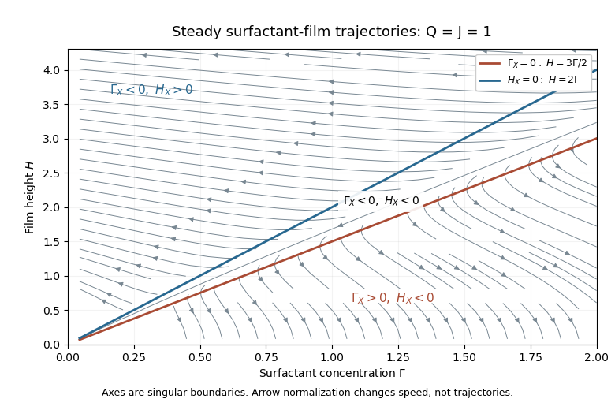

<h1 id="2/solution">Solution</h1>

↑ **Parent:** [2](../2.md)

Use $y$ for height above the horizontal wall. In the [lubrication approximation](../../../../../lubrication-theory.md), vertical momentum is hydrostatic and the [interfacial stress balance with variable surface tension](../../../../../interfacial-stress-balance-with-variable-surface-tension.md) gives

$$
p=p_{\rm atm}+\rho g(h-y)-\gamma(C)h_{xx},\qquad
B:=p_x=\big[\rho gh-\gamma(C)h_{xx}\big]_x.
$$

The horizontal equation is $\mu u_{yy}=B$, with $u(0)=0$ and $\mu u_y(h)=\gamma_x=-AC_x$. Thus

$$
u(y)=\frac{\gamma_x}{\mu}y+\frac B{2\mu}(y^2-2hy),\qquad
u_s=\frac{h\gamma_x}{\mu}-\frac{h^2B}{2\mu}.
$$

Integrating across the film and adding surface diffusion to surfactant advection gives the dimensional [thin-film mass flux](../../../../../thin-film-mass-flux.md) and [insoluble surfactant](../../../../../insoluble-surfactant.md) flux:

$$
\boxed{q=-\frac{Ah^2}{2\mu}C_x-\frac{h^3}{3\mu}\big[\rho gh-(\gamma_0-AC)h_{xx}\big]_x,}
$$

$$
\boxed{j=-\left(\frac{AhC}{\mu}+D_s\right)C_x
-\frac{Ch^2}{2\mu}\big[\rho gh-(\gamma_0-AC)h_{xx}\big]_x.}
$$

These include [Marangoni stress](../../../../../marangoni-effect.md), hydrostatic leveling, capillarity and surface diffusion with their signs fixed by the surface traction. In particular the derivative acts on the product of [surface tension](../../../../../surface-tension.md) and curvature, not just on curvature.

Choose $h_*=(AC_0/(\rho g))^{1/2}$ and $u_*=AC_0h_*/(\mu L)$. The dimensionless definitions are

$$
\boxed{H=h/h_*,\quad Q=q/(u_*h_*),\quad J=j/(C_0u_*),
\quad\Delta=\frac{\mu D_s}{AC_0h_*},\quad
G=\frac{\gamma_0}{\rho gL^2},\quad\alpha=\frac{AC_0}{\gamma_0}.}
$$

Together with the stated concentration and horizontal scales, these give

$$
Q=-\tfrac12H^2\Gamma_X-\tfrac13H^3\big[H-G(1-\alpha\Gamma)H_{XX}\big]_X,
$$

$$
J=-(H\Gamma+\Delta)\Gamma_X-\tfrac12H^2\Gamma\big[H-G(1-\alpha\Gamma)H_{XX}\big]_X.
$$

In steady flow $Q,J$ are constants by liquid and surfactant conservation.

With capillarity and diffusion neglected, solve these two linear equations for the gradients, in the region $H>0,\Gamma>0$:

$$
\boxed{\Gamma_X=\frac{6Q}{H^2}-\frac{4J}{H\Gamma},\qquad
HH_X=\frac{6J}{H\Gamma}-\frac{12Q}{H^2}.}
$$

For positive $Q,J$, the [phase plane](../../../../../phase-plane.md) nullclines are $H=3Q\Gamma/(2J)$ for $\Gamma_X=0$ and $H=2Q\Gamma/J$ for $H_X=0$. Above both lines, trajectories go left and upward; between them they go left and downward; below both they go right and downward. There is no positive-quadrant equilibrium. The axes are singular boundaries of this positive-flux reduction, not regular equilibria.

**[Figure 1](#2/image-steady-positive-flux-surfactant-film-phase-portrait-showing-both-nullclines-and-trajectory-directions-for-q-j-1). Steady positive-flux surfactant-film phase portrait, showing both nullclines and trajectory directions for Q=J=1**.

The [phase portrait](../../../../../phase-portrait.md) shows these trajectories for one choice of positive fluxes; the two nullcline slopes rescale with $Q/J$.

## ↑ Ancestors (10)

1. [2](../2.md)
2. [Paper 73](../../paper-73-split.md)
3. [Iii](../../split.md)
4. [2014](../../../split.md)
5. [Past exam of the mathematics course of the University of Cambridge](../../../../split.md)
6. [Mathematics course of the University of Cambridge](../../../../../mathematics-course-of-the-university-of-cambridge.md)
7. [Course of the University of Cambridge](../../../../../course-of-the-university-of-cambridge.md)
8. [University of Cambridge](../../../../../university-of-cambridge-split.md)
9. [List of universities](../../../../../list-of-universities.md)
10. [Codex Wiki](../../../../../split.md)
