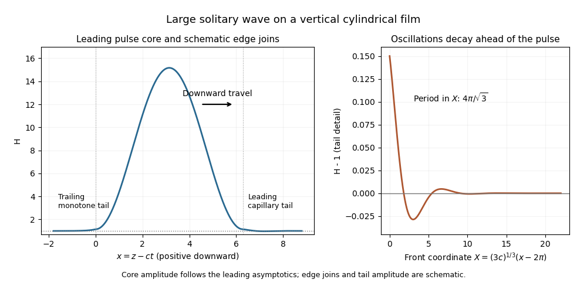

<h1 id="4/solution">Solution</h1>

↑ **Parent:** [4](../4.md)

Let the actual dimensional thickness be $d=\epsilon a h$, and let $\bar z$ increase downward. The leading curvature of the outer free surface is

$$
\kappa_s=\frac1a-\frac d{a^2}-d_{\bar z\bar z}.
$$

The [Young–Laplace equation](../../../../../young-laplace-equation.md) gives $p_{\bar z}=-\gamma(d_{\bar z}/a^2+d_{\bar z\bar z\bar z})$. In the [lubrication approximation](../../../../../lubrication-theory.md), the downward [velocity](../../../../../velocity.md) at distance $y$ from the wall is $(\rho g-p_{\bar z})(dy-y^2/2)/\mu$, from no slip and zero free-surface shear. Integrating this profile gives

$$
q=\frac{d^3}{3\mu}\left[\rho g+\gamma(d_{\bar z}/a^2+d_{\bar z\bar z\bar z})\right].
$$

Circumferential corrections are higher order in $d/a$, so volume conservation is $d_{\bar t}+q_{\bar z}=0$ at leading order. Define

$$
\boxed{z=\bar z/a,\quad t=\frac{\gamma\epsilon^3}{\mu a}\bar t,
\quad G=\frac{\rho ga^2}{\gamma\epsilon},\quad h=\bar h/a.}
$$

Then the [thin liquid film on a vertical cylinder](../../../../../thin-liquid-film-on-a-vertical-cylinder.md) satisfies

$$
\boxed{h_t+\tfrac13\partial_z[h^3(h_{zzz}+h_z+G)]=0.}
$$

The circumferential-curvature term $h_z$ is retained along with axial curvature.

The perturbation calculation gives

$$
\boxed{s(k)=\tfrac13(k^2-k^4)-iGk.}
$$

Long waves with $0<|k|<1$ grow, while $|k|>1$ decay; the fastest growth is $1/12$ at $|k|=1/\sqrt2$. Disturbances drift downward at speed $G$. The dimensional unstable wavelengths exceed $2\pi a$, with most unstable wavelength $2\pi\sqrt2a$. This is the thin-film version of the [Rayleigh–Plateau instability](../../../../../rayleigh-plateau-instability.md) driven by circumferential curvature and opposed by short-wave axial curvature.

For a [travelling wave](../../../../../travelling-wave.md), one integration fixed by $H\to1$ gives

$$
\boxed{H^3(H'''+H'+G)=3c(H-1)+G,}
$$

or $H'''+H'=3c(H-1)/H^3-G(1-H^{-3})$. In the large positive-speed core, substitute the expansion using the supplied assumptions. The left side at order $c^{2/3}$ is $H_2'''+H_2'$, while the gravity term is order one and $3c/H^2$ is only order $c^{-1/3}$. Thus $H_2'''+H_2'=0$. Its general solution is a constant plus a sine and cosine. The vanishing leading height and slope at both endpoints select

$$
\boxed{H_2(x)=K_2(1-\cos x),\qquad K_2>0.}
$$

The core length is $2\pi$ in the axial coordinate; its amplitude is fixed by transition matching.

At either edge set $X=(3c)^{1/3}(x-x_e)$, with $x_e=0$ at the trailing edge and $x_e=2\pi$ at the leading edge. Keeping the height $H$ of order one, the exact wave equation becomes

$$
H^3H_{XXX}=H-1-(3c)^{-2/3}H^3H_X-\frac G{3c}(H^3-1).
$$

Thus the transition equation is **$H^3H_{XXX}=H-1$**. Its linearization about $H=1$ has exponents $1$ and $-1/2\pm i\sqrt3/2$. Behind the pulse, approaching the uniform film as $X\to-\infty$ permits only the positive real exponent. The positive-growing, nontrivial branch has one amplitude that is removed by translation, giving the relevant unique $H_-$. In front, decay as $X\to+\infty$ permits the two real oscillatory amplitudes; translation removes one parameter and leaves a one-parameter family $H_+$. These are the [unstable manifold](../../../../../unstable-manifold.md) and [stable manifold](../../../../../stable-manifold.md) dimensions for the transition system. The literal boundary condition also admits the constant solution and an opposite departing branch, so uniqueness here is specifically for the branch matching a raised positive pulse.

Match the supplied trailing quadratic asymptotic to the core near zero. It gives $K_2=\kappa3^{2/3}$, because $\frac12c^{2/3}K_2x^2=\frac12\kappa(3c)^{2/3}x^2$. The leading maximum occurs at $x=\pi$, so

$$
\boxed{d_{\max}\sim2\kappa a\epsilon(3c)^{2/3}.}
$$

The front tail has the form $H-1\sim C e^{-X/2}\cos(\sqrt3X/2+\theta)$. Its [capillary waves](../../../../../capillary-wave.md) occur ahead of the descending pulse, not behind it; the trailing tail is monotone to leading order. Converting its frequency to physical distance gives

$$
\boxed{\Lambda_{\rm cap}=\frac{4\pi a}{3^{5/6}c^{1/3}}.}
$$

**[Figure 3](#4/image-large-solitary-pulse-on-a-vertical-cylindrical-film-with-a-monotone-trailing-approach-and-damped-capillary-waves-ahead). Large solitary pulse on a vertical cylindrical film, with a monotone trailing approach and damped capillary waves ahead**.

This [large solitary pulse on a cylindrical film](../../../../../large-solitary-pulse-on-a-cylindrical-film.md) sketch shows the leading core and the front-tail eigenmodes; the edge transitions are schematic and the ringing is enlarged for visibility. The thin-film asymptotics require both $c\gg1$ and $\epsilon c^{2/3}\ll1$, rather than taking speed to infinity at fixed film slenderness.

At the next core order, $H_0'''+H_0'=-G$. Integrating and imposing zero $H_0'$ at both endpoints gives

$$
\boxed{H_0=A_0+B_0\cos x+G(\sin x-x).}
$$

The constants in the two quadratic transition asymptotics match the core endpoint heights: $A_0+B_0=\beta_-$ and $A_0+B_0-2\pi G=\beta_+$. Hence $2\pi G=\beta_--\beta_+$, and the dimensional uniform thickness selected by matching is

$$
\boxed{\epsilon a=\frac{2\pi}{\beta_--\beta_+}\frac{\rho ga^3}{\gamma}.}
$$

With the supplied constants this fixes $G=3.75/(2\pi)$; $B_0$ is not separately fixed by these height conditions. The thickness selection and capillary wavelength follow from [matched asymptotic expansion](../../../../../matched-asymptotic-expansion.md), not from the linear instability calculation.

## ↑ Ancestors (10)

1. [4](../4.md)
2. [Paper 73](../../paper-73-split.md)
3. [Iii](../../split.md)
4. [2014](../../../split.md)
5. [Past exam of the mathematics course of the University of Cambridge](../../../../split.md)
6. [Mathematics course of the University of Cambridge](../../../../../mathematics-course-of-the-university-of-cambridge.md)
7. [Course of the University of Cambridge](../../../../../course-of-the-university-of-cambridge.md)
8. [University of Cambridge](../../../../../university-of-cambridge-split.md)
9. [List of universities](../../../../../list-of-universities.md)
10. [Codex Wiki](../../../../../split.md)
