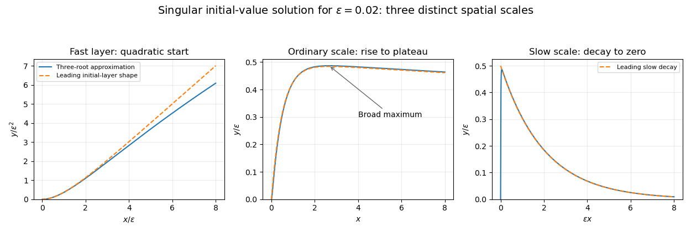

<h1 id="1/a/solution">Solution</h1>

↑ **Parent:** [A](../a.md)

The small root and the root near $-2$ are [regular perturbation roots](../../../../../../regular-perturbation-of-a-simple-algebraic-root.md): they stay finite as the parameter vanishes. Substitution of power series gives

$$
\lambda_s=-\frac{\varepsilon}{2}-\frac{\varepsilon^2}{8}+O(\varepsilon^3),\qquad
\lambda_m=-2-\frac{7\varepsilon}{2}+O(\varepsilon^2).
$$

For the third root, [dominant balance for algebraic roots](../../../../../../dominant-balance-for-algebraic-roots.md) requires $\lambda=\mu/\varepsilon$. The largest terms give $\mu^2(\mu+1)=0$, and the missing branch is $\mu=-1$. The sum of the three roots then yields

$$
\boxed{\lambda_f=-\varepsilon^{-1}+2+4\varepsilon+O(\varepsilon^2)}.
$$

Thus the leading roots are $-\varepsilon/2$, $-2$, and $-1/\varepsilon$; only the last is a [divergent perturbation root](../../../../../../divergent-algebraic-root-in-a-singular-perturbation.md). The first regular branch happens to have a zero limit, so retaining its first nonzero term is essential on the long spatial scale.

First take $\varepsilon\to0^+$, the decaying half-line regime. If the three exact roots are $r_j$, the exact [initial value problem](../../../../../../initial-value-problem.md) solution is

$$
y(x)=\sum_{j=1}^3\frac{e^{r_jx}}{\prod_{\ell\ne j}(r_j-r_\ell)}.
$$

This follows either by solving the three initial-value equations or from the [Laplace transform](../../../../../../laplace-transform.md) $\widehat y(s)=\varepsilon/(\varepsilon s^3+s^2+2s+\varepsilon)$. The coefficient formula has sums $\sum A_j=\sum r_jA_j=0$ and $\sum r_j^2A_j=1$.

Retain the three leading roots but compute their coefficients without expanding their denominators. Set $a=\varepsilon/2$, $b=2$, $d=1/\varepsilon$. A convenient [composite asymptotic expansion](../../../../../../additive-composite-expansion.md) is

$$
\boxed{y_A(x)=
\frac{e^{-ax}}{(b-a)(d-a)}-
\frac{e^{-bx}}{(b-a)(d-b)}+
\frac{e^{-dx}}{(d-a)(d-b)}}.
$$

It satisfies all three initial conditions exactly and retains the fast transient, the ordinary decay, and the slow decay. Its first two coefficients are $\varepsilon/2+O(\varepsilon^2)$ and $-\varepsilon/2+O(\varepsilon^2)$; the fast coefficient is $\varepsilon^2+O(\varepsilon^3)$. Consequently the simpler bulk expression is $\tfrac\varepsilon2(e^{-\varepsilon x/2}-e^{-2x})$, but that expression alone does not reproduce the initial [derivative](../../../../../../derivative.md) layer.

The absolute error estimate is

$$
\boxed{\sup_{x\geq0}|y(x)-y_A(x)|=O(\varepsilon^2)}.
$$

To see its uniformity, the slow-root error is $O(\varepsilon^2)$, while its magnitude is $O(\varepsilon)$ and its coefficient is $O(\varepsilon)$. The [uniform error bound for nearby decaying exponentials](../../../../../../uniform-error-bound-for-nearby-decaying-exponentials.md) therefore gives an $O(\varepsilon^2)$ contribution even for $x=O(\varepsilon^{-1})$. The middle-root error is $O(\varepsilon)$ with coefficient $O(\varepsilon)$, again giving $O(\varepsilon^2)$. The fast-root error is $O(1)$ with magnitude $O(\varepsilon^{-1})$ and coefficient $O(\varepsilon^2)$, giving only $O(\varepsilon^3)$. Coefficient errors are $O(\varepsilon^2)$ or smaller. This estimate concerns $y$ itself, rather than asserting the same uniform order for all [derivatives](../../../../../../derivative.md) or a relative error at its zero.

For the sketch, on $x=\varepsilon X$ one obtains

$$
y(x)\sim\varepsilon^2(X-1+e^{-X}).
$$

Thus $y\sim x^2/2$ at the origin and rises smoothly after the fast layer. For $x=O(1)$ it rises towards a plateau of height approximately $\varepsilon/2$, then decays on the much longer scale $x=O(\varepsilon^{-1})$. The bulk maximum lies near $x=\log(4/\varepsilon)/(2-\varepsilon/2)$ and has height asymptotic to $\varepsilon/2$.

**[Figure 1](#1/a/image-initial-quadratic-rise-ordinary-scale-plateau-and-slow-decay-of-the-singularly-perturbed-initial-value-solution). Initial quadratic rise, ordinary-scale plateau and slow decay of the singularly perturbed initial-value solution**.

The sign of the parameter matters on an infinite interval. If $\varepsilon\to0^-$ is allowed, the singular mode grows rather than decays. For each fixed $x>0$, its dominant contribution is $y(x)\sim\varepsilon^2\exp[(-1/\varepsilon+2)x]$. The extra $2$ in that exponent is needed for relative leading accuracy at fixed $x$. The positive-parameter uniform absolute bound and decaying sketch do not extend to that regime.

## ↑ Ancestors (11)

1. [A](../a.md)
2. [1](../../1.md)
3. [Paper 74](../../../paper-74-split.md)
4. [Iii](../../../split.md)
5. [2014](../../../../split.md)
6. [Past exam of the mathematics course of the University of Cambridge](../../../../../split.md)
7. [Mathematics course of the University of Cambridge](../../../../../../mathematics-course-of-the-university-of-cambridge.md)
8. [Course of the University of Cambridge](../../../../../../course-of-the-university-of-cambridge.md)
9. [University of Cambridge](../../../../../../university-of-cambridge-split.md)
10. [List of universities](../../../../../../list-of-universities.md)
11. [Codex Wiki](../../../../../../split.md)
