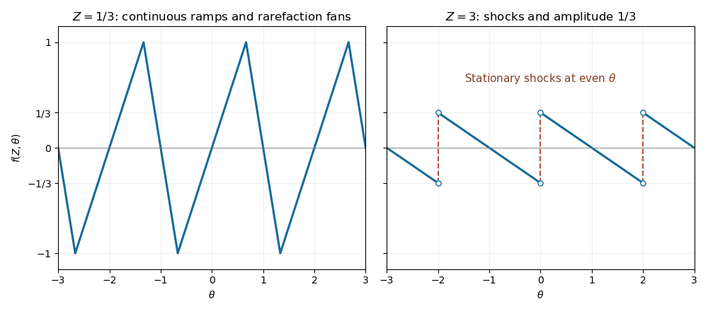

<h1 id="3/a/solution">Solution</h1>

↑ **Parent:** [A](../a.md)

Write the negative-flux [Inviscid Burgers equation](../../../../../../inviscid-burgers-equation.md) as $f_Z+\partial_\theta F(f)=0$, with $F(f)=-f^2/2$. Along a [characteristic curve](../../../../../../characteristic-curve.md),

$$
\frac{d\theta}{dZ}=-f,\qquad\frac{df}{dZ}=0,
$$

so a characteristic starting at $\theta_0$ has $\theta=\theta_0-f_0(\theta_0)Z$ and

$$
\boxed{f(Z,\theta_0-f_0(\theta_0)Z)=f_0(\theta_0)}.
$$

This formula is a classical solution only while the [method of characteristics](../../../../../../method-of-characteristics.md) is one-to-one; after [characteristic crossing](../../../../../../characteristic-crossing.md) one must select an [entropy solution](../../../../../../entropy-solution.md).

For a discontinuity with left and right values $f_-$ and $f_+$, the [Rankine-Hugoniot condition](../../../../../../rankine-hugoniot-conditions.md) follows by integrating conservation across a moving small interval:

$$
\theta_s'(f_+-f_-)=F(f_+)-F(f_-).
$$

For a nonzero jump, factor the difference of squares to obtain

$$
\boxed{\theta_s'=-\frac12(f_++f_-).}
$$

The negative flux makes increasing jumps compressive. Decreasing jumps spread into [rarefaction waves](../../../../../../rarefaction-wave.md); they cannot be retained as nonphysical expansion [shock waves](../../../../../../shock-wave.md).

In the central ramp of each period, $f_0(\theta_0)=\theta_0-2m$, so its [method of characteristics](../../../../../../method-of-characteristics.md) is $\theta-2m=(1-Z)(\theta_0-2m)$. For $0<Z<1$, the retained ramp therefore occupies $|\theta-2m|<1-Z$. At the odd boundary $r=2m+1$, the initial limiting values are $+1$ on the left and $-1$ on the right. Their [characteristic speeds](../../../../../../characteristic-speed.md) are $-1$ and $+1$, giving the fan $f=-(\theta-r)/Z$ on $|\theta-r|<Z$. Together these give the [periodic backward-sawtooth Burgers solution](../../../../../../periodic-backward-sawtooth-burgers-solution.md)

$$
\boxed{f(Z,\theta)=\begin{cases}
(\theta-2m)/(1-Z),&|\theta-2m|<1-Z,\\
-(\theta-(2m+1))/Z,&|\theta-(2m+1)|<Z,
\end{cases}\qquad0<Z<1,\quad m\in\mathbb Z.}
$$

These intervals tile the real line up to their matching endpoints, where both formulas agree at $\pm1$. The increasing ramp steepens, but the wave's maximum magnitude remains one before breaking. A steep continuous regularization of the original downward jump produces exactly the limiting fan, as suggested by the characteristic construction.

At $Z=1$, each increasing ramp collapses at $\theta=2m$. The fans on either side meet there with values $-1$ and $+1$, producing a compressive stationary [shock wave](../../../../../../shock-wave.md). For all $Z\geq1$ the fan between successive [shock waves](../../../../../../shock-wave.md) remains centered at the odd point, giving

$$
\boxed{f(Z,\theta)=\frac{2m+1-\theta}{Z}\quad(2m<\theta<2m+2),\qquad
\theta_s=2m.}
$$

At a [shock wave](../../../../../../shock-wave.md) the limiting values are $f_-=-1/Z$ and $f_+=1/Z$. Their average is zero, so the [Rankine-Hugoniot condition](../../../../../../rankine-hugoniot-conditions.md) keeps the [shock wave](../../../../../../shock-wave.md) fixed. Their [characteristic speeds](../../../../../../characteristic-speed.md) satisfy $1/Z>0>-1/Z$, confirming compression into the [shock wave](../../../../../../shock-wave.md). The arbitrary pointwise value at a [shock wave](../../../../../../shock-wave.md) does not affect the [weak solution](../../../../../../weak-solution.md). The post-breaking amplitude decays as $1/Z$, despite the lack of explicit [viscosity](../../../../../../dynamic-viscosity.md), because [shock wave](../../../../../../shock-wave.md) dissipate the wave.

For the requested sketches, $Z=1/3$ has ramp slope $3/2$ on $|\theta-2m|<2/3$ and fan slope $-3$ around odd points on width $2/3$. It is still continuous. At $Z=3$, the profile decreases linearly with slope $-1/3$ between even points and jumps from $-1/3$ to $+1/3$ at each even point:

**[Figure 1](#3/a/image-periodic-burgers-wave-before-breaking-at-z-equals-one-third-and-after-breaking-at-z-equals-three-with-stationary-shocks-at-even-theta). Periodic Burgers wave before breaking at Z equals one third and after breaking at Z equals three, with stationary shocks at even theta**.

## ↑ Ancestors (11)

1. [A](../a.md)
2. [3](../../3.md)
3. [Paper 75](../../../paper-75-split.md)
4. [Iii](../../../split.md)
5. [2014](../../../../split.md)
6. [Past exam of the mathematics course of the University of Cambridge](../../../../../split.md)
7. [Mathematics course of the University of Cambridge](../../../../../../mathematics-course-of-the-university-of-cambridge.md)
8. [Course of the University of Cambridge](../../../../../../course-of-the-university-of-cambridge.md)
9. [University of Cambridge](../../../../../../university-of-cambridge-split.md)
10. [List of universities](../../../../../../list-of-universities.md)
11. [Codex Wiki](../../../../../../split.md)
