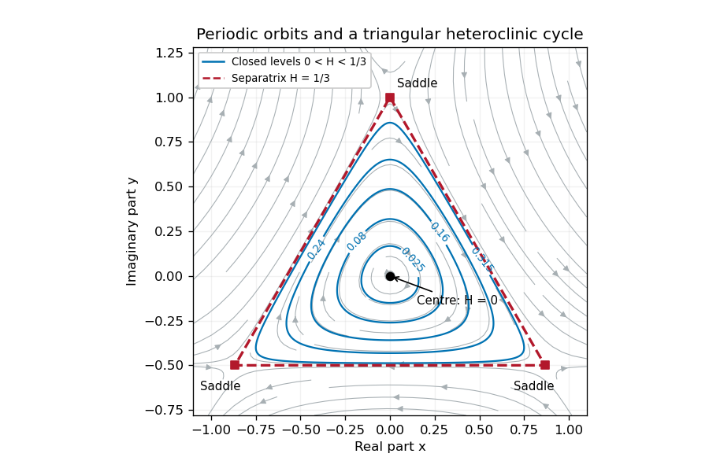

<h1 id="2/iii/solution">Solution</h1>

↑ **Parent:** [Iii](../iii.md)

For $\omega\ne0$, put $\mu=\widehat\mu\omega^2$, $C=\omega z$ and $\tau=\omega T$, where $z=\widehat C$. Then $C_T=\omega^2z_\tau$ and division by $\omega^2$ gives

$$
\boxed{z_\tau+iz=\overline z^{\,2}
+\omega(\widehat\mu z-|z|^2z).}
$$

We may take $\omega>0$ without loss of the dynamics by conjugating the original equation if necessary; otherwise $\tau$ reverses the time orientation. The scaling is singular at $\omega=0$ and is not a transformation for that exactly zero-frequency case.

The [Hamiltonian limit of three-to-one forcing](../../../../../../hamiltonian-limit-of-three-to-one-forcing.md) drops the terms proportional to $\omega$. For $z=x+iy$ the remaining real system is

$$
x_\tau=y+x^2-y^2,\qquad y_\tau=-x-2xy.
$$

The proposed [first integral](../../../../../../first-integral.md) is

$$
\boxed{H=x^2+y^2+2x^2y-\frac23y^3
=|z|^2+\frac{z^3-\overline z^{\,3}}{3i}.}
$$

Indeed $x_\tau=H_y/2$ and $y_\tau=-H_x/2$, hence $H_\tau=0$. The unperturbed equation is a planar [Hamiltonian system](../../../../../../hamiltonian-system.md), with a [center equilibrium](../../../../../../center-equilibrium.md) at the origin and three [saddle equilibria](../../../../../../saddle-equilibrium.md) at

$$
(x,y)=(0,1),\quad(\sqrt3/2,-1/2),\quad(-\sqrt3/2,-1/2).
$$

All [saddle equilibria](../../../../../../saddle-equilibrium.md) have $H=1/3$. The factorization

$$
H-\frac13=(1+2y)\left[x^2-\frac{(y-1)^2}{3}\right]
$$

shows that their central separatrix consists of the three sides of an equilateral triangle. Each level **$0<H<1/3$ inside this triangle is a closed [periodic orbit](../../../../../../periodic-orbit.md)**. Indeed, inside the triangle $0<r<1$ and $\partial_rH=2r(1+r\sin3\theta)>0$. Each ray from the origin therefore meets each such level once, giving a compact simple closed contour with no [equilibrium point](../../../../../../equilibrium-point-of-a-dynamical-system.md) on it. The nonzero vector field traverses this contour periodically; the period grows without bound as the separatrix is approached. This supplies an infinite family, not a claim that every level outside the central region is closed.

**[Figure 1](#2/iii/image-periodic-orbits-inside-the-triangular-heteroclinic-cycle-of-a-hamiltonian-system). Periodic orbits inside the triangular heteroclinic cycle of a Hamiltonian system**.

Restore the small radial perturbation. Its exact effect on the [first integral](../../../../../../first-integral.md) is

$$
H_\tau=\omega(\widehat\mu-r^2)(xH_x+yH_y)
=2\omega(\widehat\mu-r^2)r^2(1+r\sin3\theta),\qquad r=|z|.
$$

Consequently the continuum of [Hamiltonian system](../../../../../../hamiltonian-system.md) orbits generally does not persist. The origin becomes a weak attracting focus for $\widehat\mu<0$ or a repelling focus for $\widehat\mu>0$, and the three hyperbolic [saddle equilibria](../../../../../../saddle-equilibrium.md) persist with perturbed [stable manifold](../../../../../../stable-manifold.md) and [unstable manifold](../../../../../../unstable-manifold.md). For a small positive $\widehat\mu$, outward drift on very small orbits balances cubic damping on somewhat larger ones, selecting a stable [limit cycle](../../../../../../limit-cycle.md) rather than an arbitrary energy level. Near the [center equilibrium](../../../../../../center-equilibrium.md) $H\simeq r^2$, so its leading radius is $r\simeq\sqrt{\widehat\mu}$ when $\widehat\mu$ is also small.

For a more general closed unperturbed orbit $\Gamma_h$, the [averaged area criterion for perturbed Hamiltonian cycles](../../../../../../averaged-area-criterion-for-perturbed-hamiltonian-cycles.md) says that persistence requires the averaged energy drift $\oint_{\Gamma_h}H_\tau\,d\tau$ to vanish. Since the unperturbed speed is $|\nabla H|/2$, the planar [divergence theorem](../../../../../../divergence-theorem.md) converts this leading drift to

$$
\oint_{\Gamma_h}H_\tau\,d\tau
=4\omega\left[\widehat\mu\,|\mathcal D_h|
-2\int_{\mathcal D_h}r^2\,dA\right],
$$

where $\mathcal D_h$ is the enclosed region. Isolated zeros select candidate [periodic orbits](../../../../../../periodic-orbit.md); a drift changing from positive inside to negative outside gives an attracting [limit cycle](../../../../../../limit-cycle.md). The separatrix triangle has mean $r^2=1/4$, so its leading flux changes sign at $\widehat\mu=1/2$. This marks the leading possible heteroclinic transition, with higher-order corrections needed to locate it precisely.

As a cycle approaches the [saddle equilibria](../../../../../../saddle-equilibrium.md), long residence times and splitting of the [heteroclinic cycle](../../../../../../heteroclinic-cycle.md) become important. Orbits can instead drift inward to the [equilibrium point](../../../../../../equilibrium-point-of-a-dynamical-system.md) at the origin or leave the periodic island and approach one of the stable states with [phase locking](../../../../../../phase-locking.md) of the full canonical equation. Those upper-branch [threefold phase-locked equilibria](../../../../../../threefold-phase-locked-equilibria.md) have $C=O(1)$, so they lie outside the local $C=O(\omega)$ scaling. Thus the small perturbation gives energy selection, attracting or repelling oscillations, and possible switching/locking transitions; it does not preserve a conserved $H$ or an infinite family of neutral periodic solutions. This qualitative picture does not assume all global parameter values have the same attractor.

## ↑ Ancestors (11)

1. [Iii](../iii.md)
2. [2](../../2.md)
3. [Paper 76](../../../paper-76-split.md)
4. [Iii](../../../split.md)
5. [2014](../../../../split.md)
6. [Past exam of the mathematics course of the University of Cambridge](../../../../../split.md)
7. [Mathematics course of the University of Cambridge](../../../../../../mathematics-course-of-the-university-of-cambridge.md)
8. [Course of the University of Cambridge](../../../../../../course-of-the-university-of-cambridge.md)
9. [University of Cambridge](../../../../../../university-of-cambridge-split.md)
10. [List of universities](../../../../../../list-of-universities.md)
11. [Codex Wiki](../../../../../../split.md)
