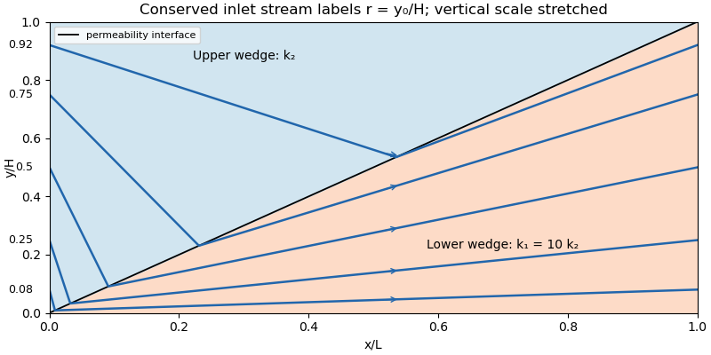

# Paper 78

↑ **Parent:** [Iii](../iii.md)

[https://www.maths.cam.ac.uk/postgrad/part-iii/files/pastpapers/2014/paper_78.pdf](https://www.maths.cam.ac.uk/postgrad/part-iii/files/pastpapers/2014/paper_78.pdf)

**Table of contents**

- [1](#1)
  - [Solution](#1/solution)
- [2](#2)
  - [Solution](#2/solution)
- [3](#3)
  - [Solution](#3/solution)
- [4](#4)
  - [Solution](#4/solution)
- [5](#5)
  - [Solution](#5/solution)
- [6](#6)
  - [Solution](#6/solution)

## 1

↑ **Parent:** [Paper 78](paper-78.md)

<h3 id="1/solution">Solution</h3>

↑ **Parent:** [1](#1)

**Effective [permeability of a porous medium](../../../porous-media-flow.md#permeability-of-a-porous-medium).** Work to leading order in the slender-layer ratio $H/L$. Take the growing lower wedge to have [porous permeability](../../../porous-media-flow.md#permeability-of-a-porous-medium) $k_1$, with interface $y=Hx/L$, and the upper wedge to have [porous permeability](../../../porous-media-flow.md#permeability-of-a-porous-medium) $k_2$. The leading [pressure](../../../thermodynamics.md#pressure) is independent of $y$; vertical flow is smaller than horizontal flow by $H/L$. Define

$$
\xi=\frac{x}{L},\qquad K(\xi)=k_2+(k_1-k_2)\xi.
$$

[Darcy's law](../../../porous-media-flow.md#darcy-law) and the fixed two-dimensional [volume flux](../../../fluid-mechanics.md#volumetric-flow-rate) give

$$
Q=-\frac{H K(\xi)}{\mu}p_x,\qquad
q_i(x)=\frac{Qk_i}{HK(\xi)}.
$$

Here $q_i$ is [Darcy velocity](../../../porous-media-flow.md#darcy-velocity); the parcel speed is $q_i/\phi$. Integrating the [pressure gradient](../../../fluid-mechanics.md#pressure-gradient) over the length and defining $Q=Hk_{\rm eff}\Delta p/(\mu L)$ yields

$$
\boxed{k_{\rm eff}=\frac{k_1-k_2}{\log(k_1/k_2)}.}
$$

The equal-[porous permeability](../../../porous-media-flow.md#permeability-of-a-porous-medium) limit is $k_{\rm eff}=k_1=k_2$. This logarithmic mean comes from parallel layers at each cross-section followed by series addition of their local hydraulic resistances. It is a slender-layer result; a full two-dimensional transmission problem has small end and interface corrections.

**Parcel paths and travel times.** Pressure equalization does not mean that parcels stay at fixed $y$: [mass conservation](../../../continuum-mechanics.md#mass-conservation) requires a small vertical flow. Define a [streamfunction](../../../fluid-mechanics.md#stream-function) by $\psi(x,0)=0$ and $\psi(x,H)=Q$. Its leading expression is

$$
\psi=\begin{cases}q_1(x)y,&y\leq H\xi,\\Q-q_2(x)(H-y),&y\geq H\xi.\end{cases}
$$

Let $r=y_0/H$ label a parcel released at the inlet. There $\psi=Qr$. At the inclined interface $\psi/Q=k_1\xi/K(\xi)$, so the parcel crosses from the upper wedge into the lower one at

$$
\boxed{\xi_c(r)=\frac{rk_2}{k_1(1-r)+k_2r}.}
$$

Before crossing, $y/H=1-(1-r)K/k_2$; afterwards, $y/H=rK/k_1$. These expressions show why integrating the speed along a horizontal line would give the wrong parcel time.

Put $d=k_1-k_2$ and $\tau_V=\phi HL/Q$, the pore-volume throughput time. Integrating $dt=\phi\,dx/q_i$ on the two portions of the path gives

$$
\boxed{\begin{aligned}
\tau(y_0)&=\tau_V\left[\frac1{k_2}\int_0^{\xi_c}K(\xi)d\xi
+\frac1{k_1}\int_{\xi_c}^{1}K(\xi)d\xi\right]\\
&=\tau_V\left[\frac{k_1+k_2}{2k_1}
+\frac d{k_1}\xi_c+\frac{d^2}{2k_1k_2}\xi_c^2\right].
\end{aligned}}
$$

Its derivative with respect to $\xi_c$ is $\tau_V dK/(k_1k_2)$, so it is monotone. The limiting streamline times at the lower and upper boundaries are $\tau_V(k_1+k_2)/(2k_1)$ and $\tau_V(k_1+k_2)/(2k_2)$ respectively. Hence

$$
\boxed{\Delta\tau_{\max}=\frac{\phi HL}{2Q}
\frac{|k_1^2-k_2^2|}{k_1k_2}.}
$$

The printed expression assumes $k_1\geq k_2$. The absolute value is needed for a nonnegative maximum difference without that ordering. For equal [porous permeabilities](../../../porous-media-flow.md#permeability-of-a-porous-medium) every parcel has time $\tau_V$.

**[Figure 1](#1/image-streamlines-crossing-an-inclined-permeability-interface-in-a-slender-layer-with-lower-wedge-permeability-ten-times-the-upper-wedge-permeability). Streamlines crossing an inclined permeability interface in a slender layer with lower-wedge permeability ten times the upper-wedge permeability**.

**Oil recovery.** In the ideal passive-displacement model with $k_1/k_2=10$, the earliest and latest travel times are $0.55\tau_V$ and $5.5\tau_V$, a spread of $4.95\tau_V$. Preferential paths through the high-[porous permeability](../../../porous-media-flow.md#permeability-of-a-porous-medium) wedge therefore give early water breakthrough while oil on slower paths remains unswept. Continued injection sends much water through paths already swept; complete displacement requires several pore volumes. The [flux-weighted residence time in a porous layer](../../../porous-media-flow.md#flux-weighted-residence-time-in-a-porous-layer) remains $\tau_V$. Real [waterflooding](../../../porous-media-flow.md#waterflooding) also depends on [phase mobilities](../../../porous-media-flow.md#phase-mobility), [relative permeabilities](../../../porous-media-flow.md#relative-permeability), [capillary pressure](../../../fluid-mechanics.md#capillary-pressure) and mixing, so these numbers illustrate heterogeneity rather than a quantitative two-phase recovery prediction.

## 2

↑ **Parent:** [Paper 78](paper-78.md)

<h3 id="2/solution">Solution</h3>

↑ **Parent:** [2](#2)

Choose $U$ and $Q$ as the speed and source strength in the same kinematic velocity convention. With $r=(x^2+y^2)^{1/2}$ and $\vartheta=\arg(x+iy)$, [superposition](../../../vector-space.md#superposition-principle) of uniform [potential flow](../../../fluid-mechanics.md#potential-flow) and a two-dimensional [point source](../../../fluid-mechanics.md#point-source) gives

$$
\boxed{\Phi=Ux+\frac{Q}{2\pi}\log r,\qquad
\psi=Uy+\frac{Q}{2\pi}\vartheta,}
$$

where $(u,v)=\nabla\Phi=(\psi_y,-\psi_x)$. The angular branch cut records the [volume flux](../../../fluid-mechanics.md#volumetric-flow-rate) from the source; the logarithm's arbitrary reference length only changes an additive constant in the [velocity potential](../../../fluid-mechanics.md#velocity-potential).

The [stagnation point](../../../fluid-mechanics.md#stagnation-point) lies on the negative axis, where $u=U+Q/(2\pi x)=0$. Thus the limiting upstream reach of source fluid is

$$
\boxed{x_s=-\frac{Q}{2\pi U}=-\frac b\pi,\qquad b=\frac{Q}{2U}.}
$$

The stagnation point is approached asymptotically, rather than reached in finite time by a parcel on the upstream axis. The dividing [streamlines](../../../fluid-mechanics.md#streamline) through it have $\psi=\pm Q/2$ when the angle is taken in $(-\pi,\pi)$. Far downstream $\vartheta\to0$, so these [streamlines](../../../fluid-mechanics.md#streamline) approach $y=\pm Q/(2U)$. Consequently the source fluid occupies the [Rankine half-body](../../../fluid-mechanics.md#rankine-half-body) between them, with downstream width $2b=Q/U$. In the upper half-plane its boundary can also be parametrized by $y=b(1-\vartheta/\pi)$, $x=y\cot\vartheta$, $0<\vartheta<\pi$.

For arrival at the downstream axis, the direct streamline $y=0$, $x>0$ has speed $U+Q/(2\pi x)$. Its transit time from the ideal point source is

$$
T_s(x)=\int_0^x\frac{dX}{U+Q/(2\pi X)}
=\frac xU-\frac{Q}{2\pi U^2}\log\left(1+\frac{2\pi Ux}{Q}\right).
$$

The first source fluid at a downstream cross-section lies on this symmetry axis: for positive $x$, the horizontal source contribution $Qx/[2\pi(x^2+y^2)]$ is maximal at $y=0$, and off-axis paths cannot advance through positive $x$ more quickly. A far-away parcel passing the inlet line at the same release time has transit time $x/U$. The time advance is therefore

$$
\boxed{\tau=\frac xU-T_s(x)=\frac b{\pi U}\log\left(1+\frac{\pi x}{b}\right).}
$$

This is an advance, not the source parcel's absolute transit time. If a source parcel is released at time $t_0$ while the distant comparison parcel crosses $x=0$ at time zero, the advance relative to that parcel is $\tau-t_0$; the printed formula uses simultaneous releases. If $U,Q$ instead denote [Darcy velocity](../../../porous-media-flow.md#darcy-velocity) and bulk-area source flux in a medium of uniform [porosity](../../../porous-media-flow.md#porosity) $\phi$, their ratio still gives the same $b$, but both parcel times acquire a factor $\phi$. No [porosity](../../../porous-media-flow.md#porosity) is specified here, so the displayed time formula fixes the kinematic convention.

## 3

↑ **Parent:** [Paper 78](paper-78.md)

<h3 id="3/solution">Solution</h3>

↑ **Parent:** [3](#3)

The imposed [pressure gradient](../../../fluid-mechanics.md#pressure-gradient) and [Darcy's law](../../../porous-media-flow.md#darcy-law) give a linear velocity profile. Use $U$ as the mean [pore velocity](../../../porous-media-flow.md#pore-velocity) in the contaminant [advection-diffusion equation](../../../diffusion-equation.md#advection-diffusion-equation); then

$$
u(y)=\frac{2Uy}{H},\qquad
c_t+u(y)c_x=D_Lc_{xx}+D_Tc_{yy},\qquad
c_y(0)=c_y(H)=0.
$$

The last conditions express zero transverse solute flux under the standard closed-layer interpretation. Transverse exchange through the layer boundaries would change this cell problem and requires additional boundary data. If the prescribed mean speed is a [Darcy velocity](../../../porous-media-flow.md#darcy-velocity), its corresponding [pore velocity](../../../porous-media-flow.md#pore-velocity) is that speed divided by [porosity](../../../porous-media-flow.md#porosity).

The given parameter is the ratio of transverse mixing time to travel time:

$$
\boxed{P=\frac{H^2/D_T}{L/U}\ll1.}
$$

Thus [transverse dispersion](../../../fluid-mechanics.md#transverse-dispersion) mixes the contaminant across the layer many times during its passage along the long layer. Different fluid speeds still matter: repeated exchange between slow and fast portions produces [Taylor dispersion](../../../fluid-mechanics.md#taylor-dispersion), rather than transport solely at each parcel's original speed. The averaged description applies after $t\gg H^2/D_T$ and on longitudinal scales large compared with the distance travelled during that mixing time.

Write $C=\overline c$ and, to leading correction order, $c=C+\chi(y)C_x+\cdots$, with $\overline\chi=0$. Taking $C_t\simeq-UC_x$ in the local equation gives the cell problem

$$
D_T\chi''=u-U,\qquad \chi'(0)=\chi'(H)=0.
$$

With $\eta=y/H$, its solution is

$$
\chi(y)=\frac{UH^2}{D_T}\left(\frac{\eta^3}{3}-\frac{\eta^2}{2}+\frac1{12}\right).
$$

Averaging the local [advection-diffusion equation](../../../diffusion-equation.md#advection-diffusion-equation) now yields $C_t+UC_x=[D_L-\overline{(u-U)\chi}]C_{xx}$. An [integration by parts](../../../calculus.md#integration-by-parts) in the cell problem gives $-\overline{(u-U)\chi}=D_T\overline{(\chi')^2}$. Since $\int_0^1(\eta^2-\eta)^2d\eta=1/30$, the effective equation is

$$
\boxed{C_t+UC_x=D_{\rm eff}C_{xx},\qquad
D_{\rm eff}=D_L+\frac{U^2H^2}{30D_T}.}
$$

This is [Taylor dispersion in a linear porous-layer velocity profile](../../../fluid-mechanics.md#taylor-dispersion-in-a-linear-porous-layer-velocity-profile). For a localized pulse away from the inlet and outlet, its mean position advances at $U$ and its longitudinal variance grows as $2D_{\rm eff}t$.

For the inlet step, use the semi-infinite inlet approximation $x>0$, $C(0,t)=1$, $C(x,0)=0$ and $C\to0$ as $x\to\infty$ at fixed $t$. The resulting [constant-concentration inlet solution](../../../diffusion-equation.md#constant-concentration-inlet-solution) is

$$
\boxed{C(x,t)=\frac12\operatorname{erfc}\left(\frac{x-Ut}{2\sqrt{D_{\rm eff}t}}\right)
+\frac12e^{Ux/D_{\rm eff}}\operatorname{erfc}\left(\frac{x+Ut}{2\sqrt{D_{\rm eff}t}}\right).}
$$

One derivation is to [Laplace transform](../../../analysis.md#laplace-transform) in time: $\widetilde C(x,p)=p^{-1}\exp[(U-\sqrt{U^2+4D_{\rm eff}p})x/(2D_{\rm eff})]$. Inverting gives the two [complementary error functions](../../../calculus.md#complementary-error-function). Their sum is one at $x=0$; for fixed $x>0$ both terms vanish as $t\downarrow0$, and substitution verifies the averaged equation. Retaining only the first term gives the familiar moving error-function front far from the inlet when longitudinal [advection](../../../fluid-mechanics.md#advection) dominates [diffusion](../../../thermodynamics.md#diffusion), but does not satisfy the inlet condition exactly.

For a literal finite layer $0<x<L$, a downstream boundary condition is also needed once the outlet influences the solution. The PDF's step-inlet request specifies only the initially clean region $x>0$, so the formula above is the semi-infinite/long-layer solution, not a claim of a unique finite-interval solution with unspecified outlet data.

## 4

↑ **Parent:** [Paper 78](paper-78.md)

<h3 id="4/solution">Solution</h3>

↑ **Parent:** [4](#4)

**Saturation equation.** Introduce intrinsic [permeability of a porous medium](../../../porous-media-flow.md#permeability-of-a-porous-medium) $K$ and [porosity](../../../porous-media-flow.md#porosity) $\phi$. The relative [porous permeabilities](../../../porous-media-flow.md#permeability-of-a-porous-medium) depend on the wetting [fluid saturation](../../../porous-media-flow.md#fluid-saturation). Define the [phase mobilities](../../../porous-media-flow.md#phase-mobility) and [fractional flow](../../../porous-media-flow.md#fractional-flow)

$$
\lambda_w(s)=\frac{k_w(s)}{\mu_w},\qquad
\lambda_n(s)=\frac{k_{nw}(s)}{\mu_{nw}},\qquad
F(s)=\frac{\lambda_w}{\lambda_w+\lambda_n}.
$$

Use the conventional [capillary pressure](../../../fluid-mechanics.md#capillary-pressure) $p_c=p_{nw}-p_w$, generally decreasing as wetting saturation increases. Neglect gravity in this horizontal model. The two [Darcy fluxes](../../../porous-media-flow.md#darcy-velocity) are $q_w=-K\lambda_wp_{w,x}$ and $q_n=-K\lambda_n(p_{w,x}+p_c'(s)s_x)$. Eliminate the common pressure gradient using $q_w+q_n=Q$ to obtain

$$
q_w=QF(s)+K\frac{\lambda_w\lambda_n}{\lambda_w+\lambda_n}p_c'(s)s_x
=QF(s)-D_c(s)s_x,
\qquad
D_c(s)=-K\frac{\lambda_w\lambda_n}{\lambda_w+\lambda_n}p_c'(s).
$$

The wetting-phase [mass conservation](../../../continuum-mechanics.md#mass-conservation) law is consequently

$$
\boxed{\phi s_t+Q\partial_xF(s)=\partial_x[D_c(s)s_x].}
$$

For $p_c'\leq0$, $D_c\geq0$ and the [capillary pressure](../../../fluid-mechanics.md#capillary-pressure) provides nonlinear diffusion. The initially uniform saturation is $s_0$. Pure wetting-fluid injection prescribes $q_w(0,t)=Q$ and $q_n(0,t)=0$; in the zero-capillarity, zero-residual-nonwetting idealization this corresponds to inlet saturation one. With residual nonwetting fluid, replace one by the appropriate maximum accessible saturation.

**Shock formation and its speed.** Neglect capillarity first. Smooth saturation values travel along [characteristic curves](../../../partial-differential-equation.md#characteristic-curve) at speed $(Q/\phi)F'(s)$. When the trailing values have larger [characteristic speeds](../../../partial-differential-equation.md#characteristic-speed) than the values ahead, the curves intersect, and the [Buckley-Leverett equation](../../../porous-media-flow.md#buckley-leverett-equation) requires a [shock](../../../partial-differential-equation.md#shock-wave) selected as an [entropy solution](../../../partial-differential-equation.md#entropy-solution). This is typical for the increasing-convex part of a physical fractional-flow curve; [shocks](../../../partial-differential-equation.md#shock-wave) are not inevitable for every possible $F$.

Integrating [mass conservation](../../../continuum-mechanics.md#mass-conservation) across a [shock](../../../partial-differential-equation.md#shock-wave) from upstream $s_s$ to downstream $s_0$ gives the [Rankine-Hugoniot condition](../../../partial-differential-equation.md#rankine-hugoniot-conditions)

$$
\boxed{V_s=\frac Q\phi\frac{F(s_s)-F(s_0)}{s_s-s_0}.}
$$

If an upstream [rarefaction wave](../../../partial-differential-equation.md#rarefaction-wave) joins the [shock](../../../partial-differential-equation.md#shock-wave) smoothly in similarity coordinates, its terminal characteristic speed equals $V_s$. Therefore the saturation at that join obeys the [fractional-flow tangent construction](../../../porous-media-flow.md#fractional-flow-tangent-construction)

$$
\boxed{F'(s_s)=\frac{F(s_s)-F(s_0)}{s_s-s_0}.}
$$

This is the printed equality. It is a tangent-selection condition, not the dimensional speed by itself; the speed includes $Q/\phi$. An arbitrary [shock](../../../partial-differential-equation.md#shock-wave) between prescribed constant states satisfies the jump condition but need not satisfy this additional tangency relation.

Positive [capillary diffusion](../../../porous-media-flow.md#capillary-diffusion) spreads a jump into a transition layer. For a travelling profile $s(x-V_st)$, integration gives

$$
D_c(s)s'=Q[F(s)-F(s_0)]-\phi V_s(s-s_0).
$$

The endpoint states still satisfy the same [Rankine-Hugoniot condition](../../../partial-differential-equation.md#rankine-hugoniot-conditions). Thus small capillarity primarily gives the front a finite thickness rather than changing the selected limiting speed; vanishing phase mobility at an endpoint can make the regularization degenerate.

**The specified reciprocal fractional flow.** On its stated branch, $F'=1/s^2$ and $F''=-2/s^3<0$. If $F$ extends continuously to the initial saturation and the inlet is at one, the decreasing saturation from behind to ahead makes [characteristic speeds](../../../partial-differential-equation.md#characteristic-speed) increase forwards: there is a [rarefaction wave](../../../partial-differential-equation.md#rarefaction-wave), not a compressive [shock](../../../partial-differential-equation.md#shock-wave). Write $a=Q/\phi$ and $\xi=x/t$. The [self-similar solution](../../../partial-differential-equation.md#similarity-solution) is

$$
\boxed{s(x,t)=\begin{cases}
1,&0\leq\xi\leq a,\\
\sqrt{a/\xi},&a<\xi<a/s_0^2,\\
s_0,&\xi\geq a/s_0^2.
\end{cases}}
$$

The fan connects continuously to the initial state and broadens linearly in time. This interpretation requires $F(s_0)=2-1/s_0$. A nonnegative physical fractional flow on the entire interval $[s_0,1]$ also requires $s_0\geq1/2$.

The PDF specifies the formula only for $s>s_0$ and earlier calls $s_0$ residual. If that means an immobile wetting phase with $F(s_0)=0$, the endpoint is an extra constraint and the continuous-branch answer applies without conflict only at $s_0=1/2$. For $0<s_0<1/2$, the printed branch would give negative fractional flow for $s_0<s<1/2$, so it cannot be the complete physical constitutive law. With an additional admissible extension, for example $F=0$ up to $1/2$ and the given positive branch above it, a compound fan–[shock](../../../partial-differential-equation.md#shock-wave) is possible. The tangent condition then gives

$$
s_s=\frac{1+\sqrt{1-2s_0}}2,\qquad
V_s=\frac a{s_s^2}.
$$

The fan $s=\sqrt{a/\xi}$ ends at $\xi=V_s$, followed by a jump to $s_0$. This is a conditional physical extension, not data supplied by the question. For $s_0>1/2$ an immobile residual endpoint is likewise incompatible with a continuous version of the stated branch. These distinctions identify what is, and is not, determined by the printed constitutive assumption.

## 5

↑ **Parent:** [Paper 78](paper-78.md)

<h3 id="5/solution">Solution</h3>

↑ **Parent:** [5](#5)

Let $K$ be intrinsic [permeability of a porous medium](../../../porous-media-flow.md#permeability-of-a-porous-medium), $\phi$ the mobile pore fraction, and let $h$ measure thickness normal to the sloping cap. Define cold and reservoir-temperature properties by

$$
\begin{aligned}
\rho_c&=\rho_w-\Delta\rho+\alpha\Delta T,&\delta_c&=\rho_w-\rho_c=\Delta\rho-\alpha\Delta T, &\mu_c&=\mu_0+\lambda\Delta T,\\
\rho_h&=\rho_w-\Delta\rho,&\delta_h&=\Delta\rho,&\mu_h&=\mu_0.
\end{aligned}
$$

The imposed inequality makes $\delta_c>0$, so the cold fluid is still buoyant. Assume $K>0$, $\sin\theta>0$, positive densities and viscosities, and the usual positive thermal-expansion and [viscosity](../../../fluid-mechanics.md#dynamic-viscosity) coefficients. Away from localized fronts, neglect the along-current thickness gradient. Hydrostatic water pressure and [Darcy's law](../../../porous-media-flow.md#darcy-law) then give the upslope [Darcy velocities](../../../porous-media-flow.md#darcy-velocity)

$$
\boxed{u_c=\frac{K\delta_cg\sin\theta}{\mu_c},\qquad
u_h=\frac{K\delta_hg\sin\theta}{\mu_h}.}
$$

Typically $u_h>u_c$: warming increases [buoyancy](../../../fluid-mechanics.md#buoyancy) and decreases [dynamic viscosity](../../../fluid-mechanics.md#dynamic-viscosity).

**Current depths and the moving [moving thermal front in a porous current](../../../porous-media-flow.md#moving-thermal-front-in-a-porous-current).** For this [slope-driven porous gravity current](../../../porous-media-flow.md#slope-driven-porous-gravity-current), the injected [mass flux](../../../physics.md#mass-flux) per unit well length fixes the cold plateau thickness:

$$
\boxed{h_c=\frac{Q}{\rho_cu_c}=\frac{Q\mu_c}{\rho_cK\delta_cg\sin\theta}.}
$$

The [moving thermal front in a porous current](../../../porous-media-flow.md#moving-thermal-front-in-a-porous-current) moves at $V_T=\Gamma u_c$. Since $u_c$ is explicitly a [Darcy velocity](../../../porous-media-flow.md#darcy-velocity), the fluid mass stored per unit horizontal area is $\phi\rho h$. Apply [mass conservation](../../../continuum-mechanics.md#mass-conservation) across the moving [moving thermal front in a porous current](../../../porous-media-flow.md#moving-thermal-front-in-a-porous-current):

$$
\rho_h(u_h-\phi V_T)h_h=\rho_c(u_c-\phi V_T)h_c.
$$

Writing $\gamma=\phi\Gamma$ and $r=u_c/u_h$, this gives the distal warm depth

$$
\boxed{h_h=\frac{Q(1-\gamma)}{\rho_h(u_h-\gamma u_c)}
=\frac{Q}{\rho_hu_h}\frac{1-\gamma}{1-\gamma r}.}
$$

For a retarded [moving thermal front in a porous current](../../../porous-media-flow.md#moving-thermal-front-in-a-porous-current) take $0\leq\gamma<1$; otherwise this two-plateau geometry needs reconsideration. The factor $(1-\gamma)/(1-\gamma r)$ is important: the distal [mass flux](../../../physics.md#mass-flux) is not generally $Q$, because mass is being stored as the cold region replaces the warm region. Setting the two fluxes equal would silently assume a stationary [moving thermal front in a porous current](../../../porous-media-flow.md#moving-thermal-front-in-a-porous-current).

If the model absorbs [porosity](../../../porous-media-flow.md#porosity) into storage and uses [pore velocity](../../../porous-media-flow.md#pore-velocity) as its transport speed, the same formulas use $\gamma=\Gamma$. The explicit Darcy convention in the PDF instead gives $\gamma=\phi\Gamma$; [porosity](../../../porous-media-flow.md#porosity) must be specified or absorbed consistently. In the stationary-front limit $\gamma=0$, the two steady depths reduce to $Q/(\rho_cu_c)$ and $Q/(\rho_hu_h)$. In the [Boussinesq approximation](../../../geophysical-fluid-dynamics.md#boussinesq-approximation), use a common reference density in the mass factors while retaining $\delta_c,\delta_h$ in the driving force.

**Leakage thresholds.** A normal thickness $h_i$ generates cap overpressure $\Pi_i=\delta_i g h_i\cos\theta$. Before leakage modifies the current, the two plateau values are

$$
\Pi_c=\frac{Q\mu_c\cot\theta}{\rho_cK},\qquad
\Pi_h=\frac{Q\mu_h\cot\theta}{\rho_hK}\frac{1-\gamma}{1-\gamma r}.
$$

For the [caprock leakage threshold](../../../porous-media-flow.md#caprock-leakage-threshold) $\Delta p>0$, the candidate critical mass-injection rates are therefore

$$
\boxed{Q_c^*=\frac{\Delta p\,\rho_cK\tan\theta}{\mu_c},\qquad
Q_h^*=\frac{\Delta p\,\rho_hK\tan\theta}{\mu_h}
\frac{1-\gamma r}{1-\gamma}.}
$$

Cold-only leakage occurs for $Q_c^*\leq Q<Q_h^*$, provided $Q_c^*<Q_h^*$. Both plateaus can leak once $Q\geq\max(Q_c^*,Q_h^*)$. In the usual common-density approximation, $\mu_c>\mu_h$ and $r<1$ ensure $Q_c^*<Q_h^*$, giving the expected sequence: no leakage, cold-only leakage, then leakage from both cold and warm regions. Without that approximation the ordering must be checked; the given inequality $\Delta\rho>\alpha\Delta T$ alone does not establish it. These are onset criteria computed on the nonleaking current, not a post-leakage mass budget.

For small slopes $\cos\theta\simeq1$ and $\tan\theta\simeq\sin\theta\simeq\theta$. If another thickness convention is used, its hydrostatic column and projected flux must be changed consistently; one should not mix a normal thickness with a vertical-pressure formula lacking the cosine.

**Cross-current [heat conduction](../../../thermodynamics.md#thermal-conduction).** Heat transfer from the warm formation makes temperature vary across the [carbon dioxide](../../../chemistry.md#carbon-dioxide) depth and introduces a warming time controlled by thickness, thermal diffusivity and the surrounding rock's heat capacity. It smooths the sharp thermal adjustment and causes gradual changes in [buoyancy](../../../fluid-mechanics.md#buoyancy), [viscosity](../../../fluid-mechanics.md#dynamic-viscosity) and the velocity profile. The cold fluid generally warms, becomes more mobile and requires less depth to carry a prescribed [mass flux](../../../physics.md#mass-flux); the enhanced cold-region overpressure and its distinct leakage zone tend to shrink. Warming may occur before a parcel reaches the idealized advective [moving thermal front in a porous current](../../../porous-media-flow.md#moving-thermal-front-in-a-porous-current), especially for a thin current. A single supplied $\Gamma$ no longer describes all heat transport. Quantitative depths and thresholds then require a coupled temperature equation and thermal boundary data; their exact changes cannot be inferred from the linear property laws alone.

## 6

↑ **Parent:** [Paper 78](paper-78.md)

<h3 id="6/solution">Solution</h3>

↑ **Parent:** [6](#6)

Introduce water [dynamic viscosity](../../../fluid-mechanics.md#dynamic-viscosity) $\mu$ and the net driving liquid-pressure difference $\Delta P=p_0-p_f>0$. If $p_c>0$ denotes capillary suction relative to an ambient gas pressure $p_a$, then $p_f=p_a-p_c$ and $\Delta P=p_0-p_a+p_c$. If $p_c$ is instead the prescribed liquid front pressure, use $\Delta P=p_0-p_c$. This makes the capillary sign convention explicit.

**Hemispherical front and injection flux.** A hemispherical surface at radius $r$ has area $2\pi r^2$. Quasi-steady [mass conservation](../../../continuum-mechanics.md#mass-conservation) makes the total [volume flux](../../../fluid-mechanics.md#volumetric-flow-rate) independent of $r$ in the saturated region, so [Darcy's law](../../../porous-media-flow.md#darcy-law) gives

$$
u_r(r)=\frac{Q(t)}{2\pi r^2}=-\frac{k}{\mu}p_r,
\qquad
\Delta P=\frac{\mu Q}{2\pi k}\left(\frac1{R_s}-\frac1R\right).
$$

The changing pore volume is $2\pi\phi(R^3-R_s^3)/3$, giving $Q=2\pi\phi R^2\dot R$. Hence

$$
\boxed{Q(R)=\frac{2\pi k\Delta P R_s}{\mu}\frac{R}{R-R_s},\qquad
\dot R=\frac{k\Delta P R_s}{\mu\phi R(R-R_s)}.}
$$

For the initially dry idealization $R(0)=R_s$, integration gives the implicit front law

$$
\boxed{t=\frac{\mu\phi}{k\Delta P R_s}
\left(\frac{R^3}{3}-\frac{R_sR^2}{2}+\frac{R_s^3}{6}\right),\qquad R\geq R_s.}
$$

Its right-hand side increases for $R>R_s$, defining one advancing radius and thus the flux implicitly in time. Equivalently, with $r=R/R_s$ and $t_*=\mu\phi R_s^2/(k\Delta P)$, $t/t_*=r^3/3-r^2/2+1/6$. The infinite initial flux is an idealization of zero wetted resistance; inertia, finite inlet geometry and pore-scale effects regularize its earliest stage.

For a thin wetted shell $\ell=R-R_s\ll R_s$, the law reduces to

$$
\ell\sim\left(\frac{2k\Delta P t}{\mu\phi}\right)^{1/2},\qquad
Q\sim2\pi R_s^2\left(\frac{k\Delta P\phi}{2\mu t}\right)^{1/2}.
$$

For $R\gg R_s$, the [hemispherical capillary imbibition](../../../porous-media-flow.md#hemispherical-capillary-imbibition) model instead predicts

$$
\boxed{R\sim\left(\frac{3k\Delta P R_st}{\mu\phi}\right)^{1/3},\qquad
Q\longrightarrow Q_\infty=\frac{2\pi k\Delta P R_s}{\mu},}
$$

with $Q/Q_\infty=1+R_s/R+O((R_s/R)^2)$. Radial spreading makes the hydraulic resistance approach a finite value, while the increasing front area reduces its advance speed.

**Comparison with one-dimensional imbibition.** Under the same constant-driving-pressure, negligible-gravity assumptions, a planar front at depth $z$ has Darcy flux $q=k\Delta P/(\mu z)$ and storage law $\phi\dot z=q$. Therefore

$$
\boxed{z\sim\left(\frac{2k\Delta P t}{\mu\phi}\right)^{1/2},\qquad
q\sim\left(\frac{k\Delta P\phi}{2\mu t}\right)^{1/2}.}
$$

A fixed-area one-dimensional flux decays as $t^{-1/2}$, whereas the hemispherical total flux tends to a constant and its radius grows as $t^{1/3}$. If purely vertical imbibition includes gravity, upward penetration eventually approaches a capillary-rise height and downward penetration has a different gravity-driven limit. The hemispherical assumption itself neglects that directional gravity effect, so the power-law comparison is within its capillary-dominated regime.

**Evaporation-limited steady radius.** Take $F_e$ as volumetric water loss per unit front area per unit time. At equilibrium the incoming flux equals $2\pi R^2F_e$, giving

$$
R(R-R_s)=\frac{k\Delta P R_s}{\mu F_e},\qquad
\boxed{R_* =\frac{R_s+\sqrt{R_s^2+4k\Delta P R_s/(\mu F_e)}}2.}
$$

If the stated loss is a [mass flux](../../../physics.md#mass-flux), replace $F_e$ by $F_e/\rho_w$. Porosity cancels from this equilibrium but affects the time to approach it. The incoming flux decreases with $R$ while the evaporating area increases, so the equilibrium is stable in this model. As $F_e\to0$, $R_*\sim[k\Delta P R_s/(\mu F_e)]^{1/2}$; sufficiently large radii can invalidate the negligible-gravity or semi-infinite homogeneous-medium assumptions.

## ↑ Ancestors (8)

1. [Iii](../iii.md)
2. [2014](../../2014.md)
3. [Past exam of the mathematics course of the University of Cambridge](../../../past-exam-of-the-mathematics-course-of-the-university-of-cambridge.md)
4. [Mathematics course of the University of Cambridge](../../../university-of-cambridge.md#mathematics-course-of-the-university-of-cambridge)
5. [Course of the University of Cambridge](../../../university-of-cambridge.md#course-of-the-university-of-cambridge)
6. [University of Cambridge](../../../university-of-cambridge.md)
7. [List of universities](../../../README.md#list-of-universities)
8. [Codex Wiki](../../../README.md)
