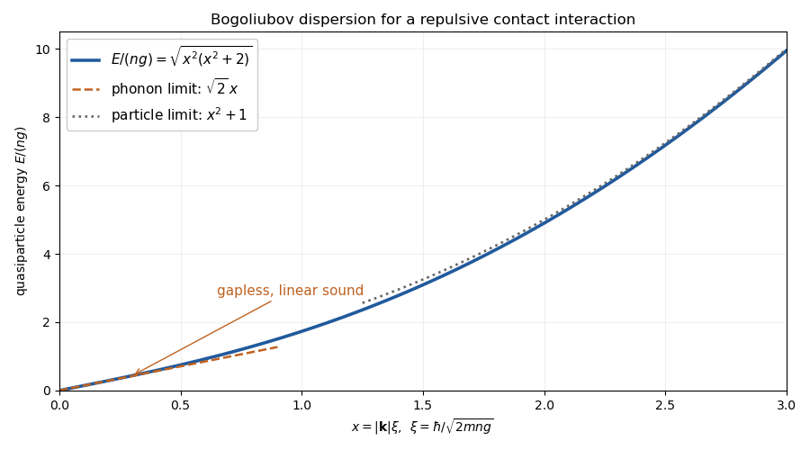

<h1 id="2/b/solution">Solution</h1>

↑ **Parent:** [B](../b.md)

Put $A_k=\epsilon_k+nV_k$ and $B_k=nV_k$, and assume the homogeneous condensate is stable, so $A_k>|B_k|$ for nonzero modes. A real [Bogoliubov transformation](../../../../../../bogoliubov-transformation.md) is

$$
b_{\mathbf k}=u_k\alpha_{\mathbf k}-v_k\alpha_{-\mathbf k}^\dagger,\qquad u_k^2-v_k^2=1.
$$

The canonical condition preserves the bosonic [canonical commutation relations](../../../../../../canonical-commutation-relation.md). Cancellation of pair terms requires $2A_ku_kv_k=B_k(u_k^2+v_k^2)$. Therefore

$$
\boxed{E_k=\sqrt{A_k^2-B_k^2}=\sqrt{\epsilon_k(\epsilon_k+2nV_k)},}
$$

$$
u_k^2=\frac12\left(\frac{A_k}{E_k}+1\right),\qquad
v_k^2=\frac12\left(\frac{A_k}{E_k}-1\right),\qquad u_kv_k=\frac{B_k}{2E_k}.
$$

The sign of $v_k$ follows that of $B_k$. [Normal ordering](../../../../../../normal-ordering.md) the transformed operators gives the [bosonic Bogoliubov zero-point shift](../../../../../../bosonic-bogoliubov-zero-point-shift.md):

$$
\boxed{H=\frac{\mathcal V}{2}V_0n^2+\frac12\sum_{\mathbf k\ne0}(E_k-A_k)+\sum_{\mathbf k\ne0}E_k\alpha_{\mathbf k}^\dagger\alpha_{\mathbf k}.}
$$

Rearranging the last two terms is exactly the requested $-\frac12\sum A_k+\sum E_k(\alpha_k^\dagger\alpha_k+1/2)$ form. Each momentum appears in the sums, so opposite-momentum pairs are not counted again separately.

The [Bogoliubov quasiparticle dispersion](../../../../../../bogoliubov-quasiparticle-dispersion.md) is linear at low momentum when $V_k\to V_0>0$:

$$
\boxed{E_k\simeq\hbar c_s|k|,\qquad c_s=\sqrt{nV_0/m}.}
$$

It is a gapless [phonon](../../../../../../phonon.md) of the condensate, unlike the free-particle quadratic spectrum. For a contact repulsion $V_k=g>0$, the [healing length](../../../../../../healing-length.md) $\xi=\hbar/\sqrt{2mng}$ controls crossover to the particle regime $E_k\simeq\epsilon_k+ng$. A momentum-dependent potential can modify the higher-energy curve; the sketch uses the contact case and does not assume every interaction has that entire shape.

**[Figure 1](#2/b/image-gapless-phonon-to-particle-crossover-of-the-bogoliubov-dispersion-for-a-repulsive-contact-interaction). Gapless phonon-to-particle crossover of the Bogoliubov dispersion for a repulsive contact interaction**.

## ↑ Ancestors (11)

1. [B](../b.md)
2. [2](../../2.md)
3. [Paper 81](../../../paper-81-split.md)
4. [Iii](../../../split.md)
5. [2014](../../../../split.md)
6. [Past exam of the mathematics course of the University of Cambridge](../../../../../split.md)
7. [Mathematics course of the University of Cambridge](../../../../../../mathematics-course-of-the-university-of-cambridge.md)
8. [Course of the University of Cambridge](../../../../../../course-of-the-university-of-cambridge.md)
9. [University of Cambridge](../../../../../../university-of-cambridge-split.md)
10. [List of universities](../../../../../../list-of-universities.md)
11. [Codex Wiki](../../../../../../split.md)
