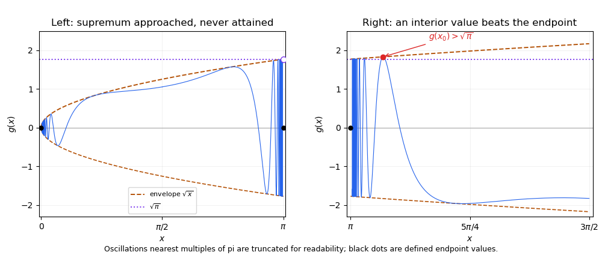

<h1 id="10d/b/solution">Solution</h1>

↑ **Parent:** [B](../b.md)

Away from integer multiples of $\pi$, the function is a composition of [continuous functions](../../../../../../continuous-function.md). At zero, the bound $|g(x)|\leq\sqrt{|x|}$ gives $g(x)\to0=g(0)$ by the [squeeze theorem](../../../../../../squeeze-theorem.md). This is [oscillation multiplied by a vanishing amplitude](../../../../../../oscillation-multiplied-by-a-vanishing-amplitude.md).

Fix $n\ne0$ and set $t_k=\pi/2+2\pi k$ and $x_k=n\pi+(-1)^n\arcsin(1/t_k)$. Then $x_k\to n\pi$, $\sin x_k=1/t_k$, and

$$
g(x_k)=\sqrt{|x_k|}\longrightarrow\sqrt{|n\pi|}\ne0=g(n\pi).
$$

So $g$ is discontinuous at every nonzero integer multiple of $\pi$. Its **set of continuity points** is

$$
\boxed{\mathbb R\setminus\{n\pi:n\in\mathbb Z,\ n\ne0\}.}
$$

On $[0,\pi]$, $g(x)\leq\sqrt{x}<\sqrt\pi$ for $x<\pi$, while $g(\pi)=0$. With $x_k=\pi-\arcsin(1/t_k)$ as above, $g(x_k)=\sqrt{x_k}\to\sqrt\pi$. Consequently **the supremum is $\sqrt\pi$ and is not attained**. This illustrates that [supremum can fail to be attained at an oscillatory endpoint](../../../../../../supremum-can-fail-to-be-attained-at-an-oscillatory-endpoint.md).

On $[\pi,3\pi/2]$, set $x_0=\pi+\arcsin(2/(3\pi))$. It lies strictly inside the interval, and $1/\sin x_0=-3\pi/2$, so $g(x_0)=\sqrt{x_0}>\sqrt\pi$. Choose $0<\delta<x_0-\pi$. On $[\pi,\pi+\delta]$,

$$
g(x)\leq\sqrt{\pi+\delta}<\sqrt{x_0}=g(x_0).
$$

On $[\pi+\delta,3\pi/2]$, $g$ is a [continuous function](../../../../../../continuous-function.md), so the [extreme value theorem](../../../../../../extreme-value-theorem.md) gives a maximum there, at least $g(x_0)$. It exceeds every value on the discarded interval. Therefore **$g$ does attain its supremum on $[\pi,3\pi/2]$**. This is the [interior-value criterion for an attained maximum](../../../../../../interior-value-criterion-for-an-attained-maximum.md).

**[Figure 1](#10d/b/image-oscillatory-function-near-pi-an-unattained-left-supremum-and-a-right-interior-value-above-the-endpoint-envelope). Oscillatory function near pi: an unattained left supremum and a right interior value above the endpoint envelope**.

## ↑ Ancestors (11)

1. [B](../b.md)
2. [10D](../../10d.md)
3. [Paper 1](../../../paper-1-split.md)
4. [Ia](../../../split.md)
5. [2015](../../../../split.md)
6. [Past exam of the mathematics course of the University of Cambridge](../../../../../split.md)
7. [Mathematics course of the University of Cambridge](../../../../../../mathematics-course-of-the-university-of-cambridge.md)
8. [Course of the University of Cambridge](../../../../../../course-of-the-university-of-cambridge.md)
9. [University of Cambridge](../../../../../../university-of-cambridge-split.md)
10. [List of universities](../../../../../../list-of-universities.md)
11. [Codex Wiki](../../../../../../split.md)
