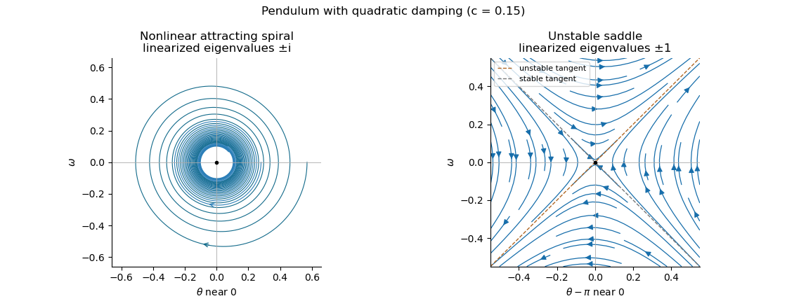

# Paper 2

↑ **Parent:** [Ia](../ia.md)

[https://www.maths.cam.ac.uk/undergrad/pastpapers/files/2015/PaperIA_2.pdf](https://www.maths.cam.ac.uk/undergrad/pastpapers/files/2015/PaperIA_2.pdf)

**Table of contents**

- [1B](#1b)
  - [Solution](#1b/solution)
- [2B](#2b)
  - [Solution](#2b/solution)
- [3F](#3f)
  - [a](#3f/a)
    - [Solution](#3f/a/solution)
  - [b](#3f/b)
    - [Solution](#3f/b/solution)
- [4F](#4f)
  - [Solution](#4f/solution)
- [5B](#5b)
  - [Solution](#5b/solution)
- [6B](#6b)
  - [Solution](#6b/solution)
- [7B](#7b)
  - [Solution](#7b/solution)
- [8B](#8b)
  - [i](#8b/i)
    - [Solution](#8b/i/solution)
  - [ii](#8b/ii)
    - [Solution](#8b/ii/solution)
  - [iii](#8b/iii)
    - [Solution](#8b/iii/solution)
- [9F](#9f)
  - [Solution](#9f/solution)
- [10F](#10f)
  - [Solution](#10f/solution)
- [11F](#11f)
  - [Solution](#11f/solution)
- [12F](#12f)
  - [Solution](#12f/solution)

## 1B

↑ **Parent:** [Paper 2](paper-2.md)

<h3 id="1b/solution">Solution</h3>

↑ **Parent:** [1B](#1b)

The [integrating factor](../../../differential-equation.md#integrating-factor) is $e^{-2x}$, so $(e^{-2x}y)'=e^{(\lambda-2)x}$. Integrating gives **the general solution**

$$
\boxed{y=Ce^{2x}+\frac{e^{\lambda x}}{\lambda-2}\quad(\lambda\ne2).}
$$

The [particular solution](../../../differential-equation.md#particular-solution) is only defined up to a [homogeneous solution](../../../differential-equation.md#homogeneous-solution). Subtract $e^{2x}/(\lambda-2)$ from it, absorbing that multiple into the arbitrary constant. The same family can then be written

$$
y=\widetilde C e^{2x}+\frac{e^{\lambda x}-e^{2x}}{\lambda-2}.
$$

Holding $\widetilde C$ fixed, the quotient tends to $xe^{2x}$, the derivative of $e^{\lambda x}$ with respect to $\lambda$ at $2$. Thus **the resonant family is $y=e^{2x}(\widetilde C+x)$**. Direct differentiation gives $y'-2y=e^{2x}$, so it is the full general solution at resonance. This [resonant exponential forcing in a first-order equation](../../../differential-equation.md#resonant-exponential-forcing-in-a-first-order-equation) limit concerns a reparametrized family, not a fixed value of the original divergent constant $C$. The [initial condition](../../../differential-equation.md#initial-condition) gives $\widetilde C=2e^{-2}-1$, hence

$$
\boxed{y(x)=e^{2x}\left(x-1+2e^{-2}\right).}
$$

## 2B

↑ **Parent:** [Paper 2](paper-2.md)

<h3 id="2b/solution">Solution</h3>

↑ **Parent:** [2B](#2b)

The [equilibrium points](../../../dynamical-systems.md#equilibrium-point-of-a-dynamical-system) are $y=0,1,-1$. To obtain the other solutions of this [separable differential equation](../../../differential-equation.md#separable-differential-equation) without losing their signs, set $z=y^{-2}$ on an interval where $y\ne0$. Then $z'=1-z$, so $z=1+Ke^{-t}$. Therefore **all real solutions** are

$$
\boxed{y(t)\equiv0\quad\text{or}\quad y(t)=\frac{s}{\sqrt{1+Ke^{-t}}},\qquad s\in\{-1,1\},}
$$

on intervals where $1+Ke^{-t}>0$. This family includes $y\equiv\pm1$ when $K=0$. For a prescribed finite nonzero $y(0)=y_0$, $s=\operatorname{sgn}y_0$ and $K=y_0^{-2}-1>-1$, so the solution exists for all future time. The [cubic logistic differential equation](../../../differential-equation.md#cubic-logistic-differential-equation) has

$$
\boxed{\lim_{t\to\infty}y(t)=\begin{cases}1&y_0>0,\\0&y_0=0,\\-1&y_0<0.\end{cases}}
$$

These are the only possible limits. The sign cannot change by uniqueness, and the denominator tends to one. A nonzero [initial condition](../../../differential-equation.md#initial-condition) producing a constant solution is **$y(0)=1$**; **$y(0)=-1$** also works. The central [equilibrium point](../../../dynamical-systems.md#equilibrium-point-of-a-dynamical-system) is unstable and the two outer [equilibrium points](../../../dynamical-systems.md#equilibrium-point-of-a-dynamical-system) attract solutions from their respective half-lines.

## 3F

↑ **Parent:** [Paper 2](paper-2.md)

<h3 id="3f/a">a</h3>

↑ **Parent:** [3F](#3f)

<h4 id="3f/a/solution">Solution</h4>

↑ **Parent:** [A](#3f/a)

For $x\geq0$, the monotonicity of the logarithm and the [uniform distribution](../../../continuous-probability-distribution.md#continuous-uniform-distribution) give

$$
P\left(-\frac{\log U}{\lambda}\leq x\right)=P(U\geq e^{-\lambda x})=1-e^{-\lambda x}.
$$

For $x<0$ the [cumulative distribution function](../../../probability-theory.md#cumulative-distribution-function) is zero. Differentiation gives the [probability density function](../../../continuous-probability-distribution.md#probability-density-function) $f(x)=\lambda e^{-\lambda x}$ for $x>0$, and zero elsewhere. **The distribution is $\boxed{\operatorname{Exp}(\lambda)}$**, with rate $\lambda$. This is [inverse transform sampling](../../../probability-theory.md#inverse-transform-sampling) of an [exponential distribution](../../../continuous-probability-distribution.md#exponential-distribution).

<h3 id="3f/b">b</h3>

↑ **Parent:** [3F](#3f)

<h4 id="3f/b/solution">Solution</h4>

↑ **Parent:** [B](#3f/b)

Condition on the fair coin, taken independent of $U$. For the [squared uniform distribution](../../../continuous-probability-distribution.md#squared-uniform-distribution), the [cumulative distribution function](../../../probability-theory.md#cumulative-distribution-function) of $U^2$ is $\sqrt{x}$ on $0<x<1$, giving [probability density function](../../../continuous-probability-distribution.md#probability-density-function) $1/(2\sqrt{x})$. Reflection about $1/2$ gives the [probability density function](../../../continuous-probability-distribution.md#probability-density-function) of $1-U^2$ as $1/(2\sqrt{1-x})$. Averaging the two conditional [probability density functions](../../../continuous-probability-distribution.md#probability-density-function) produces this [mixture model](../../../statistical-modelling.md#mixture-model):

$$
\boxed{f_X(x)=\begin{cases}\dfrac1{4\sqrt{x}}+\dfrac1{4\sqrt{1-x}}&0<x<1,\\0&\text{otherwise}.\end{cases}}
$$

There are no atoms at the endpoints; each integrable singularity contributes half the total mass. Equivalently the [cumulative distribution function](../../../probability-theory.md#cumulative-distribution-function) is $[\sqrt{x}+1-\sqrt{1-x}]/2$ on the interval.

## 4F

↑ **Parent:** [Paper 2](paper-2.md)

<h3 id="4f/solution">Solution</h3>

↑ **Parent:** [4F](#4f)

Put $a=P(A)$, $b=P(B)$ and $j=P(A\cap B)$. Because $a,b>0$, the [conditional probability](../../../probability-theory.md#conditional-probability) inequality $P(A\mid B)>P(A)$ is equivalent to $j>ab$. But that same inequality gives $j/a>b$, or **$\boxed{P(B\mid A)>P(B)}$**. Thus [positive association of two events](../../../probability-theory.md#positive-association-of-two-events) is symmetric.

For the [complement of an event](../../../probability-theory.md#complement-of-an-event), $P(B^c)=1-b>0$, and

$$
P(A\mid B^c)=\frac{a-j}{1-b}<\frac{a-ab}{1-b}=a.
$$

Therefore **$B^c$ strictly repels $A$**; equivalently $P(B^c\mid A)=1-j/a<1-b=P(B^c)$. Both directions are stated because the wording switches the grammatical roles of attraction and repulsion. The substantive conclusion is the same: the conditional probabilities involving the complement are strictly smaller than their unconditional counterparts.

## 5B

↑ **Parent:** [Paper 2](paper-2.md)

<h3 id="5b/solution">Solution</h3>

↑ **Parent:** [5B](#5b)

Introduce $\omega=\dot\theta$. The [pendulum with quadratic damping](../../../physics.md#pendulum-with-quadratic-damping) is the [autonomous planar system](../../../dynamical-systems.md#autonomous-planar-system)

$$
\boxed{\dot\theta=\omega,\qquad\dot\omega=-\sin\theta-c\omega|\omega|.}
$$

Its [equilibrium points](../../../dynamical-systems.md#equilibrium-point-of-a-dynamical-system) are $(k\pi,0)$. Since the derivative of $\omega|\omega|$ is zero at zero, the [linearization of a dynamical system](../../../algebra.md#linearization-of-a-dynamical-system) at each [equilibrium point](../../../dynamical-systems.md#equilibrium-point-of-a-dynamical-system) is

$$
J_k=\begin{pmatrix}0&1\\-\cos(k\pi)&0\end{pmatrix}.
$$

At an odd multiple of $\pi$ its [eigenvalues](../../../linear-operator-theory.md#eigenvalue) are $\pm1$, so it is a [saddle equilibrium](../../../dynamical-systems.md#saddle-equilibrium); the stable and unstable tangents are $\omega=-(\theta-k\pi)$ and $\omega=\theta-k\pi$. At an even multiple the [eigenvalues](../../../linear-operator-theory.md#eigenvalue) are $\pm i$. This linearization is a centre and does not decide the nonlinear stability. In particular it would be incorrect to infer a linear damped focus from this Jacobian.

For the full system the mechanical energy is a [Lyapunov function](../../../dynamical-systems.md#lyapunov-function) near an even [equilibrium point](../../../dynamical-systems.md#equilibrium-point-of-a-dynamical-system):

$$
H(\theta,\omega)=\frac12\omega^2+1-\cos\theta,\qquad\boxed{\dot H=-c|\omega|^3\leq0.}
$$

A sufficiently small sublevel set is compact and contains only that [equilibrium point](../../../dynamical-systems.md#equilibrium-point-of-a-dynamical-system). The only invariant motion with $\dot H=0$ has $\omega=0$ and $\sin\theta=0$, hence is the [equilibrium point](../../../dynamical-systems.md#equilibrium-point-of-a-dynamical-system) itself. The [LaSalle invariance principle](../../../dynamical-systems.md#lasalle-s-invariance-principle) proves [asymptotic stability](../../../dynamical-systems.md#asymptotic-stability). Near it the trajectories turn clockwise and spiral inward, as the near-linear angular motion persists while energy decreases. Thus **even equilibria are nonhyperbolic asymptotically stable spiral points; odd equilibria remain saddles**.

**[Figure 1](#5b/image-local-phase-trajectories-near-a-stable-pendulum-equilibrium-and-an-unstable-saddle-with-quadratic-damping). Local phase trajectories near a stable pendulum equilibrium and an unstable saddle with quadratic damping**.

For explicit trajectories put $W=\omega^2$ on a branch where $\omega\ne0$. The [chain rule](../../../calculus.md#chain-rule) gives $dW/d\theta=2\dot\omega$, so the two signs yield the [first-order linear differential equations](../../../differential-equation.md#first-order-linear-differential-equation) $W'+2cW=-2\sin\theta$ for $\omega>0$, and $W'-2cW=-2\sin\theta$ for $\omega<0$. Their [integrating factors](../../../differential-equation.md#integrating-factor) give

$$
\boxed{\begin{aligned}\omega^2&=K_+e^{-2c\theta}+\frac{2(\cos\theta-2c\sin\theta)}{1+4c^2},&&\omega>0,\\\omega^2&=K_-e^{2c\theta}+\frac{2(\cos\theta+2c\sin\theta)}{1+4c^2},&&\omega<0.\end{aligned}}
$$

Only portions with a nonnegative right-hand side are physical. At a turning point the constants of the two branches are matched using $\omega=0$; neither expression is one global trajectory through both signs. When $c=0$ they reduce to energy contours, with closed orbits around the even [equilibrium points](../../../dynamical-systems.md#equilibrium-point-of-a-dynamical-system). For every $c>0$, the [quadratic damping](../../../fluid-mechanics.md#quadratic-damping) destroys those closed orbits and makes the centres attracting spirals. Its effect is higher order in amplitude, so decay is weaker near rest than with linear damping. The [saddle equilibria](../../../dynamical-systems.md#saddle-equilibrium) remain unstable, though their separatrices change shape.

## 6B

↑ **Parent:** [Paper 2](paper-2.md)

<h3 id="6b/solution">Solution</h3>

↑ **Parent:** [6B](#6b)

The [chain rule](../../../calculus.md#chain-rule) gives $\partial_x=\partial_\xi+\beta\partial_\eta$ and $\partial_y=\alpha\partial_\xi+\partial_\eta$. The coefficients of $u_{\xi\xi}$ and $u_{\eta\eta}$ are $2+3\alpha^2-7\alpha$ and $2\beta^2+3-7\beta$. Their integer roots are **$\alpha=2$ and $\beta=3$**. Thus choose [characteristic coordinates](../../../partial-differential-equation.md#characteristic-coordinate) $\xi=x+2y$, $\eta=3x+y$, whose Jacobian determinant is $-5\ne0$. The coefficient of $u_{\xi\eta}$ is $4\beta+6\alpha-7(1+\alpha\beta)=-25$, so the equation becomes $-25u_{\xi\eta}=0$, equivalently $u_{\xi\eta}=0$.

Integrating the transformed [hyperbolic partial differential equation](../../../partial-differential-equation.md#hyperbolic-partial-differential-equation) gives $u=F(\xi)+G(\eta)$. Along $x=-2y$ the coordinates are $(0,-5y)$, so the zero [boundary condition](../../../differential-equation.md#boundary-condition) gives $G(\eta)=-F(0)$ for every real $\eta$. Along $x=0$ they are $(2y,y)$, so $F(2y)-F(0)=4y^2$, hence $F(\xi)=\xi^2+F(0)$. The constants cancel and the unique resulting solution is

$$
\boxed{u(x,y)=(x+2y)^2.}
$$

It directly satisfies both [boundary conditions](../../../differential-equation.md#boundary-condition) and $2u_{xx}+3u_{yy}-7u_{xy}=4+24-28=0$.

## 7B

↑ **Parent:** [Paper 2](paper-2.md)

<h3 id="7b/solution">Solution</h3>

↑ **Parent:** [7B](#7b)

Work on an interval where the [change of variables](../../../calculus.md#change-of-variables-formula) is smooth and invertible, with $s=\dot x\ne0$. If $v(t)=u(x(t))$, the [chain rule](../../../calculus.md#chain-rule) gives $\dot v=s u_x$ and $\ddot v=s^2u_{xx}+\dot s u_x$. Eliminating $u_{xx}$ using the original [second-order linear differential equation](../../../differential-equation.md#second-order-linear-differential-equation) gives

$$
\boxed{\ddot v-\frac{\dot s}{s}\dot v-s^2f(x)v=0.}
$$

For the real transformation as printed, take $s>0$. Set $v=s^{1/2}U$, which is the [Liouville transformation of a second-order equation](../../../differential-equation.md#liouville-transformation-of-a-second-order-equation). Differentiating twice makes the coefficient of $\dot U$ cancel. Dividing by $s^{1/2}$ leaves

$$
\boxed{\ddot U-\left[s^2f(x)+\frac{3\dot s^2}{4s^2}-\frac{\ddot s}{2s}\right]U=0.}
$$

The additional term is exactly $s^{-1/2}[(\dot s/s)d(s^{1/2})/dt-d^2(s^{1/2})/dt^2]$, as required.

On an interval with $f>0$, choose $s=f^{-1/2}$ and therefore $t=\int^x\sqrt{f(\zeta)}\,d\zeta$ up to a constant. Primes in the following expression mean derivatives with respect to $x$. We have $\dot s=-f'/(2f^2)$ and $\ddot s=-f''/(2f^{5/2})+(f')^2/f^{7/2}$, giving the [WKB correction term](../../../analysis.md#wkb-correction-term)

$$
\boxed{\ddot U-[1+F(t)]U=0,\qquad F(t)=\left[\frac{f''}{4f^2}-\frac{5(f')^2}{16f^3}\right]_{x=x(t)}.}
$$

Neglecting $F$ gives $U=c_+e^t+c_-e^{-t}$. Since $u=s^{1/2}U$, the [WKB approximation](../../../analysis.md#wkb-approximation) is

$$
\boxed{u(x)\approx f(x)^{-1/4}\left(c_+e^{\int^x\sqrt f\,d\zeta}+c_-e^{-\int^x\sqrt f\,d\zeta}\right),\qquad A(x)=f(x)^{-1/4},\quad G(x)=\int^x\sqrt f\,d\zeta.}
$$

Changing the lower integration limit only rescales the constants. Small $|F|$ is the stated local approximation criterion; rapid variation or a turning point can invalidate it, and small local residual alone need not imply uniform accuracy over an arbitrarily long interval.

The printed hypothesis only says $f\ne0$. If real $f<0$ on the interval, the printed square roots require a consistent complex branch. Equivalently a real [WKB approximation](../../../analysis.md#wkb-approximation) is

$$
u(x)\approx |f(x)|^{-1/4}\left[C_1\cos\left(\int^x\sqrt{|f|}\,d\zeta\right)+C_2\sin\left(\int^x\sqrt{|f|}\,d\zeta\right)\right].
$$

This supplies the oscillatory interpretation for the negative-$f$ case instead of silently assuming that the original nonzero hypothesis means positive. Smoothness through the derivatives used above and absence of zeros are required locally.

## 8B

↑ **Parent:** [Paper 2](paper-2.md)

<h3 id="8b/i">i</h3>

↑ **Parent:** [8B](#8b)

<h4 id="8b/i/solution">Solution</h4>

↑ **Parent:** [I](#8b/i)

The [independence of eigenvectors for distinct eigenvalues](../../../linear-operator-theory.md#independence-of-eigenvectors-for-distinct-eigenvalues) ensures that such [eigenvectors](../../../linear-operator-theory.md#eigenvector) form a [linearly independent](../../../vector-space.md#linear-independence) set. For completeness, apply $\prod_{j\ne k}(M-\lambda_j I)$ to a proposed relation $\sum_i c_i\mathbf e_i=0$. It leaves $c_k\prod_{j\ne k}(\lambda_k-\lambda_j)\mathbf e_k=0$, so every $c_k=0$. Thus the three [eigenvectors](../../../linear-operator-theory.md#eigenvector) form a [basis](../../../vector-space.md#basis) over the relevant field and $\mathbf x=\sum_i a_i(t)\mathbf e_i$. Substitution into the [linear system of ordinary differential equations](../../../differential-equation.md#linear-system-of-differential-equations) gives $\sum_i(\dot a_i-\lambda_i a_i)\mathbf e_i=0$; [linear independence](../../../vector-space.md#linear-independence) implies $\dot a_i=\lambda_i a_i$. Hence

$$
\boxed{\mathbf x(t)=\sum_{i=1}^3 A_i e^{\lambda_i t}\mathbf e_i.}
$$

A real matrix may have a complex conjugate pair of [eigenvalues](../../../linear-operator-theory.md#eigenvalue). In that case the calculation is over $\mathbb C$ and conjugate coefficients yield real solutions; equivalently use real and imaginary parts of the complex modes. No unstated assumption that all three [eigenvalues](../../../linear-operator-theory.md#eigenvalue) are real is needed.

<h3 id="8b/ii">ii</h3>

↑ **Parent:** [8B](#8b)

<h4 id="8b/ii/solution">Solution</h4>

↑ **Parent:** [Ii](#8b/ii)

The three [linearly independent](../../../vector-space.md#linear-independence) [eigenvectors](../../../linear-operator-theory.md#eigenvector) still form a [basis](../../../vector-space.md#basis), so the same coefficient calculation applies to this [diagonalizable matrix](../../../linear-operator-theory.md#diagonalizable-matrix) matrix. **The general solution is**

$$
\boxed{\mathbf x(t)=A_1e^{\lambda_1t}\mathbf e_1+e^{\lambda_2t}(A_2\mathbf e_2+A_3\mathbf e_3).}
$$

A repeated [eigenvalue](../../../linear-operator-theory.md#eigenvalue) alone does not create a polynomial factor in time; that factor is needed only when a nontrivial [Jordan block](../../../linear-operator-theory.md#jordan-block) prevents a full eigenvector [basis](../../../vector-space.md#basis).

<h3 id="8b/iii">iii</h3>

↑ **Parent:** [8B](#8b)

<h4 id="8b/iii/solution">Solution</h4>

↑ **Parent:** [Iii](#8b/iii)

Suppose $\mathbf v=\alpha\mathbf e_1+\beta\mathbf e_2$. Applying $M-\lambda_2I$ would give $\mathbf e_2=\alpha(\lambda_1-\lambda_2)\mathbf e_1$, contradicting [linear independence](../../../vector-space.md#linear-independence) of the two [eigenvectors](../../../linear-operator-theory.md#eigenvector). Therefore the [generalized eigenvector](../../../linear-operator-theory.md#generalized-eigenvector) $\mathbf v$ lies outside their span and $(\mathbf e_1,\mathbf e_2,\mathbf v)$ is a [basis](../../../vector-space.md#basis). Write $\mathbf x=a\mathbf e_1+b\mathbf e_2+d\mathbf v$. Since $M\mathbf v=\lambda_2\mathbf v+\mathbf e_2$, the [linear system of ordinary differential equations](../../../differential-equation.md#linear-system-of-differential-equations) gives

$$
\dot a=\lambda_1a,\qquad\dot d=\lambda_2d,\qquad\dot b=\lambda_2b+d.
$$

Solving these equations gives $a=A_1e^{\lambda_1t}$, $d=A_3e^{\lambda_2t}$ and $b=(A_2+A_3t)e^{\lambda_2t}$. Thus

$$
\boxed{\mathbf x(t)=A_1e^{\lambda_1t}\mathbf e_1+e^{\lambda_2t}\left[A_2\mathbf e_2+A_3(\mathbf v+t\mathbf e_2)\right].}
$$

The [length-two Jordan chain solution](../../../linear-operator-theory.md#length-two-jordan-chain-solution) for the [Jordan chain](../../../linear-operator-theory.md#jordan-chain) $(\mathbf e_2,\mathbf v)$ produces the $t e^{\lambda_2t}$ mode. The three arbitrary constants span all initial data, so this is the full general solution.

## 9F

↑ **Parent:** [Paper 2](paper-2.md)

<h3 id="9f/solution">Solution</h3>

↑ **Parent:** [9F](#9f)

Let $N=a+b$ and measure Lionel's fortune in unit stakes. This is [gambler's ruin](../../../markov-process.md#gambler-s-ruin): the fortune moves by $+1$ with probability $p$ and $-1$ with probability $q$, stopping at $0$ or $N$. Let $m_i$ be the [expected value](../../../probability-theory.md#expected-value) of the absorption time starting at $i$. It is finite: from any interior state, a run of $N$ wins or losses has a fixed positive probability of absorption within $N$ steps, giving a geometric bound on survival over successive blocks. [First-step analysis](../../../analysis.md#first-step-analysis) therefore gives

$$
m_i=1+pm_{i+1}+qm_{i-1},\qquad m_0=m_N=0.
$$

For $p\ne q$, the [homogeneous solution](../../../differential-equation.md#homogeneous-solution) of the recurrence is $A+B(q/p)^i$, and a [particular solution](../../../differential-equation.md#particular-solution) is $-i/(p-q)$. Put $\rho=q/p$. Imposing the two endpoint [boundary conditions](../../../differential-equation.md#boundary-condition) gives the [expected duration of biased gambler's ruin](../../../markov-process.md#expected-duration-of-biased-gambler-s-ruin)

$$
m_i=\frac{N(1-\rho^i)/(1-\rho^N)-i}{p-q}.
$$

Consequently **the expected number of games is**

$$
\boxed{\mathbb E[T]=\frac{(a+b)\dfrac{1-(q/p)^a}{1-(q/p)^{a+b}}-a}{p-q}.}
$$

The denominator and numerator have matching signs, so this is positive. As a check its continuous limit at $p=q=1/2$ is $a b$, the [expected duration of symmetric gambler's ruin](../../../markov-process.md#expected-duration-of-symmetric-gambler-s-ruin).

## 10F

↑ **Parent:** [Paper 2](paper-2.md)

<h3 id="10f/solution">Solution</h3>

↑ **Parent:** [10F](#10f)

The proposed [probability density function](../../../continuous-probability-distribution.md#probability-density-function) is nonnegative. To check its integral, put $I=\int_{\mathbb R}e^{-x^2/2}\,dx$. The [Gaussian integral](../../../calculus.md#gaussian-integral) can be evaluated by squaring and using polar coordinates:

$$
I^2=\int_{\mathbb R^2}e^{-(x^2+y^2)/2}\,dx\,dy=2\pi\int_0^\infty re^{-r^2/2}\,dr=2\pi.
$$

Since $I>0$, $I=\sqrt{2\pi}$ and $\int\phi=1$. Thus $X$ has the [standard normal distribution](../../../probability-theory.md#standard-normal-distribution). Completing the square in its [moment-generating function](../../../probability-theory.md#moment-generating-function) gives, for every real $t$,

$$
M_X(t)=\frac1{\sqrt{2\pi}}\int_{\mathbb R}e^{tx-x^2/2}\,dx=e^{t^2/2}\frac1{\sqrt{2\pi}}\int_{\mathbb R}e^{-(x-t)^2/2}\,dx=\boxed{e^{t^2/2}}.
$$

Differentiation under the integral is justified near every finite $t$ by Gaussian decay. Expanding $e^{t^2/2}=\sum_{m\geq0}t^{2m}/(2^m m!)$ gives **all moments**:

$$
\boxed{\mathbb E[X^{2m+1}]=0,\qquad\mathbb E[X^{2m}]=\frac{(2m)!}{2^m m!}\quad(m\geq0).}
$$

To obtain the [two-term bounds for Mills ratio](../../../probability-theory.md#two-term-bounds-for-mills-ratio), use $\phi'(t)=-t\phi(t)$. [Integration by parts](../../../calculus.md#integration-by-parts) gives, for $x>0$,

$$
\int_x^\infty\phi(t)\,dt=\frac{\phi(x)}x-\int_x^\infty\frac{\phi(t)}{t^2}\,dt.
$$

The positive remainder proves $r(x)<1/x$. A second [integration by parts](../../../calculus.md#integration-by-parts) gives

$$
\int_x^\infty\frac{\phi(t)}{t^2}\,dt=\frac{\phi(x)}{x^3}-3\int_x^\infty\frac{\phi(t)}{t^4}\,dt.
$$

Substitution and division by the strictly positive $\phi(x)$ show

$$
r(x)=\frac1x-\frac1{x^3}+\frac3{\phi(x)}\int_x^\infty\frac{\phi(t)}{t^4}\,dt.
$$

The last integral is strictly positive for every finite $x>0$, proving **$\boxed{1/x-1/x^3<r(x)<1/x}$**. Both remainders are finite for every fixed positive $x$; the lower bound remains valid even when it is negative.

## 11F

↑ **Parent:** [Paper 2](paper-2.md)

<h3 id="11f/solution">Solution</h3>

↑ **Parent:** [11F](#11f)

For a nonnegative [random variable](../../../random-variable.md) $Y$ with finite [expected value](../../../probability-theory.md#expected-value), and $a>0$, [Markov's inequality](../../../probability-inequality.md#markov-inequality) states $P(Y\geq a)\leq\mathbb E[Y]/a$. Indeed $Y\geq a\mathbf1_{\{Y\geq a\}}$, and taking [expected values](../../../probability-theory.md#expected-value) proves the bound. For a [random variable](../../../random-variable.md) $X$ with mean $\mu$ and finite [variance](../../../variance.md) $\sigma^2$, apply [Markov's inequality](../../../probability-inequality.md#markov-inequality) to $(X-\mu)^2$ at threshold $\varepsilon^2$. This proves [Chebyshev's inequality](../../../probability-inequality.md#chebyshev-inequality):

$$
\boxed{P(|X-\mu|\geq\varepsilon)\leq\frac{\sigma^2}{\varepsilon^2}.}
$$

For [independent and identically distributed random variables](../../../random-variable.md#independent-and-identically-distributed-random-variables) $X_1,X_2,\ldots$ with finite mean $\mu$ and [variance](../../../variance.md) $\sigma^2$, the sample mean has [expected value](../../../probability-theory.md#expected-value) $\mu$ and [variance](../../../variance.md) $\sigma^2/n$. Thus

$$
P\left(\left|\frac1n\sum_{i=1}^nX_i-\mu\right|\geq\varepsilon\right)\leq\frac{\sigma^2}{n\varepsilon^2}\longrightarrow0.
$$

This is **the weak law: $\boxed{n^{-1}\sum_{i=1}^nX_i\to\mu\text{ in probability}}$**, with the finite-variance hypotheses used in this direct deduction.

The more general [weak law of large numbers](../../../convergence-of-random-variables.md#weak-law-of-large-numbers) needs only $\mathbb E|X_1|<\infty$. To obtain that version, truncate $Y_i^{(K)}=X_i\mathbf1_{\{|X_i|\leq K\}}$. For fixed $K$ the bounded variables obey the result just proved. Their means tend to $\mu$, while [Markov's inequality](../../../probability-inequality.md#markov-inequality) bounds the probability that the two sample means differ by more than $\varepsilon/3$ by $3\mathbb E[|X_1|\mathbf1_{\{|X_1|>K\}}]/\varepsilon$. First take $n\to\infty$ and then $K\to\infty$; the integrable tail vanishes, proving the full integrable i.i.d. version as well.

Finally assume $\mathbb E[X]=0$ and $\operatorname{Var}(X)=\sigma^2$. For every $b>0$, $X\geq a$ implies $(X+b)^2\geq(a+b)^2$, so [Markov's inequality](../../../probability-inequality.md#markov-inequality) gives

$$
P(X\geq a)\leq\frac{\mathbb E[(X+b)^2]}{(a+b)^2}=\frac{\sigma^2+b^2}{(a+b)^2}.
$$

If $\sigma^2>0$, the derivative of the right-hand side is $2(ab-\sigma^2)/(a+b)^3$, so its minimum is at $b=\sigma^2/a$. The [Cantelli inequality](../../../probability-inequality.md#cantelli-inequality) follows:

$$
\boxed{P(X\geq a)\leq\frac{\sigma^2}{\sigma^2+a^2}.}
$$

If $\sigma^2=0$, $X=0$ almost surely and the same bound is immediate. The bound is sharp: put mass $\sigma^2/(\sigma^2+a^2)$ at $a$ and the remaining mass at $-\sigma^2/a$; this has exactly the prescribed mean and [variance](../../../variance.md).

## 12F

↑ **Parent:** [Paper 2](paper-2.md)

<h3 id="12f/solution">Solution</h3>

↑ **Parent:** [12F](#12f)

Interpret random choice of coin as equal prior probabilities, and the tosses as [independent](../../../random-variable.md#independent-random-variables) conditional on the chosen coin. Let $H_2$ denote two heads. The conditional probabilities are $P(H_2\mid A)=1/16$ and $P(H_2\mid B)=9/16$. For [posterior coin selection from repeated tosses](../../../probability-theory.md#posterior-coin-selection-from-repeated-tosses), [Bayes' theorem](../../../probability-theory.md#bayes-theorem) gives

$$
\boxed{P(B\mid H_2)=\frac{(1/2)(9/16)}{(1/2)(1/16)+(1/2)(9/16)}=\frac9{10}.}
$$

The tosses need not be unconditionally [independent](../../../random-variable.md#independent-random-variables), because the same hidden coin is used twice. If the coin-choice prior were instead $P(B)=\pi$, the answer would be $9\pi/(1+8\pi)$; equal choice gives the stated $9/10$.

For [nondecreasing uniform samples](../../../discrete-probability-distribution.md#nondecreasing-uniform-samples) in the lottery, all $n^r$ ordered samples have equal probability by the [discrete uniform distribution](../../../discrete-probability-distribution.md#discrete-uniform-distribution) and [independence](../../../random-variable.md#independent-random-variables). A nondecreasing sample is uniquely specified by its multiplicities $k_1,\ldots,k_n\geq0$, with $k_1+\cdots+k_n=r$. The [stars and bars](../../../combinatorics.md#stars-and-bars-combinatorics) argument places $n-1$ separators among $r$ identical markers, giving $\binom{r+n-1}{n-1}$ multiplicity vectors. There is exactly one nondecreasing ordered sample for each such vector, so **the probability is**

$$
\boxed{\frac{\binom{r+n-1}{n-1}}{n^r}=\frac{\binom{r+n-1}{r}}{n^r}.}
$$

This counts samples with ties correctly; multiplying a single strictly increasing count by $r!$ would not handle the repeated values.

## ↑ Ancestors (8)

1. [Ia](../ia.md)
2. [2015](../../2015.md)
3. [Past exam of the mathematics course of the University of Cambridge](../../../past-exam-of-the-mathematics-course-of-the-university-of-cambridge.md)
4. [Mathematics course of the University of Cambridge](../../../university-of-cambridge.md#mathematics-course-of-the-university-of-cambridge)
5. [Course of the University of Cambridge](../../../university-of-cambridge.md#course-of-the-university-of-cambridge)
6. [University of Cambridge](../../../university-of-cambridge.md)
7. [List of universities](../../../README.md#list-of-universities)
8. [Codex Wiki](../../../README.md)
