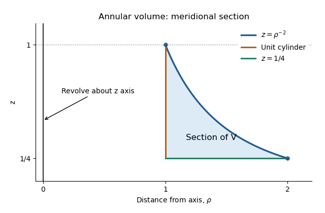
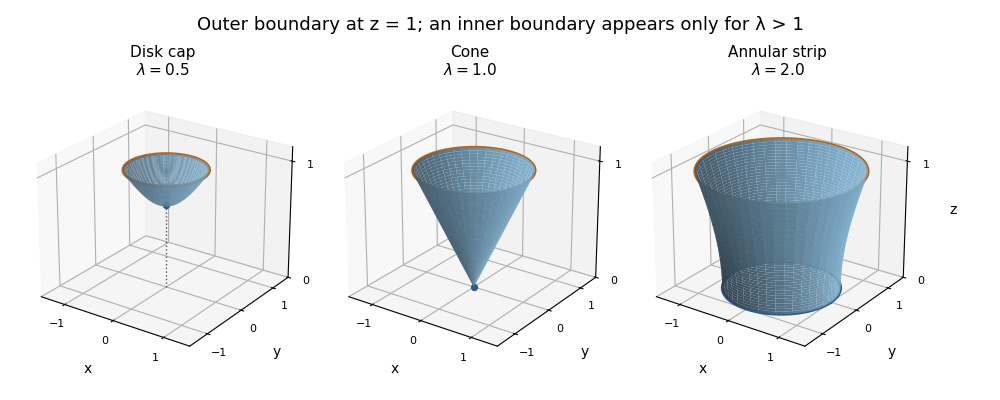

# Paper 3

↑ **Parent:** [Ia](../ia.md)

[https://www.maths.cam.ac.uk/undergrad/pastpapers/files/2015/PaperIA_3.pdf](https://www.maths.cam.ac.uk/undergrad/pastpapers/files/2015/PaperIA_3.pdf)

**Table of contents**

- [1D](#1d)
  - [i](#1d/i)
    - [Solution](#1d/i/solution)
  - [ii](#1d/ii)
    - [Solution](#1d/ii/solution)
  - [iii](#1d/iii)
    - [Solution](#1d/iii/solution)
- [2D](#2d)
  - [Solution](#2d/solution)
- [3A](#3a)
  - [i](#3a/i)
    - [Solution](#3a/i/solution)
  - [ii](#3a/ii)
    - [Solution](#3a/ii/solution)
- [4A](#4a)
  - [a](#4a/a)
    - [Solution](#4a/a/solution)
  - [b](#4a/b)
    - [Solution](#4a/b/solution)
  - [c](#4a/c)
    - [Solution](#4a/c/solution)
- [5D](#5d)
  - [Solution](#5d/solution)
  - [a](#5d/a)
    - [Solution](#5d/a/solution)
  - [b](#5d/b)
    - [Solution](#5d/b/solution)
- [6D](#6d)
  - [Solution](#6d/solution)
  - [a](#6d/a)
    - [Solution](#6d/a/solution)
  - [b](#6d/b)
    - [Solution](#6d/b/solution)
  - [c](#6d/c)
    - [Solution](#6d/c/solution)
  - [d](#6d/d)
    - [Solution](#6d/d/solution)
- [7D](#7d)
  - [a](#7d/a)
    - [Solution](#7d/a/solution)
  - [b](#7d/b)
    - [Solution](#7d/b/solution)
    - [i](#7d/b/i)
      - [Solution](#7d/b/i/solution)
    - [ii](#7d/b/ii)
      - [Solution](#7d/b/ii/solution)
    - [iii](#7d/b/iii)
      - [Solution](#7d/b/iii/solution)
- [8D](#8d)
  - [a](#8d/a)
    - [Solution](#8d/a/solution)
  - [b](#8d/b)
    - [Solution](#8d/b/solution)
  - [c](#8d/c)
    - [Solution](#8d/c/solution)
- [9A](#9a)
  - [Solution](#9a/solution)
- [10A](#10a)
  - [Solution](#10a/solution)
- [11A](#11a)
  - [i](#11a/i)
    - [Solution](#11a/i/solution)
  - [ii](#11a/ii)
    - [Solution](#11a/ii/solution)
  - [iii](#11a/iii)
    - [Solution](#11a/iii/solution)
  - [iv](#11a/iv)
    - [Solution](#11a/iv/solution)
- [12A](#12a)
  - [a](#12a/a)
    - [Solution](#12a/a/solution)
  - [b](#12a/b)
    - [Solution](#12a/b/solution)
  - [c](#12a/c)
    - [i](#12a/c/i)
      - [Solution](#12a/c/i/solution)
    - [ii](#12a/c/ii)
      - [Solution](#12a/c/ii/solution)
    - [iii](#12a/c/iii)
      - [Solution](#12a/c/iii/solution)
    - [iv](#12a/c/iv)
      - [Solution](#12a/c/iv/solution)

## 1D

↑ **Parent:** [Paper 3](paper-3.md)

<h3 id="1d/i">i</h3>

↑ **Parent:** [1D](#1d)

<h4 id="1d/i/solution">Solution</h4>

↑ **Parent:** [I](#1d/i)

The [two-involution characterization of a dihedral group](../../../group-theory.md#two-involution-characterization-of-a-dihedral-group) uses the extended convention that includes $C_2$ and the [infinite dihedral group](../../../representation-theory.md#infinite-dihedral-group); the two generators need not be distinct. Put $a=xy$ and $b=y$. The inversion relation gives

$$
a^2=xyxy=x(yxy^{-1})y^2=xx^{-1}=e,\qquad b^2=e,\qquad x=ab.
$$

If $a\ne e$, both $a,b$ are [involutions](../../../group-theory.md#involution) and generate the original [group](../../../group.md). If $a=e$, then $x=y$ and the [group](../../../group.md) is $C_2$; choose the same nonidentity element twice. Thus **two elements of order two generate the group**, including the degenerate case allowed here. The distinction between square equal to the identity and [order of a group element](../../../group-theory.md#order-of-a-group-element) exactly two is essential.

<h3 id="1d/ii">ii</h3>

↑ **Parent:** [1D](#1d)

<h4 id="1d/ii/solution">Solution</h4>

↑ **Parent:** [Ii](#1d/ii)

Let $a,b$ be the generating [involutions](../../../group-theory.md#involution). If $a\ne b$, set $x=ab$ and $y=b$. Then $x\ne e$, so its [order of a group element](../../../group-theory.md#order-of-a-group-element) is at least two or infinite, and

$$
yxy^{-1}=b(ab)b=ba=(ab)^{-1}=x^{-1},\qquad a=xy.
$$

Therefore $x,y$ generate the [group](../../../group.md) and satisfy the required dihedral inversion relation. If $a=b$, the [group](../../../group.md) is $C_2$ and $x=y=a$ gives its permitted degenerate description. This proves the [two-involution characterization of a dihedral group](../../../group-theory.md#two-involution-characterization-of-a-dihedral-group) without excluding either $C_2$ or the [infinite dihedral group](../../../representation-theory.md#infinite-dihedral-group).

<h3 id="1d/iii">iii</h3>

↑ **Parent:** [1D](#1d)

<h4 id="1d/iii/solution">Solution</h4>

↑ **Parent:** [Iii](#1d/iii)

Let $N$ be a [normal subgroup](../../../group-theory.md#normal-subgroup) and let $\pi:G\to G/N$ be the quotient [group homomorphism](../../../group-theory.md#group-homomorphism). By the first part, $G=\langle a,b\rangle$ for [involutions](../../../group-theory.md#involution) $a,b$, so the [quotient group](../../../group-theory.md#quotient-group) is generated by $\pi(a),\pi(b)$, whose squares are the identity. If both images are nonidentity, they are [involutions](../../../group-theory.md#involution) and the second part applies. If only one image is nonidentity, it generates $C_2$; choose it twice. Both images cannot be trivial because the [quotient group](../../../group-theory.md#quotient-group) is nontrivial. Hence **every nontrivial quotient is dihedral in the stated extended convention**. This is the [nontrivial-quotient closure of two-involution groups](../../../group-theory.md#nontrivial-quotient-closure-of-two-involution-groups).

## 2D

↑ **Parent:** [Paper 3](paper-3.md)

<h3 id="2d/solution">Solution</h3>

↑ **Parent:** [2D](#2d)

Every finite [cyclic subgroup](../../../group.md#cyclic-subgroup) of order $m$ has exactly $\varphi(m)$ generators, where $\varphi$ is the [Euler totient function](../../../number-theory.md#euler-totient-function): if $g$ has order $m$, then $g^k$ generates precisely when $\gcd(k,m)=1$. Each element generates exactly one [cyclic subgroup](../../../group.md#cyclic-subgroup). Thus [counting cyclic subgroups by their generators](../../../group.md#counting-cyclic-subgroups-by-their-generators) amounts to counting elements by [order of a group element](../../../group-theory.md#order-of-a-group-element) and dividing by $\varphi(m)$.

Use the [cycle decomposition of a permutation](../../../mathematics.md#cycle-decomposition-of-a-permutation) in $S_5$. A [permutation](../../../combinatorics.md#permutation) with $a_j$ cycles of length $j$ occurs $5!/\prod_j(j^{a_j}a_j!)$ times: order the five letters, then divide by the cyclic choices of starting point and the orderings of equal-length cycles. Its order is the [least common multiple](../../../number-theory.md#least-common-multiple) of the cycle lengths. The resulting count is

$$
\begin{array}{c|r|r|r}
\text{cycle type}&\text{elements}&\text{order}&\text{cyclic subgroups}\\\hline
1^5&1&1&1\\
2\,1^3&10&2&10\\
2^2\,1&15&2&15\\
3\,1^2&20&3&10\\
3\,2&20&6&10\\
4\,1&30&4&15\\
5&24&5&6
\end{array}
\qquad \boxed{1+10+15+10+10+15+6=67.}
$$

The two [subgroups](../../../group.md#subgroup) $\langle(12)\rangle$ and $\langle(12)(34)\rangle$ are both isomorphic to $C_2$ by a [group isomorphism](../../../algebra.md#group-isomorphism). They are not [conjugate subgroups](../../../group-theory.md#conjugate-subgroup): conjugating their unique nonidentity elements would have to preserve [cycle type](../../../finite-group-theory.md#cycle-type), whereas a transposition and a product of two disjoint transpositions have different [cycle types](../../../finite-group-theory.md#cycle-type).

## 3A

↑ **Parent:** [Paper 3](paper-3.md)

<h3 id="3a/i">i</h3>

↑ **Parent:** [3A](#3a)

<h4 id="3a/i/solution">Solution</h4>

↑ **Parent:** [I](#3a/i)

For the positive [Euclidean norm](../../../functional-analysis.md#euclidean-norm) $r=(x_1^2+x_2^2+x_3^2)^{1/2}$, the [chain rule](../../../calculus.md#chain-rule) gives

$$
\boxed{\partial_i r=\frac12(x_jx_j)^{-1/2}(2x_i)=\frac{x_i}{r},\qquad \nabla r=\widehat{\mathbf x}.}
$$

Repeated indices use the [Einstein summation convention](../../../linear-algebra.md#einstein-notation). The origin is excluded because the [Euclidean norm](../../../functional-analysis.md#euclidean-norm) is not differentiable there. Another derivative, useful below, is $\partial_i\widehat x_j=\delta_{ij}/r-x_ix_j/r^3$, with $\delta_{ij}$ the [Kronecker delta](../../../linear-algebra.md#kronecker-delta).

<h3 id="3a/ii">ii</h3>

↑ **Parent:** [3A](#3a)

<h4 id="3a/ii/solution">Solution</h4>

↑ **Parent:** [Ii](#3a/ii)

Use the [Einstein summation convention](../../../linear-algebra.md#einstein-notation), with [divergence](../../../calculus.md#divergence) $\partial_iF_i$ and [curl](../../../calculus.md#curl) $(\nabla\times\mathbf F)_i=\epsilon_{ijk}\partial_jF_k$, where $\epsilon_{ijk}$ is the [Levi-Civita symbol](../../../calculus.md#levi-civita-symbol). For the first [vector field](../../../calculus.md#vector-field),

$$
\partial_jF_i=2x_jx_i+r^2\delta_{ij},\qquad
\boxed{\nabla\cdot\mathbf F=5r^2,\quad \nabla\times\mathbf F=\mathbf0.}
$$

The derivative matrix is symmetric, so its contraction with the [Levi-Civita symbol](../../../calculus.md#levi-civita-symbol) vanishes. For the second [vector field](../../../calculus.md#vector-field),

$$
\partial_jG_i=a_jx_i+(\mathbf a\cdot\mathbf x)\delta_{ij},\qquad
\boxed{\nabla\cdot\mathbf G=4\mathbf a\cdot\mathbf x,\quad \nabla\times\mathbf G=\mathbf a\times\mathbf x.}
$$

For the third [vector field](../../../calculus.md#vector-field), $H_i=\epsilon_{ikl}a_kx_l/r$. Its [divergence](../../../calculus.md#divergence) is zero because the [Levi-Civita symbol](../../../calculus.md#levi-civita-symbol) contracts with symmetric products. For its [curl](../../../calculus.md#curl), either contract two [Levi-Civita symbols](../../../calculus.md#levi-civita-symbol) or use the [vector triple product](../../../calculus.md#vector-triple-product):

$$
\nabla\times\left(\frac{\mathbf a\times\mathbf x}{r}\right)
=-\frac{\mathbf x}{r^3}\times(\mathbf a\times\mathbf x)+\frac{2\mathbf a}{r}
=\frac{\mathbf a}{r}+\frac{(\mathbf a\cdot\mathbf x)\mathbf x}{r^3}.
$$

Thus

$$
\boxed{\nabla\cdot\mathbf H=0,\qquad
\nabla\times\mathbf H=\frac{\mathbf a+(\mathbf a\cdot\widehat{\mathbf x})\widehat{\mathbf x}}r.}
$$

All formulas hold on $r>0$, the domain where the radial [unit vector](../../../vector-space.md#unit-vector) is defined.

## 4A

↑ **Parent:** [Paper 3](paper-3.md)

<h3 id="4a/a">a</h3>

↑ **Parent:** [4A](#4a)

<h4 id="4a/a/solution">Solution</h4>

↑ **Parent:** [A](#4a/a)

For a [regular curve](../../../differential-geometry.md#regular-curve) parametrized by $u$, put $v(u)=|\mathbf x'(u)|>0$ and orient [arc length](../../../riemannian-geometry.md#arc-length) in the direction of increasing $u$. Since $ds=|d\mathbf x|=v\,du$, the [unit tangent vector](../../../differential-geometry.md#unit-tangent-vector) is

$$
\boxed{\frac{du}{ds}=\frac1v,\qquad \mathbf t=\frac{d\mathbf x}{ds}=\frac{\mathbf x'}v.}
$$

Regularity is the condition that permits division by $v$.

<h3 id="4a/b">b</h3>

↑ **Parent:** [4A](#4a)

<h4 id="4a/b/solution">Solution</h4>

↑ **Parent:** [B](#4a/b)

Differentiate the [unit tangent vector](../../../differential-geometry.md#unit-tangent-vector) with $d/ds=v^{-1}d/du$ and $v'=(\mathbf x'\cdot\mathbf x'')/v$. This gives

$$
\boxed{\frac{d\mathbf t}{ds}=\frac{\mathbf x''}{v^2}-\frac{\mathbf x'(\mathbf x'\cdot\mathbf x'')}{v^4}.}
$$

The [curvature of a space curve](../../../differential-geometry.md#curvature-of-a-space-curve) is $\kappa=|d\mathbf t/ds|$. Squaring the displayed expression and simplifying gives

$$
\kappa^2=\frac{v^2|\mathbf x''|^2-(\mathbf x'\cdot\mathbf x'')^2}{v^6}
=\frac{|\mathbf x'\times\mathbf x''|^2}{v^6},\qquad
\boxed{\kappa=\frac{|\mathbf x'\times\mathbf x''|}{|\mathbf x'|^3}.}
$$

The last equality is the [cross product](../../../vector-space.md#cross-product) norm identity. Equivalently, the hinted [vector triple product](../../../calculus.md#vector-triple-product) rewrites $d\mathbf t/ds=-\mathbf x'\times(\mathbf x'\times\mathbf x'')/v^4$.

<h3 id="4a/c">c</h3>

↑ **Parent:** [4A](#4a)

<h4 id="4a/c/solution">Solution</h4>

↑ **Parent:** [C](#4a/c)

This [plane curve](../../../algebraic-geometry.md#plane-curve) is an [Archimedean spiral](../../../algebraic-geometry.md#archimedean-spiral). Put $\mathbf e_r=(\cos u,\sin u,0)$ and $\mathbf e_\theta=(-\sin u,\cos u,0)$, so $\mathbf e_r'=\mathbf e_\theta$ and $\mathbf e_\theta'=-\mathbf e_r$. Then

$$
\mathbf x'=\mathbf e_r+u\mathbf e_\theta,\qquad
\mathbf x''=2\mathbf e_\theta-u\mathbf e_r,\qquad
|\mathbf x'|^2=1+u^2,\qquad
\mathbf x'\times\mathbf x''=(u^2+2)\mathbf e_z.
$$

Therefore the [curvature of a plane curve](../../../differential-geometry.md#curvature-of-a-plane-curve) is

$$
\boxed{\kappa(u)=\frac{u^2+2}{(1+u^2)^{3/2}},\qquad u\ge0.}
$$

The parametrization is regular even at $u=0$, where the [curvature of a plane curve](../../../differential-geometry.md#curvature-of-a-plane-curve) is $2$.

## 5D

↑ **Parent:** [Paper 3](paper-3.md)

<h3 id="5d/solution">Solution</h3>

↑ **Parent:** [5D](#5d)

A left [group action](../../../group-theory.md#group-action) is a map $(g,x)\mapsto g\cdot x$ with $e\cdot x=x$ and $(gh)\cdot x=g\cdot(h\cdot x)$. The [group orbit](../../../group-theory.md#orbit-of-a-group-action) and [stabiliser subgroup](../../../group-theory.md#stabilizer-subgroup) are

$$
\operatorname{Orb}(x)=\{g\cdot x:g\in G\},\qquad G_x=\{g\in G:g\cdot x=x\}.
$$

The identity belongs to $G_x$. If $g,h\in G_x$, then $(gh)\cdot x=g\cdot x=x$; also $g^{-1}\cdot x=g^{-1}\cdot(g\cdot x)=x$. Thus $G_x$ is a [subgroup](../../../group.md#subgroup).

For the [orbit-stabilizer theorem](../../../group-theory.md#orbit-stabilizer-theorem), the map $gG_x\mapsto g\cdot x$ from left [cosets](../../../group-theory.md#coset) to the [group orbit](../../../group-theory.md#orbit-of-a-group-action) is a bijection: $g\cdot x=h\cdot x$ if and only if $h^{-1}g\in G_x$, which is precisely $gG_x=hG_x$. Each left [coset](../../../group-theory.md#coset) has $|G_x|$ elements, since multiplication by $g$ is a bijection from $G_x$ to $gG_x$, and the left [cosets](../../../group-theory.md#coset) partition $G$. For finite $G$ this proves

$$
\boxed{|G|=|G_x|\,|\operatorname{Orb}(x)|.}
$$

<h3 id="5d/a">a</h3>

↑ **Parent:** [5D](#5d)

<h4 id="5d/a/solution">Solution</h4>

↑ **Parent:** [A](#5d/a)

The identity [permutation](../../../combinatorics.md#permutation) fixes every [multivariate polynomial](../../../polynomial.md#multivariate-polynomial). With permutation composition $(\sigma\tau)(i)=\sigma(\tau(i))$, substitution gives

$$
[\sigma\cdot(\tau\cdot f)](x_1,\ldots,x_n)
=f(x_{\sigma(\tau(1))},\ldots,x_{\sigma(\tau(n))})
=[(\sigma\tau)\cdot f](x_1,\ldots,x_n).
$$

Thus this is a left [variable-permutation action on polynomials](../../../group-theory.md#variable-permutation-action-on-polynomials). The substitution acts on variable names; using the displayed definition avoids reversing the composition order.

For the given [multivariate polynomial](../../../polynomial.md#multivariate-polynomial), the [group orbit](../../../group-theory.md#orbit-of-a-group-action) corresponds to the three partitions of four indices into two unordered pairs:

$$
\boxed{\operatorname{Orb}(f)=\{x_1x_2+x_3x_4,\ x_1x_3+x_2x_4,\ x_1x_4+x_2x_3\}.}
$$

These three [polynomials](../../../polynomial.md) are distinct, and every pairing occurs under a [permutation](../../../combinatorics.md#permutation). The [orbit-stabilizer theorem](../../../group-theory.md#orbit-stabilizer-theorem) gives

$$
\boxed{|(S_4)_f|=24/3=8.}
$$

The eight elements of the [stabiliser subgroup](../../../group-theory.md#stabilizer-subgroup) independently interchange the members of each pair, and may also interchange the two pairs.

<h3 id="5d/b">b</h3>

↑ **Parent:** [5D](#5d)

<h4 id="5d/b/solution">Solution</h4>

↑ **Parent:** [B](#5d/b)

Applying a [permutation](../../../combinatorics.md#permutation) to the elements of an $r$-element subset preserves its cardinality. The identity fixes each subset and

$$
\sigma\cdot(\tau\cdot U)=\{\sigma(\tau(u)):u\in U\}=(\sigma\tau)\cdot U,
$$

so this is the [symmetric group action on subsets](../../../group-theory.md#symmetric-group-action-on-subsets). For two $r$-element subsets $U,W$, choose a bijection $U\to W$ and a bijection between their complements; together they define a [permutation](../../../combinatorics.md#permutation) of the full $n$-element set. Hence **the action is transitive**.

A member of the [stabiliser subgroup](../../../group-theory.md#stabilizer-subgroup) must permute $U$ internally and its complement internally, with independent choices. Thus

$$
\boxed{|(S_n)_U|=r!(n-r)!,\qquad |\operatorname{Orb}(U)|=\binom nr.}
$$

This also agrees with the [orbit-stabilizer theorem](../../../group-theory.md#orbit-stabilizer-theorem); $0!=1$ handles $r=n$.

## 6D

↑ **Parent:** [Paper 3](paper-3.md)

<h3 id="6d/solution">Solution</h3>

↑ **Parent:** [6D](#6d)

A [group homomorphism](../../../group-theory.md#group-homomorphism) satisfies $\varphi(ab)=\varphi(a)\varphi(b)$ for every $a,b\in G$. Its [kernel of a group homomorphism](../../../group-theory.md#kernel-of-a-group-homomorphism) is $K=\{g:\varphi(g)=e_H\}$. The homomorphism equation gives $\varphi(e_G)=e_H$ by cancellation, and $\varphi(g^{-1})=\varphi(g)^{-1}$. Therefore $K$ contains the identity and is closed under multiplication and inverses, so it is a [subgroup](../../../group.md#subgroup).

For $k\in K$ and $x\in G$,

$$
\varphi(x^{-1}kx)=\varphi(x)^{-1}e_H\varphi(x)=e_H.
$$

Thus conjugation carries $K$ into itself, and applying the inverse conjugation gives equality: $K$ is a [normal subgroup](../../../group-theory.md#normal-subgroup). If $K=\{e,\xi\}$, conjugation cannot send $\xi$ to the identity because it is injective. Consequently

$$
\boxed{x^{-1}\xi x=\xi\quad\text{for every }x\in G.}
$$

This proves directly the [normal subgroup of order two is central](../../../group-theory.md#normal-subgroup-of-order-two-is-central) principle for kernels, including the kernel facts needed below.

<h3 id="6d/a">a</h3>

↑ **Parent:** [6D](#6d)

<h4 id="6d/a/solution">Solution</h4>

↑ **Parent:** [A](#6d/a)

**True.** The [determinant](../../../linear-algebra.md#determinant) gives a [group homomorphism](../../../group-theory.md#group-homomorphism)

$$
\det:O(3)\longrightarrow\{1,-1\},\qquad \det(AB)=\det(A)\det(B).
$$

For an [orthogonal matrix](../../../linear-algebra.md#orthogonal-matrix), $A^TA=I$ implies $(\det A)^2=1$, and a reflection has [determinant](../../../linear-algebra.md#determinant) $-1$, so the target has order two and the map is onto. Its [kernel of a group homomorphism](../../../group-theory.md#kernel-of-a-group-homomorphism) is exactly

$$
\boxed{\ker(\det)=SO(3).}
$$

This is the defining [special orthogonal group](../../../linear-algebra.md#special-orthogonal-group) inside the [orthogonal group](../../../linear-algebra.md#orthogonal-group).

<h3 id="6d/b">b</h3>

↑ **Parent:** [6D](#6d)

<h4 id="6d/b/solution">Solution</h4>

↑ **Parent:** [B](#6d/b)

**True.** The [sign of a permutation](../../../finite-group-theory.md#sign-of-a-permutation) is a [group homomorphism](../../../group-theory.md#group-homomorphism) $\operatorname{sgn}:S_3\to\{1,-1\}$, as follows, for example, from the multiplicative [determinant](../../../linear-algebra.md#determinant) of [permutation matrices](../../../vector-space.md#permutation-matrix). Its [kernel of a group homomorphism](../../../group-theory.md#kernel-of-a-group-homomorphism) is the [alternating group](../../../finite-group-theory.md#alternating-group)

$$
\boxed{A_3=\{e,(123),(132)\},\qquad |A_3|=3.}
$$

A transposition maps to $-1$, so this homomorphism is onto.

<h3 id="6d/c">c</h3>

↑ **Parent:** [6D](#6d)

<h4 id="6d/c/solution">Solution</h4>

↑ **Parent:** [C](#6d/c)

**True.** Use the [odd-dimensional orthogonal determinant splitting](../../../linear-algebra.md#odd-dimensional-orthogonal-determinant-splitting):

$$
\boxed{\Phi:O(3)\to SO(3),\qquad \Phi(A)=(\det A)A.}
$$

Scalar matrices commute with every matrix, so $\Phi(AB)=\Phi(A)\Phi(B)$. Its output is orthogonal and

$$
\det\Phi(A)=(\det A)^3\det A=(\det A)^4=1.
$$

Every $B\in SO(3)$ satisfies $\Phi(B)=B$, proving surjectivity. The equation $\Phi(A)=I$ forces $A=(\det A)I$, whence

$$
\boxed{\ker\Phi=\{I,-I\},\qquad |\ker\Phi|=2.}
$$

In odd dimension $-I$ has [determinant](../../../linear-algebra.md#determinant) $-1$, which is the sign needed in this construction.

<h3 id="6d/d">d</h3>

↑ **Parent:** [6D](#6d)

<h4 id="6d/d/solution">Solution</h4>

↑ **Parent:** [D](#6d/d)

**False.** Any supposed [kernel of a group homomorphism](../../../group-theory.md#kernel-of-a-group-homomorphism) of order two would have a nonidentity central element by the introductory proof. Every element of order two in $S_3$ is a transposition, and none is central: conjugating $(ij)$ by a suitable three-cycle gives a different transposition. Thus the [center of a group](../../../group-theory.md#center-of-a-group) for $S_3$ is trivial, and **such a kernel is impossible**. This argument does not assume that an arbitrary order-two [subgroup](../../../group.md#subgroup) is normal.

## 7D

↑ **Parent:** [Paper 3](paper-3.md)

<h3 id="7d/a">a</h3>

↑ **Parent:** [7D](#7d)

<h4 id="7d/a/solution">Solution</h4>

↑ **Parent:** [A](#7d/a)

[Lagrange's theorem](../../../group-theory.md#lagrange-s-theorem) says that, for a finite [group](../../../group.md) $G$ and [subgroup](../../../group.md#subgroup) $H$,

$$
\boxed{|G|=[G:H]|H|,\qquad |H|\mid|G|.}
$$

Here $[G:H]$ is the number of left [cosets](../../../group-theory.md#coset). Every $g\in G$ lies in $gH$. If $gH$ and $g'H$ meet, write $gh=g'h'$; then $g'=gh(h')^{-1}$, so $g'H=gH$. Hence the left [cosets](../../../group-theory.md#coset) partition $G$. The bijection $h\mapsto gh$ makes each [coset](../../../group-theory.md#coset) have $|H|$ elements. Adding their cardinalities proves [Lagrange's theorem](../../../group-theory.md#lagrange-s-theorem).

<h3 id="7d/b">b</h3>

↑ **Parent:** [7D](#7d)

<h4 id="7d/b/solution">Solution</h4>

↑ **Parent:** [B](#7d/b)

Every $g\in G$ lies in $HgK$, since both [subgroups](../../../group.md#subgroup) contain the identity. If two [double cosets](../../../group-theory.md#double-coset) intersect, choose

$$
h_1gk_1=h_2g'k_2.
$$

Then $g'=h_2^{-1}h_1gk_1k_2^{-1}\in HgK$, so every element of $Hg'K$ lies in $HgK$. Reversing the argument gives equality. Thus **the double cosets partition the group**.

Unlike single [cosets](../../../group-theory.md#coset), [double cosets](../../../group-theory.md#double-coset) can have different cardinalities. For finite $G$, decompose $HgK$ into left [cosets](../../../group-theory.md#coset) of $K$, or apply the [orbit-stabilizer theorem](../../../group-theory.md#orbit-stabilizer-theorem) to the action of $H$ on $gK$. Its [stabiliser subgroup](../../../group-theory.md#stabilizer-subgroup) is $H\cap gKg^{-1}$, giving

$$
\boxed{|HgK|=\frac{|H||K|}{|H\cap gKg^{-1}|}.}
$$

This formula explains the counterexamples in the following parts.

<h4 id="7d/b/i">i</h4>

↑ **Parent:** [B](#7d/b)

<h5 id="7d/b/i/solution">Solution</h5>

↑ **Parent:** [I](#7d/b/i)

**False.** Let $G=S_3$ and $H=K=\langle(12)\rangle$. For $g=(13)$, direct multiplication gives the [double coset](../../../group-theory.md#double-coset)

$$
HgH=\{(13),(132),(123),(23)\}.
$$

It has four elements, and $4\nmid6=|S_3|$. This is a concrete example of [double-coset sizes not dividing group order](../../../group-theory.md#double-coset-sizes-not-dividing-group-order); [Lagrange's theorem](../../../group-theory.md#lagrange-s-theorem) applies to [subgroups](../../../group.md#subgroup), not to arbitrary [double cosets](../../../group-theory.md#double-coset).

<h4 id="7d/b/ii">ii</h4>

↑ **Parent:** [B](#7d/b)

<h5 id="7d/b/ii/solution">Solution</h5>

↑ **Parent:** [Ii](#7d/b/ii)

**False.** Use the same [subgroups](../../../group.md#subgroup) of $S_3$. The [double coset](../../../group-theory.md#double-coset) $HeH=H$ has two elements, while $H(13)H$ has four. Thus **even a fixed pair of subgroups can give different double-coset sizes**. Their disjoint union is all six elements of $S_3$.

<h4 id="7d/b/iii">iii</h4>

↑ **Parent:** [B](#7d/b)

<h5 id="7d/b/iii/solution">Solution</h5>

↑ **Parent:** [Iii](#7d/b/iii)

**False.** Realize the symmetries of a square as a [dihedral group](../../../finite-group-theory.md#dihedral-group) of order eight, generated by $r=(1234)$ and $s=(24)$, with $r^4=s^2=e$ and $srs=r^{-1}$. Take $H=K=\langle s\rangle$. Its [double cosets](../../../group-theory.md#double-coset) are precisely

$$
H=\{e,s\},\quad Hr^2H=\{r^2,r^2s\},\quad
HrH=\{r,r^3,rs,r^3s\}.
$$

These are disjoint and exhaust the eight symmetries. There are three [double cosets](../../../group-theory.md#double-coset), and $3\nmid8$. This proves that [double-coset counts need not divide group order](../../../group-theory.md#double-coset-counts-need-not-divide-group-order). Specifying the order-eight realization avoids competing conventions for the notation of a [dihedral group](../../../finite-group-theory.md#dihedral-group).

## 8D

↑ **Parent:** [Paper 3](paper-3.md)

<h3 id="8d/a">a</h3>

↑ **Parent:** [8D](#8d)

<h4 id="8d/a/solution">Solution</h4>

↑ **Parent:** [A](#8d/a)

The identity belongs to the [center of a group](../../../group-theory.md#center-of-a-group). If $z,w$ commute with every $g$, then $zw$ does too; rearranging $gz=zg$ also shows that $z^{-1}$ commutes with $g$. Hence $Z(G)$ is a [subgroup](../../../group.md#subgroup). Moreover $gzg^{-1}=z$ for $z\in Z(G)$, so it is a [normal subgroup](../../../group-theory.md#normal-subgroup).

Suppose $|G|=p^n>1$. The [conjugation action](../../../group-theory.md#conjugation-action) partitions $G$ into [conjugacy classes](../../../group-theory.md#conjugacy-class). The [orbit-stabilizer theorem](../../../group-theory.md#orbit-stabilizer-theorem) gives class size $[G:C_G(x)]$, where $C_G(x)$ is the [centralizer](../../../group-theory.md#centralizer) of $x$. By [Lagrange's theorem](../../../group-theory.md#lagrange-s-theorem), this size is a power of $p$; it is one exactly when $x$ is central. Thus the [class equation](../../../group-theory.md#class-equation) has the form

$$
|G|=|Z(G)|+\sum_{\text{noncentral classes}}p^{m_i},\qquad m_i\ge1.
$$

It follows that $p\mid |Z(G)|$. Since the identity is central, $|Z(G)|\ge1$, and therefore

$$
\boxed{|Z(G)|\ge p,\qquad Z(G)\ne\{e\}.}
$$

This is the nontrivial-centre property of a [finite p-group](../../../finite-group-theory.md#finite-p-group).

<h3 id="8d/b">b</h3>

↑ **Parent:** [8D](#8d)

<h4 id="8d/b/solution">Solution</h4>

↑ **Parent:** [B](#8d/b)

Write the [Heisenberg group](../../../lie-algebra.md#heisenberg-group) element as $M(x,y,z)$. Matrix multiplication and inversion give

$$
M(x,y,z)M(x',y',z')=M(x+x',\ y+y'+xz',\ z+z'),\qquad
M(x,y,z)^{-1}=M(-x,-y+xz,-z).
$$

All matrices have [determinant](../../../linear-algebra.md#determinant) one. They contain $M(0,0,0)=I$, are closed under multiplication and inverses, and inherit associativity from [matrix multiplication](../../../vector-space.md#matrix-multiplication); hence they form a [subgroup](../../../group.md#subgroup) of $GL_3(\mathbb R)$.

Two such matrices commute precisely when $xz'=x'z$. Requiring this for every $x',z'$ forces $x=z=0$. Consequently

$$
\boxed{Z(H)=\{M(0,y,0):y\in\mathbb R\}.}
$$

The map $\pi(M(x,y,z))=(x,z)$ is a surjective [group homomorphism](../../../group-theory.md#group-homomorphism) to the additive [group](../../../group.md) $\mathbb R^2$, with [kernel of a group homomorphism](../../../group-theory.md#kernel-of-a-group-homomorphism) $Z(H)$. Equivalently, it gives the explicit [quotient group](../../../group-theory.md#quotient-group) isomorphism

$$
\boxed{H/Z(H)\longrightarrow(\mathbb R^2,+),\qquad M(x,y,z)Z(H)\longmapsto(x,z).}
$$

It is well-defined because multiplying by a central element changes only $y$. It is injective because equal $(x,z)$ imply that the quotient of the two matrices is central, and surjectivity follows by taking $y=0$. This also proves the needed instance of the [first isomorphism theorem](../../../group-theory.md#first-isomorphism-theorem) directly.

<h3 id="8d/c">c</h3>

↑ **Parent:** [8D](#8d)

<h4 id="8d/c/solution">Solution</h4>

↑ **Parent:** [C](#8d/c)

For the [modular Heisenberg group](../../../lie-algebra.md#modular-heisenberg-group), the three independent entries each have $p$ choices, so

$$
\boxed{|H_p|=p^3.}
$$

The multiplication and commutation calculations work over the [finite field](../../../algebra.md#finite-field) $\mathbb F_p$ exactly as over $\mathbb R$. Taking $x'=1,z'=0$ and $x'=0,z'=1$ shows that

$$
Z(H_p)=\{M(0,y,0):y\in\mathbb F_p\}.
$$

Let $c=M(0,1,0)$. Its powers exhaust the centre and $c$ has order $p$, giving the [group presentation](../../../geometric-group-theory.md#group-presentation)

$$
\boxed{Z(H_p)=\langle c\mid c^p=e\rangle\cong C_p.}
$$

Let $a=M(1,0,0)$ and $b=M(0,0,1)$. Their images $\bar a,\bar b$ in the [quotient group](../../../group-theory.md#quotient-group) translate the $x,z$ entries independently. They commute modulo the centre, have order $p$, and generate $p^2$ distinct pairs. Therefore

$$
\boxed{H_p/Z(H_p)=\langle\bar a,\bar b\mid\bar a^p=\bar b^p=e,\ \bar a\bar b=\bar b\bar a\rangle\cong C_p\times C_p.}
$$

For context, $aba^{-1}b^{-1}=c$, with $c$ central. All conclusions above include $p=2$; one must not infer that every nonidentity element of $H_2$ has order two, since $(ab)^2=c$.

## 9A

↑ **Parent:** [Paper 3](paper-3.md)

<h3 id="9a/solution">Solution</h3>

↑ **Parent:** [9A](#9a)

In [cylindrical coordinates](../../../calculus.md#cylindrical-coordinate-system), $\rho=(x^2+y^2)^{1/2}$ and $\mathbf F=(f(\rho)x/\rho,f(\rho)y/\rho,0)$. The [chain rule](../../../calculus.md#chain-rule) gives $\partial_x\rho=x/\rho$ and $\partial_y\rho=y/\rho$. Therefore

$$
\boxed{\begin{aligned}
\frac{\partial F_1}{\partial x}&=f'(\rho)\cos^2\phi+\frac{f(\rho)}\rho\sin^2\phi,\\
\frac{\partial F_2}{\partial y}&=f'(\rho)\sin^2\phi+\frac{f(\rho)}\rho\cos^2\phi,\\
\frac{\partial F_3}{\partial z}&=0,\qquad
\nabla\cdot\mathbf F=f'(\rho)+\frac{f(\rho)}\rho.
\end{aligned}}
$$

This is [cylindrically radial divergence](../../../calculus.md#cylindrically-radial-divergence), valid for $\rho>0$.

The bounded domain is outside the unit cylinder, below the inverse-square surface and above the lower plane:

$$
V=\left\{\frac14\le z\le1,\quad 1\le\rho\le z^{-1/2},\quad0\le\phi<2\pi\right\}
=\left\{1\le\rho\le2,\quad\frac14\le z\le\rho^{-2}\right\}.
$$

The upper plane touches only the rim $\rho=1,z=1$; it is not an extra positive-area top face. Revolving the shaded meridional region below around the $z$ axis gives the three-dimensional domain.

**[Figure 1](#9a/image-meridional-section-of-the-annular-volume-between-the-unit-cylinder-inverse-square-surface-and-lower-plane). Meridional section of the annular volume between the unit cylinder, inverse-square surface and lower plane**.

With the [Jacobian determinant](../../../calculus.md#jacobian-determinant) $dV=\rho\,d\rho\,d\phi\,dz$ of [cylindrical coordinates](../../../calculus.md#cylindrical-coordinate-system),

$$
\boxed{\operatorname{Vol}(V)=\pi\int_{1/4}^1(z^{-1}-1)\,dz=\pi\left(\log4-\frac34\right).}
$$

Zero [divergence](../../../calculus.md#divergence) gives $(\rho f)'=0$, hence the most general solution on the positive radial interval is

$$
\boxed{f(\rho)=\frac A\rho,\qquad A\in\mathbb R.}
$$

Although this [vector field](../../../calculus.md#vector-field) is singular on the axis if $A\ne0$, the entire closure of $V$ lies at $\rho\ge1$, so it is smooth on a neighbourhood of $V$ and the [divergence theorem](../../../calculus.md#divergence-theorem) applies.

Its volume integral of [divergence](../../../calculus.md#divergence) is zero. Compute the outward [surface integral](../../../calculus.md#surface-integral) directly. On the inner cylinder, $\mathbf n=-\mathbf e_\rho$, $dS=d\phi\,dz$, and the flux is $-2\pi A(1-1/4)=-3\pi A/2$. On the curved roof $z=g(\rho)=\rho^{-2}$, the outward [vector surface element of a graph](../../../calculus.md#vector-surface-element-of-a-graph) is

$$
d\mathbf S=(-g'(\rho)\mathbf e_\rho+\mathbf e_z)\rho\,d\rho\,d\phi
=\left(\frac2{\rho^2}\mathbf e_\rho+\rho\mathbf e_z\right)d\rho\,d\phi.
$$

Therefore its flux is

$$
\int_0^{2\pi}\int_1^2\frac{2A}{\rho^3}\,d\rho\,d\phi=\frac{3\pi A}{2}.
$$

The horizontal bottom has zero flux and the top rim has zero surface area. Summing gives

$$
\boxed{\int_{\partial V}\mathbf F\cdot d\mathbf S=0=\int_V\nabla\cdot\mathbf F\,dV,}
$$

which verifies the [divergence theorem](../../../calculus.md#divergence-theorem) with every boundary contribution accounted for.

## 10A

↑ **Parent:** [Paper 3](paper-3.md)

<h3 id="10a/solution">Solution</h3>

↑ **Parent:** [10A](#10a)

[Stokes theorem](../../../calculus.md#stokes-theorem) equates the circulation around the induced [boundary orientation](../../../differential-geometry.md#boundary-orientation) of an [oriented surface](../../../differential-geometry.md#oriented-surface) to the normal flux of [curl](../../../calculus.md#curl):

$$
\boxed{\oint_{\partial S}\mathbf F\cdot d\mathbf x=\int_S(\nabla\times\mathbf F)\cdot d\mathbf S.}
$$

The usual version requires a piecewise smooth oriented surface and a [vector field](../../../calculus.md#vector-field) continuously differentiable on a neighbourhood of it. We use the upward orientation wherever the surface is a graph; each outer circle is counterclockwise viewed from above, and an inner circle is clockwise.

Write $\rho=(x^2+y^2)^{1/2}$. The [surface of revolution](../../../differential-geometry.md#surface-of-revolution) has $z=\sqrt{\rho^2+1-\lambda}$ with $0\le z\le1$. For $0<\lambda<1$, it is a disk-shaped cap of a [two-sheeted hyperboloid](../../../differential-geometry.md#two-sheeted-hyperboloid), running from $\rho=0,z=\sqrt{1-\lambda}$ to $\rho=\sqrt\lambda,z=1$. For $\lambda=1$, it is a [right circular cone](../../../geometry-and-topology.md#right-circular-cone), $z=\rho$, including its apex. For $\lambda>1$, it is an annular strip of a [one-sheet hyperboloid](../../../differential-geometry.md#one-sheet-hyperboloid), between the circles $\rho=\sqrt{\lambda-1},z=0$ and $\rho=\sqrt\lambda,z=1$.

**[Figure 2](#10a/image-disk-cap-cone-and-annular-hyperboloid-strip-in-the-three-positive-parameter-regimes-of-stokes-theorem). Disk cap, cone and annular hyperboloid strip in the three positive-parameter regimes of Stokes' theorem**.

For $z>0$, differentiation of the graph gives $z_x=x/z$ and $z_y=y/z$, so the upward [vector surface element of a graph](../../../calculus.md#vector-surface-element-of-a-graph) and its scalar area are

$$
\boxed{d\mathbf S=\left(-\frac xz,-\frac yz,1\right)dx\,dy,\qquad
 dS=\sqrt{1+\frac{x^2+y^2}{z^2}}\,dx\,dy.}
$$

For $\lambda>1$ this graph expression is singular at the lower circle because the surface has a vertical tangent there, rather than a singular geometric surface. A regular parametrization is

$$
\mathbf X(z,\phi)=(\sqrt{z^2+\lambda-1}\cos\phi,\sqrt{z^2+\lambda-1}\sin\phi,z),\qquad
\mathbf X_z\times\mathbf X_\phi=-\rho\mathbf e_\rho+z\mathbf e_z.
$$

It proves that the graph [surface integral](../../../calculus.md#surface-integral) is interpreted by its integrable endpoint limit. The same parametrization works away from the pole or apex in the other regimes.

Direct differentiation of the first [vector field](../../../calculus.md#vector-field) gives

$$
\boxed{\nabla\times\mathbf F=(0,0,2).}
$$

Its [surface integral](../../../calculus.md#surface-integral) is twice the projected area, namely $2\pi\lambda$ for $0<\lambda\le1$ and $2\pi[\lambda-(\lambda-1)]=2\pi$ for $\lambda>1$. On an oriented circle of radius $R$, $\mathbf F\cdot d\mathbf x=R^2d\phi$. The outer circulation is $2\pi\lambda$; an inner circle, when present, contributes $-2\pi(\lambda-1)$. Thus

$$
\boxed{\oint_{\partial S}\mathbf F\cdot d\mathbf x=\int_S(\nabla\times\mathbf F)\cdot d\mathbf S=2\pi\min(\lambda,1).}
$$

At $\lambda=1$, excise a small apex circle of radius $\varepsilon$, apply [Stokes theorem](../../../calculus.md#stokes-theorem) to the smooth truncated cone, and let $\varepsilon\to0$. The removed flux and its inner circulation are both $2\pi\varepsilon^2$, so the limiting equality holds. This avoids silently applying a smooth-surface theorem at the cone's nonsmooth apex.

The second [vector field](../../../calculus.md#vector-field) is the [azimuthal inverse-radius vector field](../../../calculus.md#azimuthal-inverse-radius-vector-field), $\mathbf G=\mathbf e_\phi/\rho$. Away from the axis,

$$
\partial_x\left(\frac x{x^2+y^2}\right)=\frac{y^2-x^2}{(x^2+y^2)^2}
=\partial_y\left(\frac{-y}{x^2+y^2}\right),\qquad
\boxed{\nabla\times\mathbf G=\mathbf0\quad(\rho>0).}
$$

The other two [curl](../../../calculus.md#curl) components vanish because the field is independent of $z$ and has zero $z$ component. On any positively oriented circle around the axis, $\mathbf G\cdot d\mathbf x=d\phi$, so its circulation is $2\pi$, independent of radius. Therefore

$$
\boxed{\oint_{\partial S}\mathbf G\cdot d\mathbf x=
\begin{cases}2\pi,&0<\lambda\le1,\\0,&\lambda>1.\end{cases}}
$$

For $\lambda>1$ the surface avoids the axis, so [Stokes theorem](../../../calculus.md#stokes-theorem) applies directly and returns zero [curl](../../../calculus.md#curl) flux. For $0<\lambda<1$ the disk cap meets the axis, and for $\lambda=1$ the apex lies on it: $\mathbf G$ is undefined there, so the neighbourhood hypothesis of [Stokes theorem](../../../calculus.md#stokes-theorem) fails. Removing a small circle gives cancelling inner and outer circulations; the inner circulation remains $-2\pi$ as its radius tends to zero. Hence it cannot be discarded as it could for $\mathbf F$. A nonzero circulation here is compatible with zero [curl](../../../calculus.md#curl) away from the excluded axis.

## 11A

↑ **Parent:** [Paper 3](paper-3.md)

<h3 id="11a/i">i</h3>

↑ **Parent:** [11A](#11a)

<h4 id="11a/i/solution">Solution</h4>

↑ **Parent:** [I](#11a/i)

Apply the [divergence theorem](../../../calculus.md#divergence-theorem) to $\mathbf F=\psi\nabla\phi$, for functions smooth enough on the closure of the bounded piecewise smooth volume. The [product rule](../../../calculus.md#product-rule) gives

$$
\nabla\cdot(\psi\nabla\phi)=\nabla\psi\cdot\nabla\phi+\psi\nabla^2\phi,
\qquad (\psi\nabla\phi)\cdot\mathbf n=\psi\frac{\partial\phi}{\partial n}.
$$

Thus [Green's first theorem](../../../partial-differential-equation.md#green-s-first-identity), also called [Green's first identity](../../../partial-differential-equation.md#green-s-first-identity), is

$$
\boxed{\int_V(\psi\nabla^2\phi+\nabla\psi\cdot\nabla\phi)\,dV
=\int_{\partial V}\psi\frac{\partial\phi}{\partial n}\,dS.}
$$

The normal is outward. This identifies the boundary term and its sign directly from the [divergence theorem](../../../calculus.md#divergence-theorem).

<h3 id="11a/ii">ii</h3>

↑ **Parent:** [11A](#11a)

<h4 id="11a/ii/solution">Solution</h4>

↑ **Parent:** [Ii](#11a/ii)

For the usual [Dirichlet problem](../../../analysis.md#dirichlet-problem) on a bounded regular volume, suppose $\phi_1,\phi_2$ both satisfy the stated data. Their difference $u=\phi_1-\phi_2$ is a [harmonic function](../../../partial-differential-equation.md#harmonic-function), with $\nabla^2u=0$ in $V$ and $u=0$ on $\partial V$. In [Green's first identity](../../../partial-differential-equation.md#green-s-first-identity), choose both functions equal to $u$:

$$
\int_V|\nabla u|^2\,dV=\int_{\partial V}u\frac{\partial u}{\partial n}\,dS=0.
$$

The nonnegative continuous integrand forces $\nabla u=0$. Thus $u$ is constant on each connected component, and its zero boundary values force each constant to vanish. This proves **uniqueness** for the [Dirichlet problem](../../../analysis.md#dirichlet-problem).

If the boundary value is a constant $c$, the constant function $c$ is itself a [harmonic function](../../../partial-differential-equation.md#harmonic-function) with those data. Uniqueness therefore yields

$$
\boxed{\phi\equiv c\text{ throughout }V.}
$$

Boundedness, or an appropriate condition at infinity replacing it, is essential. On the upper half-space both $u=0$ and $u=z$ are [harmonic functions](../../../partial-differential-equation.md#harmonic-function) with zero data on its boundary plane. They show why unrestricted uniqueness must not be asserted for an unbounded volume.

<h3 id="11a/iii">iii</h3>

↑ **Parent:** [11A](#11a)

<h4 id="11a/iii/solution">Solution</h4>

↑ **Parent:** [Iii](#11a/iii)

Put $\mathbf x=r\boldsymbol\omega$, with $|\boldsymbol\omega|=1$. The [Jacobian determinant](../../../calculus.md#jacobian-determinant) in [spherical coordinates](../../../calculus.md#spherical-coordinate-system) gives $dS=r^2d\omega=r^2\sin\theta\,d\theta\,d\varphi$, so

$$
f(r)=\frac1{4\pi}\int_{S^2}\phi(r\boldsymbol\omega)\,d\omega.
$$

Differentiation under this fixed-domain integral yields

$$
f'(r)=\frac1{4\pi}\int_{S^2}\nabla\phi(r\boldsymbol\omega)\cdot\boldsymbol\omega\,d\omega
=\frac1{4\pi r^2}\int_{\partial V_r}\frac{\partial\phi}{\partial n}\,dS
=\frac1{4\pi r^2}\int_{V_r}\nabla^2\phi\,dV=0.
$$

The last step is the [divergence theorem](../../../calculus.md#divergence-theorem) and the [Laplace equation](../../../partial-differential-equation.md#laplace-equation). Hence $f$ is constant on radii for which the closed ball lies inside $V$. Continuity at the origin gives $\lim_{r\to0}f(r)=\phi(0)$, proving the [mean value property for harmonic functions](../../../partial-differential-equation.md#mean-value-property-for-harmonic-functions):

$$
\boxed{f(r)=\phi(0).}
$$

<h3 id="11a/iv">iv</h3>

↑ **Parent:** [11A](#11a)

<h4 id="11a/iv/solution">Solution</h4>

↑ **Parent:** [Iv](#11a/iv)

The continuous [harmonic function](../../../partial-differential-equation.md#harmonic-function) has $m\le\phi(\mathbf x)\le M$ on the compact sphere. Integrate these inequalities over its area $4\pi r^2$ and use the [mean value property for harmonic functions](../../../partial-differential-equation.md#mean-value-property-for-harmonic-functions):

$$
4\pi r^2m\le\int_{\partial V_r}\phi\,dS\le4\pi r^2M,
\qquad \boxed{m\le\phi(0)\le M.}
$$

The centre value is an average with positive weights, so it lies between the smallest and largest boundary-sphere values.

## 12A

↑ **Parent:** [Paper 3](paper-3.md)

<h3 id="12a/a">a</h3>

↑ **Parent:** [12A](#12a)

<h4 id="12a/a/solution">Solution</h4>

↑ **Parent:** [A](#12a/a)

Use the [Cartesian second-rank tensor](../../../linear-algebra.md#cartesian-second-rank-tensor) transformation convention $T'=RTR^T$, where $R$ is the orthogonal matrix converting components to the new [orthonormal basis](../../../linear-algebra.md#orthonormal-basis). The coordinate half-turns are

$$
R_x=\operatorname{diag}(1,-1,-1),\quad
R_y=\operatorname{diag}(-1,1,-1),\quad
R_z=\operatorname{diag}(-1,-1,1).
$$

For a diagonal rotation $R=\operatorname{diag}(s_1,s_2,s_3)$, invariance gives $t_{ij}=s_is_jt_{ij}$, with no summation in this equation. For each $i\ne j$, one of the listed half-turns makes $s_is_j=-1$, so $t_{ij}=-t_{ij}=0$. Thus

$$
\boxed{T=\operatorname{diag}(t_{11},t_{22},t_{33}).}
$$

This is [coordinate half-turn invariance of a second-rank tensor](../../../linear-algebra.md#coordinate-half-turn-invariance-of-a-second-rank-tensor). It does not force equal diagonal entries; invariance under all rotations would be the stronger [isotropic second-rank tensor](../../../linear-algebra.md#isotropic-second-rank-tensor) condition.

<h3 id="12a/b">b</h3>

↑ **Parent:** [12A](#12a)

<h4 id="12a/b/solution">Solution</h4>

↑ **Parent:** [B](#12a/b)

The first index of the printed [Levi-Civita symbol](../../../calculus.md#levi-civita-symbol) is fixed at $1$. Thus the matrix in the first [orthonormal basis](../../../linear-algebra.md#orthonormal-basis) is

$$
A=I+(\epsilon_{1ij})=\begin{pmatrix}1&0&0\\0&1&1\\0&-1&1\end{pmatrix},
\qquad \det A=2.
$$

The specified matrix in the other basis is $I$, with [determinant](../../../linear-algebra.md#determinant) one. If this array were a [Cartesian second-rank tensor](../../../linear-algebra.md#cartesian-second-rank-tensor), an orthogonal basis change would give $A'=RAR^T$, and

$$
\det A'=(\det R)^2\det A=\det A.
$$

The determinants disagree, proving **the array is not a tensor**. The fixed index matters: the TeX aid drops it, but the original PDF clearly prints $\epsilon_{1ij}$.

<h3 id="12a/c">c</h3>

↑ **Parent:** [12A](#12a)

<h4 id="12a/c/i">i</h4>

↑ **Parent:** [C](#12a/c)

<h5 id="12a/c/i/solution">Solution</h5>

↑ **Parent:** [I](#12a/c/i)

**True.** In all four tests, an array is understood to have components specified in each rotated [orthonormal basis](../../../linear-algebra.md#orthonormal-basis); being a scalar means that the contraction is invariant under those changes. Write the [Frobenius inner product](../../../linear-algebra.md#frobenius-inner-product) as $A:B=\sum_{ij}A_{ij}B_{ij}$. Every test [Cartesian second-rank tensor](../../../linear-algebra.md#cartesian-second-rank-tensor) obeys $B'=RBR^T$. The assumption says

$$
A':(RBR^T)=A:B\quad\text{for every }B,
\quad\text{hence}\quad (R^TA'R-A):B=0\quad\text{for every }B.
$$

Choosing the elementary matrices as $B$, or choosing $B=R^TA'R-A$, gives $R^TA'R=A$. Therefore

$$
\boxed{A'=RAR^T,}
$$

which is the required [Cartesian second-rank tensor](../../../linear-algebra.md#cartesian-second-rank-tensor) transformation law. This is the [scalar contraction test for a Cartesian tensor](../../../linear-algebra.md#scalar-contraction-test-for-a-cartesian-tensor).

<h4 id="12a/c/ii">ii</h4>

↑ **Parent:** [C](#12a/c)

<h5 id="12a/c/ii/solution">Solution</h5>

↑ **Parent:** [Ii](#12a/c/ii)

**False.** Tests against [symmetric second-rank tensors](../../../linear-algebra.md#symmetric-second-rank-tensor) see only the symmetric part $A_s=(A+A^T)/2$, because the [Frobenius inner product](../../../linear-algebra.md#frobenius-inner-product) of a symmetric matrix and an antisymmetric matrix is zero:

$$
\sum_{ij}K_{ij}B_{ij}=-\sum_{ij}K_{ji}B_{ij}=-\sum_{ij}K_{ij}B_{ij}=0.
$$

An arbitrary basis-dependent antisymmetric part is invisible to these tests. For example, prescribe

$$
A=\begin{pmatrix}0&1&0\\-1&0&0\\0&0&0\end{pmatrix}
$$

in one basis, and $A'=0$ in another rotated basis, choosing antisymmetric arrays in every remaining basis. Every contraction with any [symmetric second-rank tensor](../../../linear-algebra.md#symmetric-second-rank-tensor) is the invariant scalar zero. But an invertible rotation cannot transform this nonzero matrix to zero, so the array is not a [Cartesian second-rank tensor](../../../linear-algebra.md#cartesian-second-rank-tensor). This is the [blindness of symmetric contraction tests to antisymmetric arrays](../../../linear-algebra.md#blindness-of-symmetric-contraction-tests-to-antisymmetric-arrays).

<h4 id="12a/c/iii">iii</h4>

↑ **Parent:** [C](#12a/c)

<h5 id="12a/c/iii/solution">Solution</h5>

↑ **Parent:** [Iii](#12a/c/iii)

**False.** The counterexample just given is antisymmetric in every basis and has zero contraction with every [symmetric second-rank tensor](../../../linear-algebra.md#symmetric-second-rank-tensor). It still fails the [Cartesian second-rank tensor](../../../linear-algebra.md#cartesian-second-rank-tensor) transformation law, because its value is nonzero in one basis and zero in another. Thus **antisymmetry alone, together with symmetric tests, proves no tensor transformation law**. The same [blindness of symmetric contraction tests to antisymmetric arrays](../../../linear-algebra.md#blindness-of-symmetric-contraction-tests-to-antisymmetric-arrays) applies even when the array is assumed antisymmetric.

<h4 id="12a/c/iv">iv</h4>

↑ **Parent:** [C](#12a/c)

<h5 id="12a/c/iv/solution">Solution</h5>

↑ **Parent:** [Iv](#12a/c/iv)

**True.** Since $A$ and $A'$ are antisymmetric, the matrix $D=R^TA'R-A$ is antisymmetric. Invariance of contractions with every [antisymmetric second-rank tensor](../../../linear-algebra.md#antisymmetric-second-rank-tensor) gives $D:B=0$ for every antisymmetric test matrix $B$. Such a matrix can be freely prescribed in one basis and then transformed to define a valid test [tensor](../../../linear-algebra.md#tensor). Choose $B=D$ in that basis. Then

$$
D:D=\sum_{ij}D_{ij}^2=0,
$$

so $D=0$ and $A'=RAR^T$. Together with the given antisymmetry, this proves that $A$ is an [antisymmetric second-rank tensor](../../../linear-algebra.md#antisymmetric-second-rank-tensor). The [antisymmetric contraction test for an antisymmetric tensor](../../../linear-algebra.md#antisymmetric-contraction-test-for-an-antisymmetric-tensor) works because the [Frobenius inner product](../../../linear-algebra.md#frobenius-inner-product) is nondegenerate on the antisymmetric subspace.

## ↑ Ancestors (8)

1. [Ia](../ia.md)
2. [2015](../../2015.md)
3. [Past exam of the mathematics course of the University of Cambridge](../../../past-exam-of-the-mathematics-course-of-the-university-of-cambridge.md)
4. [Mathematics course of the University of Cambridge](../../../university-of-cambridge.md#mathematics-course-of-the-university-of-cambridge)
5. [Course of the University of Cambridge](../../../university-of-cambridge.md#course-of-the-university-of-cambridge)
6. [University of Cambridge](../../../university-of-cambridge.md)
7. [List of universities](../../../README.md#list-of-universities)
8. [Codex Wiki](../../../README.md)
