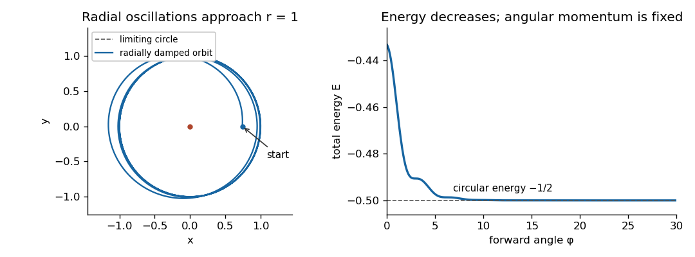

# Paper 4

↑ **Parent:** [Ia](../ia.md)

[https://www.maths.cam.ac.uk/undergrad/pastpapers/files/2015/PaperIA_4.pdf](https://www.maths.cam.ac.uk/undergrad/pastpapers/files/2015/PaperIA_4.pdf)

**Table of contents**

- [1E](#1e)
  - [a](#1e/a)
    - [Solution](#1e/a/solution)
  - [b](#1e/b)
    - [Solution](#1e/b/solution)
- [2E](#2e)
  - [Solution](#2e/solution)
- [3C](#3c)
  - [Solution](#3c/solution)
- [4C](#4c)
  - [Solution](#4c/solution)
- [5E](#5e)
  - [i](#5e/i)
    - [Solution](#5e/i/solution)
  - [ii](#5e/ii)
    - [Solution](#5e/ii/solution)
- [6E](#6e)
  - [i](#6e/i)
    - [Solution](#6e/i/solution)
  - [ii](#6e/ii)
    - [Solution](#6e/ii/solution)
  - [iii](#6e/iii)
    - [Solution](#6e/iii/solution)
- [7E](#7e)
  - [Solution](#7e/solution)
- [8E](#8e)
  - [a](#8e/a)
    - [Solution](#8e/a/solution)
  - [b](#8e/b)
    - [Solution](#8e/b/solution)
    - [i](#8e/b/i)
      - [Solution](#8e/b/i/solution)
    - [ii](#8e/b/ii)
      - [Solution](#8e/b/ii/solution)
- [9C](#9c)
  - [Solution](#9c/solution)
- [10C](#10c)
  - [Solution](#10c/solution)
- [11C](#11c)
  - [Solution](#11c/solution)
- [12C](#12c)
  - [Solution](#12c/solution)

## 1E

↑ **Parent:** [Paper 4](paper-4.md)

<h3 id="1e/a">a</h3>

↑ **Parent:** [1E](#1e)

<h4 id="1e/a/solution">Solution</h4>

↑ **Parent:** [A](#1e/a)

Subtracting twice the first [linear congruence](../../../number-theory.md#linear-congruence) from the second gives $5x\equiv1\pmod{53}$. Since $5\cdot32=3\cdot53+1$, the [modular inverse](../../../number-theory.md#modular-multiplicative-inverse) of $5$ modulo $53$ is $32$. Thus $x\equiv32\pmod{53}$. Substitution in the first [linear congruence](../../../number-theory.md#linear-congruence) then gives $2y\equiv23\pmod{53}$, whence $y\equiv38\pmod{53}$. **All integer solutions are**

$$
\boxed{x=32+53r,\qquad y=38+53t,\qquad r,t\in\mathbb Z.}
$$

The two free [integers](../../../number-theory.md#integer) are independent. Conversely, these values give $6x+2y\equiv268\equiv3$ and $17x+4y\equiv696\equiv7\pmod{53}$, so no additional restriction is needed.

<h3 id="1e/b">b</h3>

↑ **Parent:** [1E](#1e)

<h4 id="1e/b/solution">Solution</h4>

↑ **Parent:** [B](#1e/b)

Write the [composite number](../../../number-theory.md#composite-number) as $n=ab$, with $2\le a\le b<n$. If $a<b$, both $a$ and $b$ occur as distinct factors of the [factorial](../../../combinatorics.md#factorial) $(n-1)!$, so their product $n$ divides that [factorial](../../../combinatorics.md#factorial).

If $a=b$, then $n=a^2$ and $n>4$ implies $a\ge3$. Both $a$ and $2a$ are distinct factors in $(n-1)!$, because $2a\le a^2-1$. Their product is $2n$, so again $n$ divides the [factorial](../../../combinatorics.md#factorial). Hence

$$
\boxed{(n-1)!\equiv0\pmod n\quad\text{for every composite }n>4.}
$$

The exception $n=4$ matters: its [factorial](../../../combinatorics.md#factorial) $3!=6$ is not divisible by $4$. This argument handles perfect squares without incorrectly counting the same factor twice.

## 2E

↑ **Parent:** [Paper 4](paper-4.md)

<h3 id="2e/solution">Solution</h3>

↑ **Parent:** [2E](#2e)

The [Chinese remainder theorem](../../../mathematics.md#chinese-remainder-theorem) says that for pairwise [coprime integers](../../../number-theory.md#coprime-integers) $m_1,\ldots,m_r>0$, any prescribed residue modulo each $m_i$ is realized by exactly one residue class modulo $\prod_i m_i$. The [Fermat little theorem](../../../number-theory.md#fermat-little-theorem) says that for a [prime number](../../../number-theory.md#prime-number) $q$ and an [integer](../../../number-theory.md#integer) $a$ not divisible by $q$, $a^{q-1}\equiv1\pmod q$; equivalently, $a^q\equiv a\pmod q$ for every [integer](../../../number-theory.md#integer) $a$.

For the given [prime number](../../../number-theory.md#prime-number), write $p=2k+1$. Its square is $p^2=1+4k(k+1)=1+8t$ for some [integer](../../../number-theory.md#integer) $t$, since one of two consecutive [integers](../../../number-theory.md#integer) is even. Therefore $p^4=(1+8t)^2\equiv1\pmod{16}$. The [Fermat little theorem](../../../number-theory.md#fermat-little-theorem) applied modulo $3$ gives $p^2\equiv1\pmod3$, hence $p^4\equiv1\pmod3$; applied modulo $5$ it gives $p^4\equiv1\pmod5$. These applications are valid because $p>5$.

The three moduli $16,3,5$ are pairwise [coprime integers](../../../number-theory.md#coprime-integers) and have product $240$. By the [Chinese remainder theorem](../../../mathematics.md#chinese-remainder-theorem),

$$
\boxed{p^4\equiv1\pmod{240}.}
$$

## 3C

↑ **Parent:** [Paper 4](paper-4.md)

<h3 id="3c/solution">Solution</h3>

↑ **Parent:** [3C](#3c)

Let the uniform [mass density](../../../fluid-mechanics.md#density) be $\rho=3M/(4\pi a^3)$. In [spherical polar coordinates](../../../calculus.md#spherical-coordinate-system) about the rotation axis, the perpendicular distance is $r\sin\theta$ and the volume element is $r^2\sin\theta\,dr\,d\theta\,d\phi$. The [moment of inertia](../../../classical-mechanics.md#moment-of-inertia) is therefore

$$
I=\rho\int_0^a r^4\,dr\int_0^\pi\sin^3\theta\,d\theta\int_0^{2\pi}d\phi=\frac{8\pi\rho a^5}{15}=\boxed{\frac25Ma^2}.
$$

In the given [rigid body](../../../classical-mechanics.md#rigid-body-dynamics) [kinetic energy](../../../classical-mechanics.md#kinetic-energy) decomposition, $\tfrac12M|\dot{\mathbf R}|^2$ is the translational [kinetic energy](../../../classical-mechanics.md#kinetic-energy) of the whole mass moving at its [center of mass](../../../classical-mechanics.md#center-of-mass) velocity. The term $\tfrac12I\omega^2$ is the rotational [kinetic energy](../../../classical-mechanics.md#kinetic-energy) about the [center of mass](../../../classical-mechanics.md#center-of-mass). The mixed term vanishes because the mass-weighted relative positions sum to zero.

For [rolling without slipping](../../../classical-mechanics.md#rolling-without-slipping), the point of contact has zero instantaneous velocity relative to the stationary surface. Its rotational velocity is opposite the [center of mass](../../../classical-mechanics.md#center-of-mass) velocity and has magnitude $a|\omega|$. Hence $V=a|\omega|$. Substituting this and the [moment of inertia of a uniform solid sphere](../../../classical-mechanics.md#moment-of-inertia-of-a-uniform-solid-sphere) gives

$$
\boxed{T=\frac12MV^2+\frac12\left(\frac25Ma^2\right)\frac{V^2}{a^2}=\frac7{10}MV^2.}
$$

The rotational axis is through the [center of mass](../../../classical-mechanics.md#center-of-mass) and parallel to the surface, perpendicular to the direction of rolling.

## 4C

↑ **Parent:** [Paper 4](paper-4.md)

<h3 id="4c/solution">Solution</h3>

↑ **Parent:** [4C](#4c)

Use the [Minkowski metric](../../../special-relativity.md#minkowski-metric) convention $+---$. A particle's [four-momentum](../../../special-relativity.md#four-momentum) is $P=(E/c,\mathbf p)$, with $P\cdot P=m^2c^2$ for [rest mass](../../../special-relativity.md#invariant-mass) $m$. For a [photon](../../../quantum-mechanics.md#photon), its energy and [wavelength](../../../wave-equation.md#wavelength) obey $E=hc/\lambda$, and its [four-momentum](../../../special-relativity.md#four-momentum) is null. Here $h$ is the [Planck constant](../../../quantum-mechanics.md#planck-constant).

The initially stationary electron has $P=(mc,0,0,0)$. Choose the scattering plane as the $xy$ plane. The incoming and outgoing [photon](../../../quantum-mechanics.md#photon) [four-momenta](../../../special-relativity.md#four-momentum) are

$$
K_1=\frac h{\lambda_1}(1,1,0,0),\qquad K_2=\frac h{\lambda_2}(1,\cos\theta,\sin\theta,0).
$$

By [four-momentum conservation](../../../special-relativity.md#four-momentum-conservation), the final electron has $P'=P+K_1-K_2$. Its [rest mass](../../../special-relativity.md#invariant-mass) is unchanged, so the [relativistic energy-momentum relation](../../../special-relativity.md#energy-momentum-relation) gives $P'^2=P^2=m^2c^2$. Since $K_1^2=K_2^2=0$, expansion yields

$$
P\cdot(K_1-K_2)=K_1\cdot K_2,
$$

or

$$
mc h\left(\frac1{\lambda_1}-\frac1{\lambda_2}\right)=\frac{h^2}{\lambda_1\lambda_2}(1-\cos\theta).
$$

Multiplying through gives the [Compton scattering](../../../physics.md#compton-scattering) shift:

$$
\boxed{\lambda_2-\lambda_1=\frac h{mc}(1-\cos\theta)=\frac{2h}{mc}\sin^2(\theta/2).}
$$

It is nonnegative and vanishes for forward scattering, consistent with the recoil energy being supplied by the [photon](../../../quantum-mechanics.md#photon).

## 5E

↑ **Parent:** [Paper 4](paper-4.md)

<h3 id="5e/i">i</h3>

↑ **Parent:** [5E](#5e)

<h4 id="5e/i/solution">Solution</h4>

↑ **Parent:** [I](#5e/i)

For an [equivalence relation](../../../set-theory.md#equivalence-relation) $\sim$ on $X$, the [equivalence class](../../../set-theory.md#equivalence-class) of $x\in X$ is $[x]=\{y\in X:y\sim x\}$. A [set partition](../../../combinatorics.md#set-partition) is a family of nonempty, pairwise disjoint subsets whose union is $X$.

Reflexivity ensures $x\in[x]$, so every [equivalence class](../../../set-theory.md#equivalence-class) is nonempty and every element belongs to one. If $[x]\cap[y]$ contains $z$, then $z\sim x$ and $z\sim y$; symmetry and transitivity give $x\sim y$. If $w\in[x]$, transitivity gives $w\sim y$, so $w\in[y]$; interchanging $x,y$ gives the reverse inclusion. Thus intersecting [equivalence classes](../../../set-theory.md#equivalence-class) are equal.

Taking the collection of distinct [equivalence classes](../../../set-theory.md#equivalence-class) therefore produces a [set partition](../../../combinatorics.md#set-partition) of $X$. **Every element lies in exactly one class.** If $X$ is empty, the empty family is its [set partition](../../../combinatorics.md#set-partition).

<h3 id="5e/ii">ii</h3>

↑ **Parent:** [5E](#5e)

<h4 id="5e/ii/solution">Solution</h4>

↑ **Parent:** [Ii](#5e/ii)

Reflexivity follows by taking the two exponents equal to $1$, and symmetry is built into the two divisibility conditions. For transitivity, suppose $m\mid n^a$, $n\mid m^b$, $n\mid \ell^c$ and $\ell\mid n^d$. Then $m\mid\ell^{ac}$ and $\ell\mid m^{bd}$, with positive exponents. Thus the relation is an [equivalence relation](../../../set-theory.md#equivalence-relation).

Its [equivalence classes](../../../set-theory.md#equivalence-class) have a useful description by [prime factorization](../../../number-theory.md#fundamental-theorem-of-arithmetic). Let $S(n)$ be the finite set of [prime factors](../../../number-theory.md#prime-factor) of $n$, with $S(1)=\varnothing$. If $m\mid n^a$, every [prime factor](../../../number-theory.md#prime-factor) of $m$ divides $n$; the reverse divisibility gives $S(n)\subseteq S(m)$. Conversely, if $S(m)=S(n)$, write $m=\prod_{p\in S}p^{\alpha_p}$ and $n=\prod_{p\in S}p^{\beta_p}$, with all exponents positive. Choosing $a\ge\max_p\lceil\alpha_p/\beta_p\rceil$ and $b\ge\max_p\lceil\beta_p/\alpha_p\rceil$ gives the required divisibilities. The empty case is exactly $m=n=1$.

Therefore the [prime-support equivalence relation](../../../set-theory.md#prime-support-equivalence-relation) is

$$
\boxed{m\sim n\iff S(m)=S(n)\iff\operatorname{rad}(m)=\operatorname{rad}(n),}
$$

where the [radical of an integer](../../../number-theory.md#radical-of-an-integer) is the product of its distinct [prime factors](../../../number-theory.md#prime-factor). The class with empty support is $\{1\}$. For every nonempty finite support $S$, all positive exponent choices give one class, and varying just one exponent produces infinitely many different [integers](../../../number-theory.md#integer) in it.

There are infinitely many classes because each [prime number](../../../number-theory.md#prime-number) gives a different singleton support. For completeness, if there were only finitely many [prime numbers](../../../number-theory.md#prime-number) $p_1,\ldots,p_r$, a [prime factor](../../../number-theory.md#prime-factor) of $p_1\cdots p_r+1$ would differ from them all. **There are infinitely many classes; the unique finite class is $\{1\}$.**

## 6E

↑ **Parent:** [Paper 4](paper-4.md)

<h3 id="6e/i">i</h3>

↑ **Parent:** [6E](#6e)

<h4 id="6e/i/solution">Solution</h4>

↑ **Parent:** [I](#6e/i)

Suppose two [base-p expansions](../../../number-theory.md#base-p-expansion) represent the same nonnegative [integer](../../../number-theory.md#integer). Pad the shorter one by trailing zero digits so that both have the same length. Reducing modulo $p$ shows that their first digits satisfy $k_0\equiv k'_0\pmod p$. Since both digits lie between $0$ and $p-1$, they are equal as [integers](../../../number-theory.md#integer).

Subtract that common digit and divide by $p$. The remaining equality is an equality of two [base-p expansions](../../../number-theory.md#base-p-expansion) with one fewer digit. Repeating this argument shows that every pair of corresponding digits agrees. Equivalently, repeated [Euclidean division](../../../number-theory.md#euclidean-division) recovers the digits as remainders. **The digits are unique up to padding by zeroes.** The finite nonnegative-digit representation presupposes $k\ge0$; a negative [integer](../../../number-theory.md#integer) has no such expansion.

<h3 id="6e/ii">ii</h3>

↑ **Parent:** [6E](#6e)

<h4 id="6e/ii/solution">Solution</h4>

↑ **Parent:** [Ii](#6e/ii)

For $1\le j\le p-1$, the identity for [binomial coefficients](../../../combinatorics.md#binomial-coefficient)

$$
j\binom pj=p\binom{p-1}{j-1}
$$

shows that $p$ divides $j\binom pj$. Since $p$ is a [prime number](../../../number-theory.md#prime-number) and $j$ is not divisible by $p$, cancellation modulo $p$ gives

$$
\boxed{\binom pj\equiv0\pmod p\quad(0<j<p).}
$$

The [binomial theorem](../../../combinatorics.md#binomial-theorem) consequently gives $(1+x)^p\equiv1+x^p$ as a coefficientwise polynomial [modular congruence](../../../number-theory.md#modular-congruence). Apply the same identity with $x$ replaced by $x^{p^r}$ and use [mathematical induction](../../../foundations-of-mathematics.md#mathematical-induction) to obtain

$$
(1+x)^{p^i}\equiv1+x^{p^i}\pmod p\qquad(i\ge1).
$$

This is an iteration of the [Frobenius endomorphism](../../../galois-theory.md#frobenius-endomorphism) in characteristic $p$. Comparing the intermediate coefficients gives the [prime-power binomial divisibility](../../../combinatorics.md#prime-power-binomial-divisibility) result

$$
\boxed{\binom{p^i}{j}\equiv0\pmod p\quad(0<j<p^i).}
$$

<h3 id="6e/iii">iii</h3>

↑ **Parent:** [6E](#6e)

<h4 id="6e/iii/solution">Solution</h4>

↑ **Parent:** [Iii](#6e/iii)

Write both nonnegative [integers](../../../number-theory.md#integer) $n,k$ in [base-p expansions](../../../number-theory.md#base-p-expansion), padding with zero digits to a common length $L$. By the preceding polynomial identity,

$$
(1+x)^n=\prod_{i=0}^L\left((1+x)^{p^i}\right)^{n_i}\equiv\prod_{i=0}^L(1+x^{p^i})^{n_i}\pmod p.
$$

Expanding the last product with the [binomial theorem](../../../combinatorics.md#binomial-theorem), each term is obtained by choosing an [integer](../../../number-theory.md#integer) $j_i$ with $0\le j_i\le n_i<p$. Its exponent is $\sum_i j_ip^i$ and its coefficient is $\prod_i\binom{n_i}{j_i}$. Uniqueness of [base-p expansions](../../../number-theory.md#base-p-expansion) says that the only way this exponent can equal $k$ is to choose $j_i=k_i$ for every $i$.

If some $k_i>n_i$, no such term exists and the coefficient is zero. Otherwise its coefficient is precisely the product below. Comparing the coefficient of $x^k$ proves [Lucas theorem](../../../combinatorics.md#lucas-s-theorem):

$$
\boxed{\binom nk\equiv\prod_{i=0}^L\binom{n_i}{k_i}\pmod p,}
$$

with the convention $\binom ab=0$ for $b>a$. This also covers $k>n$, and padding either expansion by further zero digits multiplies the product only by $\binom00=1$.

## 7E

↑ **Parent:** [Paper 4](paper-4.md)

<h3 id="7e/solution">Solution</h3>

↑ **Parent:** [7E](#7e)

For a finite family of subsets $A_1,\ldots,A_N$ of a finite set $\Omega$, the [inclusion-exclusion principle](../../../combinatorics.md#inclusion-exclusion-principle) states

$$
\left|\bigcup_{i=1}^N A_i\right|=\sum_{\varnothing\ne J\subseteq\{1,\ldots,N\}}(-1)^{|J|+1}\left|\bigcap_{j\in J}A_j\right|.
$$

Let $A_{ij}$ be the set of [permutations](../../../combinatorics.md#permutation) with the two-cycle $(ij)$ in their [cycle decomposition of a permutation](../../../mathematics.md#cycle-decomposition-of-a-permutation). Two distinct specified pairs sharing a label cannot both occur, so their intersection is empty. An intersection containing $r$ pairwise disjoint specified pairs fixes those $2r$ labels and leaves $(n-2r)!$ choices for the other labels.

The number of ways to choose $r$ disjoint unordered pairs is $n!/[2^r r!(n-2r)!]$: first order the selected labels, then divide by the two orders within each pair, by the $r!$ orders of the pairs, and by the orders of the unused labels. Applying [inclusion-exclusion](../../../combinatorics.md#inclusion-exclusion-principle) to the complement of the union yields the count of [permutations without two-cycles](../../../mathematics.md#permutations-without-two-cycles):

$$
\boxed{f(n)=\sum_{r=0}^{\lfloor n/2\rfloor}(-1)^r\frac{n!}{2^rr!}.}
$$

The term $r=0$ is $n!$. Fixed points and cycles of length at least three are allowed; the restriction concerns two-cycles, not whether a [permutation](../../../combinatorics.md#permutation) can be expressed as a product of [transpositions](../../../combinatorics.md#transposition-permutation).

Dividing by $n!$ gives partial sums of the absolutely convergent [exponential series](../../../calculus.md#exponential-series), so

$$
\boxed{\lim_{n\to\infty}\frac{f(n)}{n!}=\sum_{r=0}^{\infty}\frac{(-1/2)^r}{r!}=e^{-1/2}.}
$$

## 8E

↑ **Parent:** [Paper 4](paper-4.md)

A [countable set](../../../set-theory.md#countable-set) means here a finite set or a countably infinite set, equivalently a set admitting an [injection](../../../algebra.md#injective-function) into $\mathbb N$. This convention includes the empty set. An infinite set is countably infinite precisely when it can be put in [bijection](../../../function.md#bijection) with $\mathbb N$.

<h3 id="8e/a">a</h3>

↑ **Parent:** [8E](#8e)

<h4 id="8e/a/solution">Solution</h4>

↑ **Parent:** [A](#8e/a)

Let $j:B\to\mathbb N$ be an [injection](../../../algebra.md#injective-function) witnessing that $B$ is a [countable set](../../../set-theory.md#countable-set). The composition $j\circ f:A\to\mathbb N$ is an [injection](../../../algebra.md#injective-function), so $A$ is a [countable set](../../../set-theory.md#countable-set). This proof includes finite and empty sets.

<h3 id="8e/b">b</h3>

↑ **Parent:** [8E](#8e)

<h4 id="8e/b/solution">Solution</h4>

↑ **Parent:** [B](#8e/b)

Choose an [injection](../../../algebra.md#injective-function) $j:A\to\mathbb N$. For each $b\in B$, its fiber under the [surjection](../../../algebra.md#surjective-function) $f$ is nonempty, so define

$$
h(b)=\min\{j(a):f(a)=b\}.
$$

Two distinct fibers cannot contain the same label $j(a)$, because $j$ is an [injection](../../../algebra.md#injective-function) and $f(a)$ has a single value. Thus $h:B\to\mathbb N$ is an [injection](../../../algebra.md#injective-function), proving that $B$ is a [countable set](../../../set-theory.md#countable-set). Taking the least label avoids any need for a separate choice of one element from each fiber. If $A$ is empty, surjectivity makes $B$ empty as well.

For the unheaded enumeration request, list pairs of positive [natural numbers](../../../arithmetic.md#natural-number) by their sum. An explicit [Cantor pairing function](../../../set-theory.md#cantor-pairing-function) is

$$
\boxed{\pi(m,n)=\frac{(m+n-2)(m+n-1)}2+n.}
$$

For $d=m+n-2\ge0$, the positive [integers](../../../number-theory.md#integer) $n=1,\ldots,d+1$ give the consecutive labels $d(d+1)/2+1,\ldots,(d+1)(d+2)/2$. These blocks are disjoint, consecutive and cover $\mathbb N$. Consequently $\pi$ is a [bijection](../../../function.md#bijection) from $\mathbb N\times\mathbb N$ to $\mathbb N$, so **$\mathbb N\times\mathbb N$ is countable**.

<h4 id="8e/b/i">i</h4>

↑ **Parent:** [B](#8e/b)

<h5 id="8e/b/i/solution">Solution</h5>

↑ **Parent:** [I](#8e/b/i)

Choose [injections](../../../algebra.md#injective-function) $a:X\to\mathbb N$ and $b:Y\to\mathbb N$. The map $(x,y)\mapsto(a(x),b(y))$ is an [injection](../../../algebra.md#injective-function) into the [countable set](../../../set-theory.md#countable-set) $\mathbb N\times\mathbb N$. Composing with the [Cantor pairing function](../../../set-theory.md#cantor-pairing-function) gives an [injection](../../../algebra.md#injective-function) into $\mathbb N$. Thus **the Cartesian product of two countable sets is countable**, including the case of an empty factor.

<h4 id="8e/b/ii">ii</h4>

↑ **Parent:** [B](#8e/b)

<h5 id="8e/b/ii/solution">Solution</h5>

↑ **Parent:** [Ii](#8e/b/ii)

The [integers](../../../number-theory.md#integer) are countable: $j(z)=2z+1$ for $z\ge0$ and $j(z)=-2z$ for $z<0$ is an [injection](../../../algebra.md#injective-function) $\mathbb Z\to\mathbb N$. Hence $\mathbb Z\times\mathbb N$ is a [countable set](../../../set-theory.md#countable-set). The map $(a,b)\mapsto a/b$ is a [surjection](../../../algebra.md#surjective-function) onto the [rational numbers](../../../number-theory.md#rational-number), so the image result already proved gives **$\mathbb Q$ is countable**. Unique reduced fractions are not required for this [surjection](../../../algebra.md#surjective-function) argument.

For the final unheaded geometry request, suppose for contradiction that no two distinct circles in the collection intersect. Restrict to the subcollection $\mathcal C_0$ of circles tangent to the $x$-axis. Each such nondegenerate [circle](../../../topology.md#circle) has a unique tangency point, and the tangency-point map $\mathcal C_0\to\mathbb R$ is a [surjection](../../../algebra.md#surjective-function) by the hypothesis.

The closed disk of a circle tangent at $(a,0)$ meets the $x$-axis only at $(a,0)$. Two distinct members of $\mathcal C_0$ cannot have nested disks: if one disk were inside the other, its tangency point would belong to the larger disk, so both tangency points would be equal and both circle boundaries would pass through it. That already contradicts nonintersection. Circles with disjoint boundaries and no nesting have disjoint disks. Thus their open disks are pairwise disjoint.

By the [density of the rational numbers](../../../number-theory.md#density-of-the-rational-numbers), every nonempty open disk contains a point of $\mathbb Q^2$, which is a [countable set](../../../set-theory.md#countable-set). Fix an enumeration of $\mathbb Q^2$ and assign to each disk the first enumerated point inside it. Disjointness makes this assignment an [injection](../../../algebra.md#injective-function). This is the [countability of pairwise disjoint open disks](../../../set-theory.md#countability-of-pairwise-disjoint-open-disks), and proves that $\mathcal C_0$ is a [countable set](../../../set-theory.md#countable-set). Its [surjection](../../../algebra.md#surjective-function) onto $\mathbb R$ would make the [real numbers](../../../arithmetic.md#real-number) countable, contrary to the [Cantor diagonal argument](../../../set-theory.md#cantor-diagonal-argument). Therefore

$$
\boxed{\text{The collection contains two distinct intersecting circles.}}
$$

The proof allows circles on either side of the axis and counts tangential contact as intersection; it does not assume that all circles in the original collection are tangent to the axis.

## 9C

↑ **Parent:** [Paper 4](paper-4.md)

<h3 id="9c/solution">Solution</h3>

↑ **Parent:** [9C](#9c)

Outside a spherical Earth the gravitational field is the field of its total mass at the center, by the [shell theorem](../../../physics.md#spherical-shell-theorem). Since $GM_E=gR^2$, the [inverse-square force](../../../classical-mechanics.md#inverse-square-force) on the upward radial trajectory gives

$$
\boxed{\ddot z=-\frac{gR^2}{(R+z)^2},\qquad z(0)=0,\quad\dot z(0)=V.}
$$

The independent dimensional inputs are $R,V,g$, of dimensions $L,LT^{-1},LT^{-2}$. A dimensionless monomial in them must be a power of $V^2/(gR)$. Thus [dimensional analysis](../../../physics.md#dimensional-analysis) gives

$$
\boxed{H=RF(\lambda),\qquad T=\frac VgG(\lambda),\qquad\lambda=\frac{V^2}{gR}.}
$$

For a finite turning height and time, assume $0<V<\sqrt{2gR}$, equivalently $0<\lambda<2$. This [escape velocity](../../../classical-mechanics.md#escape-velocity) restriction is implicit in the requested maximum-height formulas.

The [conservation of energy](../../../physics.md#conservation-of-energy), per unit particle mass, is

$$
\frac12\dot z^2-\frac{gR^2}{R+z}=\frac12V^2-gR,
$$

so

$$
\dot z^2=V^2-\frac{2gRz}{R+z}=\frac{V^2R-(2gR-V^2)z}{R+z}.
$$

The numerator vanishes at the turning point, giving

$$
\boxed{H=\frac{V^2R}{2gR-V^2},\qquad F(\lambda)=\frac{\lambda}{2-\lambda}.}
$$

On ascent $\dot z>0$, and integrating $dt=dz/\dot z$ gives

$$
\boxed{T=\int_0^H\sqrt{\frac{R+z}{V^2R-(2gR-V^2)z}}\,dz.}
$$

The upper endpoint has an integrable inverse-square-root singularity. Set $z=Hx$, use $H=R\lambda/(2-\lambda)$ and $V^2R=(2gR-V^2)H$, and note $R\lambda/V=V/g$. The result is

$$
T=\frac Vg\int_0^1\sqrt{\frac{2-\lambda+\lambda x}{(2-\lambda)^3(1-x)}}\,dx,\qquad \boxed{G(\lambda)=\int_0^1\sqrt{\frac{2-\lambda+\lambda x}{(2-\lambda)^3(1-x)}}\,dx.}
$$

For small $\lambda$, $F(\lambda)\sim\lambda/2$ and $G(\lambda)\to1$, recovering $H\sim V^2/(2g)$ and $T\sim V/g$. At $\lambda=2$ the particle escapes marginally and has no finite maximum; for $\lambda>2$ it escapes with nonzero asymptotic speed. The finite-turning formulas must not be extended to those cases.

## 10C

↑ **Parent:** [Paper 4](paper-4.md)

<h3 id="10c/solution">Solution</h3>

↑ **Parent:** [10C](#10c)

The [Lorentz force](../../../electromagnetism.md#lorentz-force) in the uniform [magnetic field](../../../electromagnetism.md#magnetic-field) gives

$$
\dot{\mathbf L}=\mathbf r\times m\dot{\mathbf v}=q\mathbf r\times(\mathbf v\times\mathbf B)=q[(\mathbf r\cdot\mathbf B)\mathbf v-(\mathbf r\cdot\mathbf v)\mathbf B],
$$

where the last step is the [vector triple product identity](../../../calculus.md#vector-triple-product). Hence

$$
\frac d{dt}(\mathbf L\cdot\mathbf B)=q[(\mathbf r\cdot\mathbf B)(\mathbf v\cdot\mathbf B)-B^2(\mathbf r\cdot\mathbf v)].
$$

On the other hand, $|\mathbf r\times\mathbf B|^2=B^2r^2-(\mathbf r\cdot\mathbf B)^2$, so

$$
\frac d{dt}\left(\frac q2|\mathbf r\times\mathbf B|^2\right)=q[B^2(\mathbf r\cdot\mathbf v)- (\mathbf r\cdot\mathbf B)(\mathbf v\cdot\mathbf B)].
$$

The derivatives cancel, proving the [magnetic angular-momentum invariant](../../../electromagnetism.md#magnetic-angular-momentum-invariant)

$$
\boxed{\mathbf L\cdot\mathbf B+\frac q2|\mathbf r\times\mathbf B|^2=\text{constant}.}
$$

The magnetic [Lorentz force](../../../electromagnetism.md#lorentz-force) is perpendicular to velocity, so its power is zero:

$$
\dot T=m\mathbf v\cdot\dot{\mathbf v}=q\mathbf v\cdot(\mathbf v\times\mathbf B)=0.
$$

Thus **the kinetic energy is constant**.

For the alternative [kinetic energy](../../../classical-mechanics.md#kinetic-energy) expression, work on an interval where $r>0$ so that the radial [unit vector](../../../vector-space.md#unit-vector) $\mathbf u=\mathbf r/r$ is defined. Differentiating $\mathbf u\cdot\mathbf u=1$ once and twice gives

$$
\mathbf u\cdot\dot{\mathbf u}=0,\qquad \mathbf u\cdot\ddot{\mathbf u}=-|\dot{\mathbf u}|^2.
$$

Since $\mathbf v=\dot r\mathbf u+r\dot{\mathbf u}$, it follows that $\mathbf u\cdot\mathbf v=\dot r$ and $v^2=\dot r^2+r^2|\dot{\mathbf u}|^2$. Therefore the [unit-direction kinetic-energy identity](../../../classical-mechanics.md#unit-direction-kinetic-energy-identity) is

$$
\boxed{T=\frac m2\mathbf u\cdot\left[(\mathbf u\cdot\mathbf v)\mathbf v-r^2\ddot{\mathbf u}\right]=\frac m2v^2.}
$$

This identity holds for any twice differentiable trajectory away from the origin, not only for motion in a [magnetic field](../../../electromagnetism.md#magnetic-field).

## 11C

↑ **Parent:** [Paper 4](paper-4.md)

<h3 id="11c/solution">Solution</h3>

↑ **Parent:** [11C](#11c)

In [plane polar coordinates](../../../classical-mechanics.md#plane-polar-coordinates), use $\mathbf e_r=(\cos\theta,\sin\theta)$ and $\mathbf e_\theta=(-\sin\theta,\cos\theta)$. Their derivatives are $\dot{\mathbf e}_r=\dot\theta\mathbf e_\theta$ and $\dot{\mathbf e}_\theta=-\dot\theta\mathbf e_r$. Differentiating $\mathbf r=r\mathbf e_r$ gives the velocity and [acceleration in polar coordinates](../../../classical-mechanics.md#acceleration-in-polar-coordinates):

$$
\boxed{\mathbf v=\dot r\mathbf e_r+r\dot\theta\mathbf e_\theta,\qquad \mathbf a=(\ddot r-r\dot\theta^2)\mathbf e_r+(r\ddot\theta+2\dot r\dot\theta)\mathbf e_\theta.}
$$

Both the electrostatic [inverse-square force](../../../classical-mechanics.md#inverse-square-force) and the drag point radially, so the [torque](../../../classical-mechanics.md#torque) about the origin is zero even though the force depends on radial velocity. The vector [angular momentum](../../../classical-mechanics.md#angular-momentum) $\mathbf h=\mathbf r\times\dot{\mathbf r}$ is constant. For $\mathbf h\ne0$, every position lies in the fixed plane perpendicular to it; if $\mathbf h=0$, the trajectory is radial and still lies in a plane. In the nonzero case the transverse equation is $r\ddot\theta+2\dot r\dot\theta=0$, giving

$$
\boxed{h=r^2\dot\theta=\text{constant}.}
$$

The signed $h$ depends on the plane orientation. The stipulated ratio $k/|h|$ requires $h\ne0$.

Set $u=1/r$ and use primes for differentiation with respect to $\theta$. Then $\dot\theta=hu^2$, $\dot r=-hu'$ and $\ddot r=-h^2u^2u''$. The radial equation is $\ddot r-r\dot\theta^2=-p/r^2-k\dot r/r^2$, so

$$
-h^2u^2(u''+u)=-pu^2+khu^2u',\qquad \boxed{u''+\frac kh u'+u=\frac p{h^2}.}
$$

This [damped Binet equation](../../../classical-mechanics.md#damped-binet-equation) has the general solution, for $k/|h|<2$,

$$
\boxed{u(\theta)=\frac p{h^2}+e^{-k(\theta-\theta_0)/(2h)}\left[C\cos\!\big(\omega(\theta-\theta_0)\big)+D\sin\!\big(\omega(\theta-\theta_0)\big)\right],\quad \omega=\sqrt{1-\frac{k^2}{4h^2}}.}
$$

It is used on the physical interval where $u>0$. For either sign of $h$, introduce the forward angular distance $\phi=\operatorname{sgn}(h)(\theta-\theta_0)$; then the exponential is $e^{-k\phi/(2|h|)}$. Thus damping acts forward in time for both orientations, not just when $h>0$.

For unit mass, the [kinetic energy](../../../classical-mechanics.md#kinetic-energy) is $\tfrac12(\dot r^2+r^2\dot\theta^2)$ and the electrostatic [potential energy](../../../classical-mechanics.md#potential-energy) is $-p/r$. Therefore

$$
\boxed{E=\frac{h^2}{2}(u'^2+u^2)-pu.}
$$

Using the [damped Binet equation](../../../classical-mechanics.md#damped-binet-equation),

$$
\frac{dE}{d\theta}=h^2u'\left(u''+u-\frac p{h^2}\right)=-khu'^2,
$$

and multiplication by $\dot\theta=hu^2$ gives

$$
\boxed{\frac{dE}{dt}=-kh^2u^2u'^2=-\frac{k\dot r^2}{r^2}\le0.}
$$

This is also the drag force times the radial speed. **Energy is nonincreasing in time**, strictly decreasing while radial motion occurs; a circular trajectory already has constant energy. The sign of $dE/d\theta$ alone would be misleading for negative $h$.

To justify [circularization under radial inverse-square drag](../../../classical-mechanics.md#circularization-under-radial-inverse-square-drag), suppose the forward trajectory remains bounded, $r\le R_*$. Since $E\le E(0)$ and the effective radial [potential energy](../../../classical-mechanics.md#potential-energy) $h^2/(2r^2)-p/r$ tends to $+\infty$ as $r\to0$, the radius is also bounded away from zero. Velocity then stays bounded, so the solution continues for all forward time without collision. Moreover $\dot\phi=|h|/r^2\ge|h|/R_*^2$, so $\phi\to\infty$. The decaying general solution gives $u\to p/h^2$ and $u'\to0$. Consequently

$$
\boxed{r\to\frac{h^2}{p},\qquad\dot r\to0,\qquad E\to-\frac{p^2}{2h^2}.}
$$

The tangential motion remains, so the limiting orbit is circular. The convergence is asymptotic; boundedness is needed because a physical solution could otherwise reach $u=0$ and escape rather than complete indefinitely many turns.

**[Figure 1](#11c/image-bounded-inverse-square-orbit-with-radial-drag-approaching-a-circular-orbit-with-nonincreasing-energy-converging-to-the-circular-orbit-value). Bounded inverse-square orbit with radial drag approaching a circular orbit, with nonincreasing energy converging to the circular-orbit value**.

The example uses $p=h=1$, $k=0.6$ and $u(\theta)=1+0.35e^{-0.3\theta}\cos(\sqrt{0.91}\theta)$, which stays positive. Radial oscillations decay while [angular momentum](../../../classical-mechanics.md#angular-momentum) stays fixed.

## 12C

↑ **Parent:** [Paper 4](paper-4.md)

<h3 id="12c/solution">Solution</h3>

↑ **Parent:** [12C](#12c)

For a [Lorentz transformation](../../../special-relativity.md#lorentz-transformation) to an [inertial frame](../../../physics.md#inertial-frame) moving at speed $v_B$ in the positive $x$ direction, write $\beta_B=v_B/c$ and $\Gamma_B=(1-\beta_B^2)^{-1/2}$. Any [four-vector](../../../special-relativity.md#four-vector) transforms as

$$
\boxed{W'^0=\Gamma_B(W^0-\beta_BW^1),\quad W'^1=\Gamma_B(W^1-\beta_BW^0),\quad W'^2=W^2,\quad W'^3=W^3.}
$$

This convention applies to $X=(ct,x,0,0)$ and uses the same $+---$ [Minkowski metric](../../../special-relativity.md#minkowski-metric) as the [four-momentum](../../../special-relativity.md#four-momentum) calculation.

The definition of [proper time](../../../special-relativity.md#proper-time) gives $d\tau=dt\sqrt{1-u^2/c^2}=dt/\gamma$ for $|u|<c$. Hence the [four-velocity](../../../special-relativity.md#four-velocity) is

$$
\boxed{U=\gamma(c,u).}
$$

Since $\dot\gamma=\gamma^3u\dot u/c^2$, differentiating with respect to [proper time](../../../special-relativity.md#proper-time) gives

$$
A=\gamma\frac{dU}{dt}=\left(\frac{\gamma^4u\dot u}{c},\gamma^2\dot u+\frac{\gamma^4u^2\dot u}{c^2}\right)=\boxed{\gamma^4\dot u\,(u/c,1)}.
$$

Here $1+\gamma^2u^2/c^2=\gamma^2$ simplifies the spatial component of the [four-acceleration](../../../special-relativity.md#four-acceleration).

At each event, boost with $v_B=u$ to the instantaneous rest [inertial frame](../../../physics.md#inertial-frame). Then $A'^0=0$ and $A'^1=\gamma\gamma^4\dot u(1-u^2/c^2)=\gamma^3\dot u$. Thus the signed [proper acceleration for one-dimensional motion](../../../special-relativity.md#proper-acceleration-for-one-dimensional-motion) is

$$
\boxed{a=\gamma^3\dot u=\frac d{dt}(\gamma u).}
$$

The last equality follows by differentiating $\gamma u$; its magnitude is the usual scalar [proper acceleration](../../../special-relativity.md#proper-acceleration).

If this signed [proper acceleration](../../../special-relativity.md#proper-acceleration) is constant and the particle starts from rest, integration gives $\gamma u=at$, so

$$
u(t)=\frac{at}{\sqrt{1+a^2t^2/c^2}}.
$$

Integrating once more and imposing $x(0)=0$ yields the [hyperbolic motion](../../../special-relativity.md#hyperbolic-motion) worldline

$$
\boxed{x(t)=\frac{c^2}{a}\left(\sqrt{1+\frac{a^2t^2}{c^2}}-1\right)\quad(a\ne0).}
$$

For $a=0$ the continuous limiting solution is $x=0$. Finally, the [Taylor series](../../../calculus.md#taylor-series) of the square root gives

$$
x(t)=\frac12at^2-\frac{a^3t^4}{8c^2}+O(a^5t^6/c^4),\qquad \boxed{x\sim\frac12at^2\quad\text{when }|at|\ll c.}
$$

This recovers constant-acceleration [Newtonian mechanics](../../../classical-mechanics.md#newtonian-mechanics) at low speed while the exact relativistic speed remains less than $c$.

## ↑ Ancestors (8)

1. [Ia](../ia.md)
2. [2015](../../2015.md)
3. [Past exam of the mathematics course of the University of Cambridge](../../../past-exam-of-the-mathematics-course-of-the-university-of-cambridge.md)
4. [Mathematics course of the University of Cambridge](../../../university-of-cambridge.md#mathematics-course-of-the-university-of-cambridge)
5. [Course of the University of Cambridge](../../../university-of-cambridge.md#course-of-the-university-of-cambridge)
6. [University of Cambridge](../../../university-of-cambridge.md)
7. [List of universities](../../../README.md#list-of-universities)
8. [Codex Wiki](../../../README.md)
