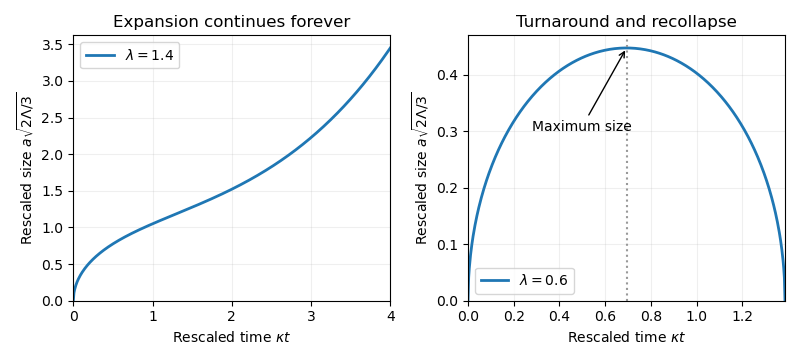
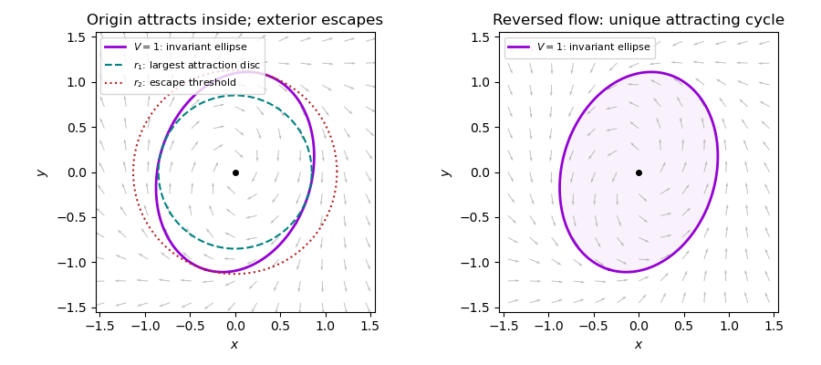

# Paper 1

↑ **Parent:** [Ii](../ii.md)

[https://www.maths.cam.ac.uk/undergrad/pastpapers/files/2015/PaperII_1.pdf](https://www.maths.cam.ac.uk/undergrad/pastpapers/files/2015/PaperII_1.pdf)

**Table of contents**

- [1H](#1h)
  - [Solution](#1h/solution)
- [2I](#2i)
  - [i](#2i/i)
    - [Solution](#2i/i/solution)
  - [ii](#2i/ii)
    - [Solution](#2i/ii/solution)
  - [iii](#2i/iii)
    - [Solution](#2i/iii/solution)
  - [iv](#2i/iv)
    - [Solution](#2i/iv/solution)
- [3G](#3g)
  - [Solution](#3g/solution)
- [4J](#4j)
  - [Solution](#4j/solution)
- [5E](#5e)
  - [Solution](#5e/solution)
- [6B](#6b)
  - [Solution](#6b/solution)
- [7D](#7d)
  - [a](#7d/a)
    - [Solution](#7d/a/solution)
  - [b](#7d/b)
    - [i](#7d/b/i)
      - [Solution](#7d/b/i/solution)
    - [ii](#7d/b/ii)
      - [Solution](#7d/b/ii/solution)
- [8C](#8c)
  - [Solution](#8c/solution)
- [9G](#9g)
  - [Solution](#9g/solution)
  - [a](#9g/a)
    - [Solution](#9g/a/solution)
  - [b](#9g/b)
    - [Solution](#9g/b/solution)
- [10J](#10j)
  - [Solution](#10j/solution)
- [11B](#11b)
  - [Solution](#11b/solution)
- [12C](#12c)
  - [Solution](#12c/solution)
- [13I](#13i)
  - [Solution](#13i/solution)
- [14I](#14i)
  - [a](#14i/a)
    - [Solution](#14i/a/solution)
  - [b](#14i/b)
    - [Solution](#14i/b/solution)
  - [c](#14i/c)
    - [Solution](#14i/c/solution)
- [15F](#15f)
  - [a](#15f/a)
    - [Solution](#15f/a/solution)
  - [b](#15f/b)
    - [i](#15f/b/i)
      - [Solution](#15f/b/i/solution)
    - [ii](#15f/b/ii)
      - [Solution](#15f/b/ii/solution)
    - [iii](#15f/b/iii)
      - [Solution](#15f/b/iii/solution)
- [16H](#16h)
  - [a](#16h/a)
    - [Solution](#16h/a/solution)
  - [b](#16h/b)
    - [Solution](#16h/b/solution)
- [17F](#17f)
  - [i](#17f/i)
    - [Solution](#17f/i/solution)
  - [ii](#17f/ii)
    - [Solution](#17f/ii/solution)
  - [iii](#17f/iii)
    - [Solution](#17f/iii/solution)
- [18H](#18h)
  - [Solution](#18h/solution)
- [19G](#19g)
  - [a](#19g/a)
    - [Solution](#19g/a/solution)
  - [b](#19g/b)
    - [Solution](#19g/b/solution)
- [20F](#20f)
  - [Solution](#20f/solution)
- [21F](#21f)
  - [i](#21f/i)
    - [Solution](#21f/i/solution)
  - [ii](#21f/ii)
    - [Solution](#21f/ii/solution)
  - [iii](#21f/iii)
    - [Solution](#21f/iii/solution)
- [22G](#22g)
  - [Solution](#22g/solution)
- [23J](#23j)
  - [a](#23j/a)
    - [Solution](#23j/a/solution)
  - [b](#23j/b)
    - [Solution](#23j/b/solution)
  - [c](#23j/c)
    - [Solution](#23j/c/solution)
  - [d](#23j/d)
    - [Solution](#23j/d/solution)
- [24K](#24k)
  - [a](#24k/a)
    - [Solution](#24k/a/solution)
  - [b](#24k/b)
    - [Solution](#24k/b/solution)
- [25J](#25j)
  - [Solution](#25j/solution)
- [26K](#26k)
  - [i](#26k/i)
    - [Solution](#26k/i/solution)
  - [ii](#26k/ii)
    - [Solution](#26k/ii/solution)
  - [iii](#26k/iii)
    - [Solution](#26k/iii/solution)
- [27C](#27c)
  - [a](#27c/a)
    - [Solution](#27c/a/solution)
  - [b](#27c/b)
    - [Solution](#27c/b/solution)
- [28B](#28b)
  - [a](#28b/a)
    - [Solution](#28b/a/solution)
  - [b](#28b/b)
    - [Solution](#28b/b/solution)
- [29D](#29d)
  - [Solution](#29d/solution)
- [30E](#30e)
  - [a](#30e/a)
    - [Solution](#30e/a/solution)
  - [b](#30e/b)
    - [Solution](#30e/b/solution)
- [31A](#31a)
  - [Solution](#31a/solution)
- [32A](#32a)
  - [Solution](#32a/solution)
- [33C](#33c)
  - [a](#33c/a)
    - [Solution](#33c/a/solution)
  - [b](#33c/b)
    - [Solution](#33c/b/solution)
  - [c](#33c/c)
    - [Solution](#33c/c/solution)
- [34A](#34a)
  - [Solution](#34a/solution)
  - [i](#34a/i)
    - [Solution](#34a/i/solution)
  - [ii](#34a/ii)
    - [Solution](#34a/ii/solution)
- [35D](#35d)
  - [a](#35d/a)
    - [Solution](#35d/a/solution)
  - [b](#35d/b)
    - [Solution](#35d/b/solution)
  - [c](#35d/c)
    - [Solution](#35d/c/solution)
- [36E](#36e)
  - [i](#36e/i)
    - [Solution](#36e/i/solution)
  - [ii](#36e/ii)
    - [Solution](#36e/ii/solution)
  - [iii](#36e/iii)
    - [Solution](#36e/iii/solution)
- [37B](#37b)
  - [Solution](#37b/solution)
- [38E](#38e)
  - [a](#38e/a)
    - [Solution](#38e/a/solution)
  - [b](#38e/b)
    - [Solution](#38e/b/solution)

## 1H

↑ **Parent:** [Paper 1](paper-1.md)

<h3 id="1h/solution">Solution</h3>

↑ **Parent:** [1H](#1h)

For an odd prime $p$, the [Legendre symbol](../../../number-theory.md#legendre-symbol) $(a/p)$ is $0$ if $p\mid a$, $1$ if $a$ is a nonzero square modulo $p$, and $-1$ otherwise. [Euler's criterion](../../../number-theory.md#euler-s-criterion) states

$$
\boxed{a^{(p-1)/2}\equiv (a/p)\pmod p}.
$$

If $p\mid a$ both sides vanish. Otherwise write $a\equiv g^j$ for a [primitive root](../../../number-theory.md#primitive-root-modulo-n) $g$. The squares are precisely the even powers of $g$, while $g^{(p-1)/2}$ has order two and therefore equals $-1$. Hence $a^{(p-1)/2}=(-1)^j$, proving the criterion and the useful special case $(-1/p)=(-1)^{(p-1)/2}$.

For odd $n$, $n^2+4\equiv5\pmod8$. Every prime divisor $p$ of this number is odd, and $p\nmid n$, so $(n/2)^2\equiv-1\pmod p$. [Euler's criterion](../../../number-theory.md#euler-s-criterion) forces $p\equiv1\pmod4$, hence $p\equiv1$ or $5\pmod8$. A product of such primes can be $5\pmod8$ only if a prime $5\pmod8$ occurs to an odd power.

Suppose the primes $5\pmod8$ were $p_1,\ldots,p_r$. Choose the odd integer $n=p_1\cdots p_r$ (or $n=1$ for an empty list). None of these primes divides $n^2+4$, since the latter is $4$ modulo each $p_i$. Yet the preceding argument gives a prime divisor $5\pmod8$, outside the list. This contradiction proves **infinitely many primes congruent to $5$ modulo $8$**.

## 2I

↑ **Parent:** [Paper 1](paper-1.md)

<h3 id="2i/i">i</h3>

↑ **Parent:** [2I](#2i)

<h4 id="2i/i/solution">Solution</h4>

↑ **Parent:** [I](#2i/i)

The closure is closed and bounded in $\mathbb R^2$, hence [compact](../../../topology.md#compact-space) by the [Heine-Borel theorem](../../../topology.md#heine-borel-theorem). It is nonempty. The [extreme value theorem](../../../real-analysis.md#extreme-value-theorem) therefore gives a point of the closure at which the continuous function attains its maximum. The closure, rather than the open domain, is essential.

<h3 id="2i/ii">ii</h3>

↑ **Parent:** [2I](#2i)

<h4 id="2i/ii/solution">Solution</h4>

↑ **Parent:** [Ii](#2i/ii)

At an interior local maximum, the second [derivatives](../../../calculus.md#derivative) in both coordinate directions are nonpositive: restrict the function to each coordinate line and apply the one-variable second-derivative test. Thus $\nabla^2\phi\leq0$ there, contradicting $\nabla^2\phi\geq\epsilon>0$. Since a maximum exists on the closure, **a maximum lies on the boundary**.

<h3 id="2i/iii">iii</h3>

↑ **Parent:** [2I](#2i)

<h4 id="2i/iii/solution">Solution</h4>

↑ **Parent:** [Iii](#2i/iii)

For $\eta>0$, use the [weak maximum principle for elliptic operators](../../../elliptic-boundary-value-problem.md#weak-maximum-principle-for-elliptic-operators) perturbation $\phi_\eta(x)=\phi(x)+\eta|x|^2$. Its [Laplacian](../../../calculus.md#laplacian) is at least $4\eta$, so the preceding argument puts its maximum on the boundary. If $R^2=\max_{\bar\Omega}|x|^2$, then, for any $x\in\bar\Omega$,

$$
\phi(x)\leq\max_{\partial\Omega}\phi+\eta R^2.
$$

Letting $\eta\downarrow0$ gives $\phi(x)\leq\max_{\partial\Omega}\phi$. The boundary is compact, so this maximum is attained. This proves the weak [weak maximum principle for elliptic operators](../../../elliptic-boundary-value-problem.md#weak-maximum-principle-for-elliptic-operators) even when the [Laplacian](../../../calculus.md#laplacian) may vanish.

<h3 id="2i/iv">iv</h3>

↑ **Parent:** [2I](#2i)

<h4 id="2i/iv/solution">Solution</h4>

↑ **Parent:** [Iv](#2i/iv)

Apply the weak [weak maximum principle for elliptic operators](../../../elliptic-boundary-value-problem.md#weak-maximum-principle-for-elliptic-operators) to the [harmonic function](../../../partial-differential-equation.md#harmonic-function) $\phi$ and to $-\phi$. Their boundary maxima are both zero, giving $\phi\leq0$ and $\phi\geq0$ on the closure. Consequently **$\phi\equiv0$**.

## 3G

↑ **Parent:** [Paper 1](paper-1.md)

<h3 id="3g/solution">Solution</h3>

↑ **Parent:** [3G](#3g)

For a block code, the [minimum distance of a code](../../../coding-theory.md#minimum-distance-of-a-code) is the minimum [Hamming distance](../../../coding-theory.md#hamming-distance) between distinct codewords, where [Hamming distance](../../../coding-theory.md#hamming-distance) counts positions in which two equal-length binary strings differ. We use equal-length codewords, so the fact that the codomain allows arbitrary finite strings creates no ambiguity. Minimum distance $\delta$ means every two distinct codewords differ in at least $\delta$ positions and some pair differs in exactly $\delta$.

Changing at most $\delta-1$ bits cannot turn a codeword into another codeword. Testing membership therefore detects every such nonzero error. For $t=\lfloor(\delta-1)/2\rfloor$, suppose a received word lies within distance $t$ of two codewords. The [triangle inequality](../../../topological-analysis.md#triangle-inequality) would put their mutual distance at most $2t<\delta$, a contradiction. Hence the radius-$t$ [Hamming balls](../../../coding-theory.md#hamming-ball) are disjoint and nearest-codeword decoding corrects all errors of weight at most $t$.

For an alphabet of size $m\geq2$, start with $0$ and the $m-1$ standard unit vectors in $\{0,1\}^{m-1}$. Their [minimum distance of a code](../../../coding-theory.md#minimum-distance-of-a-code) is one. Repeat every coordinate $\delta$ times; every distance is multiplied by $\delta$, so the resulting code has **[minimum distance of a code](../../../coding-theory.md#minimum-distance-of-a-code) exactly $\delta$**. A one-letter alphabet has no pair of distinct codewords and therefore no finite [minimum distance of a code](../../../coding-theory.md#minimum-distance-of-a-code) under this definition; the construction concerns the usual nontrivial coding situation.

## 4J

↑ **Parent:** [Paper 1](paper-1.md)

<h3 id="4j/solution">Solution</h3>

↑ **Parent:** [4J](#4j)

The standard normal [distribution function](../../../probability-theory.md#cumulative-distribution-function) $\Phi$ gives

$$
P(Z_i=1\mid x_i)=P(\epsilon_i>\log c-\mu-x_i^T\beta)
=\Phi\!\left(\frac{\mu-\log c}{\sigma}+x_i^T\frac\beta\sigma\right).
$$

The observations are independent [Bernoulli random variables](../../../discrete-probability-distribution.md#bernoulli-distribution), because the original errors are independent. Thus the [probit regression](../../../statistical-modelling.md#probit-model) has intercept $\alpha=(\mu-\log c)/\sigma$ and coefficient vector $\gamma=\beta/\sigma$. With the specified known $\sigma$ and $c$, recovery is

$$
\boxed{\mu=\log c+\sigma\alpha,\qquad\beta=\sigma\gamma}.
$$

The scale would not be recoverable from threshold data alone if $\sigma$ were unknown.

## 5E

↑ **Parent:** [Paper 1](paper-1.md)

<h3 id="5e/solution">Solution</h3>

↑ **Parent:** [5E](#5e)

Substitution of the separated exponential profile into the [age-structured population equation](../../../mathematical-biology.md#age-structured-population-equation) gives $r'=-(\gamma+\mu(a))r$. Therefore

$$
r(a)=C\exp\!\left[-\gamma a-\int_0^a\mu(s)\,ds\right].
$$

For $C\ne0$, the birth boundary condition cancels $C$ and becomes the [Euler-Lotka equation](../../../mathematical-biology.md#euler-lotka-equation)

$$
\boxed{\int_0^\infty b(a)\exp\!\left[-\gamma a-\int_0^a\mu(s)\,ds\right]da=1}.
$$

The survival probability to age $a$ is $e^{-\mu a}$ for constant death rate. Hence the expected lifetime offspring count, or [net reproduction rate](../../../mathematical-biology.md#net-reproduction-rate), is

$$
\boxed{R_0=\int_0^\infty Ba^pe^{-(\lambda+\mu)a}\,da
=\frac{Bp!}{(\lambda+\mu)^{p+1}}}.
$$

The [Gamma integral](../../../complex-analysis.md#gamma-integral) evaluates the [Euler-Lotka equation](../../../mathematical-biology.md#euler-lotka-equation) as $Bp!/(\lambda+\mu+\gamma)^{p+1}=1$, requiring $\lambda+\mu+\gamma>0$. Its real solution and profile are

$$
\boxed{\gamma=(Bp!)^{1/(p+1)}-\lambda-\mu,\qquad
n(a,t)=C e^{\gamma t}e^{-[(Bp!)^{1/(p+1)}-\lambda]a}}.
$$

Thus **$B^*=(\lambda+\mu)^{p+1}/p!$**, and $B>B^*$ gives positive growth. The profile is a nonzero formal separated solution for all positive $B$; a finite total population additionally requires $\gamma+\mu>0$, equivalently $(Bp!)^{1/(p+1)}>\lambda$. A decaying-in-time mode need not have an integrable age profile.

## 6B

↑ **Parent:** [Paper 1](paper-1.md)

<h3 id="6b/solution">Solution</h3>

↑ **Parent:** [6B](#6b)

Introduce the [Mellin transform](../../../analysis.md#mellin-transform) integral $J(s)=\int_0^\infty x^{s-1}/(1+x^2)\,dx$, valid for $0<\operatorname{Re}s<2$. A [keyhole contour](../../../complex-analysis.md#keyhole-contour) for $z^{s-1}/(1+z^2)$ with $0<\arg z<2\pi$ has residues $i^{s-1}/(2i)$ and $(-i)^{s-1}/(-2i)$, with the latter argument $3\pi/2$. The two sides of the positive-axis cut give $(1-e^{2\pi i(s-1)})J(s)$. The small and large arcs vanish in this strip; simplifying the [residue theorem](../../../analysis.md#residue-theorem) identity yields

$$
J(s)=\frac\pi2\csc\frac{\pi s}{2}.
$$

Differentiation under the integral is valid on compact substrips because the extra $\log x$ is dominated at both endpoints. Therefore

$$
J'(s)=-\frac{\pi^2}{4}\csc\frac{\pi s}{2}\cot\frac{\pi s}{2}.
$$

At $s=3/2$, the requested values are

$$
\boxed{\int_0^\infty\frac{x^{1/2}\log x}{1+x^2}\,dx=\frac{\pi^2}{2\sqrt2},\qquad
\int_0^\infty\frac{x^{1/2}}{1+x^2}\,dx=\frac\pi{\sqrt2}}.
$$

## 7D

↑ **Parent:** [Paper 1](paper-1.md)

<h3 id="7d/a">a</h3>

↑ **Parent:** [7D](#7d)

<h4 id="7d/a/solution">Solution</h4>

↑ **Parent:** [A](#7d/a)

The [principle of stationary action](../../../classical-mechanics.md#principle-of-stationary-action) says that the physical path makes the action stationary under smooth variations $q+\eta h$ with fixed endpoints $h(t_1)=h(t_2)=0$. It need not minimize the action. Differentiating and integrating by parts gives

$$
0=\delta S=\int_{t_1}^{t_2}\left(L_qh+L_{\dot q}\dot h\right)dt
=\int_{t_1}^{t_2}\left(L_q-\frac d{dt}L_{\dot q}\right)h\,dt.
$$

The [fundamental lemma of the calculus of variations](../../../calculus-of-variations.md#fundamental-lemma-of-the-calculus-of-variations) then gives the [Euler-Lagrange equation](../../../analysis.md#euler-lagrange-equation)

$$
\boxed{\frac d{dt}\frac{\partial L}{\partial\dot q}-\frac{\partial L}{\partial q}=0}.
$$

<h3 id="7d/b">b</h3>

↑ **Parent:** [7D](#7d)

<h4 id="7d/b/i">i</h4>

↑ **Parent:** [B](#7d/b)

<h5 id="7d/b/i/solution">Solution</h5>

↑ **Parent:** [I](#7d/b/i)

Use $r\in(0,l)$, the bead's distance from the pivot, and $\theta$, the rod angle from downward vertical. The [kinetic energy](../../../classical-mechanics.md#kinetic-energy) is $m(\dot r^2+r^2\dot\theta^2)/2$. If the identical springs have common natural length $r_*$, their potential is $k[(r-r_*)^2+(l-r-r_*)^2]/2$. Its $r$-dependent part is $k(r-l/2)^2$; the unspecified common natural length changes only an additive constant. Gravity contributes $-mgr\cos\theta$. Consequently the [Lagrangian](../../../calculus-of-variations.md#lagrangian) may be taken as

$$
\boxed{L=\frac m2(\dot r^2+r^2\dot\theta^2)+mgr\cos\theta-k(r-l/2)^2}.
$$

This uses the illustrated symmetric two-spring arrangement without assuming an unstated natural length.

<h4 id="7d/b/ii">ii</h4>

↑ **Parent:** [B](#7d/b)

<h5 id="7d/b/ii/solution">Solution</h5>

↑ **Parent:** [Ii](#7d/b/ii)

Apply the [Euler-Lagrange equation](../../../analysis.md#euler-lagrange-equation) separately to $r$ and $\theta$:

$$
\boxed{m\ddot r=mr\dot\theta^2+mg\cos\theta-2k(r-l/2),\qquad
r^2\ddot\theta+2r\dot r\dot\theta+gr\sin\theta=0}.
$$

The first equation balances radial inertia, centrifugal motion, gravity and the net spring force. The second is the angular-momentum equation $d(mr^2\dot\theta)/dt=-mgr\sin\theta$. For $r>0$ it is equivalently $\ddot\theta+2\dot r\dot\theta/r+g\sin\theta/r=0$.

## 8C

↑ **Parent:** [Paper 1](paper-1.md)

<h3 id="8c/solution">Solution</h3>

↑ **Parent:** [8C](#8c)

Relative positions and velocities measured from galaxy $A$ are $r_B-r_A$ and $v_B-v_A$. [Spatial homogeneity](../../../cosmology.md#spatial-homogeneity) says that the same position-to-relative-velocity rule applies from every galaxy. Thus $v(r_B-r_A)=v(r_B-r_O)-v(r_A-r_O)$. Taking $r_O=0$ and putting $r_B=x+y$, $r_A=y$ gives additivity $v(x+y)=v(x)+v(y)$. For a continuous physical velocity field, additivity implies rational homogeneity and, by continuity, real homogeneity. Therefore

$$
\boxed{v(r)=Hr}
$$

for a position-independent [matrix](../../../vector-space.md#matrix) $H$. Regularity is necessary to exclude pathological discontinuous additive functions.

Decompose the given [matrix](../../../vector-space.md#matrix) as $H=(5D/t)I+(D/t)W$, where

$$
W=\begin{pmatrix}0&-1&-2\\1&0&-1\\2&1&0\end{pmatrix}.
$$

Its symmetric part is isotropic: no [cosmological shear](../../../cosmology.md#cosmological-shear), expansion scalar $\nabla\cdot v=15D/t$, and linear scale factor proportional to $t^{5D}$ for $t>0$. Its antisymmetric part is rigid rotation with [angular velocity](../../../classical-mechanics.md#angular-velocity)

$$
\boxed{\boldsymbol\omega(t)=\frac D t(1,-2,1),\qquad|\boldsymbol\omega|=\frac{\sqrt6D}{t}}.
$$

The [vorticity](../../../fluid-mechanics.md#vorticity) is $2\boldsymbol\omega$. Comoving separations obey

$$
r(t)=\left(\frac t{t_0}\right)^{5D}
\exp\!\left[D\log(t/t_0)W\right]r(t_0).
$$

Thus all distances grow by the same power, volumes grow as $t^{15D}$, and the pattern rotates about the fixed axis $(1,-2,1)$ through angle $\sqrt6D\log(t/t_0)$. Homogeneity alone permits this rotation; full cosmological isotropy would not.

## 9G

↑ **Parent:** [Paper 1](paper-1.md)

<h3 id="9g/solution">Solution</h3>

↑ **Parent:** [9G](#9g)

For $r\geq2$, let $H$ be the $r\times(2^r-1)$ binary [matrix](../../../vector-space.md#matrix) whose columns are all distinct nonzero vectors of $\mathbb F_2^r$. The binary [Hamming code](../../../coding-theory.md#hamming-code) is $C=\ker H$. Its [parity-check matrix](../../../coding-theory.md#parity-check-matrix) has rank $r$ since its columns include the standard basis. Hence $C$ is linear of length $2^r-1$ and dimension $2^r-1-r$.

No word of weight one or two lies in $C$, since columns are nonzero and distinct; three columns $u,v,u+v$ sum to zero, so the [minimum distance of a code](../../../coding-theory.md#minimum-distance-of-a-code) is exactly three. The [syndrome](../../../coding-theory.md#syndrome) of a single-bit error is its column of $H$, uniquely identifying the erroneous position. The $2^r$ possible syndromes correspond to no error or exactly one of $2^r-1$ single-bit errors. Alternatively, every radius-one [Hamming ball](../../../coding-theory.md#hamming-ball) has $2^r$ words and

$$
|C|\,2^r=2^{2^r-1-r}2^r=2^{2^r-1}.
$$

Disjoint balls therefore cover the whole word space. This proves **linearity, one-error correction and perfection**. For $r=3$, the parameters are $[7,4,3]$, giving the 16 messages needed below.

<h3 id="9g/a">a</h3>

↑ **Parent:** [9G](#9g)

<h4 id="9g/a/solution">Solution</h4>

↑ **Parent:** [A](#9g/a)

Independence of individual bit errors gives **$P=(1-p)^{4N}$**. Independent retransmissions have a [geometric distribution](../../../discrete-probability-distribution.md#geometric-distribution) with success probability $P$, so the expected total number of transmissions, including the successful one, is **$1/P$**. At the supplied values, $P\approx0.018279$ and $1/P\approx54.71$.

<h3 id="9g/b">b</h3>

↑ **Parent:** [9G](#9g)

<h4 id="9g/b/solution">Solution</h4>

↑ **Parent:** [B](#9g/b)

A [Hamming code](../../../coding-theory.md#hamming-code) decoder succeeds on a seven-bit block exactly when there are zero or one errors. Its radius-one decoding regions are disjoint, so an error of weight at least two cannot decode back to the original codeword. Thus

$$
q=(1-p)^7+7p(1-p)^6=1-21p^2+O(p^3),\qquad
\boxed{Q=q^N\simeq(1-21p^2)^N\simeq e^{-21Np^2}}.
$$

Numerically $Q\approx0.97929$, so only about $1.0212$ transmissions are expected. Even accounting for seven rather than four bits per letter, expected bits sent are $7N/Q\approx7148$, compared with $4N/P\approx218830$. **The Hamming method is substantially better** under the stated error detection and independent retransmission assumptions.

## 10J

↑ **Parent:** [Paper 1](paper-1.md)

<h3 id="10j/solution">Solution</h3>

↑ **Parent:** [10J](#10j)

The [Poisson regression](../../../statistical-modelling.md#poisson-regression) uses independent counts with mean $m_i$ and [logarithmic link function](../../../statistical-modelling.md#logarithmic-link-function). Writing $c$ for concentration, the fitted predictors for strains $0,1,2$ are respectively

$$
\log m_0=4.47171-0.28700c,\quad
\log m_1=4.56552+0.05515c,\quad
\log m_2=4.59328-0.26315c.
$$

The interaction formula includes concentration, strain indicators and their products. The intercept is the baseline log mean at zero toxin; exponentiating it gives about $87.5$ fleas. Strain coefficients compare log means at zero concentration. Interaction coefficients compare concentration slopes with the common strain. A unit concentration increase multiplies the three means by about $0.751$, $1.057$ and $0.769$ respectively.

For design [matrix](../../../vector-space.md#matrix) $X$, the fitted expected [Fisher information](../../../statistical-modelling.md#fisher-information-matrix) is $X^TWX$, $W=\operatorname{diag}(\hat m_i)$, since a Poisson count has variance equal to its mean. Standard errors are square roots of diagonal entries of $(X^TWX)^{-1}$. Each reported [Wald test](../../../statistical-modelling.md#wald-test) divides its coefficient estimate by its standard error and compares with an approximate standard normal distribution under a zero-coefficient null, conditional on the other terms. Concentration has strong evidence of a negative baseline effect. At zero concentration strain 1 is not significant at 5% ($p=0.087$), while strain 2 is ($p=0.030$). The strain-1 slope differs strongly from the baseline ($p=0.000193$); the strain-2 slope has no detected difference ($p=0.808$). A nonsignificant difference is not proof of equality. The very significant intercept is a test of mean one at zero toxin, with little scientific relevance.

Relabelling factor levels merges strains 0 and 2 into one group and leaves strain 1 separate. Model $M_2$ retains three intercepts but allows only two slopes: strain 1 versus the common slope of strains 0 and 2. Thus it has five parameters, compared with six in $M_1$. Model $M_3$ merges both intercepts and slopes for strains 0 and 2, retaining only four parameters. The natural nesting is $M_3\subset M_2\subset M_1$.

For these nested [generalized linear models](../../../statistical-modelling.md#generalized-linear-model), the difference in [Poisson deviance](../../../statistical-modelling.md#poisson-deviance) is an asymptotic [likelihood-ratio test](../../../statistical-modelling.md#likelihood-ratio-test) statistic with degrees of freedom equal to the parameter difference. Comparing $M_2$ with $M_1$ gives $56.93-56.87=0.06$ on one degree of freedom, far below $3.84$: the additional strain-2 slope is unnecessary. Comparing $M_3$ with $M_2$ gives $76.98-56.93=20.05$ on one degree of freedom, far above $3.84$: merging the strain-0 and strain-2 intercepts is rejected. Comparing $M_3$ with $M_1$ uses $20.11$ on two degrees of freedom and requires a two-degree-of-freedom threshold, about $5.99$, rather than the supplied $3.84$.

**$M_2$ is the most appropriate of the three models**: retain different strain baselines and the special strain-1 slope, but pool the unsupported strain-2 slope difference. Residual degrees of freedom are $74,75,76$; deviances of this magnitude give no obvious evidence of overdispersion from these summaries alone.

## 11B

↑ **Parent:** [Paper 1](paper-1.md)

<h3 id="11b/solution">Solution</h3>

↑ **Parent:** [11B](#11b)

Write $y=\int_Ce^{xt}f(t)dt$ and move the factor $x$ onto $e^{xt}$ by integration by parts. The differential-equation residual is

$$
\left[e^{xt}t(t-1)f(t)\right]_{\partial C}
+\int_Ce^{xt}\left\{-[t(t-1)f]' +(at-b)f\right\}dt.
$$

Thus the [Laplace integral solution](../../../analysis.md#laplace-integral-solution) is obtained from

$$
\frac{f'}f=\frac{(a-2)t+1-b}{t(t-1)},\qquad
\boxed{f(t)=t^{b-1}(1-t)^{a-b-1}},
$$

up to a nonzero constant and branch choices. The endpoint factor is proportional to $t^b(1-t)^{a-b}$, so the given positive real parts ensure its vanishing at $0$ and $1$.

For $x>0$, choose the directed intervals $C_1=[0,1]$ and $C_2=(-\infty,0]$; for $x<0$, choose $C_1=[0,1]$ and $C_2=[1,\infty)$. On each interval choose a continuous branch separately. Equivalently their integrands, after an irrelevant constant phase is removed, use $t^{b-1}(1-t)^{a-b-1}$ on $(0,1)$, $(-t)^{b-1}(1-t)^{a-b-1}$ on $t<0$, and $t^{b-1}(t-1)^{a-b-1}$ on $t>1$. Exponential decay at the infinite endpoint removes the remaining boundary term.

**[Figure 1](#11b/image-directed-real-contours-for-two-laplace-integral-solutions-zero-to-one-in-both-cases-negative-infinity-to-zero-for-positive-x-and-one-to-positive-infinity-for-negative-x). Directed real contours for two Laplace integral solutions: zero to one in both cases, negative infinity to zero for positive x, and one to positive infinity for negative x**.

For large positive $x$, $C_1$ has a nonzero leading term proportional to $e^xx^{-(a-b)}$, while $C_2$ is proportional to $x^{-b}$. For large negative $x$, $C_1$ is proportional to $(-x)^{-b}$ and $C_2$ to $e^x(-x)^{-(a-b)}$. These distinct asymptotics prove independence in each case; the gamma factors are nonzero under the assumptions.

For $a=3,b=1$, integrate $e^{xt}(1-t)$ on $[0,1]$ to get $(e^x-1-x)/x^2$. A convenient independent pair on either side of zero is

$$
\boxed{y_1=\frac{x+1}{x^2},\qquad y_2=\frac{e^x}{x^2}}.
$$

Direct substitution verifies both, and their ratio is not constant. Their singularities cancel in $y_2-y_1$. Since $e^x-1-x=x^2/2+O(x^3)$, the solution regular at zero with the required normalization is

$$
\boxed{y(x)=\frac{2(e^x-1-x)}{x^2},\qquad y(0)=1}.
$$

Its power series supplies the removable value and verifies the equation at the singular point.

## 12C

↑ **Parent:** [Paper 1](paper-1.md)

<h3 id="12c/solution">Solution</h3>

↑ **Parent:** [12C](#12c)

Set $y=a^2$. Multiplication of the [Friedmann equation](../../../cosmology.md#friedmann-equations) by $4a^4$ gives

$$
\dot y^2=4\Gamma-4y+\frac{4\Lambda}{3}y^2.
$$

For the expanding branch emerging from $y(0)=0$, **$\dot y(0)=2\sqrt\Gamma$**. Differentiating where $\dot y\ne0$ gives $\ddot y=(4\Lambda/3)y-2$, and continuity extends it through a regular turning point. Put $\kappa=\sqrt{4\Lambda/3}$. Solving this linear equation with both initial data gives

$$
\boxed{a^2(t)=\frac3{2\Lambda}\left[1-\cosh\kappa t+\lambda\sinh\kappa t\right],\qquad
\lambda=2\sqrt{\frac{\Lambda\Gamma}{3}}}.
$$

Initially $a(t)\sim(2\sqrt\Gamma\,t)^{1/2}$. If $\lambda>1$, $y$ stays positive and strictly increasing; at late times $a\sim[3(\lambda-1)/(4\Lambda)]^{1/2}e^{\kappa t/2}$. This universe expands forever.

If $0<\lambda<1$, expansion stops when $\tanh\kappa t_{\max}=\lambda$, giving

$$
\boxed{t_{\max}=\kappa^{-1}\operatorname{artanh}\lambda,\quad
a_{\max}^2=\frac3{2\Lambda}(1-\sqrt{1-\lambda^2}),\quad
t_{\rm crunch}=2t_{\max}}.
$$

The physical solution expands from zero and then symmetrically recollapses to zero; negative $a^2$ beyond this interval is not a continuation of a real scale factor.

**[Figure 2](#12c/image-scale-factor-histories-for-closed-radiation-universes-with-positive-cosmological-constant-eternal-expansion-for-lambda-above-one-and-finite-time-recollapse-for-lambda-below-one). Scale-factor histories for closed radiation universes with positive cosmological constant: eternal expansion for lambda above one and finite-time recollapse for lambda below one**.

## 13I

↑ **Parent:** [Paper 1](paper-1.md)

<h3 id="13i/solution">Solution</h3>

↑ **Parent:** [13I](#13i)

The [completeness theorem for propositional logic](../../../mathematical-logic.md#completeness-theorem-for-propositional-logic) states that $S\models\phi$ if and only if $S\vdash\phi$. Soundness follows by checking that axioms are tautologies and inference rules preserve truth. For completeness it suffices to prove that every syntactically consistent set has a model.

The [deduction theorem for propositional logic](../../../mathematical-logic.md#deduction-theorem-for-propositional-logic) used here is: $S\cup\{\psi\}\vdash\chi$ if and only if $S\vdash\psi\Rightarrow\chi$, in classical propositional logic. A proof is finite, so the union of a chain of consistent sets remains consistent: a contradiction would already occur in one member. By [Zorn's lemma](../../../set-theory.md#zorn-s-lemma), extend a consistent $S$ to a maximal consistent set $T$. If $\psi\notin T$, adding $\psi$ yields a contradiction; the deduction theorem gives $T\vdash\neg\psi$, and maximal consistency puts $\neg\psi$ in $T$. Conversely $\psi$ and $\neg\psi$ cannot both belong to $T$. Maximal consistency also makes $T$ deductively closed.

Assign each primitive proposition the truth value true precisely when it belongs to $T$. The [maximal consistent set truth lemma](../../../mathematical-logic.md#maximal-consistent-set-truth-lemma) follows by induction on formulas. For negation use the preceding dichotomy. For implication, if $\neg\psi\in T$ or $\chi\in T$, the classical implication axioms put $\psi\Rightarrow\chi$ in $T$; if $\psi\in T$ and $\neg\chi\in T$, modus ponens prevents that implication from belonging to $T$. This is exactly its truth table. Other connectives are defined from these or handled by the same induction. The resulting valuation satisfies all of $T$, hence all of $S$.

If $S\nvdash\phi$, the deduction theorem and classical contradiction rules show $S\cup\{\neg\phi\}$ is consistent. Its model falsifies $\phi$, so $S\not\models\phi$. This proves **completeness**.

The [propositional compactness theorem](../../../mathematical-logic.md#propositional-compactness-theorem) says $S$ is satisfiable if every finite subset is satisfiable. Otherwise completeness would make $S$ inconsistent, and a finite proof of contradiction would involve only finitely many assumptions, contradicting their satisfiability. Equivalently, every semantic consequence of $S$ is a consequence of a finite subset. The [decidability theorem for propositional logic](../../../mathematical-logic.md#decidability-theorem-for-propositional-logic) says there is an algorithm deciding whether a formula is provable with no assumptions: enumerate all truth assignments to its finitely many primitive propositions, check whether it is a tautology, and use soundness and completeness to identify tautologies with theorems. This does not claim an algorithm for arbitrary infinitely presented theories.

Finally, the valuation assigning false to every $p_n$ satisfies all the implications in $S$ and falsifies $p_1$. By soundness, **$S\nvdash p_1$**.

## 14I

↑ **Parent:** [Paper 1](paper-1.md)

<h3 id="14i/a">a</h3>

↑ **Parent:** [14I](#14i)

<h4 id="14i/a/solution">Solution</h4>

↑ **Parent:** [A](#14i/a)

A [strongly regular graph](../../../graph-theory.md#strongly-regular-graph) with parameters $(k,a,b)$ is a simple graph in which each vertex has degree $k$, adjacent vertices have exactly $a$ common neighbours, and distinct nonadjacent vertices have exactly $b$ common neighbours. Its order $n$ is often included separately as a fourth parameter.

<h3 id="14i/b">b</h3>

↑ **Parent:** [14I](#14i)

<h4 id="14i/b/solution">Solution</h4>

↑ **Parent:** [B](#14i/b)

Let $A$ be the [adjacency matrix of a graph](../../../graph-theory.md#adjacency-matrix), $J$ the all-ones [matrix](../../../vector-space.md#matrix) and $\mathbf1$ the all-ones vector. Counting two-step walks gives

$$
A^2=(k-b)I+(a-b)A+bJ,\qquad A\mathbf1=k\mathbf1.
$$

Because $b\geq1$, any two nonadjacent vertices have a common neighbour, so the graph is connected. The [eigenvalue](../../../linear-operator-theory.md#eigenvalue) $k$ is simple: for a real [eigenvector](../../../linear-operator-theory.md#eigenvector) at $k$, a maximal entry and the averaging equation force its neighbours, and then every vertex, to have the same value. Since $A$ is real symmetric, its other [eigenvectors](../../../linear-operator-theory.md#eigenvector) lie in $\mathbf1^\perp$, where $J$ vanishes. Their [eigenvalues](../../../linear-operator-theory.md#eigenvalue) are therefore

$$
r,s=\frac{a-b\pm d}{2},\qquad d=\sqrt{(a-b)^2+4(k-b)}.
$$

Here $d>0$ for the present incomplete connected graph. Indeed $k\geq b$; if $d=0$, then $k=b=a$, which conflicts with $a\leq k-1$ for an edge. If $r,s$ have multiplicities $m_r,m_s$, dimension and zero trace give $m_r+m_s=n-1$ and $k+m_rr+m_ss=0$. Thus

$$
\boxed{m_r=\frac12\left(n-1+\frac{(n-1)(b-a)-2k}{d}\right),\qquad
m_s=\frac12\left(n-1-\frac{(n-1)(b-a)-2k}{d}\right)}.
$$

These are dimensions of [eigenspaces](../../../linear-operator-theory.md#eigenspace), hence integers. A multiplicity may be zero; that does not affect the conclusion.

<h3 id="14i/c">c</h3>

↑ **Parent:** [14I](#14i)

<h4 id="14i/c/solution">Solution</h4>

↑ **Parent:** [C](#14i/c)

Count edges from the $k$ neighbours of a fixed vertex to its $n-k-1$ nonneighbours. Each neighbour contributes $k-a-1$ such edges, and each nonneighbour receives $b$. With $a=0,b=3$,

$$
3(n-k-1)=k(k-1),\qquad n=\frac{k^2+2k+3}{3}.
$$

The graph is incomplete, so there are nonadjacent vertices and $k\geq3$. Substituting into the [eigenvalue multiplicity](../../../linear-operator-theory.md#eigenvalue-multiplicity) formula gives a multiplicity difference of $k^2/\sqrt{4k-3}$. This must be an integer. As $k>0$, $d=\sqrt{4k-3}$ is rational and hence an integer; it is positive and odd. Moreover $d\mid k^2$ and $4k=d^2+3$, so reducing $16k^2$ modulo $d$ gives $d\mid9$. Thus $d\in\{1,3,9\}$. The value $d=1$ gives $k=1$, impossible here; the other two give $(k,n)=(3,6)$ and $(21,162)$. Consequently **$|G|\in\{6,162\}$**. This is a necessity argument, not a claim that integrality alone constructs either graph.

## 15F

↑ **Parent:** [Paper 1](paper-1.md)

<h3 id="15f/a">a</h3>

↑ **Parent:** [15F](#15f)

<h4 id="15f/a/solution">Solution</h4>

↑ **Parent:** [A](#15f/a)

If the two-dimensional [group representation](../../../representation-theory.md#group-representation) were reducible, [Maschke's theorem](../../../representation-theory.md#maschke-s-theorem) would split it into a direct sum of two one-dimensional [group representations](../../../representation-theory.md#group-representation). In a basis respecting that decomposition, every representing [matrix](../../../vector-space.md#matrix) would be diagonal. All would therefore commute, contradicting the specified pair. Hence **the [group representation](../../../representation-theory.md#group-representation) is irreducible**. Complete reducibility over $\mathbb C$ is essential to this argument.

<h3 id="15f/b">b</h3>

↑ **Parent:** [15F](#15f)

<h4 id="15f/b/i">i</h4>

↑ **Parent:** [B](#15f/b)

<h5 id="15f/b/i/solution">Solution</h5>

↑ **Parent:** [I](#15f/b/i)

Call the two proposed [matrices](../../../vector-space.md#matrix) $A$ and $B$. Direct multiplication gives $A^{2n}=I$, $B^2=\epsilon^nI=A^n$, and $B^{-1}AB=A^{-1}$. Both are invertible since $\epsilon\ne0$. They therefore satisfy every defining relation, and the [universal property of a group presentation](../../../geometric-group-theory.md#universal-property-of-a-group-presentation) gives the desired [group representation](../../../representation-theory.md#group-representation).

<h4 id="15f/b/ii">ii</h4>

↑ **Parent:** [B](#15f/b)

<h5 id="15f/b/ii/solution">Solution</h5>

↑ **Parent:** [Ii](#15f/b/ii)

Put $\zeta=e^{\pi i/n}$. The [group representations](../../../representation-theory.md#group-representation) from the preceding construction with $\epsilon=\zeta^j$, $1\leq j\leq n-1$, will be denoted $\rho_j$. Their diagonal [matrices](../../../vector-space.md#matrix) for $a$ have distinct [eigenvalues](../../../linear-operator-theory.md#eigenvalue). The only possible invariant lines would be these two [eigenspaces](../../../linear-operator-theory.md#eigenspace), and the [matrix](../../../vector-space.md#matrix) for $b$ exchanges them. Thus each $\rho_j$ is irreducible. Equivalently their $a,b$ [matrices](../../../vector-space.md#matrix) do not commute, so part (a) applies. The choices $j$ and $2n-j$ give equivalent [group representations](../../../representation-theory.md#group-representation) by exchanging basis vectors. The displayed range contains exactly one of each pair, and distinct members have different traces at $a$ because $\cos(\pi j/n)$ is strictly decreasing there.

For a one-dimensional [character of a representation](../../../representation-theory.md#character-of-a-representation), write $a\mapsto\alpha$, $b\mapsto\beta$. The conjugation relation forces $\alpha^2=1$, and $\beta^2=\alpha^n$. Hence there are exactly four choices:

$$
\boxed{\alpha=\pm1,\qquad\beta\text{ one of the two square roots of }\alpha^n}.
$$

For even $n$, $\beta=\pm1$ for either $\alpha$; for odd $n$, $\alpha=1$ has $\beta=\pm1$ and $\alpha=-1$ has $\beta=\pm i$. Finally,

$$
4\cdot1^2+(n-1)\cdot2^2=4n=|G_{4n}|.
$$

The [sum of squares of irreducible representation dimensions](../../../representation-theory.md#sum-of-squares-of-irreducible-representation-dimensions) proves that these four one-dimensional and $n-1$ two-dimensional [group representations](../../../representation-theory.md#group-representation) exhaust the irreducibles, including $n=1$ where the latter list is empty.

<h4 id="15f/b/iii">iii</h4>

↑ **Parent:** [B](#15f/b)

<h5 id="15f/b/iii/solution">Solution</h5>

↑ **Parent:** [Iii](#15f/b/iii)

The [conjugacy classes](../../../group-theory.md#conjugacy-class) are $\{1\}$, $\{a^n\}$, $\{a^r,a^{-r}\}$ for $1\leq r\leq n-1$, and two classes containing respectively $ba^{2s}$ and $ba^{2s+1}$, each of size $n$. Conjugation by $b$ inverts powers of $a$, while conjugation by $a$ changes the exponent of $ba^r$ by two; these facts prove the list and sizes. The sizes total $4n$.

The complete [character table](../../../representation-theory.md#character-table) is specified by the following array, with one column for every $r$ and one row for every $j$ in the indicated ranges:

$$
\boxed{\begin{array}{c|ccccc}
\text{class}&1&a^n&\{a^r,a^{-r}\}&\{ba^{2s}\}&\{ba^{2s+1}\}\\
\text{size}&1&1&2&n&n\\\hline
\chi_{\alpha,\beta}&1&\alpha^n&\alpha^r&\beta&\alpha\beta\\
\chi_j&2&2(-1)^j&2\cos(\pi jr/n)&0&0
\end{array}}
$$

Here $1\leq r,j\leq n-1$; the four pairs $(\alpha,\beta)$ are those in part (ii). In particular, this formula displays both parity cases without concealing the different values $\pm i$ when $n$ is odd. The zero entries follow because the two-dimensional [matrices](../../../vector-space.md#matrix) representing $ba^r$ are off-diagonal.

## 16H

↑ **Parent:** [Paper 1](paper-1.md)

<h3 id="16h/a">a</h3>

↑ **Parent:** [16H](#16h)

<h4 id="16h/a/solution">Solution</h4>

↑ **Parent:** [A](#16h/a)

Let $c_1,\ldots,c_d$ be the coefficients of $f$. Each is an [algebraic integer](../../../algebraic-number-theory.md#algebraic-integer). The ring $R=\mathbb Z[c_1,\ldots,c_d]$ is a finitely generated $\mathbb Z$-module: reduce powers of each generator by its monic integral equation. As $f$ is monic, $R[\alpha]$ is generated over $R$ by $1,\alpha,\ldots,\alpha^{d-1}$, so is a finite $\mathbb Z$-module. It is torsion-free as a subgroup of a characteristic-zero field, hence free of finite rank. Multiplication by $\alpha$ on it is represented by an integer [matrix](../../../vector-space.md#matrix). Its monic [characteristic polynomial](../../../linear-operator-theory.md#characteristic-polynomial), by [Cayley-Hamilton theorem](../../../mathematics.md#cayley-hamilton-theorem), annihilates $\alpha$. Thus **$\alpha$ is an [algebraic integer](../../../algebraic-number-theory.md#algebraic-integer)**. This proves the required transitivity of integrality in this setting.

Every root of the monic $h$ is also a root of the monic [polynomial](../../../polynomial.md) $h^n\in\mathcal O_K[x]$, and is therefore an [algebraic integer](../../../algebraic-number-theory.md#algebraic-integer). The coefficients of $h$ are elementary symmetric [polynomials](../../../polynomial.md) in these roots, hence [algebraic integers](../../../algebraic-number-theory.md#algebraic-integer) because [algebraic integers](../../../algebraic-number-theory.md#algebraic-integer) form a ring. They also belong to $K$, so belong to $\mathcal O_K$. Consequently **$h\in\mathcal O_K[x]$**.

<h3 id="16h/b">b</h3>

↑ **Parent:** [16H](#16h)

<h4 id="16h/b/solution">Solution</h4>

↑ **Parent:** [B](#16h/b)

The cubic has no rational integer root among the divisors of four, so is irreducible. Its [polynomial](../../../polynomial.md) [discriminant](../../../polynomial.md#discriminant) is $4-27\cdot16=-428=-4\cdot107$. Thus the index $[\mathcal O_K:\mathbb Z[\alpha]]$ is one or two, since its square divides the [discriminant](../../../polynomial.md#discriminant).

Set $\beta=(\alpha^2+\alpha)/2$. Using $\alpha^3=\alpha+4$ gives

$$
\beta^2=\beta+\alpha+2,\qquad\alpha\beta=\beta+2,
$$

and hence $\beta^3-\beta^2-3\beta-2=0$. Therefore $\beta$ is integral. The lattice spanned by $1,\alpha,\beta$ contains $\mathbb Z[\alpha]$ with index two. Changing basis divides the [discriminant](../../../polynomial.md#discriminant) by four, giving $-107$, which is squarefree. An integral lattice of full rank with squarefree [discriminant](../../../polynomial.md#discriminant) cannot have any further index in the full ring of integers. Hence

$$
\boxed{\mathcal O_K=\mathbb Z\oplus\mathbb Z\alpha\oplus\mathbb Z\frac{\alpha^2+\alpha}{2}}
$$

is the required [integral basis](../../../algebraic-number-theory.md#integral-basis). The relations also give $\alpha=\beta^2-\beta-2$, so this ring can equally be generated by $\beta$.

## 17F

↑ **Parent:** [Paper 1](paper-1.md)

<h3 id="17f/i">i</h3>

↑ **Parent:** [17F](#17f)

<h4 id="17f/i/solution">Solution</h4>

↑ **Parent:** [I](#17f/i)

For $\alpha\in L$ with $f(\alpha)=0$, evaluation $K[t]\to L$, $g\mapsto g(\alpha)$, has $(f)$ in its kernel. It therefore induces a $K$-algebra homomorphism $\sigma_\alpha:K[t]/(f)\to L$. Conversely, such a homomorphism is determined by $\alpha=\sigma(\bar t)$, since every class is a [polynomial](../../../polynomial.md) in $\bar t$. Applying it to $f(\bar t)=0$ shows $f(\alpha)=0$. These constructions are inverse, giving the [root-embedding correspondence](../../../galois-theory.md#root-embedding-correspondence)

$$
\boxed{\operatorname{Root}_f(L)\longleftrightarrow\operatorname{Hom}_K(K[t]/(f),L)}.
$$

Irreducibility ensures the quotient is a field, so each unital homomorphism is injective.

<h3 id="17f/ii">ii</h3>

↑ **Parent:** [17F](#17f)

<h4 id="17f/ii/solution">Solution</h4>

↑ **Parent:** [Ii](#17f/ii)

A [splitting field](../../../galois-theory.md#splitting-field) of $f$ over $K$ is an extension generated over $K$ by all its roots in which $f$ splits into linear factors. A nonconstant irreducible [polynomial](../../../polynomial.md) is [separable polynomial](../../../galois-theory.md#separable-polynomial) when its roots in a [splitting field](../../../galois-theory.md#splitting-field) are distinct, equivalently when it is coprime to its formal [derivative](../../../calculus.md#derivative). For a general [polynomial](../../../polynomial.md), the convention compatible with the printed assertion is that all its irreducible factors are separable; repeated occurrences of the same factor are allowed under this convention.

For a finite field of characteristic $p$, the [finite-field Frobenius automorphism](../../../algebra.md#finite-field-frobenius-automorphism) $x\mapsto x^p$ is injective and hence surjective. If an irreducible [polynomial](../../../polynomial.md) $g$ had zero [derivative](../../../calculus.md#derivative), every nonzero exponent would be divisible by $p$. Taking $p$th roots of its coefficients would give $g=h^p$, contradicting irreducibility. Thus $g'\ne0$, and irreducibility gives $\gcd(g,g')=1$. Every irreducible factor is therefore separable: **finite fields are perfect**.

If instead one defines a separable [polynomial](../../../polynomial.md) to mean that the entire [polynomial](../../../polynomial.md) has no repeated roots, the printed claim for every $f$ is false: $(t-1)^2$ is a counterexample over any finite field. The proof above establishes the precise intended perfect-field assertion; a [polynomial](../../../polynomial.md) has entirely distinct roots if and only if it is also squarefree.

<h3 id="17f/iii">iii</h3>

↑ **Parent:** [17F](#17f)

<h4 id="17f/iii/solution">Solution</h4>

↑ **Parent:** [Iii](#17f/iii)

A finite [separable field extension](../../../galois-theory.md#separable-extension) of degree $d$ has exactly $d$ embeddings into an algebraic closure: adjoin finitely many generators successively, and use part (i) to count extensions of each embedding by the distinct roots of the relevant separable minimal [polynomial](../../../polynomial.md).

For $L=K(\alpha,\beta)$, label these embeddings $\sigma_1,\ldots,\sigma_d$. For each pair $i\ne j$, the equality

$$
\sigma_i(\alpha)+c\sigma_i(\beta)=\sigma_j(\alpha)+c\sigma_j(\beta)
$$

excludes at most one $c\in K$. If the images of $\beta$ agree, the images of $\alpha$ cannot agree too, so it excludes none. Since $K$ is infinite, choose $c$ avoiding the finitely many bad values and put $\eta=\alpha+c\beta$. The $d$ images of $\eta$ are distinct, hence its minimal [polynomial](../../../polynomial.md) has degree at least $d$. But $K(\eta)\subset L$ gives degree at most $d$. Therefore $K(\eta)=L$. Combining generators two at a time proves the [primitive element theorem](../../../galois-theory.md#primitive-element-theorem) for every finite separable extension over an infinite base field.

## 18H

↑ **Parent:** [Paper 1](paper-1.md)

<h3 id="18h/solution">Solution</h3>

↑ **Parent:** [18H](#18h)

A useful closed-cover version of the [Seifert-van Kampen theorem](../../../algebraic-topology.md#seifert-van-kampen-theorem) is the following. Let $X=A\cup B$ with $A,B,A\cap B$ path-connected closed subspaces and basepoint in their intersection. Assume there are open neighbourhoods $U,V$ covering $X$ that deformation retract onto $A,B$, while $U\cap V$ deformation retracts onto $A\cap B$, with the induced inclusions compatible up to based homotopy. Then

$$
\pi_1(X)=\pi_1(A)*\pi_1(B)/\langle\!\langle i_A(\gamma)i_B(\gamma)^{-1}:\gamma\in\pi_1(A\cap B)\rangle\!\rangle.
$$

The neighbourhood hypothesis, available for the present finite subcomplex gluing, matters: arbitrary closed covers need not satisfy this theorem.

A [Möbius band](../../../topology.md#mobius-band) retracts onto its core circle, with generator $m$; its boundary represents $m^2$. The [torus](../../../topology.md#torus) has generators $u,v$ and relation $[u,v]=1$. The attaching circle is the $u$ circle. Reversing the attaching homeomorphism merely replaces $u$ by its inverse and changes no isomorphism type. The closed-cover theorem gives

$$
\boxed{\pi_1(X)=\langle m,u,v\mid [u,v]=1,\ u=m^2\rangle
=\langle m,v\mid[m^2,v]=1\rangle}.
$$

Mapping $m\mapsto0$, $v\mapsto1$ surjects onto $\mathbb Z$, so the group is infinite. Imposing the extra relation $m^2=1$ gives the quotient $C_2*\mathbb Z$, a nonabelian [free product](../../../algebraic-topology.md#free-product), since alternating reduced words $mv$ and $vm$ differ. A quotient of an abelian group would be abelian, so **the [fundamental group](../../../algebraic-topology.md#fundamental-group) is nonabelian**.

## 19G

↑ **Parent:** [Paper 1](paper-1.md)

<h3 id="19g/a">a</h3>

↑ **Parent:** [19G](#19g)

<h4 id="19g/a/solution">Solution</h4>

↑ **Parent:** [A](#19g/a)

Use the convention that the [inner product](../../../linear-algebra.md#inner-product) is linear in its first argument. Set $a_n=\langle x,e_n\rangle$ and $P_Nx=\sum_{n\leq N}a_ne_n$. Orthogonality makes $P_Nx$ the nearest point in the finite span of the first $N$ basis vectors. Since an [orthonormal basis](../../../linear-algebra.md#orthonormal-basis) has dense linear span, for every $\epsilon>0$ a finite linear combination approximates $x$ within $\epsilon$. For all larger $N$, the nearest-point property gives $\|x-P_Nx\|<\epsilon$. Thus the series converges in $X$ to $x$ even without completeness. Taking [inner products](../../../linear-algebra.md#inner-product) with each $e_n$ proves uniqueness of its coefficients.

In the Hilbert-space case, [Parseval's identity](../../../fourier-analysis.md#parseval-identity) gives $\sum|a_n|^2=\|x\|^2$. Completeness makes

$$
\boxed{Ux=\sum_{n=1}^\infty\langle x,e_n\rangle f_n}
$$

convergent. It is linear and preserves [inner products](../../../linear-algebra.md#inner-product) and norms, so bounded with norm one. Its inverse is the corresponding map sending $f_n$ to $e_n$; equivalently every coefficient sequence of a vector in the $f_n$ basis is also square-summable in the $e_n$ basis. Hence $U$ is surjective and **unitary**. Any bounded map agreeing on the $e_n$ agrees on their dense span and then on all of $X$, proving uniqueness.

<h3 id="19g/b">b</h3>

↑ **Parent:** [19G](#19g)

<h4 id="19g/b/solution">Solution</h4>

↑ **Parent:** [B](#19g/b)

Suppose a bounded linear isomorphism $T:\ell^p\to Y\subset\ell^2$ with bounded inverse existed. There would be constants $0<c\leq C$ such that $c\|x\|_p\leq\|Tx\|_2\leq C\|x\|_p$. Put $y_j=Te_j$. Averaging the squared Hilbert norm over all $2^n$ independent sign choices cancels cross terms, giving the [generalized parallelogram identity](../../../linear-algebra.md#generalized-parallelogram-identity)

$$
2^{-n}\sum_{\varepsilon_j=\pm1}\left\|\sum_{j=1}^n\varepsilon_jy_j\right\|_2^2
=\sum_{j=1}^n\|y_j\|_2^2.
$$

Every signed sum of the original $e_j$ has $p$-norm $n^{1/p}$. The left side is therefore between $c^2n^{2/p}$ and $C^2n^{2/p}$, while the right side is between $c^2n$ and $C^2n$. Thus $n^{2/p}$ and $n$ would be bounded constant multiples of one another for all $n$, impossible unless $p=2$. Consequently **no such normed-space isomorphism exists for $p\ne2$**.

## 20F

↑ **Parent:** [Paper 1](paper-1.md)

<h3 id="20f/solution">Solution</h3>

↑ **Parent:** [20F](#20f)

At a noncritical point a [holomorphic map](../../../complex-analysis.md#holomorphic-map) has a local holomorphic inverse. Fibres of a nonconstant map between compact connected [Riemann surfaces](../../../complex-analysis.md#riemann-surfaces) are finite: zeros are isolated and compactness precludes infinitely many. Around a nonbranch value $w$, choose disjoint inverse neighbourhoods of every point in its fibre. Compactness of the remaining source ensures a sufficiently small disc about $w$ has no additional preimages. Its preimage is therefore a disjoint union of open sets each mapped biholomorphically onto that disc. This proves a finite-sheeted unbranched [covering map](../../../algebraic-topology.md#covering-space) after removing the branch fibres.

Here the word “regular” must mean locally unbranched or evenly covered, rather than the stronger modern normal-cover condition. A general holomorphic map does not give a normal covering, and the example below itself shows the distinction.

Lift a loop based at $w$ uniquely from each point of $f^{-1}(w)$. Its endpoint defines a permutation; reversing the loop gives the inverse permutation, and concatenation gives composition. Homotopic loops yield the same endpoints. The [monodromy group of a covering](../../../complex-analysis.md#monodromy-group-of-a-covering) consists of these permutations. Removing finitely many points from a connected surface leaves it path-connected. Any two points in the same fibre can therefore be joined upstairs; the projection of that path is a loop whose lift joins them. Thus **the monodromy action is transitive**.

For the rational map of degree three, differentiation gives

$$
f'(z)=\frac{z^2(3-z^2)}{(1-z^2)^2}.
$$

At $z=0$, the local degree is three, so a small loop around its value $0$ acts as a 3-cycle. At $z=\pm\sqrt3$, the local degree is two; their distinct branch values are $\mp3\sqrt3/2$, and a loop around either acts as a transposition. The poles $\pm1$ and the point at infinity are simple and unramified. A 3-cycle and a transposition generate the full symmetric group, so

$$
\boxed{H=S_3}.
$$

The corresponding degree-three connected cover is not normal: a normal cover would have a regular monodromy action, whereas $S_3$ on three letters has nontrivial point stabilizers. Thus the stronger interpretation of the printed terminology cannot hold.

## 21F

↑ **Parent:** [Paper 1](paper-1.md)

<h3 id="21f/i">i</h3>

↑ **Parent:** [21F](#21f)

<h4 id="21f/i/solution">Solution</h4>

↑ **Parent:** [I](#21f/i)

For [affine varieties](../../../algebraic-geometry.md#affine-algebraic-set) $X\subset\mathbb A^m$ and $Y\subset\mathbb A^n$, a [morphism of affine varieties](../../../algebraic-geometry.md#morphism-of-affine-varieties) is a map whose $n$ coordinate functions are restrictions to $X$ of [polynomials](../../../polynomial.md) in its $m$ ambient coordinates. Intrinsically, its coordinates belong to the [coordinate ring](../../../algebraic-geometry.md#coordinate-ring) $A(X)$; they must satisfy the defining relations of $Y$.

<h3 id="21f/ii">ii</h3>

↑ **Parent:** [21F](#21f)

<h4 id="21f/ii/solution">Solution</h4>

↑ **Parent:** [Ii](#21f/ii)

A morphism induces the pullback $f^*:A(Y)\to A(X)$, $g\mapsto g\circ f$, a unital $k$-algebra homomorphism. Conversely, given such a homomorphism $\varphi$, take [polynomial](../../../polynomial.md) representatives $g_j$ on $X$ of the images of the coordinate classes $y_j$. Define $f(x)=(g_1(x),\ldots,g_n(x))$. If $P\in I(Y)$, then $\varphi(\bar P)=0$, so $P(g_1(x),\ldots,g_n(x))=0$ on $X$. Therefore the values lie in $Y$. The resulting map is a morphism and has pullback $\varphi$ because coordinate classes generate $A(Y)$. Conversely recovering coordinate functions from $f^*$ returns $f$. This proves **the bijection between morphisms and contravariant coordinate-ring homomorphisms**.

<h3 id="21f/iii">iii</h3>

↑ **Parent:** [21F](#21f)

<h4 id="21f/iii/solution">Solution</h4>

↑ **Parent:** [Iii](#21f/iii)

Write the target coordinates as $x_1,x_2,x_3,x_4$. Every image point satisfies $x_3=x_2^2$ and $x_4=x_1x_2$. Conversely any point satisfying these equations is obtained by taking $t=x_2$, $u=x_1$. Hence the image is the closed [affine variety](../../../algebraic-geometry.md#affine-algebraic-set)

$$
\boxed{X=V(x_3-x_2^2,\ x_4-x_1x_2)}.
$$

The substitution homomorphism $k[x_1,x_2,x_3,x_4]\to k[u,t]$ has kernel exactly the ideal $J=(x_3-x_2^2,x_4-x_1x_2)$: reduce any [polynomial](../../../polynomial.md) by these two relations to a [polynomial](../../../polynomial.md) in $x_1,x_2$, which vanishes after substitution only if it is zero. Equivalently the quotient by $J$ is $k[x_1,x_2]$, so $J$ is prime. Since $k$ is algebraically closed, or directly by the same polynomial-vanishing argument, **$I(X)=J$**.

## 22G

↑ **Parent:** [Paper 1](paper-1.md)

<h3 id="22g/solution">Solution</h3>

↑ **Parent:** [22G](#22g)

The planar [planar isoperimetric inequality](../../../geometry-and-topology.md#planar-isoperimetric-inequality) is

$$
\boxed{4\pi A(\Omega)\leq l(\partial\Omega)^2},
$$

with equality precisely for a disc. Let the positively oriented boundary be parametrized by arclength as $r(s)=(x(s),y(s))$, $0\leq s\leq L$. Translate its mean to zero. Then $|r'|=1$, and [Green's theorem](../../../calculus.md#green-theorem) gives $2A=\int_0^L(xy'-yx')ds$.

The periodic [Wirtinger inequality](../../../calculus-of-variations.md#wirtinger-inequality) says that for a real absolutely continuous $L$-periodic function $h$ of mean zero and square-integrable [derivative](../../../calculus.md#derivative),

$$
\int_0^Lh^2ds\leq\left(\frac L{2\pi}\right)^2\int_0^L(h')^2ds,
$$

with equality exactly for $h(s)=a\cos(2\pi s/L)+b\sin(2\pi s/L)$. Apply it to both coordinates and use [Cauchy-Schwarz inequality](../../../probability-and-statistics.md#cauchy-schwarz-inequality):

$$
2A\leq\left(\int|r|^2ds\right)^{1/2}\left(\int|r'|^2ds\right)^{1/2}
\leq\frac L{2\pi}\int|r'|^2ds=\frac{L^2}{2\pi}.
$$

If equality holds, the Wirtinger equalities give $r=p\cos(2\pi s/L)+q\sin(2\pi s/L)$. The arclength condition forces $|p|=|q|=L/(2\pi)$ and $p\cdot q=0$, so the boundary is a circle. A circle attains equality, making the constant optimal.

**The inequality and equality characterization persist for finitely many corners.** A rectifiable piecewise smooth simple closed curve has a Lipschitz arclength parametrization, with $|r'|=1$ almost everywhere. Green's theorem and the absolutely continuous version of Wirtinger's inequality used above still apply. More generally one may approximate a rectifiable Jordan curve by smooth curves while preserving the limiting length and area. If the allowed isolated singularities give infinite length, the inequality is trivially satisfied in the extended sense.

## 23J

↑ **Parent:** [Paper 1](paper-1.md)

<h3 id="23j/a">a</h3>

↑ **Parent:** [23J](#23j)

<h4 id="23j/a/solution">Solution</h4>

↑ **Parent:** [A](#23j/a)

On a fixed underlying set, a [pi-system](../../../measure-theory.md#pi-system) is a nonempty family closed under finite intersections. A [Dynkin system](../../../measure-theory.md#dynkin-system), also called a d-system, contains the whole underlying set, is closed under complements relative to it, and under countable disjoint unions. Equivalently it is closed under differences of nested members and increasing countable unions. A [sigma-algebra](../../../measure-theory.md#sigma-algebra) contains the whole set, is closed under complements and arbitrary countable unions, hence also countable intersections. A Dynkin system need not be a sigma-algebra unless additional intersection closure is available.

<h3 id="23j/b">b</h3>

↑ **Parent:** [23J](#23j)

<h4 id="23j/b/solution">Solution</h4>

↑ **Parent:** [B](#23j/b)

The [dominated convergence theorem](../../../measure-theory.md#dominated-convergence-theorem) states that, on a measure space, if measurable $f_n\to f$ almost everywhere and $|f_n|\leq g$ almost everywhere for one integrable $g$, then $f$ is integrable and $\int|f_n-f|\to0$. In particular, **$\int f_n\to\int f$**. The statement applies to real or complex functions.

<h3 id="23j/c">c</h3>

↑ **Parent:** [23J](#23j)

<h4 id="23j/c/solution">Solution</h4>

↑ **Parent:** [C](#23j/c)

**No.** On the real line, the disjoint bounded Borel sets $[n,n+1)$, $n\geq0$, each have assigned mass zero, while their union $[0,\infty)$ has assigned mass one. This contradicts [countable additivity](../../../measure-theory.md#countable-additivity), so the set function is not a [Borel measure](../../../measure-theory.md#borel-measure).

<h3 id="23j/d">d</h3>

↑ **Parent:** [23J](#23j)

<h4 id="23j/d/solution">Solution</h4>

↑ **Parent:** [D](#23j/d)

For each $x$, $g(x)^n\to0$ if $g(x)<1$, and remains one if $g(x)=1$. Continuity gives pointwise convergence to $f(0)$ off $E=\{x:g(x)=1\}$ and to $f(1)$ on $E$. The functions are measurable and bounded by $\max_{[0,1]}|f|$, an integrable constant on a unit-length interval. The [dominated convergence theorem](../../../measure-theory.md#dominated-convergence-theorem) therefore gives

$$
\boxed{\lim_n\int_0^1f(g(x)^n)dx=(1-|E|)f(0)+|E|f(1)}.
$$

Here $|E|$ is [Lebesgue measure](../../../measure-theory.md#lebesgue-measure). This convex combination belongs to **$[f(0),f(1)]$**, without requiring $f$ to be monotone.

## 24K

↑ **Parent:** [Paper 1](paper-1.md)

<h3 id="24k/a">a</h3>

↑ **Parent:** [24K](#24k)

<h4 id="24k/a/solution">Solution</h4>

↑ **Parent:** [A](#24k/a)

A [birth-death chain](../../../markov-process.md#birth-death-chain) on $\mathbb N_0$ has generator entries $q_{n,n+1}=\lambda_n$, $q_{n,n-1}=\mu_n$ for $n\geq1$, $\mu_0=0$, $q_{nn}=-(\lambda_n+\mu_n)$, and zero elsewhere. Assume the usual conservative nonexplosive chain. The [detailed balance for a birth-death process](../../../markov-process.md#detailed-balance-for-a-birth-death-process) are $\pi_n\lambda_n=\pi_{n+1}\mu_{n+1}$.

If they hold, each incoming term cancels an outgoing term, giving $\pi Q=0$ and thus invariance. Conversely the invariance equation at zero gives $\pi_0\lambda_0=\pi_1\mu_1$. At state $n$, write the stationarity equation as equality of the neighbouring probability currents

$$
\pi_{n-1}\lambda_{n-1}-\pi_n\mu_n
=\pi_n\lambda_n-\pi_{n+1}\mu_{n+1}.
$$

Induction from the zero boundary current gives [detailed balance for a birth-death process](../../../markov-process.md#detailed-balance-for-a-birth-death-process) for every edge. Thus **invariant measures are exactly the detailed-balance measures** in this standard birth–death setting. The argument is the generator characterization; a stationary probability law additionally needs finite normalization. For potentially explosive processes, formal generator balance alone would require additional boundary qualifications.

<h3 id="24k/b">b</h3>

↑ **Parent:** [24K](#24k)

<h4 id="24k/b/solution">Solution</h4>

↑ **Parent:** [B](#24k/b)

The number present is an [M-M-s queue](../../../queueing-theory.md#m-m-s-queue): births occur at rate $\lambda$, deaths at rate $\mu\min(n,s)$. Both rates are bounded, so the chain is nonexplosive. For $\lambda,\mu>0$ and an integer $s\geq1$, the detailed-balance weights with $\pi_0=1$ are

$$
\pi_n=\frac{(\lambda/\mu)^n}{n!}\quad(0\leq n\leq s),\qquad
\pi_n=\frac{(\lambda/\mu)^s}{s!}\left(\frac\lambda{s\mu}\right)^{n-s}\quad(n\geq s).
$$

Their sum is finite precisely when $\lambda<s\mu$, giving **positive recurrence** and a stationary [probability distribution](../../../probability-theory.md#probability-distribution) after normalization.

For completeness, the birth–death recurrence criterion is $\sum_{n\geq0}(\lambda_n\pi_n)^{-1}=\infty$. It follows by solving the harmonic hitting-probability recurrence: successive differences are proportional to $(\lambda_n\pi_n)^{-1}$, and divergence makes the probability of escaping to infinity before reaching zero vanish. The geometric tail of the weights makes this sum diverge when $\lambda\leq s\mu$ and converge when $\lambda>s\mu$. Thus **$\lambda=s\mu$ gives null recurrence**, since the chain is recurrent but has no finite invariant normalization, and **$\lambda>s\mu$ gives transience**. The critical case is not positive recurrent merely because arrival and maximum service rates balance.

## 25J

↑ **Parent:** [Paper 1](paper-1.md)

<h3 id="25j/solution">Solution</h3>

↑ **Parent:** [25J](#25j)

The [James–Stein estimator](../../../statistical-modelling.md#james-stein-estimator) in the specified unit-variance model is

$$
\boxed{\hat\theta_{\rm STEIN}(X)=\left(1-\frac{p-2}{\|X\|^2}\right)X},
$$

with an arbitrary value at $X=0$, a probability-zero event. The risk of $X$ is $p$. [Gaussian Stein identity](../../../probability-theory.md#stein-s-lemma-probability) states $E_\theta[(X_i-\theta_i)g_i(X)]=E_\theta[\partial_i g_i(X)]$ for suitably integrable differentiable functions; it extends to the present singular function by truncation, since $p>2$ makes $E\|X\|^{-2}$ finite.

Put $c=p-2$ and $g(x)=-cx/\|x\|^2$. Then $\|g\|^2=c^2/\|x\|^2$ and $\operatorname{div}g=-c(p-2)/\|x\|^2$. Expanding the [quadratic risk](../../../statistical-inference.md#quadratic-risk) and applying Stein's lemma yields

$$
\boxed{R(\theta,\hat\theta)=p-(p-2)^2E_\theta\frac1{\|X\|^2}<p=R(\theta,X)}.
$$

Thus domination is strict for every finite $\theta$.

To identify the worst-case risk, let $r=\|\theta\|\to\infty$. On $\|X\|>r/2$, the reciprocal square is at most $4/r^2$. On the complementary ball, the Gaussian density is at most $(2\pi)^{-p/2}e^{-r^2/8}$, so its reciprocal-square integral is bounded by a constant times $e^{-r^2/8}r^{p-2}$, tending to zero. Therefore $E_\theta\|X\|^{-2}\to0$, and $R(\theta,\hat\theta)\to p$ from below. Hence

$$
\boxed{\sup_\theta R(\theta,X)=\sup_\theta R(\theta,\hat\theta)=p}.
$$

The second supremum is approached at infinity and need not be attained at a finite parameter.

## 26K

↑ **Parent:** [Paper 1](paper-1.md)

<h3 id="26k/i">i</h3>

↑ **Parent:** [26K](#26k)

<h4 id="26k/i/solution">Solution</h4>

↑ **Parent:** [I](#26k/i)

A [martingale](../../../martingale.md) relative to a [filtration](../../../stochastic-process.md#filtration-probability-theory) $(\mathcal F_n)$ is an adapted sequence of integrable random variables with $E[X_{n+1}\mid\mathcal F_n]=X_n$ almost surely for every $n$. Adapted means $X_n$ is $\mathcal F_n$-measurable. Iterating gives $E[X_m\mid\mathcal F_n]=X_n$ for all $m\geq n$.

<h3 id="26k/ii">ii</h3>

↑ **Parent:** [26K](#26k)

<h4 id="26k/ii/solution">Solution</h4>

↑ **Parent:** [Ii](#26k/ii)

Conditional expectation makes $Y_n$ measurable with respect to $\mathcal F_n$, and conditional Jensen gives $E|Y_n|\leq E|Y|<\infty$. The [tower property of conditional expectation](../../../measure-theory.md#law-of-total-expectation) for nested sigma-algebras gives

$$
E[Y_{n+1}\mid\mathcal F_n]
=E[E[Y\mid\mathcal F_{n+1}]\mid\mathcal F_n]
=E[Y\mid\mathcal F_n]=Y_n.
$$

Thus this is a [martingale](../../../martingale.md). **Its finite limit exists almost surely for every integrable $Y$ under the stated increasing [filtration](../../../stochastic-process.md#filtration-probability-theory)**: the [martingale](../../../martingale.md) convergence theorem applies to the uniform bound on $E|Y_n|$. In fact the family is [uniformly integrable](../../../convergence-of-random-variables.md#uniform-integrability). One way to see this is to approximate $Y$ in $L^1$ by a bounded variable, whose [conditional expectations](../../../measure-theory.md#conditional-expectation) remain bounded, while the [conditional expectations](../../../measure-theory.md#conditional-expectation) of the error have uniformly small $L^1$ norm. Consequently convergence is also in $L^1$, with limit $E[Y\mid\sigma(\bigcup_n\mathcal F_n)]$. Mere [martingale](../../../martingale.md) status without a suitable bound would not imply convergence.

<h3 id="26k/iii">iii</h3>

↑ **Parent:** [26K](#26k)

<h4 id="26k/iii/solution">Solution</h4>

↑ **Parent:** [Iii](#26k/iii)

Use the natural urn [filtration](../../../stochastic-process.md#filtration-probability-theory). At stage $n$, put $s=X_n+Y_n=n+2$ and $d=X_n-Y_n$. The difference becomes $d-1$ with probability $X_n/s$ and $d+1$ with probability $Y_n/s$. Hence its conditional next mean is $d+(Y_n-X_n)/s=d(1-1/s)$. Since the next total is $s+1$,

$$
E[M_{n+1}\mid\mathcal F_n]=s\,d(1-1/s)=d(s-1)=M_n.
$$

Adaptedness is immediate, and every $M_n$ is bounded by a deterministic finite number, so integrable. This proves the [martingale](../../../martingale.md) property.

Nevertheless **it does not converge to a finite limit on any sample path**. The increments are $d+s$ or $d-s$, because $M_{n+1}=s(d\pm1)$ and $M_n=(s-1)d$. Both colours remain present, so $|d|\leq s-2$ and $|M_{n+1}-M_n|\geq2$. Convergence of a real sequence would force its increments to tend to zero. There is therefore no almost-sure finite convergence, illustrating why the boundedness condition in the preceding part matters.

## 27C

↑ **Parent:** [Paper 1](paper-1.md)

<h3 id="27c/a">a</h3>

↑ **Parent:** [27C](#27c)

<h4 id="27c/a/solution">Solution</h4>

↑ **Parent:** [A](#27c/a)

For $\operatorname{Re}z>0$, the [gamma function](../../../complex-analysis.md#gamma-function) is

$$
\Gamma(z)=\int_0^\infty t^{z-1}e^{-t}dt.
$$

Rotate the integration ray through $\pi/2$, or insert a damping factor and then let it vanish. With the principal power, [contour rotation](../../../complex-analysis.md#contour-rotation) gives

$$
\boxed{\int_0^\infty t^{\gamma-1}e^{it}dt=e^{i\pi\gamma/2}\Gamma(\gamma),\qquad0<\gamma<1}.
$$

For the damping argument, $\int t^{\gamma-1}e^{-(\epsilon-i)t}dt=\Gamma(\gamma)(\epsilon-i)^{-\gamma}$, and Dirichlet tail estimates justify the limit. The condition $\gamma>0$ ensures integrability at zero; $\gamma<1$ makes the amplitude tend to zero and permits conditional convergence at infinity. At $\gamma=1$, the upper-end oscillation has no limit; larger $\gamma$ also fails ordinary improper convergence. These restrictions concern this improper integral, not its analytic regularizations.

<h3 id="27c/b">b</h3>

↑ **Parent:** [27C](#27c)

<h4 id="27c/b/solution">Solution</h4>

↑ **Parent:** [B](#27c/b)

Near zero, write the amplitude as $t^{-1/4}(1+t)^{-1/4}=\sum_{m\geq0}\binom{-1/4}{m}t^{m-1/4}$. The large parameter localizes the integral at $t=0$. Termwise integration of the local expansion gives

$$
\int_0^\infty e^{-kt^2}t^{m-1/4}dt
=\frac12 k^{-3/8-m/2}\Gamma\left(\frac38+\frac m2\right).
$$

Consequently

$$
\boxed{\alpha=\frac38,\quad\beta=\frac12,\quad
a_m=\frac12\binom{-1/4}{m}\Gamma\left(\frac38+\frac m2\right)
=\frac{(-1)^m(1/4)_m}{2m!}\Gamma\left(\frac38+\frac m2\right)}.
$$

Here $(1/4)_m$ is the [rising factorial](../../../combinatorics.md#rising-factorial). This is an asymptotic series, not an assertion that the full integrated Taylor series converges.

The needed result is [Watson's lemma](../../../analysis.md#watson-s-lemma): if a locally integrable amplitude has an expansion $g(s)\sim\sum c_ms^{\rho_m-1}$ as $s\downarrow0$, with $\rho_m>0$ increasing and suitable growth at infinity so its Laplace integral converges, then $\int_0^\infty e^{-ks}g(s)ds\sim\sum c_m\Gamma(\rho_m)k^{-\rho_m}$, with the corresponding finite-order remainder bounds. Apply it after $s=t^2$, when $g(s)=\tfrac12s^{-5/8}(1+\sqrt s)^{-1/4}$ and $\rho_m=3/8+m/2$. The tail is exponentially small after any fixed positive cutoff.

## 28B

↑ **Parent:** [Paper 1](paper-1.md)

<h3 id="28b/a">a</h3>

↑ **Parent:** [28B](#28b)

<h4 id="28b/a/solution">Solution</h4>

↑ **Parent:** [A](#28b/a)

A [Lyapunov function](../../../dynamical-systems.md#lyapunov-function) near an equilibrium is a continuously differentiable positive-definite function $V$, vanishing there, whose [derivative](../../../calculus.md#derivative) along trajectories is nonpositive. The strict [Second Lyapunov theorem](../../../dynamical-systems.md#second-lyapunov-theorem) says a negative-definite [derivative](../../../calculus.md#derivative) implies local asymptotic stability.

For sharper bounds than the circular test $x^2+y^2$, put $z=(x,y)^T$, $r^2=z^Tz$ and

$$
A=\begin{pmatrix}-1&1\\-2&-1\end{pmatrix},\quad
P=\begin{pmatrix}4/3&-1/6\\-1/6&5/6\end{pmatrix},\quad V=z^TPz.
$$

A direct multiplication gives $A^TP+PA=-2I$. Its [eigenvalues](../../../linear-operator-theory.md#eigenvalue) are $\lambda_\pm=(13\pm\sqrt{13})/12>0$. Since the nonlinear vector field is $Az+r^2z$,

$$
\boxed{\dot V=2r^2(V-1)}.
$$

For $0<V<1$, the [derivative](../../../calculus.md#derivative) is strictly negative. The Lyapunov theorem proves asymptotic stability. In fact $V(0)<1$ gives $V(t)\leq V(0)$ and

$$
\dot V\leq-\frac{2(1-V(0))}{\lambda_+}V,
$$

so the solution stays bounded, exists for all positive time and converges exponentially to zero.

The ellipse $V=1$ is invariant. In polar coordinates, $\dot\theta=-(2\cos^2\theta+\sin^2\theta)<0$, so it is a nonconstant periodic orbit, not part of the basin. For $V(0)>1$, use $r^2\geq V/\lambda_+$ to obtain $\dot V\geq2V(V-1)/\lambda_+$. This implies finite-time blow-up by comparison with the scalar equation. Thus the exact basin is $\{V<1\}$ and every point outside its closure escapes to unbounded norm within its maximal existence interval.

The largest open disc centred at zero lying in this exact basin has radius

$$
\boxed{r_1=\lambda_+^{-1/2}=\sqrt{\frac{12}{13+\sqrt{13}}}}.
$$

The smallest radius such that every point strictly outside its circle escapes is the largest radius on the invariant ellipse:

$$
\boxed{r_2=\lambda_-^{-1/2}=\sqrt{\frac{12}{13-\sqrt{13}}}}.
$$

These are optimal: a larger attraction disc contains a periodic-orbit point, and a smaller escape threshold leaves a periodic-orbit point in its exterior. This is an [exact quadratic basin boundary](../../../dynamical-systems.md#exact-quadratic-basin-boundary).

The simpler radial [derivative](../../../calculus.md#derivative) is $\tfrac12(d/dt)r^2=r^2(r^2-1)-xy$. It only certifies attraction for $r<1/\sqrt2$ and strictly increasing norm for $r>\sqrt{3/2}$. Those are optimal thresholds for a sign test on that radial [derivative](../../../calculus.md#derivative), not for the actual attraction and escape regions. If “increases without bound” is read as requiring monotonic increase from the initial instant, the smallest such uniform radius is $\sqrt{3/2}$: at direction $x=y$, any smaller threshold permits an initially decreasing norm. The sharper $r_2$ above concerns eventual unbounded escape, which need not be monotone at every instant.

<h3 id="28b/b">b</h3>

↑ **Parent:** [28B](#28b)

<h4 id="28b/b/solution">Solution</h4>

↑ **Parent:** [B](#28b/b)

This vector field is the negative of the one in part (a). For the same positive-definite [quadratic form](../../../linear-algebra.md#quadratic-form),

$$
\dot V=2r^2(1-V),\qquad\dot\theta=2\cos^2\theta+\sin^2\theta>0.
$$

The ellipse $V=1$ is invariant and has no stationary point. The angular variable increases around it, with a finite return time $\int_0^{2\pi}d\theta/(2\cos^2\theta+\sin^2\theta)=\sqrt2\pi$. It therefore explicitly supplies a **periodic solution**. Alternatively, the [Poincaré-Bendixson theorem](../../../dynamical-systems.md#poincare-bendixson-theorem) applies to any compact invariant annulus $c\leq V\leq C$ with $0<c<1<C$, because its boundaries point inward and there is no equilibrium in the annulus.

If a periodic orbit had a point with $V<1$, then $V$ would strictly increase along it and could not return; a point with $V>1$ would make it strictly decrease. A periodic orbit meeting $V=1$ remains on that ellipse by uniqueness of solutions. Consequently **the ellipse is the unique periodic orbit**, up to time translation. It is attracting, and all nonzero trajectories approach it.

**[Figure 3](#28b/b/image-the-invariant-quadratic-ellipse-separates-attraction-from-finite-time-escape-in-the-first-system-and-is-the-unique-attracting-periodic-orbit-in-the-reversed-system-inner-and-outer-circles-show-the-optimal-attraction-and-escape-radii). The invariant quadratic ellipse separates attraction from finite-time escape in the first system and is the unique attracting periodic orbit in the reversed system; inner and outer circles show the optimal attraction and escape radii**.

## 29D

↑ **Parent:** [Paper 1](paper-1.md)

<h3 id="29d/solution">Solution</h3>

↑ **Parent:** [29D](#29d)

A [Hamiltonian evolution equation](../../../classical-mechanics.md#hamiltonian-evolution-equation) has the form $u_t=J\,\delta H/\delta u$, where $H$ is a functional and the Hamiltonian operator $J$ induces a bilinear antisymmetric bracket obeying the Jacobi identity. For a local functional $H=\int h(u,u_x,\ldots)dx$, its [variational derivative](../../../classical-mechanics.md#variational-derivative) is the coefficient of a test perturbation after all integrations by parts.

Linearizing about zero drops the cubic term and gives $u_t+u_{xxx}=0$. A plane wave $e^{i(kx-\omega t)}$ has **$\omega=-k^3$**, so phase velocity $-k^2$ and group velocity $-3k^2$ depend on wavenumber. This proves small-amplitude [wave dispersion](../../../wave-equation.md#wave-dispersion).

Take

$$
\boxed{H[u]=\frac12\int(u_x^2+u^4)dx,\qquad J=\partial_x}.
$$

Then $\delta H/\delta u=-u_{xx}+2u^3$ and $J\delta H/\delta u=-u_{xxx}+6u^2u_x$, the required flow. On sufficiently smooth functionals define the [Poisson bracket](../../../classical-mechanics.md#poisson-bracket)

$$
\boxed{\{F,G\}=\int\frac{\delta F}{\delta u}\,\partial_x\frac{\delta G}{\delta u}\,dx}.
$$

Variational differentiation and integration are linear, proving linearity in both arguments. Integration by parts and the rapid decay give $\{F,G\}=-\{G,F\}$. The constant skew differential operator $\partial_x$ also satisfies the Hamiltonian Jacobi condition, so this is indeed a [Poisson bracket](../../../classical-mechanics.md#poisson-bracket).

Along the flow, the functional chain rule gives $dI/dt=\int(\delta I/\delta u)u_tdx=\{I,H\}$. Thus an autonomous functional is a [first integral](../../../differential-equation.md#first-integral) exactly when its bracket with $H$ vanishes identically on phase space. Direct multiplication of the equation by $2u$ gives

$$
\partial_t(u^2)= -2uu_{xxx}+12u^3u_x
=-\partial_x(2uu_{xx}-u_x^2-3u^4).
$$

Integrating the resulting [local conservation law](../../../physics.md#local-conservation-law) over the line makes the boundary flux vanish. Hence $I=\int u^2dx$ is conserved and **$\{I,H\}=0$**. As a direct check, its [variational derivative](../../../classical-mechanics.md#variational-derivative) is $2u$, and integration by parts makes $\int2u(-u_{xxx}+6u^2u_x)dx=0$.

## 30E

↑ **Parent:** [Paper 1](paper-1.md)

<h3 id="30e/a">a</h3>

↑ **Parent:** [30E](#30e)

<h4 id="30e/a/solution">Solution</h4>

↑ **Parent:** [A](#30e/a)

The first-order [Cauchy-Kovalevskaya theorem](../../../partial-differential-equation.md#cauchy-kovalevskaya-theorem) says that an analytic PDE system solved for the [derivative](../../../calculus.md#derivative) normal to an analytic noncharacteristic initial hypersurface, with analytic initial data, has a unique local analytic solution near each point of that hypersurface. The general theorem likewise applies to higher-order equations solved for the highest normal [derivative](../../../calculus.md#derivative) with analytic data for the lower normal [derivatives](../../../calculus.md#derivative).

Here the characteristic vector is $(x,y,a)$ and the normal to $z=0$ is $(0,0,1)$. Its normal component is $a$, so the theorem applies precisely when **$a\ne0$**. The [method of characteristics](../../../partial-differential-equation.md#method-of-characteristics) gives $\dot x=x$, $\dot y=y$, $\dot z=a$, $\dot u=u$. Starting from $(\xi,\eta,0)$ at parameter $s=0$ gives $x=\xi e^s$, $y=\eta e^s$, $z=as$, $u=e^sf(\xi,\eta)$. Eliminating $s=z/a$ yields

$$
\boxed{u(x,y,z)=e^{z/a}f(xe^{-z/a},ye^{-z/a})}.
$$

This is locally defined wherever the arguments remain in the analytic domain of $f$, and verifies both PDE and initial data.

As $a\to0$, the normal component vanishes and the characteristic curves become tangent to the initial plane. The crossing parameter $s=z/a$ and slopes $dx/dz=x/a$, $dy/dz=y/a$ become singular. At $a=0$, arbitrary analytic data are not admissible: already on the plane they must obey $xf_x+yf_y=f$. Even compatible data do not determine [derivatives](../../../calculus.md#derivative) normal to the plane. This is failure of the noncharacteristic condition, not a failure of the analytic theorem.

<h3 id="30e/b">b</h3>

↑ **Parent:** [30E](#30e)

<h4 id="30e/b/solution">Solution</h4>

↑ **Parent:** [B](#30e/b)

Choose

$$
\boxed{u_n(x,y)=\frac1n\cos(nx)\cosh(ny),\qquad
v_n(x,y)=-\frac1n\sin(nx)\sinh(ny)}.
$$

Direct differentiation gives $u_{ny}=v_{nx}$ and $v_{ny}=-u_{nx}$. Both functions are smooth and $2\pi$-periodic in $x$, with initial data $f_n(x)=n^{-1}\cos nx$, $v_n(x,0)=0$. Their squared norms are

$$
\int_0^{2\pi}|f_n|^2dx=\frac\pi{n^2}\to0,\qquad
\int_0^{2\pi}|u_n(x,y)|^2dx=\frac\pi{n^2}\cosh^2(ny)\to\infty
$$

for every fixed $y\ne0$. Thus **continuous dependence on the initial data fails in this $L^2$ topology**, even on smooth analytic data. The [Cauchy problem for a partial differential equation](../../../partial-differential-equation.md#cauchy-problem) is ill-posed in the sense of [Hadamard well-posedness](../../../inverse-problem.md#well-posed-problem); existence of analytic solutions from the preceding theorem does not supply stability for an elliptic Cauchy problem.

## 31A

↑ **Parent:** [Paper 1](paper-1.md)

<h3 id="31a/solution">Solution</h3>

↑ **Parent:** [31A](#31a)

Put $C=[A,B]$, which commutes with both operators by hypothesis. Differentiating $e^{\lambda A}Be^{-\lambda A}$ gives $C$, so this conjugate is $B+\lambda C$. Similarly the product $P=e^{\lambda A}e^{\lambda B}$ conjugates $A+B$ to itself: the two central commutator shifts cancel. Hence

$$
F'F^{-1}=A+(B+\lambda C)-(A+B)=\lambda C.
$$

With $F(0)=I$, the operator differential equation gives $F(\lambda)=e^{\lambda^2C/2}$. At $\lambda=1$ this proves the central-commutator [Baker--Campbell--Hausdorff formula](../../../linear-operator-theory.md#baker-campbell-hausdorff-formula)

$$
\boxed{e^Ae^B=e^{[A,B]/2}e^{A+B}}.
$$

These formal manipulations apply on a suitable common domain, or to the oscillator exponentials below where the corresponding unitary identities are well defined.

The oscillator has $[a,a^\dagger]=1$ and $H=\hbar\omega(a^\dagger a+1/2)$. Its normalized states and energies are

$$
\boxed{|n\rangle=\frac{(a^\dagger)^n}{\sqrt{n!}}|0\rangle,\qquad E_n=\hbar\omega(n+1/2)}.
$$

Since $\hat x=\sqrt{\hbar/(2m\omega)}(a+a^\dagger)$, put $\gamma=\mu\sqrt{\hbar/(2m\omega)}$. Taking $A=\pm i\gamma a^\dagger$, $B=\pm i\gamma a$ gives $[A,B]=\gamma^2$. The formula implies $e^{\pm i\mu\hat x}=e^{-\gamma^2/2}e^{\pm i\gamma a^\dagger}e^{\pm i\gamma a}$. Averaging the two signs proves the requested [normal ordering](../../../perturbative-quantum-field-theory.md#normal-ordering) of the cosine.

Because $a|0\rangle=0$, expansion of the remaining creation exponential gives

$$
\langle n|V|0\rangle=e^{-\gamma^2/2}\frac{(i\gamma)^n+(-i\gamma)^n}{2\sqrt{n!}}.
$$

Odd [matrix](../../../vector-space.md#matrix) elements vanish, the ground expectation is $e^{-\gamma^2/2}$, and the magnitude squared for $n=2p$ is $e^{-\gamma^2}\gamma^{4p}/(2p)!$. The nondegenerate [second-order nondegenerate perturbation theory](../../../quantum-mechanics.md#second-order-nondegenerate-perturbation-theory) formula is $\Delta E_0=\epsilon V_{00}+\epsilon^2\sum_{n>0}|V_{n0}|^2/(E_0-E_n)+O(\epsilon^3)$. Therefore

$$
\boxed{\Delta E_0=\epsilon e^{-\mu^2\hbar/(4m\omega)}-
\frac{\epsilon^2e^{-\mu^2\hbar/(2m\omega)}}{\hbar\omega}
\sum_{p=1}^\infty\frac{(\mu^2\hbar/(2m\omega))^{2p}}{(2p)!(2p)}+O(\epsilon^3)}.
$$

The negative second-order sign comes from the higher unperturbed energies in every denominator.

## 32A

↑ **Parent:** [Paper 1](paper-1.md)

<h3 id="32a/solution">Solution</h3>

↑ **Parent:** [32A](#32a)

The [Rayleigh quotient](../../../linear-operator-theory.md#rayleigh-quotient) is $R[\psi]=\langle\psi,H\psi\rangle/\langle\psi,\psi\rangle$, interpreted through the energy [quadratic form](../../../linear-algebra.md#quadratic-form) for trial states in its form domain. Expanding in normalized energy eigenstates gives $R[\psi]=\sum E_n|c_n|^2/\sum|c_n|^2\geq E_0$. If the ground state is unique, equality requires all coefficients outside its one-dimensional [eigenspace](../../../linear-operator-theory.md#eigenspace) to vanish. Thus equality means the same ground-state ray, allowing normalization and an overall phase.

Use the normalized trial function $\sqrt{2/a}\cos(\pi x/a)$ on $|x|<a/2$, zero outside. Its [kinetic energy](../../../classical-mechanics.md#kinetic-energy) is $\pi^2\hbar^2/(2ma^2)$ and its mean square position is $c_0a^2$, where $c_0=1/12-1/(2\pi^2)$. The energy is

$$
R_0(a)=\frac{\pi^2\hbar^2}{2ma^2}+\frac{m\omega^2c_0a^2}{2}.
$$

Minimization gives $a^4=\pi^2\hbar^2/(m^2\omega^2c_0)$ and

$$
\boxed{E_0\leq\hbar\omega\sqrt{\frac{\pi^2}{12}-\frac12}\approx0.56786\hbar\omega}.
$$

For the first excited well state use $\sqrt{2/a}\sin(2\pi x/a)$, zero outside. Now the [kinetic energy](../../../classical-mechanics.md#kinetic-energy) is $2\pi^2\hbar^2/(ma^2)$ and the position factor is $c_1=1/12-1/(8\pi^2)$. Minimizing gives $a^4=4\pi^2\hbar^2/(m^2\omega^2c_1)$ and

$$
\boxed{E_1\leq\hbar\omega\sqrt{\frac{\pi^2}{3}-\frac12}\approx1.67029\hbar\omega}.
$$

**This particular excited-state estimate is an upper bound.** The trial function is odd and the oscillator ground state is even, so it is exactly orthogonal to the ground state. Its spectral expansion therefore contains only energies at least $E_1$, giving the same variational bound on that orthogonal subspace. An arbitrary trial state without this [orthogonality](../../../linear-algebra.md#orthogonal-vectors) would bound only $E_0$, not $E_1$. The compactly supported trial functions belong to the quadratic-form domain despite [derivative](../../../calculus.md#derivative) jumps at the well edges; their kinetic energies are correctly computed as $\hbar^2\int|\psi'|^2/(2m)$.

## 33C

↑ **Parent:** [Paper 1](paper-1.md)

<h3 id="33c/a">a</h3>

↑ **Parent:** [33C](#33c)

<h4 id="33c/a/solution">Solution</h4>

↑ **Parent:** [A](#33c/a)

With $\beta=1/(k_BT)$, the [canonical partition function](../../../statistical-physics.md#canonical-partition-function) and equilibrium probabilities are

$$
\boxed{Z=\sum_ne^{-\beta E_n},\qquad p(n)=\frac{e^{-\beta E_n}}Z}.
$$

Differentiating $T\log Z$, with fixed energy levels, gives $S=k_B\log Z+\langle E\rangle/T$. Since $\log p(n)=-\beta E_n-\log Z$, normalization yields

$$
\boxed{S=-k_B\sum_np(n)\log p(n)}.
$$

The sums include degeneracy by labeling states rather than distinct energy values, and a zero probability contributes zero by continuity.

<h3 id="33c/b">b</h3>

↑ **Parent:** [33C](#33c)

<h4 id="33c/b/solution">Solution</h4>

↑ **Parent:** [B](#33c/b)

For occupations $W_n=Wp(n)$ of $W$ distinguishable copies, the number of arrangements is the [multinomial coefficient](../../../combinatorics.md#multinomial-coefficient) $\mathcal N=W!/\prod_nW_n!$. The ensemble entropy is $S_W=k_B\log\mathcal N$. [Stirling's formula](../../../real-analysis.md#stirling-formula) and $\sum W_n=W$ give

$$
S_W\sim k_B\left[W\log W-\sum_nWp(n)\log(Wp(n))\right]
=-Wk_B\sum_np(n)\log p(n).
$$

Dividing by the number of independent copies and taking the large-ensemble limit recovers **$S=-k_B\sum_np(n)\log p(n)$**. Terms with zero occupation are interpreted by the usual $0\log0=0$ convention.

<h3 id="33c/c">c</h3>

↑ **Parent:** [33C](#33c)

<h4 id="33c/c/solution">Solution</h4>

↑ **Parent:** [C](#33c/c)

Let $x=\mathcal E/(k_BT)>0$ and $r=e^{-x}$. The one-particle internal [partition function](../../../statistical-physics.md#canonical-partition-function) is $z=(1-r^q)/(1-r)$, and independence gives $Z=z^N$. The mean level index is

$$
\langle j\rangle=-\frac d{dx}\log z=\frac r{1-r}-\frac{qr^q}{1-r^q}.
$$

Thus the full internal entropy is

$$
\boxed{S=Nk_B\left[\log\frac{1-e^{-qx}}{1-e^{-x}}+
 x\left(\frac1{e^x-1}-\frac q{e^{qx}-1}\right)\right]}.
$$

This describes the specified internal degrees of freedom, with no translational or mixing contribution added. For a positive level spacing, **$S\to0$ as $T\to0$**, since the unique lowest internal level becomes certain, while **$S\to Nk_B\log q$ as $T\to\infty$**, since all $q^N$ internal configurations become equally likely. The formula includes $q=1$, where the entropy is identically zero.

## 34A

↑ **Parent:** [Paper 1](paper-1.md)

<h3 id="34a/solution">Solution</h3>

↑ **Parent:** [34A](#34a)

Use $x^0=ct$. The [stress-energy tensor](../../../general-relativity.md#stress-energy-tensor) component $T^{00}$ is energy per unit volume; $cT^{i0}$ is energy flux in direction $i$; $T^{0j}/c$ is momentum density in direction $j$; and $T^{ij}$ is the flux of momentum component $j$ through a surface normal to direction $i$. In a symmetric tensor, energy flux equals $c^2$ times momentum density. Thus $\partial_\mu T^{\mu0}=0$ is energy conservation and $\partial_\mu T^{\mu j}=0$ is momentum conservation.

<h3 id="34a/i">i</h3>

↑ **Parent:** [34A](#34a)

<h4 id="34a/i/solution">Solution</h4>

↑ **Parent:** [I](#34a/i)

Differentiate the electromagnetic [stress-energy tensor](../../../general-relativity.md#stress-energy-tensor). The current term is

$$
\frac1{\mu_0}(\partial_\mu F^{\mu\alpha})F^\nu{}_\alpha=-J^\alpha F^\nu{}_\alpha.
$$

The other two terms cancel by the homogeneous [Maxwell equations](../../../electromagnetism.md#maxwell-equations). To see the contraction explicitly, multiply $\partial_\mu F_{\beta\alpha}+\partial_\beta F_{\alpha\mu}+\partial_\alpha F_{\mu\beta}=0$ by $F^{\mu\alpha}$. The first and third contracted terms are equal after swapping indices and using antisymmetry; the middle is $-\tfrac12\partial_\beta(F^{\mu\alpha}F_{\mu\alpha})$. Therefore

$$
F^{\mu\alpha}\partial_\mu F^\nu{}_\alpha
=\frac14\partial^\nu(F^{\alpha\beta}F_{\alpha\beta}).
$$

It cancels differentiation of the trace term, leaving

$$
\boxed{\partial_\mu T_{\rm em}^{\mu\nu}=-F^\nu{}_\mu J^\mu}.
$$

The sign is tied to the printed convention $\partial_\mu F^{\mu\nu}=-\mu_0J^\nu$ and the displayed field-strength tensor.

<h3 id="34a/ii">ii</h3>

↑ **Parent:** [34A](#34a)

<h4 id="34a/ii/solution">Solution</h4>

↑ **Parent:** [Ii](#34a/ii)

In the local rest frame the [four-velocity](../../../special-relativity.md#four-velocity) is $(c,0,0,0)$, the current is $(qn_0c,0,0,0)$, and the pressureless particle fluid has only $T^{00}=mn_0c^2$ nonzero. Covariance therefore gives

$$
\boxed{J^\mu=qn_0u^\mu,\qquad T_{\rm fluid}^{\mu\nu}=mn_0u^\mu u^\nu}.
$$

The absence of random rest-frame velocities is what makes this a [dust stress-energy tensor](../../../general-relativity.md#dust-stress-energy-tensor) rather than a fluid with pressure. The [Lorentz four-force](../../../electromagnetism.md#lorentz-four-force) on a particle and its equation of motion are $f^\nu=qF^\nu{}_\mu u^\mu$ and $mu^\mu\partial_\mu u^\nu=qF^\nu{}_\mu u^\mu$.

Particle-number conservation gives $\partial_\mu(n_0u^\mu)=0$. It also follows from charge conservation $\partial_\mu J^\mu=0$ when $q\ne0$, obtained by antisymmetric double differentiation of Maxwell's equations. Consequently

$$
\partial_\mu T_{\rm fluid}^{\mu\nu}
=m u^\nu\partial_\mu(n_0u^\mu)+mn_0u^\mu\partial_\mu u^\nu
=F^\nu{}_\mu J^\mu.
$$

Adding part (i) proves **$\partial_\mu(T_{\rm em}^{\mu\nu}+T_{\rm fluid}^{\mu\nu})=0$**. Energy and momentum exchanged with the field cancel in the total tensor.

## 35D

↑ **Parent:** [Paper 1](paper-1.md)

<h3 id="35d/a">a</h3>

↑ **Parent:** [35D](#35d)

<h4 id="35d/a/solution">Solution</h4>

↑ **Parent:** [A](#35d/a)

The symmetrized covariant [derivative](../../../calculus.md#derivative) equation is $\nabla_a\xi_b+\nabla_b\xi_a=\psi g_{ab}$. Lower $\xi_b=g_{bc}\xi^c$ and expand both [derivatives](../../../calculus.md#derivative). Using the [Christoffel symbols](../../../riemannian-geometry.md#christoffel-symbol) of the metric and their symmetry, the coefficient of $\xi^c$ simplifies by

$$
\partial_ag_{bc}+\partial_bg_{ac}-2\Gamma^d_{ab}g_{dc}=\partial_cg_{ab}.
$$

Hence

$$
\boxed{\xi^c\partial_cg_{ab}+g_{bc}\partial_a\xi^c+g_{ac}\partial_b\xi^c=\psi g_{ab}}.
$$

This is the coordinate formula for the [Lie derivative](../../../differential-form.md#lie-derivative-of-a-differential-form) $\mathcal L_\xi g=\psi g$, proving equivalence with the [Conformal Killing vector field](../../../general-relativity.md#conformal-killing-vector-field) condition.

<h3 id="35d/b">b</h3>

↑ **Parent:** [35D](#35d)

<h4 id="35d/b/solution">Solution</h4>

↑ **Parent:** [B](#35d/b)

Apply the product rule for the [Lie derivative](../../../differential-form.md#lie-derivative-of-a-differential-form) to $\tilde g=e^{2\phi}g$:

$$
\mathcal L_\xi\tilde g=e^{2\phi}\left[2\xi(\phi)g+\mathcal L_\xi g\right]
=e^{2\phi}(2\xi^c\phi_{,c}+\psi)g.
$$

The prescribed transport equation makes this zero, so **$\xi$ is a [Killing vector field](../../../general-relativity.md#killing-vector-field) for $\tilde g$**. This is a conformal rescaling that absorbs the original infinitesimal dilation.

<h3 id="35d/c">c</h3>

↑ **Parent:** [35D](#35d)

<h4 id="35d/c/solution">Solution</h4>

↑ **Parent:** [C](#35d/c)

In [Minkowski spacetime](../../../special-relativity.md#minkowski-spacetime), the dilation field $\xi=t\partial_t+x\partial_x+y\partial_y+z\partial_z$ has $\partial_a\xi^c=\delta_a^c$, so $\mathcal L_\xi\eta=2\eta$ and $\psi=2$. On $t>0$, take $\phi=-\log t$, for which $\xi(\phi)=-1$. Part (b) gives the explicit [Lorentzian metric](../../../general-relativity.md#lorentzian-metric)

$$
\boxed{ds^2=t^{-2}(-dt^2+dx^2+dy^2+dz^2)}
$$

with the requested [Killing vector field](../../../general-relativity.md#killing-vector-field) components. The restriction $t>0$ makes the logarithm smooth and the conformal factor nonzero.

## 36E

↑ **Parent:** [Paper 1](paper-1.md)

<h3 id="36e/i">i</h3>

↑ **Parent:** [36E](#36e)

<h4 id="36e/i/solution">Solution</h4>

↑ **Parent:** [I](#36e/i)

An isotropic fourth-order tensor has the form $A_{ijkl}=a\delta_{ij}\delta_{kl}+b\delta_{ik}\delta_{jl}+c\delta_{il}\delta_{jk}$. Contracting with the velocity gradient gives $a\delta_{ij}\nabla\cdot u+b\partial_ju_i+c\partial_iu_j$. [Incompressibility](../../../fluid-mechanics.md#incompressible-flow) removes the first term. Symmetry of the stress for arbitrary incompressible velocity gradients, including antisymmetric ones, forces $b=c$. Writing their common value as the [dynamic viscosity](../../../fluid-mechanics.md#dynamic-viscosity) $\mu$ yields

$$
\boxed{A_{ijkl}\partial_lu_k=\mu(\partial_ju_i+\partial_iu_j)=2\mu e_{ij}}.
$$

The asserted constant is the homogeneous material coefficient of this Newtonian constitutive law. Isotropy alone fixes its tensor form, not spatial constancy if the material's viscosity were allowed to vary.

<h3 id="36e/ii">ii</h3>

↑ **Parent:** [36E](#36e)

<h4 id="36e/ii/solution">Solution</h4>

↑ **Parent:** [Ii](#36e/ii)

Put $Q=F\cdot x$. Differentiate the given [Stokeslet](../../../stokes-flow.md#stokeslet) velocity:

$$
\partial_ju_i=\frac1{8\pi\mu}\left[-\frac{F_ix_j}{r^3}+\frac{F_jx_i+Q\delta_{ij}}{r^3}-\frac{3Qx_ix_j}{r^5}\right].
$$

Symmetrizing and subtracting the pressure term cancels the diagonal terms, leaving the [Cauchy stress tensor](../../../continuum-mechanics.md#cauchy-stress-tensor)

$$
\sigma_{ij}=-\frac{3Qx_ix_j}{4\pi r^5}.
$$

On the radius-$R$ surface with outward sphere normal $n=x/R$, the force exerted by the exterior fluid on the sphere is the [traction](../../../continuum-mechanics.md#traction)

$$
t_i=\sigma_{ij}n_j=-\frac3{4\pi R^2}(F\cdot n)n_i.
$$

Use $dS=R^2d\Omega$ and $\int_{S^2}n_in_jd\Omega=(4\pi/3)\delta_{ij}$ to find

$$
\boxed{G_i=-\frac3{4\pi}F_j\int n_in_jd\Omega=-F_i}.
$$

The $R^2$ factors cancel, proving independence of radius. This calculation uses the printed far-field [Stokeslet](../../../stokes-flow.md#stokeslet); higher multipoles of the exact sphere flow have zero net force through enclosing surfaces.

<h3 id="36e/iii">iii</h3>

↑ **Parent:** [36E](#36e)

<h4 id="36e/iii/solution">Solution</h4>

↑ **Parent:** [Iii](#36e/iii)

For constant viscosity, differentiating $\sigma=-pI+\mu(\nabla u+\nabla u^T)$ gives $\nabla\cdot\sigma=-\nabla p+\mu\nabla^2u$, since $\nabla\cdot u=0$. This is zero by the body-force-free [Stokes equations](../../../stokes-flow.md#stokes-equation).

Apply the [divergence theorem](../../../calculus.md#divergence-theorem) to the annular fluid. Its outer normal is $+n_R$, but its inner normal is minus the sphere's outward normal. Therefore $0=\int_{S_R}\sigma n_RdS-\int_{S_a}\sigma n_adS$. The second integral is the hydrodynamic force on the inner sphere, $-F$, because that sphere exerts $F$ on the fluid. Thus again **$G=-F$**, without differentiating the far field. Local momentum conservation carries the same total force through every enclosing surface.

## 37B

↑ **Parent:** [Paper 1](paper-1.md)

<h3 id="37b/solution">Solution</h3>

↑ **Parent:** [37B](#37b)

Linearized momentum balance is $\rho_0\partial_t\tilde u=-\nabla\tilde p$. For a progressive [acoustic plane wave](../../../physics.md#acoustic-plane-wave) $\tilde p=P(\hat k\cdot x-c_0t)$, integration gives

$$
\boxed{\tilde u=\frac{\hat k}{\rho_0c_0}\tilde p}.
$$

The integration constant is zero for the pure wave with no added uniform flow. The instantaneous [acoustic intensity](../../../continuum-mechanics.md#acoustic-energy-flux) is $I=\tilde p\tilde u$, the pressure-work energy flux; time-averaged intensity is $\langle I\rangle$. For complex harmonic pressure amplitude $P$, $\langle I\rangle=|P|^2\hat k/(2\rho_0c_0)$.

Use phase convention $e^{i(k_y y-\omega t)}$, with $\omega=kc_0$, $k_y=k\sin\theta$, $k_x=k\cos\theta>0$. Let incident, reflected and transmitted pressure amplitudes be $1,R,T_p$. The two normal velocities at the membrane are $(1-R)\cos\theta/(\rho_0c_0)$ and $T_p\cos\theta/(\rho_0c_0)$, and both equal $-i\omega X_0$. Hence $T_p=1-R$ and $X_0=iT_p\cos\theta/(\rho_0c_0\omega)$. Only normal velocity is matched for an inviscid fluid; tangential velocities need not agree.

Put $D_m=k^2(mc_0^2-T\sin^2\theta)$. The dynamic condition is $-D_mX_0+T_p-(1+R)=0$, or $-D_mX_0-2R=0$. Since $D_m\cos\theta/(\rho_0c_0\omega)=1/\alpha$, elimination gives

$$
\boxed{R=\frac1{1+2i\alpha},\qquad T_p=\frac{2i\alpha}{1+2i\alpha}}.
$$

Complex conjugation gives the amplitudes for the opposite time-phase convention. At zero $D_m$, the formulas have the limiting values $R=0,T_p=1$ even though $\alpha$ itself is then infinite. A strongly inertial membrane has $\alpha\to0$, giving almost total reflection.

For real $\alpha$, $|R|^2+|T_p|^2=1$. Thus the incoming net normal energy flux is $\cos\theta(1-|R|^2)/(2\rho_0c_0)$, equal to the transmitted flux $\cos\theta|T_p|^2/(2\rho_0c_0)$. **Time-averaged energy flux is conserved**: the lossless membrane stores and returns energy but has no mean dissipation.

## 38E

↑ **Parent:** [Paper 1](paper-1.md)

<h3 id="38e/a">a</h3>

↑ **Parent:** [38E](#38e)

<h4 id="38e/a/solution">Solution</h4>

↑ **Parent:** [A](#38e/a)

Let all spatial [derivatives](../../../calculus.md#derivative) be evaluated at $x=mh$, $t=nk$. Expand the two adjacent flux contributions symmetrically. The bracket in the scheme is

$$
S=a(x-h/2)[u(x-h)-u(x)]+a(x+h/2)[u(x+h)-u(x)]
=h^2(au_x)_x+O(h^4).
$$

For clarity, the $h^2$ terms are $au_{xx}+a'u_x$; odd orders cancel under $h\mapsto-h$. Under four spatial [derivatives](../../../calculus.md#derivative) the next coefficient is $au_{xxxx}/12+a'u_{xxx}/6+a''u_{xx}/8+a^{(3)}u_x/24$. Time expansion gives $u(x,t+k)=u+k u_t+O(k^2)$. Since $u_t=(au_x)_x$ and $k=\mu h^2$,

$$
u(x,t+k)-u(x,t)-\mu S=O(k^2)+O(\mu h^4)=\boxed{O(h^4)}.
$$

This stronger smooth-data residual implies the requested **$O(h^3)$** consistency bound. Even a less detailed Taylor expansion with an $O(h^3)$ spatial remainder would suffice for the printed order. Uniform bounds on the needed [derivatives](../../../calculus.md#derivative) over the region under consideration make the estimate uniform in the interior mesh index; the zero boundary values enter the scheme exactly.

<h3 id="38e/b">b</h3>

↑ **Parent:** [38E](#38e)

<h4 id="38e/b/solution">Solution</h4>

↑ **Parent:** [B](#38e/b)

The [Gershgorin circle theorem](../../../numerical-analysis.md#gershgorin-circle-theorem) says that every [eigenvalue](../../../linear-operator-theory.md#eigenvalue) of a square [matrix](../../../vector-space.md#matrix) lies in at least one disc centred at a diagonal entry with radius the sum of the absolute values of the off-diagonal entries in that row.

For interior unknowns write the update as $u^{n+1}=Bu^n$. The [matrix](../../../vector-space.md#matrix) is real symmetric and tridiagonal, with diagonal $1-\mu(a_{m-1/2}+a_{m+1/2})$ and adjacent entries $\mu a_{m+1/2}$. Each Gershgorin radius is at most $\mu(a_{m-1/2}+a_{m+1/2})$. Its real interval is therefore contained in

$$
[1-2\mu(a_{m-1/2}+a_{m+1/2}),1]\subset[1-4\mu a_+,1].
$$

For **$0<\mu\leq1/(2a_+)$**, every [eigenvalue](../../../linear-operator-theory.md#eigenvalue) lies in $[-1,1]$. Symmetry gives an orthogonal diagonalization, so $\|B^n\|_2\leq1$ for every $n$: errors in initial data cannot grow. This is stability in the discrete $\ell^2$ norm, also in its $h$-weighted version. One can additionally see maximum-norm stability directly: the update weights are nonnegative with row sums at most one once the zero boundary unknowns are removed. Hence $\|B\|_\infty\leq1$.

## ↑ Ancestors (8)

1. [Ii](../ii.md)
2. [2015](../../2015.md)
3. [Past exam of the mathematics course of the University of Cambridge](../../../past-exam-of-the-mathematics-course-of-the-university-of-cambridge.md)
4. [Mathematics course of the University of Cambridge](../../../university-of-cambridge.md#mathematics-course-of-the-university-of-cambridge)
5. [Course of the University of Cambridge](../../../university-of-cambridge.md#course-of-the-university-of-cambridge)
6. [University of Cambridge](../../../university-of-cambridge.md)
7. [List of universities](../../../README.md#list-of-universities)
8. [Codex Wiki](../../../README.md)
