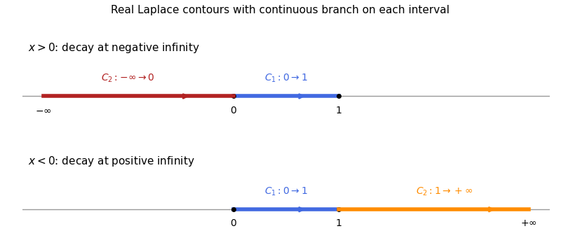

<h1 id="11b/solution">Solution</h1>

↑ **Parent:** [11B](../11b.md)

Write $y=\int_Ce^{xt}f(t)dt$ and move the factor $x$ onto $e^{xt}$ by integration by parts. The differential-equation residual is

$$
\left[e^{xt}t(t-1)f(t)\right]_{\partial C}
+\int_Ce^{xt}\left\{-[t(t-1)f]' +(at-b)f\right\}dt.
$$

Thus the [Laplace integral solution](../../../../../laplace-integral-solution.md) is obtained from

$$
\frac{f'}f=\frac{(a-2)t+1-b}{t(t-1)},\qquad
\boxed{f(t)=t^{b-1}(1-t)^{a-b-1}},
$$

up to a nonzero constant and branch choices. The endpoint factor is proportional to $t^b(1-t)^{a-b}$, so the given positive real parts ensure its vanishing at $0$ and $1$.

For $x>0$, choose the directed intervals $C_1=[0,1]$ and $C_2=(-\infty,0]$; for $x<0$, choose $C_1=[0,1]$ and $C_2=[1,\infty)$. On each interval choose a continuous branch separately. Equivalently their integrands, after an irrelevant constant phase is removed, use $t^{b-1}(1-t)^{a-b-1}$ on $(0,1)$, $(-t)^{b-1}(1-t)^{a-b-1}$ on $t<0$, and $t^{b-1}(t-1)^{a-b-1}$ on $t>1$. Exponential decay at the infinite endpoint removes the remaining boundary term.

**[Figure 1](#11b/image-directed-real-contours-for-two-laplace-integral-solutions-zero-to-one-in-both-cases-negative-infinity-to-zero-for-positive-x-and-one-to-positive-infinity-for-negative-x). Directed real contours for two Laplace integral solutions: zero to one in both cases, negative infinity to zero for positive x, and one to positive infinity for negative x**.

For large positive $x$, $C_1$ has a nonzero leading term proportional to $e^xx^{-(a-b)}$, while $C_2$ is proportional to $x^{-b}$. For large negative $x$, $C_1$ is proportional to $(-x)^{-b}$ and $C_2$ to $e^x(-x)^{-(a-b)}$. These distinct asymptotics prove independence in each case; the gamma factors are nonzero under the assumptions.

For $a=3,b=1$, integrate $e^{xt}(1-t)$ on $[0,1]$ to get $(e^x-1-x)/x^2$. A convenient independent pair on either side of zero is

$$
\boxed{y_1=\frac{x+1}{x^2},\qquad y_2=\frac{e^x}{x^2}}.
$$

Direct substitution verifies both, and their ratio is not constant. Their singularities cancel in $y_2-y_1$. Since $e^x-1-x=x^2/2+O(x^3)$, the solution regular at zero with the required normalization is

$$
\boxed{y(x)=\frac{2(e^x-1-x)}{x^2},\qquad y(0)=1}.
$$

Its power series supplies the removable value and verifies the equation at the singular point.

## ↑ Ancestors (10)

1. [11B](../11b.md)
2. [Paper 1](../../paper-1-split.md)
3. [Ii](../../split.md)
4. [2015](../../../split.md)
5. [Past exam of the mathematics course of the University of Cambridge](../../../../split.md)
6. [Mathematics course of the University of Cambridge](../../../../../mathematics-course-of-the-university-of-cambridge.md)
7. [Course of the University of Cambridge](../../../../../course-of-the-university-of-cambridge.md)
8. [University of Cambridge](../../../../../university-of-cambridge-split.md)
9. [List of universities](../../../../../list-of-universities.md)
10. [Codex Wiki](../../../../../split.md)
