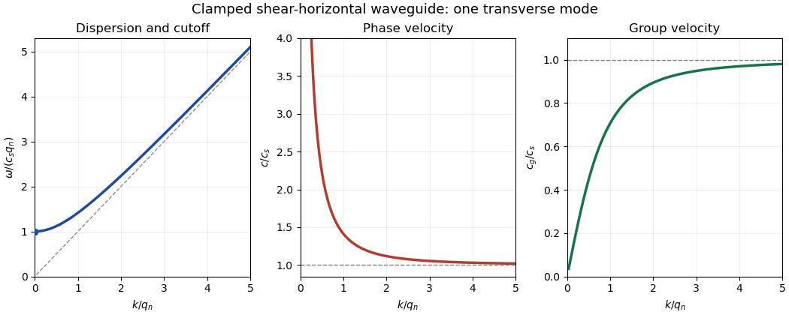

<h1 id="36b/solution">Solution</h1>

↑ **Parent:** [36B](../36b.md)

The linear elastic wave equation is $\rho\mathbf u_{tt}=(\lambda+\mu)\nabla(\nabla\cdot\mathbf u)+\mu\Delta\mathbf u$. For a [shear-horizontal wave](../../../../../shear-horizontal-wave.md), take $\mathbf u=(0,v(x,z,t),0)$ with no $y$ dependence. Its divergence vanishes, and

$$
v_{tt}=c_s^2(v_{xx}+v_{zz}),\qquad c_s=\sqrt{\mu/\rho}.
$$

Rigid fixed boundaries require $v=0$ at $z=0,h$. The modes are $v=A\sin(q_nz)\cos(kx-\omega_nt)$ with $q_n=n\pi/h$, $n=1,2,\ldots$, and

$$
\boxed{\omega_n(k)=c_s\sqrt{k^2+q_n^2},\qquad\omega_{n,\mathrm{cut}}=c_sq_n.}
$$

There is no $n=0$ displacement mode with these clamped boundary conditions. For $k>0$, the [phase velocity](../../../../../phase-velocity.md) and [group velocity](../../../../../group-velocity.md) are

$$
\boxed{c(k)=c_s\frac{\sqrt{k^2+q_n^2}}k,\qquad c_g(k)=c_s\frac{k}{\sqrt{k^2+q_n^2}}.}
$$

The [phase velocity](../../../../../phase-velocity.md) decreases from infinity to $c_s$, while the [group velocity](../../../../../group-velocity.md) increases from zero to $c_s$; their product is $c_s^2$.

**[Figure 1](#36b/image-dispersion-phase-velocity-and-group-velocity-of-a-clamped-shear-horizontal-waveguide-mode). Dispersion, phase velocity and group velocity of a clamped shear-horizontal waveguide mode**.

For a mode of frequency $\omega$, the appropriate time and cross-sectional average is $\langle A\rangle=\omega/(2\pi h)\int_0^{2\pi/\omega}\int_0^h A\,dz\,dt$, per unit transverse width. Its average [kinetic energy density](../../../../../kinetic-energy-density.md) is $\rho A^2\omega^2/8$. The only nonzero strains are $e_{xy}=e_{yx}=v_x/2$ and $e_{yz}=e_{zy}=v_z/2$, while $e_{kk}=0$. Thus the elastic [energy](../../../../../energy.md) density is $\mu(v_x^2+v_z^2)/2$, whose average is $\mu A^2(k^2+q_n^2)/8$. The [dispersion relation](../../../../../dispersion-relation.md) proves **equality of average kinetic and elastic energies**.

For the [ray asymptotics of a clamped elastic waveguide mode](../../../../../ray-asymptotics-of-a-clamped-elastic-waveguide-mode.md), expand the localized initial displacement in transverse sine modes and [Fourier transform](../../../../../fourier-transform.md) in $x$. For a displacement released from rest, each mode evolves with $\cos(\omega_n(k)t)$. At $x=Vt$ the oscillatory phases are $t(kV\pm\omega_n(k))$. If $0<|V|<c_s$, one phase has a [stationary point](../../../../../stationary-point.md) with

$$
|k_*|=\frac{q_n|V|}{\sqrt{c_s^2-V^2}},\qquad\omega_n''(k_*)>0.
$$

The [stationary phase method](../../../../../stationary-phase-method.md) gives a **generic oscillatory amplitude proportional to $t^{-1/2}$** for each contributing mode. If the initial [Fourier coefficient](../../../../../fourier-coefficient.md) vanishes at the [stationary point](../../../../../stationary-point.md), that mode can decay faster; smooth localized data make the modal sum well behaved. If $|V|>c_s$, there is no [stationary point](../../../../../stationary-point.md). Repeated integration by parts gives rapid decay for smooth rapidly decaying data; for initially compactly supported displacement, [finite propagation speed](../../../../../finite-propagation-speed.md) makes the displacement on that ray **exactly zero after a sufficiently long time**. These are the requested subsonic and super-shear-speed regimes.

## ↑ Ancestors (10)

1. [36B](../36b.md)
2. [Paper 2](../../paper-2-split.md)
3. [Ii](../../split.md)
4. [2015](../../../split.md)
5. [Past exam of the mathematics course of the University of Cambridge](../../../../split.md)
6. [Mathematics course of the University of Cambridge](../../../../../mathematics-course-of-the-university-of-cambridge.md)
7. [Course of the University of Cambridge](../../../../../course-of-the-university-of-cambridge.md)
8. [University of Cambridge](../../../../../university-of-cambridge-split.md)
9. [List of universities](../../../../../list-of-universities.md)
10. [Codex Wiki](../../../../../split.md)
