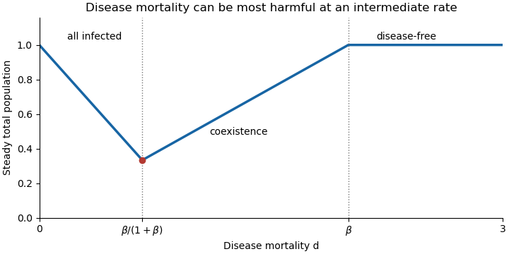

<h1 id="11e/d/solution">Solution</h1>

↑ **Parent:** [D](../d.md)

For $\beta>0$ and positive initial populations, summing the coordinates of the attracting [equilibrium point](../../../../../../equilibrium-point-of-a-dynamical-system.md) gives **the steady total population**

$$
\boxed{N_*(d)=\begin{cases}1-d,&0\leq d\leq\beta/(1+\beta),\\d/\beta,&\beta/(1+\beta)\leq d\leq\beta,\\1,&d\geq\beta.\end{cases}}
$$

Its minimum is $1/(1+\beta)$ at $d=\beta/(1+\beta)$. Small mortality leaves a fully infected population with only modest demographic loss. Raising mortality first reduces that population; after the threshold it suppresses infection sufficiently for the uninfected population to recover. Beyond the invasion threshold the disease cannot persist.

**[Figure 1](#11e/d/image-steady-frog-population-against-disease-mortality-with-transmission-rate-beta-equal-to-two). Steady frog population against disease mortality, with transmission rate beta equal to two**.

## ↑ Ancestors (11)

1. [D](../d.md)
2. [11E](../../11e.md)
3. [Paper 3](../../../paper-3-split.md)
4. [Ii](../../../split.md)
5. [2015](../../../../split.md)
6. [Past exam of the mathematics course of the University of Cambridge](../../../../../split.md)
7. [Mathematics course of the University of Cambridge](../../../../../../mathematics-course-of-the-university-of-cambridge.md)
8. [Course of the University of Cambridge](../../../../../../course-of-the-university-of-cambridge.md)
9. [University of Cambridge](../../../../../../university-of-cambridge-split.md)
10. [List of universities](../../../../../../list-of-universities.md)
11. [Codex Wiki](../../../../../../split.md)
